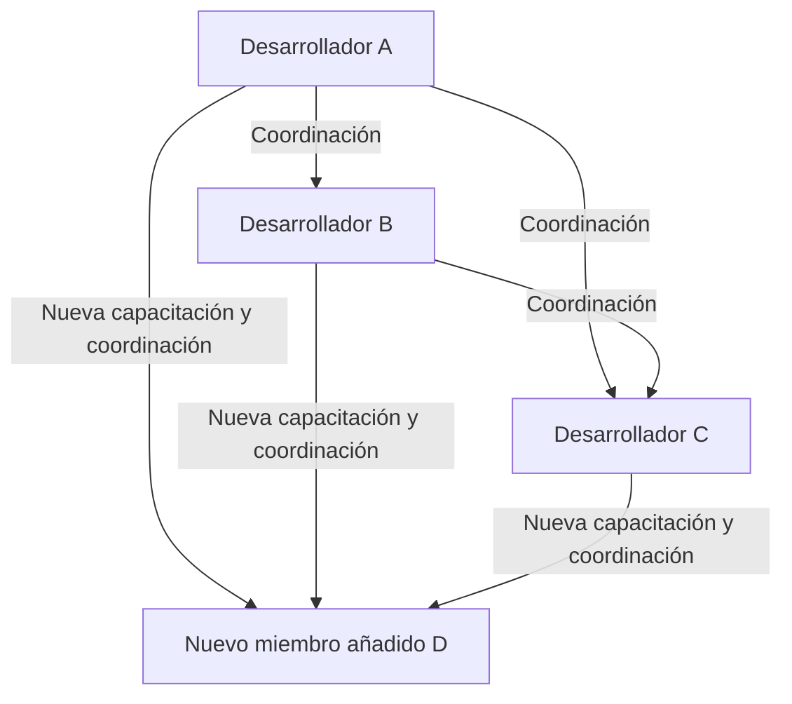
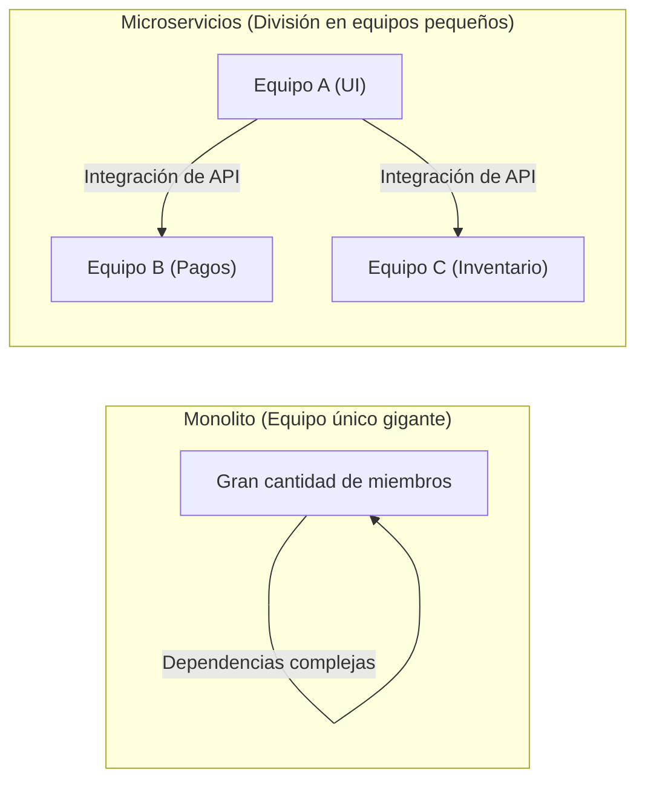

# Introducción: ¿Qué es la Ley de Brooks?

Si estás involucrado en el desarrollo de sistemas, ingeniería de software, o en la gestión de proyectos en general, es muy probable que hayas escuchado el término "Ley de Brooks" (Brooks's law) al menos una vez.

La Ley de Brooks es una regla empírica muy famosa y paradójica en proyectos de desarrollo de software, propuesta en 1975 por Frederick P. Brooks Jr. en su libro *El mítico hombre-mes: Ensayos sobre ingeniería de software* (The Mythical Man-Month). Esta ley se resume en la siguiente frase:

> **"Añadir mano de obra a un proyecto de software retrasado hace que se retrase más."**
> *(Adding manpower to a late software project makes it later.)*

Intuitivamente, parece que si un proyecto está retrasado, añadir más personas debería acelerar el trabajo. La lógica dicta que "si una persona tarda 10 días en hacer un trabajo, 10 personas deberían terminarlo en 1 día". Sin embargo, en el mundo del desarrollo de software, esta fórmula de cálculo basada en "hombres-mes" no se cumple.

En este artículo, desentrañaremos por qué ocurre la Ley de Brooks y cuáles son sus causas fundamentales, además de profundizar en cómo evitar o mitigar esta ley en las metodologías modernas de desarrollo de software (Agile, DevOps, etc.).

---

# ¿Por qué añadir personal aumenta el retraso? 3 causas fundamentales

¿Por qué la adición de personal, realizada con buenas intenciones por un gerente de proyecto para recuperar el tiempo perdido, termina siendo como "echar leña al fuego"? Brooks señala tres factores principales:

## 1. Aumento explosivo del trabajo adicional de comunicación

Cuantas más personas haya, mayores serán los costos de comunicación y coordinación (gastos generales o *overhead*).
El número de canales de comunicación (rutas) entre los miembros del equipo aumenta con respecto al número de miembros $n$ según la fórmula $\frac{n(n-1)}{2}$.

- En un equipo de 3 personas, hay 3 canales de comunicación.
- En un equipo de 5 personas, 10 canales.
- En un equipo de 10 personas, 45 canales.
- En un equipo de 20 personas, 190 canales.

De esta manera, a medida que aumenta el número de personas, los canales de comunicación aumentan **exponencialmente (más exactamente, de forma combinatoria)**. Cuando se añaden nuevas personas, es necesario que todos se pongan de acuerdo sobre quién hace qué, cuáles son las políticas de diseño y cuáles son las especificaciones de la interfaz. El tiempo que originalmente se podría haber utilizado para desarrollar se pierde en reuniones, sincronizaciones y verificación de información.

## 2. Costos de integración (Onboarding, educación y aprendizaje)

Si se añaden nuevos miembros en las etapas finales del proyecto o cuando el proyecto está en crisis, los miembros existentes deben enseñar a los recién llegados sobre el contexto del proyecto, la arquitectura del sistema, las convenciones de codificación, el conocimiento del dominio del negocio, etc.

Esta acción de "enseñar" consume el tiempo de los ingenieros estrella que más profundamente entienden el proyecto. Se necesita un período de aprendizaje (*ramp-up time*) antes de que los nuevos miembros se conviertan en una fuerza útil (comiencen a contribuir al proyecto), y durante ese tiempo, la productividad general del equipo en realidad **disminuye en comparación con antes de la adición**.

## 3. Indivisibilidad del trabajo (Naturaleza secuencial de las tareas)

No todo el trabajo se puede dividir equitativamente entre el número de personas.
En su libro, Brooks usa la famosa metáfora: **"Nueve mujeres no pueden hacer un bebé en un mes"**.

- **Tareas completamente divisibles:** Cortar el césped de un campo o la simple entrada de datos. Si se duplica el número de personas, el tiempo se reduce a la mitad.
- **Tareas indivisibles:** Diseño básico de software, investigación de errores complejos, invención de algoritmos, etc. Requieren una comprensión del contexto general, y si se dividen a la fuerza entre varias personas, provocan errores e inconsistencias durante la integración.

Muchas etapas en el desarrollo de software tienen dependencias mutuas, existiendo una relación secuencial (ruta crítica) en la que, por ejemplo, el módulo B no se puede probar hasta que el módulo A esté terminado. Incluso si se asigna una gran cantidad de personas aquí, solo aumentará el tiempo de espera y el progreso no se acelerará.

---

# La estructura de la "Marcha de la Muerte" en proyectos reales

Donde la Ley de Brooks se manifiesta de forma más cruel es en las etapas finales del proyecto, cuando se acerca la fecha de entrega.

1. **Descubrimiento del retraso:** Ocurren errores inesperados durante fases como las pruebas de integración y se descubre el retraso en el cronograma.
2. **Presión de la dirección:** Llega la orden: "La fecha de entrega es inamovible. Proporcionaremos el presupuesto, así que añadan personal y solucionen el problema".
3. **Adición de personal:** Se incorporan ingenieros de otros proyectos que están libres (pero sin conocimientos del negocio) o una gran cantidad de programadores de empresas colaboradoras.
4. **El caos total:** Los miembros existentes se ven abrumados por la capacitación de los nuevos y por responder a sus preguntas, sin poder concentrarse en sus propias tareas. Los canales de comunicación explotan y solo aumentan las reuniones.
5. **Deterioro de la calidad:** Debido a la prisa y la falta de comunicación, los nuevos miembros realizan modificaciones que rompen las bases del sistema, generando una gran cantidad de nuevos errores (regresión).
6. **Aún más retraso:** Como resultado, la finalización se retrasa aún más que en el plan original, y el equipo queda exhausto (se completa la "Marcha de la Muerte").

Para romper este círculo vicioso, los gerentes deben tener opciones alternativas a "añadir más personas".

---

# Enfoques y soluciones modernas a la Ley de Brooks

Esta ley, propuesta en 1975, sigue siendo fundamentalmente válida en la ingeniería de software actual, a pesar de que ha pasado casi medio siglo. Sin embargo, tenemos "soluciones" aprendidas de los fracasos del pasado. ¿Cómo superan la Ley de Brooks las organizaciones de ingeniería sobresalientes, el desarrollo ágil moderno y DevOps?

## Solución 1: Reevaluación del cronograma y reducción del alcance

Cuando un proyecto se retrasa, las dos soluciones más racionales y menos dolorosas son:

- **Extender la fecha de entrega:** Reprogramar basándose en estimaciones realistas.
- **Reducir el alcance:** Excluir de la versión a entregar las características que no son esenciales (*Nice to have*) y proporcionar solo el valor central (*core value*) para la fecha límite.

La regla de oro es "aumentar el tiempo" o "reducir lo que se va a hacer", en lugar de "añadir personas". En el desarrollo ágil (como Scrum), se trabaja sobre una "acumulación de trabajo (*backlog*) que se puede completar" dentro de un *sprint* fijo, lo que incorpora un mecanismo para evitar la imposición de un alcance irrazonable.

## Solución 2: Equipos pequeños y multifuncionales (Two-Pizza Team)

La regla de "los dos equipos de pizza" (Two-Pizza Team) propuesta por Jeff Bezos de Amazon es una de las respuestas perfectas a la Ley de Brooks. La regla establece que "el número de miembros en un equipo no debe superar a los que pueden compartir dos pizzas (generalmente alrededor de 6 a 8 personas como máximo)".

Al mantener los equipos pequeños, se evita la explosión de canales de comunicación. Cuando se construyen sistemas a gran escala, en lugar de crear un solo equipo gigante, el sistema se divide de forma poco acoplada utilizando una arquitectura de microservicios, y pequeños equipos independientes se hacen cargo de cada componente.

## Solución 3: Integración Continua (CI) y automatización de pruebas

El mayor temor al añadir nuevas personas es que "los nuevos miembros rompan el código existente (regresión)".
Lo que previene esto es el sistema de pruebas automatizadas y CI (Integración Continua).
Si existe un entorno donde se ejecutan miles de pruebas automatizadas en cuestión de minutos sin importar quién modifique el código, y cualquier error se detecta al instante, los nuevos miembros pueden modificar el código con tranquilidad. Es un enfoque que utiliza la tecnología para reducir la curva de aprendizaje y el riesgo.

## Solución 4: Mejora de la documentación y eliminación del conocimiento tácito

Para reducir los costos de *onboarding*, es necesario reducir el "conocimiento tácito que no se entiende a menos que se pregunte directamente a los miembros existentes" y aumentar el "conocimiento explícito que se entiende al leerlo".
- Elaboración de un excelente archivo README o Wiki
- ADR (Architecture Decision Record) para dejar un registro de los antecedentes de las decisiones de arquitectura
- Código limpio, legible y autodocumentado
Al preparar esto durante los períodos de normalidad, se pueden reducir significativamente los "costos de capacitación" al añadir personal.

---

# Conclusión: Para enfrentar el mito

En *El mítico hombre-mes*, Frederick Brooks afirmó categóricamente que "no hay balas de plata (ninguna tecnología o técnica mágica que resuelva de un golpe todos los problemas en el desarrollo de software)".

El pensamiento simple de "si hay retraso, solo añade gente" no funciona en las complejas creaciones intelectuales invisibles llamadas software. Para llevar un proyecto al éxito, no hay otra manera que comprender la estructura de la comunicación, mantener el tamaño del equipo de manera adecuada y acumular constantemente prácticas de ingeniería diarias (automatización, modularización, documentación).

La Ley de Brooks nos exige despertar de "la ilusión del hombre-mes" y enfrentarnos a la verdadera naturaleza del "trabajo en equipo" tejido por seres humanos complejos.
