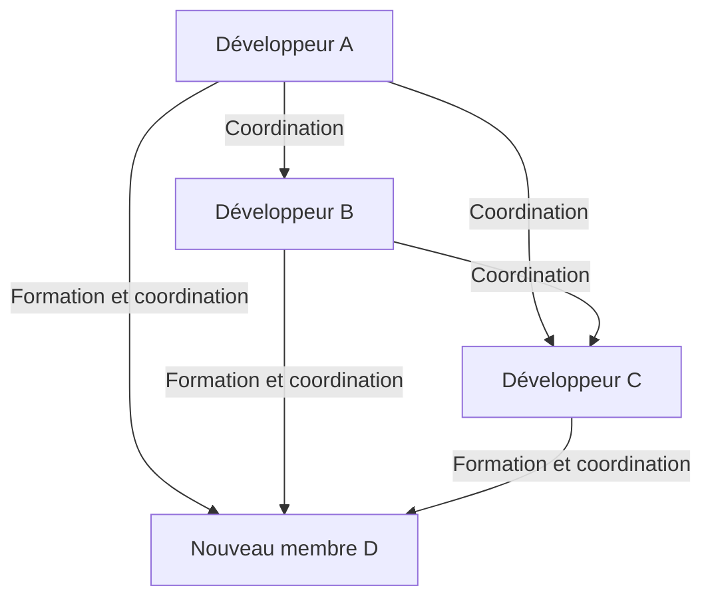
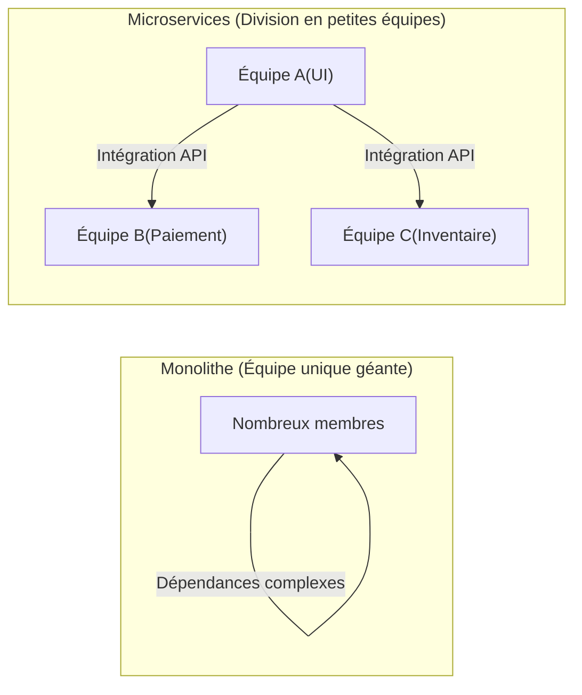

# Introduction : Qu'est-ce que la loi de Brooks ?

Toute personne impliquée dans le développement de systèmes, le génie logiciel ou la gestion de projet en général a probablement entendu parler de la "loi de Brooks" (Brooks's law) au moins une fois.

La loi de Brooks est une règle empirique très célèbre et paradoxale dans les projets de développement logiciel, proposée par Frederick P. Brooks Jr. en 1975 dans son livre "Le Mythe du mois-homme" (The Mythical Man-Month). Cette loi se résume en une phrase :

> **"Ajouter des effectifs à un projet logiciel en retard le retarde encore plus."**
> *(Adding manpower to a late software project makes it later.)*

Intuitivement, si un projet est en retard, il semble qu'ajouter des personnes devrait accélérer le travail. C'est la logique selon laquelle "si une tâche prend 10 jours à 1 personne, elle devrait prendre 1 jour à 10 personnes". Cependant, dans le monde du développement logiciel, cette équation du "mois-homme" (man-month) ne fonctionne pas.

Dans cet article, nous allons explorer en détail pourquoi la loi de Brooks se produit, ses causes fondamentales, et comment éviter ou atténuer cette loi dans les méthodes de développement logiciel modernes (Agile, DevOps, etc.).

---

# Pourquoi l'ajout de personnel aggrave-t-il les retards ? 3 causes fondamentales

Pourquoi l'ajout de personnel, bien intentionné de la part d'un chef de projet pour rattraper un retard, finit-il par "jeter de l'huile sur le feu" ? Brooks cite principalement les trois facteurs suivants comme raisons.

## 1. Augmentation explosive des frais généraux de communication

Plus il y a de personnes, plus les coûts de communication (frais généraux) pour le partage d'informations et la coordination augmentent.
Le nombre de chemins de communication (canaux) entre les membres de l'équipe augmente selon la formule $\frac{n(n-1)}{2}$ pour un nombre de membres $n$.

- Pour une équipe de 3 personnes, il y a 3 chemins de communication
- Pour une équipe de 5 personnes, 10 chemins
- Pour une équipe de 10 personnes, 45 chemins
- Pour une équipe de 20 personnes, 190 chemins

Ainsi, à mesure que le nombre de personnes augmente, les chemins de communication augmentent de manière **exponentielle (plus précisément, combinatoire)**. Lorsqu'une nouvelle personne est ajoutée, il est nécessaire de s'aligner avec tout le monde sur qui fait quoi, quelle est la politique de conception et quelles sont les spécifications de l'interface. Le temps qui devrait être consacré au développement est alors accaparé par les réunions, les discussions et la vérification des messages.

## 2. Apparition des coûts d'intégration (formation/apprentissage)

Lorsqu'un nouveau membre est ajouté vers la fin d'un projet ou en pleine crise, les membres existants doivent lui enseigner le contexte du projet, l'architecture du système, les conventions de codage, les connaissances du domaine métier, etc.

Cet acte d'"enseigner" prive les meilleurs ingénieurs, ceux qui comprennent le mieux le projet, de leur temps. Il faut une certaine période d'apprentissage (temps de montée en puissance) avant que le nouveau membre ne devienne opérationnel (commence à contribuer au projet), et pendant ce temps, la productivité globale de l'équipe est en réalité **inférieure à ce qu'elle était avant l'ajout**.

## 3. Indivisibilité du travail (séquentialité des tâches)

Toutes les tâches ne peuvent pas être divisées proprement par le nombre de personnes.
Dans son livre, Brooks utilise la célèbre métaphore : **"Neuf femmes ne peuvent pas faire un bébé en un mois"**.

- **Tâches parfaitement divisibles :** Tondre la pelouse, saisie de données simple, etc. Si vous doublez le nombre de personnes, le temps est divisé par deux.
- **Tâches indivisibles :** Conception de base de logiciels, investigation de bugs complexes, conception d'algorithmes, etc. Une compréhension du contexte global et de l'ensemble est nécessaire, et forcer la division entre plusieurs personnes entraîne souvent des bugs et des incohérences lors de l'intégration.

De nombreuses étapes du développement logiciel ont des dépendances mutuelles, créant des dépendances séquentielles (chemin critique), comme l'impossibilité de tester le module B tant que le module A n'est pas terminé. Ajouter massivement des personnes ici ne fait qu'augmenter le temps d'attente sans accélérer la progression.

---

# La structure de la "marche de la mort" (Death March) dans les projets réels

La loi de Brooks se manifeste de la manière la plus cruelle dans les dernières phases d'un projet, lorsque la date limite approche.

1. **Découverte du retard :** De nombreux bugs imprévus surviennent lors de la phase de test d'intégration, révélant un retard dans le planning.
2. **Pression de la direction :** L'ordre est donné : "La date limite est absolument inamovible. Le budget est là, alors ajoutez des gens et faites en sorte que ça marche."
3. **Ajout de personnel :** Des ingénieurs disponibles (mais sans connaissance du métier) d'autres projets, ou un grand nombre de programmeurs de sociétés partenaires sont intégrés.
4. **Chaos total :** Les membres existants sont submergés par la formation des nouveaux et la réponse à leurs questions, les empêchant de se concentrer sur leurs propres tâches. Les chemins de communication explosent et les réunions se multiplient.
5. **Baisse de qualité :** Poussés par l'urgence et le manque de communication, les nouveaux membres effectuent des modifications qui cassent les fondations du système, générant un grand nombre de nouveaux bugs (régressions).
6. **Retard supplémentaire :** En conséquence, l'achèvement est encore plus retardé que prévu, et le personnel sur le terrain est épuisé (la marche de la mort est terminée).

Pour briser ce cercle vicieux, les managers doivent avoir d'autres options que "d'ajouter des personnes".

---

# Approches et mesures modernes face à la loi de Brooks

Bien que proposée en 1975, cette loi reste fondamentalement valide dans le génie logiciel moderne près d'un demi-siècle plus tard. Cependant, nous avons des "mesures" tirées des échecs passés. Comment le développement agile moderne, le DevOps et les excellentes organisations d'ingénierie surmontent-ils cette loi de Brooks ?

## Mesure 1 : Repenser le calendrier et réduire la portée

Lorsqu'un projet est en retard, les deux solutions les plus rationnelles et les moins douloureuses sont :

- **Repousser la date limite :** Refaire le calendrier sur la base d'estimations réalistes.
- **Réduire la portée :** Exclure les fonctionnalités non essentielles (Nice to have) de la version finale et ne fournir que la valeur fondamentale d'ici la date limite.

La règle d'or est d'"ajouter du temps" ou de "réduire ce qui doit être fait", plutôt que d'"ajouter des personnes". Dans le développement agile (comme Scrum), un mécanisme est intégré pour empêcher de forcer une portée irréaliste, car seule "la quantité de backlog pouvant être terminée" est traitée dans un sprint fixe.

## Mesure 2 : Petites équipes interfonctionnelles (Two-Pizza Team)

La règle de l'"équipe de deux pizzas" (Two-Pizza Team), proposée par Jeff Bezos d'Amazon, est l'une des réponses parfaites à la loi de Brooks. La règle stipule que "la taille de l'équipe doit être limitée au nombre de personnes pouvant se partager deux pizzas (environ 6 à 8 personnes)".

En gardant les équipes petites, on évite l'explosion des chemins de communication. Lors de la construction de systèmes à grande échelle, plutôt que de créer une seule équipe géante, le système est divisé de manière lâche via une architecture de microservices, et des petites équipes indépendantes sont responsables de chaque composant.

## Mesure 3 : Intégration continue (CI) et automatisation des tests

Ce qui est le plus effrayant lors de l'ajout de personnes, c'est que "les nouveaux membres cassent le code existant (régression)".
C'est là qu'interviennent les tests automatisés et les mécanismes de CI (Continuous Integration).
Si, quel que soit l'auteur de la modification du code, des milliers de tests automatisés sont exécutés en quelques minutes et que les bugs sont détectés immédiatement, les nouveaux membres peuvent modifier le code en toute tranquillité. C'est une approche où la technologie réduit les coûts d'apprentissage et les risques.

## Mesure 4 : Amélioration de la documentation et élimination des connaissances tacites

Pour réduire les coûts d'intégration, il est nécessaire de réduire les "connaissances tacites qui ne peuvent être comprises qu'en demandant directement aux membres existants" et d'augmenter les "connaissances explicites qui peuvent être comprises en lisant".
- Création d'excellents README et Wiki
- ADR (Architecture Decision Record) pour documenter le contexte des décisions d'architecture
- Code propre, facile à lire et auto-documenté
En préparant cela en temps normal, le "coût de formation" lors de l'ajout de personnes peut être considérablement réduit.

---

# Conclusion : Pour faire face au mythe

Frederick Brooks a affirmé dans "Le Mythe du mois-homme" qu'il "n'y a pas de balle en argent (technologie ou méthode magique qui résout tous les problèmes du développement logiciel d'un seul coup)".

La pensée additive simple "si nous sommes en retard, ajoutons des personnes" ne fonctionne pas dans la création intellectuelle complexe et invisible qu'est le logiciel. Pour mener un projet au succès, il n'y a pas d'autre choix que de comprendre la structure de la communication, de maintenir la taille de l'équipe à un niveau approprié et d'accumuler régulièrement des pratiques d'ingénierie quotidiennes (automatisation, modularisation, documentation).

La loi de Brooks nous demande de nous réveiller de "l'illusion du mois-homme" et de faire face à l'essence du "travail d'équipe" tissé par des êtres complexes que sont les humains.
