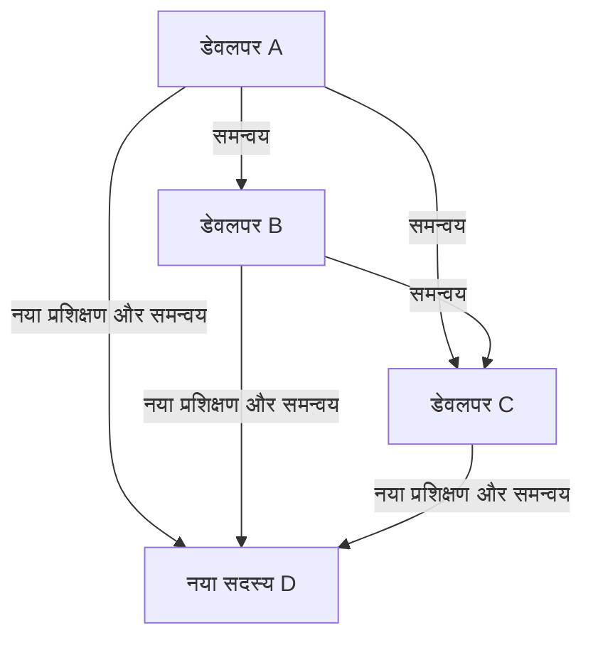
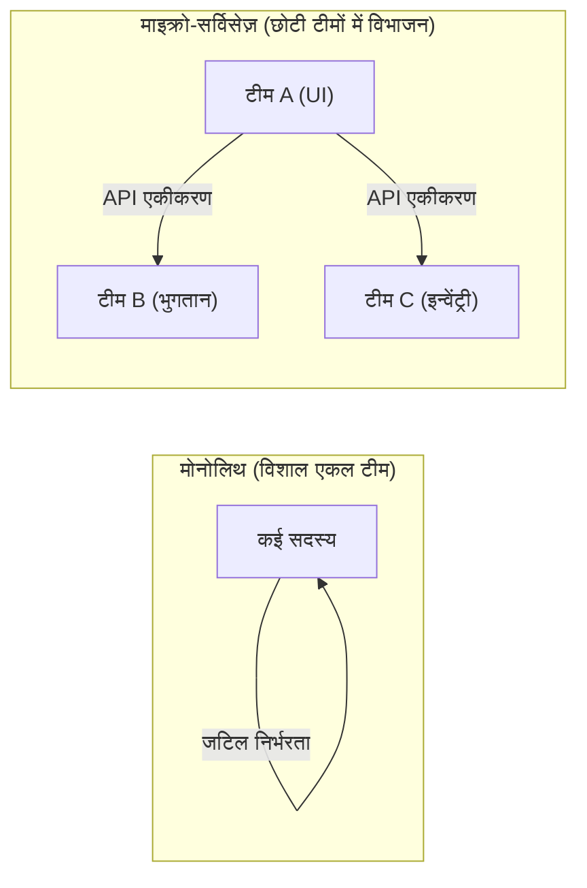

# परिचय: ब्रूक्स का नियम क्या है?

सिस्टम डेवलपमेंट, सॉफ्टवेयर इंजीनियरिंग, या सामान्य प्रोजेक्ट मैनेजमेंट से जुड़े किसी भी व्यक्ति ने कम से कम एक बार "ब्रूक्स का नियम (Brooks's law)" जरूर सुना होगा।

ब्रूक्स का नियम सॉफ्टवेयर डेवलपमेंट प्रोजेक्ट्स में एक बहुत प्रसिद्ध और विरोधाभासी अनुभवजन्य नियम है, जिसे 1975 में फ्रेडरिक पी. ब्रूक्स जूनियर (Frederick P. Brooks Jr.) ने अपनी पुस्तक "द मिथिकल मैन-मंथ (The Mythical Man-Month)" में प्रस्तावित किया था। यह नियम निम्नलिखित एक वाक्य में संक्षेप में प्रस्तुत किया जा सकता है:

> **"एक देरी से चल रहे सॉफ्टवेयर प्रोजेक्ट में जनशक्ति (मैनपावर) जोड़ने से उसमें और भी देरी होती है।"**
> *(Adding manpower to a late software project makes it later.)*

सहज रूप से ऐसा लगता है कि यदि प्रोजेक्ट में देरी हो रही है, तो लोगों को बढ़ाने से काम तेज़ी से आगे बढ़ेगा। इसका तर्क यह है कि "यदि 1 व्यक्ति को कोई काम करने में 10 दिन लगते हैं, तो 10 लोगों को उसे 1 दिन में खत्म कर देना चाहिए।" हालांकि, सॉफ्टवेयर डेवलपमेंट की दुनिया में यह "मैन-मंथ" (man-month) की गणना लागू नहीं होती है।

इस लेख में, हम गहराई से जानेंगे कि ब्रूक्स का नियम क्यों लागू होता है, इसके मूल कारण क्या हैं, और आधुनिक सॉफ्टवेयर डेवलपमेंट विधियों (जैसे एजाइल, DevOps आदि) में इस नियम से कैसे बचा जा सकता है या इसे कैसे कम किया जा सकता है।

---

# जनशक्ति बढ़ाना देरी को क्यों बढ़ावा देता है? 3 मूल कारण

प्रोजेक्ट मैनेजर द्वारा देरी की भरपाई के लिए अच्छे इरादे से की गई जनशक्ति वृद्धि क्यों "आग में घी डालने" जैसी हो जाती है? ब्रूक्स इसके मुख्य रूप से निम्नलिखित 3 कारण बताते हैं:

## 1. कम्युनिकेशन ओवरहेड में विस्फोटक वृद्धि

जैसे-जैसे लोगों की संख्या बढ़ती है, सूचना साझा करने और समन्वय के लिए कम्युनिकेशन की लागत (ओवरहेड) भी बढ़ती है।
टीम के सदस्यों के बीच कम्युनिकेशन पाथ (रास्तों) की संख्या, सदस्यों की संख्या $n$ के लिए $\frac{n(n-1)}{2}$ के सूत्र के अनुसार बढ़ती है।

- 3 लोगों की टीम के लिए, कम्युनिकेशन पाथ 3 होते हैं
- 5 लोगों की टीम के लिए, 10 पाथ
- 10 लोगों की टीम के लिए, 45 पाथ
- 20 लोगों की टीम के लिए, 190 पाथ

इस प्रकार, जैसे-जैसे लोगों की संख्या बढ़ती है, कम्युनिकेशन पाथ **घातांकीय रूप से (सटीक रूप से कहें तो संयोजनात्मक रूप से) बढ़ते हैं**। जब नए लोगों को जोड़ा जाता है, तो सभी को यह समझना पड़ता है कि कौन क्या कर रहा है, डिज़ाइन नीति क्या है, और इंटरफ़ेस विनिर्देश क्या हैं। जो समय वास्तव में डेवलपमेंट के लिए इस्तेमाल होना चाहिए था, वह बैठकों, चर्चाओं और सूचनाओं की पुष्टि में बर्बाद हो जाता है।

## 2. ऑनबोर्डिंग (प्रशिक्षण और सीखना) लागत का उत्पन्न होना

जब प्रोजेक्ट के अंतिम चरण में या संकट के समय नए सदस्यों को जोड़ा जाता है, तो मौजूदा सदस्यों को नए सदस्यों को प्रोजेक्ट की पृष्ठभूमि, सिस्टम आर्किटेक्चर, कोडिंग मानक और व्यावसायिक डोमेन ज्ञान आदि सिखाना पड़ता है।

यह "सिखाने" की प्रक्रिया प्रोजेक्ट को सबसे गहराई से समझने वाले शीर्ष इंजीनियरों का समय ले लेती है। नए सदस्यों को प्रभावी होने (प्रोजेक्ट में योगदान देना शुरू करने) में एक निश्चित सीखने का समय (रैंप-अप टाइम) लगता है, और इस दौरान, पूरी टीम की उत्पादकता वास्तव में **जोड़ने से पहले की तुलना में कम** हो जाती है।

## 3. कार्य की अविभाज्यता (कार्यों की क्रमिक प्रकृति)

सभी काम लोगों की संख्या के अनुसार आसानी से विभाजित नहीं किए जा सकते।
ब्रूक्स ने अपनी पुस्तक में एक प्रसिद्ध रूपक का उपयोग किया है: **"भले ही 9 गर्भवती महिलाएँ हों, वे 1 महीने में एक बच्चे को जन्म नहीं दे सकती हैं।"**

- **पूरी तरह से विभाज्य कार्य:** खेत में घास काटना या सरल डेटा प्रविष्टि। यदि आप लोगों की संख्या दोगुनी करते हैं, तो समय आधा हो जाता है।
- **अविभाज्य कार्य:** सॉफ्टवेयर का बुनियादी डिज़ाइन, जटिल बग की जांच, एल्गोरिदम तैयार करना आदि। इसके लिए संदर्भ और समग्र चित्र को समझने की आवश्यकता होती है, और यदि इसे ज़बरदस्ती कई लोगों में विभाजित किया जाता है, तो यह एकीकरण के दौरान बग और विसंगतियों का कारण बनता है।

सॉफ्टवेयर डेवलपमेंट के कई चरण आपस में जुड़े होते हैं, जैसे कि क्रमिक निर्भरता (क्रिटिकल पाथ) जहां मॉड्यूल B का परीक्षण तब तक नहीं किया जा सकता जब तक कि मॉड्यूल A पूरा न हो जाए। भले ही आप इसमें भारी संख्या में लोगों को लगा दें, यह केवल प्रतीक्षा समय बढ़ाता है और प्रगति को तेज नहीं करता है।

---

# वास्तविक प्रोजेक्ट्स में "डेथ मार्च" (Death March) की संरचना

ब्रूक्स का नियम सबसे क्रूर रूप में तब प्रकट होता है जब प्रोजेक्ट की समय सीमा करीब होती है (अंतिम चरण)।

1. **देरी का पता चलना:** इंटीग्रेशन टेस्टिंग चरण के दौरान अप्रत्याशित बग बहुतायत में आते हैं, और शेड्यूल में देरी का पता चलता है।
2. **प्रबंधन की ओर से दबाव:** "समय सीमा को किसी भी हालत में नहीं बदला जा सकता। हम बजट देंगे, बस और लोगों को लगाकर इसे किसी तरह पूरा करो।"
3. **जनशक्ति बढ़ाना:** अन्य प्रोजेक्ट्स से उपलब्ध (लेकिन व्यावसायिक ज्ञान के बिना) इंजीनियरों और सहयोगी कंपनियों से बड़ी संख्या में प्रोग्रामरों को लाया जाता है।
4. **अत्यधिक भ्रम:** मौजूदा सदस्य नए लोगों को प्रशिक्षित करने और उनके सवालों का जवाब देने में इतने व्यस्त हो जाते हैं कि वे अपने खुद के कार्यों पर ध्यान केंद्रित नहीं कर पाते हैं। कम्युनिकेशन पाथ बहुत बढ़ जाते हैं और केवल मीटिंग्स बढ़ती हैं।
5. **गुणवत्ता में गिरावट:** जल्दबाजी और कम्युनिकेशन की कमी के कारण, नए सदस्य ऐसे बदलाव करते हैं जो सिस्टम की बुनियादी मान्यताओं को तोड़ देते हैं, जिससे बड़ी संख्या में नए बग (डिग्रेडेशन) पैदा होते हैं।
6. **और अधिक देरी:** परिणामस्वरूप, प्रोजेक्ट पूरा होने में मूल योजना से भी अधिक देरी होती है, और टीम पूरी तरह से थक जाती है (डेथ मार्च पूरा हुआ)।

इस दुष्चक्र को तोड़ने के लिए, प्रबंधकों के पास "लोगों को जोड़ने" के अलावा अन्य विकल्प होने चाहिए।

---

# ब्रूक्स के नियम के लिए आधुनिक उपाय और दृष्टिकोण

1975 में प्रस्तावित यह नियम आधी सदी बीत जाने के बाद भी आधुनिक सॉफ्टवेयर इंजीनियरिंग में मौलिक रूप से मान्य है। हालाँकि, हमारे पास पिछले विफलताओं से सीखे गए "उपाय" हैं। आधुनिक एजाइल डेवलपमेंट, DevOps और बेहतरीन इंजीनियरिंग संगठन इस ब्रूक्स के नियम को कैसे पार करते हैं?

## उपाय 1: शेड्यूल पर पुनर्विचार और कार्य-क्षेत्र (स्कोप) को कम करना

जब कोई प्रोजेक्ट लेट हो जाता है, तो सबसे तार्किक और कम दर्दनाक समाधान निम्नलिखित दो होते हैं:

- **समय सीमा बढ़ाना:** यथार्थवादी अनुमानों के आधार पर शेड्यूल को फिर से बनाना।
- **स्कोप कम करना:** गैर-ज़रूरी फीचर्स (Nice to have) को रिलीज़ से हटाना, और समय सीमा तक केवल मुख्य मूल्य (कोर वैल्यू) प्रदान करना।

मूल नियम "लोगों को जोड़ने" का नहीं, बल्कि "समय बढ़ाने" या "काम को कम करने" का है। एजाइल डेवलपमेंट (जैसे स्क्रम) में, एक निश्चित स्प्रिंट के भीतर केवल "पूरा किया जा सकने वाला बैकलॉग" ही लिया जाता है, जिससे अवास्तविक स्कोप को थोपने से रोकने का तंत्र शामिल होता है।

## उपाय 2: क्रॉस-फंक्शनल छोटी टीमें (टू-पिज़्ज़ा टीम)

अमेज़ॅन के जेफ बेजोस द्वारा प्रस्तावित "टू-पिज़्ज़ा टीम" नियम ब्रूक्स के नियम का एक आदर्श उत्तर है। यह नियम कहता है कि "टीम का आकार इतना होना चाहिए जिसे दो पिज्जा से खिलाया जा सके (लगभग 6 से 8 लोग)।"

टीमों को छोटा रखकर, कम्युनिकेशन पाथ में होने वाले विस्फोट को रोका जा सकता है। जब एक बड़े सिस्टम का निर्माण किया जाता है, तो एक विशाल टीम बनाने के बजाय, सिस्टम को माइक्रो-सर्विसेज़ आर्किटेक्चर जैसी तकनीक का उपयोग करके लूज़ली-कपल्ड (loosely coupled) हिस्सों में विभाजित किया जाता है, और प्रत्येक घटक एक स्वतंत्र छोटी टीम द्वारा संभाला जाता है।

## उपाय 3: निरंतर एकीकरण (Continuous Integration - CI) और परीक्षण स्वचालन

लोगों को जोड़ते समय सबसे डरावनी बात यह होती है कि "नए सदस्य मौजूदा कोड को तोड़ सकते हैं (डिग्रेडेशन)।"
इसे रोकने के लिए स्वचालित परीक्षण (Automated Testing) और CI (Continuous Integration) का तंत्र है।
यदि कोई ऐसा वातावरण है जहाँ कोई भी कोड बदलता है, तो कुछ ही मिनटों में हज़ारों स्वचालित परीक्षण चलते हैं, और यदि कोई बग होता है, तो उसका तुरंत पता चल जाता है। इससे नए सदस्य भी विश्वास के साथ कोड बदल सकते हैं। यह तकनीक के माध्यम से सीखने की लागत और जोखिम को कम करने का एक दृष्टिकोण है।

## उपाय 4: दस्तावेज़ीकरण (Documentation) को बनाए रखना और अनकहे ज्ञान को हटाना

ऑनबोर्डिंग लागत को कम करने के लिए, हमें "उस अनकहे ज्ञान जिसे केवल मौजूदा सदस्यों से पूछकर जाना जा सकता है" को कम करना होगा और "ऐसे ज्ञान जिसे पढ़कर समझा जा सके" को बढ़ाना होगा।
- उत्कृष्ट README और Wiki को बनाए रखना
- आर्किटेक्चरल निर्णयों के पीछे की पृष्ठभूमि को दर्ज करने वाले ADR (Architecture Decision Record)
- पढ़ने में आसान, स्वयं-दस्तावेज़ीकृत और स्वच्छ कोड
इन्हें सामान्य समय में ही व्यवस्थित रखने से, लोगों को जोड़ते समय "प्रशिक्षण लागत" काफी कम हो जाती है।

---

# निष्कर्ष: मिथकों का सामना करना

फ्रेडरिक ब्रूक्स ने "द मिथिकल मैन-मंथ" में स्पष्ट रूप से कहा था, "कोई सिल्वर बुलेट नहीं है (ऐसी कोई जादुई तकनीक या विधि नहीं है जो सॉफ्टवेयर डेवलपमेंट की सभी समस्याओं को एक ही झटके में हल कर दे)।"

"हम लेट हो गए हैं इसलिए बस और लोगों को जोड़ दो" का सरल गणित सॉफ्टवेयर जैसे जटिल और अदृश्य बौद्धिक निर्माण में काम नहीं करता है। एक प्रोजेक्ट को सफल बनाने के लिए, आपको कम्युनिकेशन की संरचना को समझना होगा, उचित टीम का आकार बनाए रखना होगा, और दैनिक इंजीनियरिंग अभ्यासों (स्वचालन, मॉड्यूलरिटी, दस्तावेज़ीकरण) को निरंतर और धैर्यपूर्वक अपनाना होगा।

ब्रूक्स का नियम हमसे "मैन-मंथ के भ्रम" से जागने और इंसानों जैसे जटिल प्राणियों द्वारा बनाए गए "टीम वर्क" के असली सार का सामना करने की मांग करता है।
