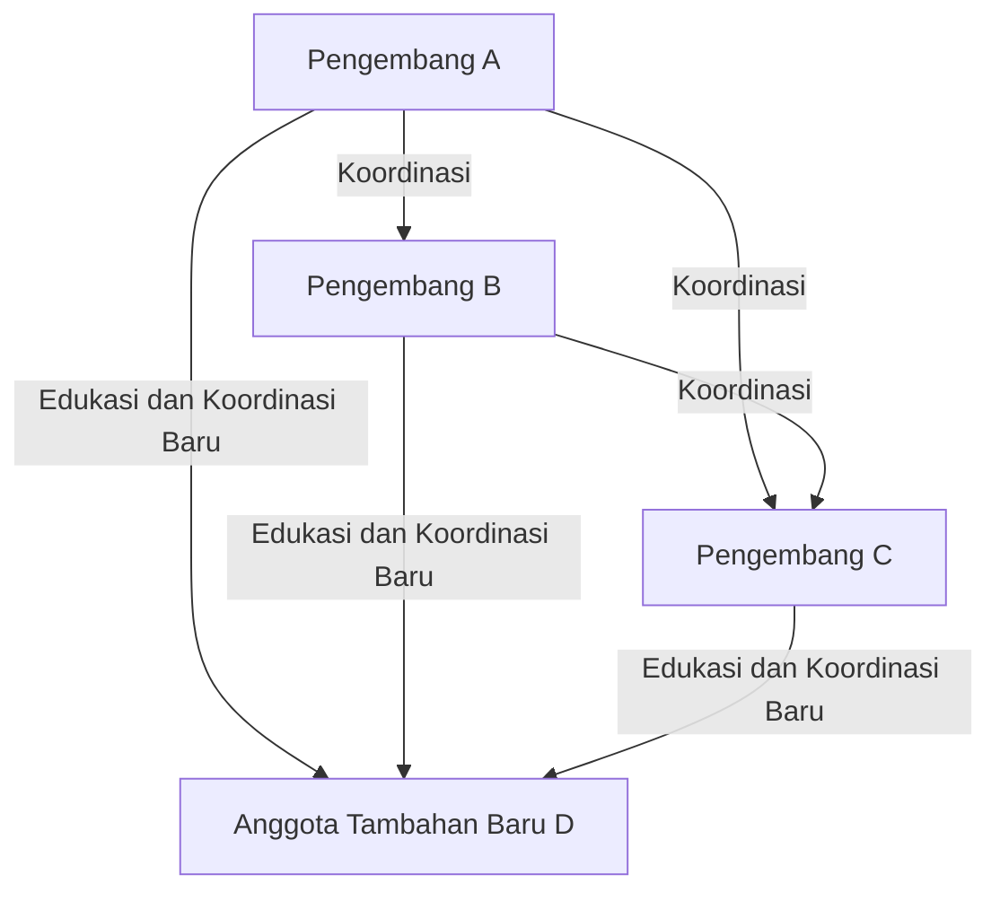
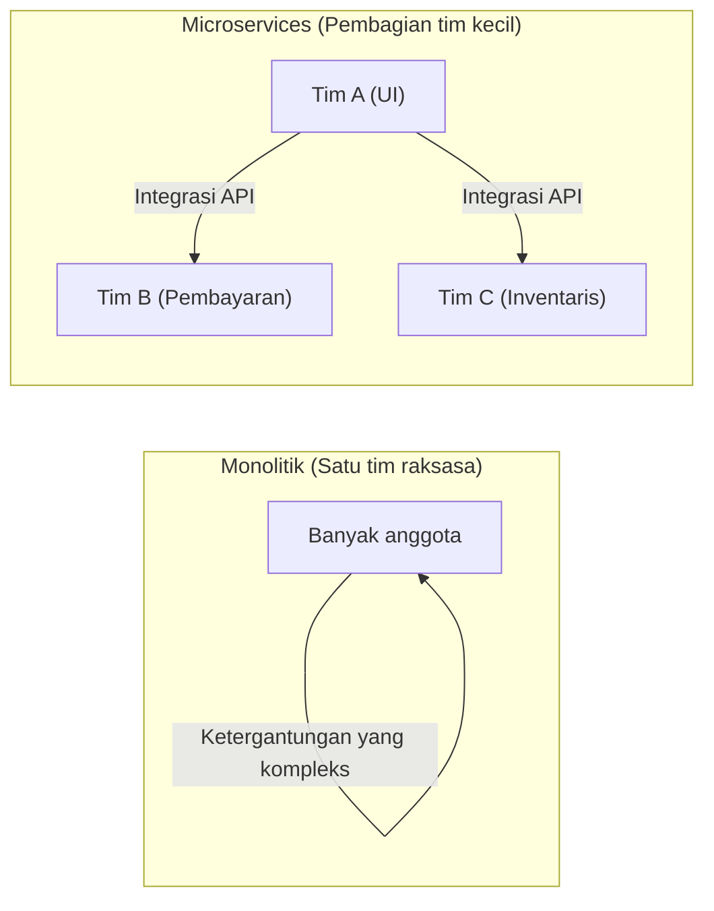

# Pengantar: Apa itu Hukum Brooks?

Bagi siapa pun yang terlibat dalam pengembangan sistem, rekayasa perangkat lunak, atau manajemen proyek pada umumnya, mungkin pernah mendengar istilah "Hukum Brooks (Brooks's law)".

Hukum Brooks adalah aturan empiris yang sangat terkenal dan paradoks dalam proyek pengembangan perangkat lunak, yang diajukan oleh Frederick P. Brooks Jr. pada tahun 1975 dalam bukunya *The Mythical Man-Month: Essays on Software Engineering*. Hukum ini terangkum dalam satu kalimat berikut:

> **"Menambah tenaga kerja pada proyek perangkat lunak yang terlambat hanya akan membuatnya semakin terlambat."**
> *(Adding manpower to a late software project makes it later.)*

Secara intuitif, jika sebuah proyek mengalami keterlambatan, tampaknya masuk akal jika kita menambah orang maka pekerjaan akan berjalan lebih cepat. Logikanya adalah, "Jika suatu pekerjaan memakan waktu 10 hari untuk 1 orang, maka akan selesai dalam 1 hari untuk 10 orang." Namun, dalam dunia pengembangan perangkat lunak, rumus perhitungan "Man-Month (Orang-Bulan)" ini tidak berlaku.

Dalam artikel ini, kita akan mengungkap mengapa Hukum Brooks ini terjadi, apa penyebab mendasarnya, serta bagaimana kita seharusnya menghindari atau memitigasi hukum ini dalam metode pengembangan perangkat lunak modern (Agile, DevOps, dll.) secara mendalam.

---

# Mengapa Menambah Personel Memperburuk Keterlambatan? 3 Penyebab Utama

Mengapa penambahan personel yang dilakukan manajer proyek dengan niat baik untuk mengejar keterlambatan justru berakibat "menyiram minyak ke dalam api"? Brooks menyebutkan tiga faktor utama berikut sebagai alasannya.

## 1. Peningkatan Biaya Komunikasi (Overhead) yang Eksplosif

Semakin banyak orang, semakin besar biaya komunikasi (overhead) untuk berbagi informasi dan koordinasi.
Jumlah jalur (path) komunikasi antar anggota tim meningkat dengan rumus $\frac{n(n-1)}{2}$ terhadap jumlah anggota $n$.

- Untuk tim dengan 3 orang, terdapat 3 jalur komunikasi
- Untuk tim dengan 5 orang, 10 jalur
- Untuk tim dengan 10 orang, 45 jalur
- Untuk tim dengan 20 orang, 190 jalur

Dengan demikian, seiring bertambahnya jumlah orang, jalur komunikasi **meningkat secara eksponensial (tepatnya kombinatorial)**. Ketika ada anggota baru yang ditambahkan, seluruh tim perlu menyamakan persepsi mengenai siapa yang mengerjakan apa, bagaimana arah desainnya, dan bagaimana spesifikasi antarmukanya. Waktu yang seharusnya bisa digunakan untuk pengembangan justru tersita untuk rapat, diskusi, dan pengecekan informasi.

## 2. Munculnya Biaya Onboarding (Edukasi dan Pembelajaran)

Ketika anggota baru ditambahkan pada akhir proyek atau saat proyek sedang dalam masalah besar (death march), anggota lama harus mengajari anggota baru tersebut mengenai latar belakang proyek, arsitektur sistem, standar pengkodean, pengetahuan domain bisnis, dan lain-lain.

Tindakan "mengajari" ini akan menyita waktu para insinyur andalan (ace) yang paling memahami proyek. Sampai anggota baru bisa menjadi produktif (mulai berkontribusi pada proyek), diperlukan periode pembelajaran (ramp-up time) tertentu. Selama masa itu, produktivitas tim secara keseluruhan justru **turun dibandingkan sebelum penambahan anggota**.

## 3. Ketidakmampuan Membagi Pekerjaan (Sifat Sepuensial/Serial Tugas)

Tidak semua pekerjaan dapat dibagi rata sesuai jumlah orang.
Brooks dalam bukunya menggunakan analogi terkenal: **"Meskipun ada 9 wanita hamil, tidak mungkin melahirkan seorang bayi dalam 1 bulan."**

- **Tugas yang sepenuhnya dapat dibagi:** Memotong rumput di ladang atau entri data sederhana. Jika jumlah orang digandakan, waktu pengerjaan akan berkurang setengah.
- **Tugas yang tidak dapat dibagi:** Desain dasar perangkat lunak, investigasi bug yang kompleks, penemuan algoritma, dll. Ini membutuhkan pemahaman tentang konteks keseluruhan dan latar belakang. Jika dipaksa dibagi kepada banyak orang, hal itu justru akan menimbulkan bug atau inkonsistensi saat integrasi.

Banyak proses dalam pengembangan perangkat lunak memiliki saling ketergantungan satu sama lain, dan terdapat dependensi serial (critical path), seperti modul B tidak dapat diuji sampai modul A selesai. Menggelontorkan banyak orang ke dalam situasi ini hanya akan memperlama waktu tunggu dan tidak mempercepat pengerjaan.

---

# Struktur "Death March" dalam Proyek Nyata

Hukum Brooks muncul paling kejam pada tahap akhir saat tenggat waktu proyek sudah dekat.

1. **Penemuan Keterlambatan:** Banyak bug tak terduga muncul saat fase pengujian integrasi (integration testing), dan keterlambatan jadwal mulai terungkap.
2. **Tekanan dari Manajemen:** Turun instruksi, "Tenggat waktu mutlak tidak bisa digeser. Kami akan mengeluarkan anggaran untuk menambah orang agar bisa selesai."
3. **Penambahan Personel:** Insinyur yang sedang luang dari proyek lain (namun tidak memiliki pengetahuan bisnis proyek ini) atau banyak pemrogram dari perusahaan mitra diterjunkan.
4. **Kekacauan Memuncak:** Anggota lama sibuk mengajari dan menjawab pertanyaan anggota baru, sehingga tidak bisa fokus pada tugas mereka sendiri. Jalur komunikasi meledak, dan jumlah rapat semakin bertambah.
5. **Penurunan Kualitas:** Akibat ketergesaan dan kurangnya komunikasi, anggota baru melakukan perubahan yang merusak premis sistem, menciptakan banyak bug baru (degradasi).
6. **Keterlambatan Lebih Lanjut:** Hasilnya, penyelesaian menjadi lebih lambat dari jadwal awal, dan orang-orang di lapangan benar-benar kelelahan (terciptalah death march).

Untuk memutus siklus setan ini, manajer harus memiliki pilihan selain "menambah orang".

---

# Pendekatan dan Solusi Modern terhadap Hukum Brooks

Hukum yang diajukan pada tahun 1975 ini pada dasarnya masih relevan dalam rekayasa perangkat lunak modern setelah hampir setengah abad berlalu. Namun, kita memiliki "solusi" yang dipelajari dari kegagalan masa lalu. Bagaimana pengembangan Agile modern, DevOps, dan organisasi rekayasa perangkat lunak yang unggul mengatasi Hukum Brooks ini?

## Solusi 1: Mempertimbangkan Kembali Jadwal dan Mengurangi Lingkup (Scope)

Jika proyek terlambat, dua solusi paling rasional dan tidak menyakitkan adalah:

- **Memperpanjang tenggat waktu:** Menyusun ulang jadwal berdasarkan perkiraan yang realistis.
- **Mengurangi lingkup:** Menghapus fitur yang tidak esensial (Nice to have) dari target rilis, dan hanya menyediakan nilai inti (core value) hingga tenggat waktu.

Aturan emasnya adalah "menambah waktu" atau "mengurangi apa yang harus dikerjakan", bukan "menambah orang". Dalam pengembangan Agile (seperti Scrum), karena hanya menyelesaikan "backlog yang bisa diselesaikan" dalam sprint yang tetap, sistem ini sudah memiliki mekanisme untuk mencegah memaksakan lingkup yang tidak masuk akal.

## Solusi 2: Tim Lintas Fungsi Berskala Kecil (Two-Pizza Team)

"Aturan Dua Piza (Two-Pizza Team)" yang diajukan oleh Jeff Bezos dari Amazon adalah salah satu jawaban sempurna untuk Hukum Brooks. Aturannya adalah, "Jumlah anggota tim maksimal haruslah jumlah orang yang bisa berbagi dua loyang piza (sekitar 6 hingga 8 orang)."

Dengan menjaga tim tetap kecil, ledakan jalur komunikasi dapat dicegah. Saat membangun sistem berskala besar, alih-alih membuat satu tim raksasa, sistem dibagi secara longgar (loosely coupled) seperti dengan [arsitektur microservices](/id/p/microservices-architecture-bff-api-gateway/), dan masing-masing komponen ditangani oleh tim kecil yang independen.

## Solusi 3: Integrasi Berkelanjutan (CI) dan Otomatisasi Pengujian

Hal yang paling menakutkan saat menambah orang adalah "anggota baru merusak kode yang sudah ada (degradasi)".
Hal yang mencegah ini adalah mekanisme pengujian otomatis dan CI (Continuous Integration).
Siapa pun yang mengubah kode, ribuan tes otomatis akan dijalankan dalam beberapa menit, dan jika ada bug, akan segera terdeteksi. Dengan lingkungan seperti ini, anggota baru pun dapat memodifikasi kode tanpa rasa khawatir. Ini adalah pendekatan menggunakan teknologi untuk menurunkan biaya pembelajaran dan risiko.

## Solusi 4: Penyempurnaan Dokumentasi dan Penghapusan Pengetahuan Tersembunyi (Tacit Knowledge)

Untuk menurunkan biaya onboarding, kita harus mengurangi "pengetahuan tersembunyi yang hanya bisa diketahui jika bertanya langsung kepada anggota lama" dan memperbanyak "pengetahuan tersurat yang bisa dipahami dengan membacanya".
- Menyiapkan README atau Wiki yang baik
- Menggunakan ADR (Architecture Decision Record) untuk merekam latar belakang keputusan arsitektur
- Menulis kode yang bersih, mudah dibaca, dan mendokumentasikan dirinya sendiri (self-documenting code)
Dengan mempersiapkan hal-hal ini dalam keadaan normal, "biaya edukasi" saat menambah orang dapat dikurangi secara signifikan.

---

# Penutup: Untuk Menghadapi Mitos

Frederick Brooks dalam *The Mythical Man-Month* menegaskan bahwa "Tidak ada peluru perak (teknologi atau metode ajaib yang dapat menyelesaikan semua masalah dalam pengembangan perangkat lunak dengan satu pukulan)".

Pemikiran penambahan sederhana seperti "Jika terlambat, tambah saja orang" tidak berlaku dalam ciptaan intelektual yang kompleks dan tidak terlihat seperti perangkat lunak. Untuk membawa proyek menuju kesuksesan, tidak ada cara lain selain memahami struktur komunikasi, menjaga ukuran tim agar tetap ideal, dan secara konsisten menumpuk praktik rekayasa perangkat lunak harian (otomatisasi, modularisasi, dokumentasi).

Hukum Brooks menuntut kita untuk terbangun dari "ilusi Man-Month", dan menghadapi esensi dari "kerja sama tim" yang dijalin oleh eksistensi manusia yang kompleks.
