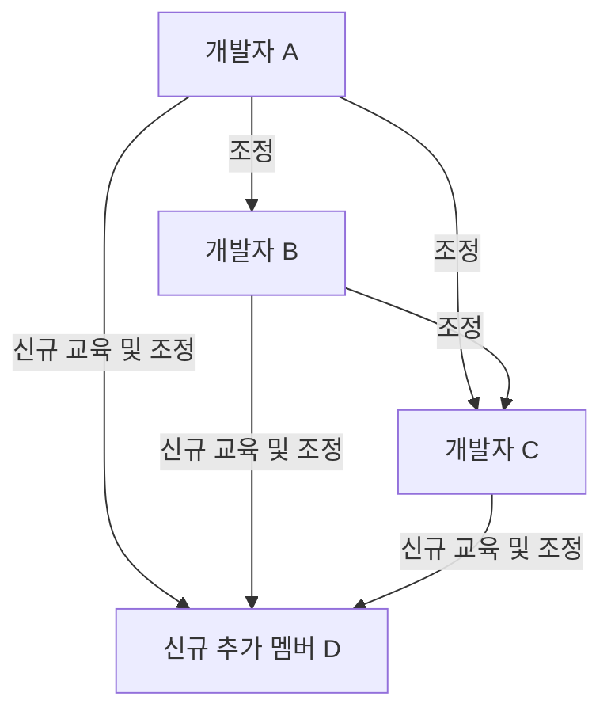
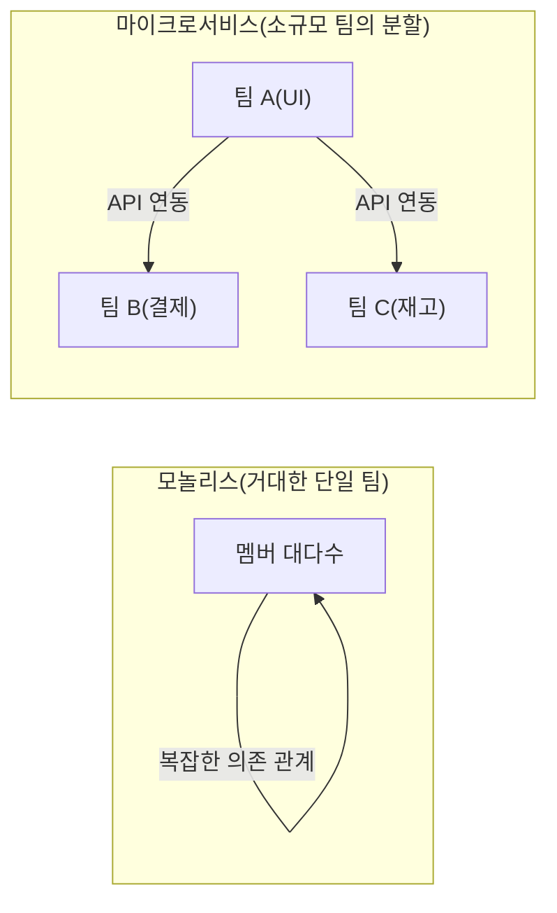

# 들어가며: 브룩스의 법칙이란 무엇인가?

시스템 개발이나 소프트웨어 엔지니어링, 또는 일반적인 프로젝트 관리에 관여하는 사람이라면 한 번쯤 '브룩스의 법칙(Brooks's law)'이라는 말을 들어본 적이 있을 것입니다.

브룩스의 법칙은 1975년 프레더릭 P. 브룩스 주니어(Frederick P. Brooks Jr.)가 자신의 저서 『맨먼스 미신: 늑대인간을 쏠 은탄환은 없다(The Mythical Man-Month)』에서 제창한, 소프트웨어 개발 프로젝트에 있어 매우 유명하고도 역설적인 경험 법칙입니다. 그 법칙은 다음 한 문장으로 요약됩니다.

> **"지연되고 있는 소프트웨어 프로젝트에 인력을 추가하는 것은 프로젝트를 더욱 지연시킬 뿐이다."**
> *(Adding manpower to a late software project makes it later.)*

직관적으로는 프로젝트가 지연되고 있다면 인력을 늘릴수록 그만큼 작업이 진행될 것처럼 생각됩니다. "혼자서 10일 걸리는 일이라면, 10명이면 1일에 끝날 것이다"라는 논리입니다. 하지만 소프트웨어 개발의 세계에서는 이 '인월(맨먼스)'의 계산식이 성립하지 않습니다.

본 기사에서는 이 브룩스의 법칙이 왜 일어나는지 그 근본적인 원인을 밝히고, 현대 소프트웨어 개발 기법(애자일, DevOps 등)에서 이 법칙을 어떻게 회피하고 완화해 나가야 할지에 대해 상세히 파헤쳐 보겠습니다.

---

# 왜 인력 추가가 지연을 조장하는가? 3가지 근본 원인

프로젝트 매니저가 지연을 만회하기 위해 좋은 의도로 실행한 인력 추가가 왜 '불에 기름을 붓는' 결과가 되어버리는 걸까요? 브룩스는 그 이유로 주로 다음의 3가지 요인을 들고 있습니다.

## 1. 커뮤니케이션 오버헤드의 폭발적인 증대

사람이 늘어나면 늘어날수록, 정보 공유나 조정을 위한 커뮤니케이션 비용(오버헤드)이 증대됩니다.
팀원 간 커뮤니케이션 패스(경로)의 수는 멤버 수 $n$ 에 대해 $\frac{n(n-1)}{2}$ 의 계산식으로 증가합니다.

- 3명의 팀이라면 커뮤니케이션 패스는 3경로
- 5명의 팀이라면 10경로
- 10명의 팀이라면 45경로
- 20명의 팀이라면 190경로

이처럼 인원수가 늘어남에 따라 커뮤니케이션 패스는 **지수함수적(정확히는 조합적)으로 증가**합니다. 새로 인력이 추가되면 누가 무엇을 하고 있는지, 설계 방침은 어떻게 되어 있는지, 인터페이스 사양은 어떻게 되어 있는지를 전원이 조율해야 하며, 본래 개발에 사용할 수 있었을 시간이 회의나 미팅, 전달 사항 확인에 빼앗겨 버리게 됩니다.

## 2. 온보딩(교육 및 학습) 비용의 발생

프로젝트 막바지나 화재 진압 중에 새로운 멤버가 추가되면, 기존 멤버는 그 신규 멤버에게 프로젝트의 배경, 시스템의 아키텍처, 코딩 규약, 업무 도메인 지식 등을 가르쳐야만 합니다.

이 '가르친다'라는 행위는 프로젝트를 가장 깊이 이해하고 있는 에이스급 엔지니어의 시간을 빼앗게 됩니다. 신규 멤버가 전력이 될(프로젝트에 기여하기 시작할) 때까지는 일정한 학습 기간(램프업 타임)이 필요하지만, 그동안 팀 전체의 생산성은 오히려 **추가하기 전보다 저하**되어 버리는 것입니다.

## 3. 작업 분할의 불가능성(태스크의 직렬성)

모든 일이 인원수만큼 깔끔하게 분할될 수 있는 것은 아닙니다.
브룩스는 저서 속에서 **"임산부가 9명 있다고 해서, 1개월 만에 아기를 출산할 수는 없다"**라는 유명한 비유를 사용하고 있습니다.

- **완전히 분할 가능한 태스크:** 밭의 잡초 베기나 데이터의 단순 입력 등. 인원수를 배로 늘리면 시간은 절반이 됩니다.
- **분할 불가능한 태스크:** 소프트웨어의 기본 설계, 복잡한 버그 조사, 알고리즘 고안 등. 전후 맥락이나 전체상 파악이 필요하여, 여러 명에게 억지로 분할하게 되면 반대로 통합 시의 버그나 불일치를 일으키게 됩니다.

소프트웨어 개발의 많은 공정은 상호 의존 관계를 가지고 있어, A라는 모듈이 완성되지 않으면 B라는 모듈의 테스트를 할 수 없는 식의 직렬적인 의존 관계(크리티컬 패스)가 존재합니다. 여기에 인력을 대량으로 투입하더라도 대기 시간만 늘어날 뿐 진행이 빨라지지는 않습니다.

---

# 현실 프로젝트에서의 '데스마치' 구조

브룩스의 법칙이 가장 잔혹하게 나타나는 것은 프로젝트의 납기가 임박한 막바지 단계입니다.

1. **지연 발각:** 통합 테스트 페이즈 등에서 예상치 못한 버그가 다발하여 스케줄 지연이 발각된다.
2. **경영진의 압박:** "납기는 절대 바꿀 수 없다. 예산은 내줄 테니 인력을 투입해서 어떻게든 해라"라는 지시가 내려온다.
3. **인력 추가:** 다른 프로젝트에서 손이 빈(하지만 업무 지식이 없는) 엔지니어나 협력사에서 대량의 프로그래머가 투입된다.
4. **혼란의 극치:** 기존 멤버는 신인 교육과 질문 대응에 쫓겨 자신의 태스크에 집중할 수 없게 된다. 커뮤니케이션 패스가 폭발하여 미팅만 계속 늘어난다.
5. **품질 저하:** 초조함과 커뮤니케이션 부족으로 신규 멤버가 시스템의 전제를 무너뜨리는 듯한 수정을 가해 새로운 버그(디그레이드)를 대량으로 양산한다.
6. **추가적인 지연:** 결과적으로 당초 예정보다 더욱 완성이 늦어지고 현장은 지쳐버린다(데스마치 완성).

이 악순환을 끊기 위해서는 매니저가 '인력을 늘린다' 이외의 선택지를 가져야만 합니다.

---

# 브룩스의 법칙에 대한 현대적인 대책과 접근법

1975년에 제창된 이 법칙은 반세기가 지나려는 현대의 소프트웨어 공학에서도 본질적으로는 유효합니다. 하지만 우리에게는 과거의 실패로부터 배운 '대책'이 있습니다. 현대의 애자일 개발이나 DevOps, 그리고 우수한 엔지니어링 조직은 이 브룩스의 법칙을 어떻게 극복하고 있을까요?

## 대책 1: 스케줄 재고와 스코프 축소

프로젝트가 지연되었을 경우, 가장 합리적이고 고통이 적은 해결책은 다음 2가지입니다.

- **납기를 연장한다:** 현실적인 견적에 근거하여 스케줄을 다시 짠다.
- **스코프를 줄인다:** 필수가 아닌 기능(Nice to have)을 릴리스 대상에서 제외하고 핵심 가치만 기한 내에 제공한다.

'인력을 추가한다'가 아니라, '시간을 늘리거나' '할 일을 줄인다'는 것이 철칙입니다. 애자일 개발(스크럼 등)에서는 고정된 스프린트 안에서 '완성할 수 있는 만큼의 백로그'를 소화해 나가기 때문에 무리한 스코프를 밀어넣는 것을 방지하는 구조가 내장되어 있습니다.

## 대책 2: 크로스 펑셔널 소규모 팀(Two-Pizza Team)

아마존의 제프 베조스가 제창한 '피자 2판 규칙(Two-Pizza Team)'은 브룩스의 법칙에 대한 완벽한 해답 중 하나입니다. "팀의 인원수는 피자 2판을 나눠 먹을 수 있는 인원(대략 6~8명 정도)을 상한으로 해야 한다"라는 규칙입니다.

팀을 작게 유지함으로써 커뮤니케이션 패스의 폭발을 방지합니다. 대규모 시스템을 구축할 경우에는 하나의 거대한 팀을 만드는 것이 아니라, 시스템을 마이크로서비스 아키텍처 등으로 느슨하게 결합되도록 분할하여 각각의 컴포넌트를 독립된 소규모 팀이 담당하도록 합니다.

## 대책 3: 지속적 통합(CI)과 테스트 자동화

인력을 추가했을 때 가장 두려운 것은 '신규 멤버가 기존 코드를 망가뜨려 버리는 것(디그레이드)'입니다.
이것을 막아주는 것이 자동 테스트와 CI(Continuous Integration) 구조입니다.
누가 코드를 변경하더라도 몇 분 안에 수천 건의 자동 테스트가 실행되어 버그가 있으면 즉시 감지되는 환경이 있다면 신규 멤버도 안심하고 코드를 변경할 수 있습니다. 학습 비용과 리스크를 기술로 낮추는 접근법입니다.

## 대책 4: 문서화 정비와 암묵지의 배제

온보딩 비용을 낮추기 위해서는 '기존 멤버에게 직접 묻지 않으면 알 수 없는 암묵지'를 줄이고 '읽으면 알 수 있는 형식지'를 늘릴 필요가 있습니다.
- 훌륭한 README나 Wiki 정비
- 아키텍처 결정 배경을 남기는 ADR(Architecture Decision Record)
- 읽기 쉽고 자기 문서화된 클린 코드
이러한 것들을 평소에 정비해 둠으로써 인력을 추가했을 때의 '교육 비용'을 대폭 삭감할 수 있습니다.

---

# 마치며: 미신에 맞서기 위해

프레더릭 브룩스는 『맨먼스 미신』 속에서 "은탄환(소프트웨어 개발의 모든 문제를 단번에 해결해 줄 마법의 기술이나 기법)은 없다"라고 단언했습니다.

"지연됐으니까 사람을 더하면 된다"라는 단순한 덧셈식 사고는 소프트웨어라는 복잡하고 눈에 보이지 않는 지적 창조물에는 통용되지 않습니다. 프로젝트를 성공으로 이끌기 위해서는 커뮤니케이션 구조를 이해하고, 팀 규모를 적정하게 유지하며, 매일의 엔지니어링 프랙티스(자동화, 모듈화, 문서화)를 꾸준히 축적해 나가는 수밖에 없습니다.

브룩스의 법칙은 우리에게 '인월이라는 환상'에서 깨어나 인간이라는 복잡한 존재가 엮어내는 '팀워크'의 본질과 마주할 것을 요구하고 있는 것입니다.
