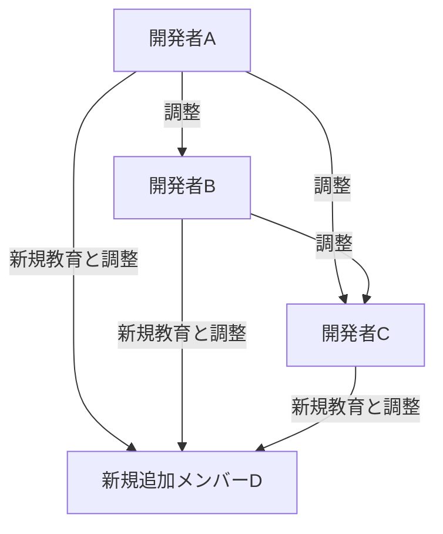
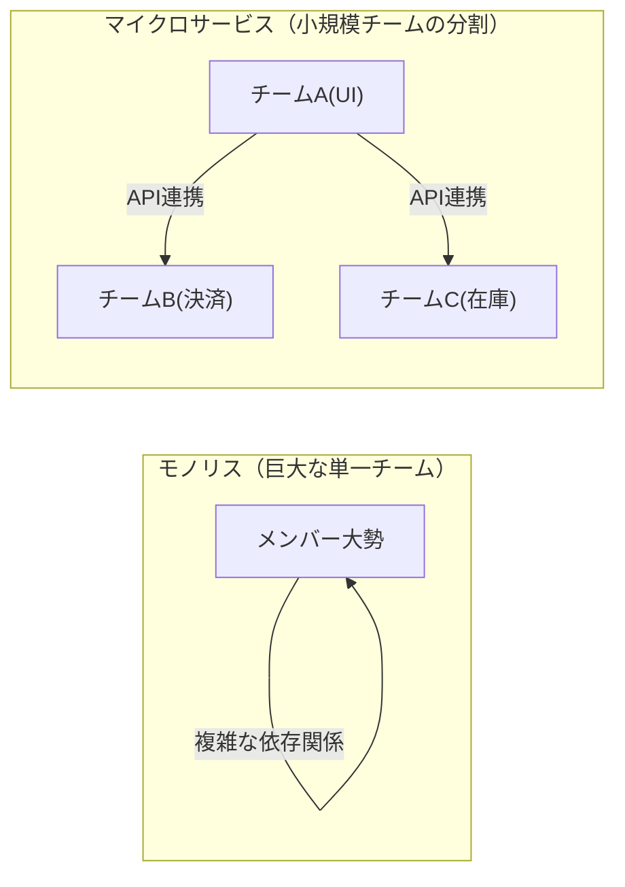

# はじめに：ブルックスの法則とは何か？

システム開発やソフトウェアエンジニアリング、あるいは一般的なプロジェクトマネジメントに関わる人であれば、一度は「ブルックスの法則（Brooks's law）」という言葉を耳にしたことがあるでしょう。

ブルックスの法則は、1975年にフレデリック・P・ブルックス・ジュニア（Frederick P. Brooks Jr.）がその著書『人月の神話：狼人間を撃つ銀の弾はない（The Mythical Man-Month）』の中で提唱した、ソフトウェア開発プロジェクトにおける非常に有名かつ逆説的な経験則です。その法則は、次の一文に集約されます。

> **「遅れているソフトウェアプロジェクトへの要員追加は、プロジェクトをさらに遅らせるだけである。」**
> *(Adding manpower to a late software project makes it later.)*

直感的には、プロジェクトが遅延しているなら、人を増やせばその分だけ作業が進むように思えます。「1人で10日かかる仕事なら、10人なら1日で終わるはずだ」という論理です。しかし、ソフトウェア開発の世界においてはこの「人月（マン・マンス）」の計算式は成り立ちません。

本記事では、このブルックスの法則がなぜ起こるのか、その根本的な原因を解き明かすとともに、現代のソフトウェア開発手法（アジャイル、DevOpsなど）においてこの法則をどのように回避・緩和していくべきかを、詳細にわたって深掘りしていきます。

---

# なぜ要員追加が遅れを助長するのか？ 3つの根本原因

プロジェクトマネージャーが遅延を取り戻すために良かれと思って行った要員追加が、なぜ「火に油を注ぐ」結果になってしまうのでしょうか。ブルックスはその理由として、主に以下の3つの要因を挙げています。

## 1. コミュニケーション・オーバーヘッドの爆発的な増大

人が増えれば増えるほど、情報共有や調整のためのコミュニケーション・コスト（オーバーヘッド）が増大します。
チームメンバー間のコミュニケーションパス（経路）の数は、メンバー数 $n$ に対して $\frac{n(n-1)}{2}$ の計算式で増加します。

- 3人のチームなら、コミュニケーションパスは 3経路
- 5人のチームなら、10経路
- 10人のチームなら、45経路
- 20人のチームなら、190経路

このように、人数が増えるにつれてコミュニケーションパスは**指数関数的（正確には組み合わせ的）に増加**します。新しく人が追加されると、誰が何をやっているのか、設計方針はどうなっているのか、インターフェースの仕様はどうなっているのかを全員ですり合わせる必要があり、本来開発に使えるはずの時間が会議や打ち合わせ、連絡事項の確認に奪われてしまいます。

## 2. オンボーディング（教育・学習）コストの発生

プロジェクトの終盤や炎上している最中に新しいメンバーが追加されると、既存のメンバーはその新メンバーに対してプロジェクトの背景、システムのアーキテクチャ、コーディング規約、業務ドメインの知識などを教えなければなりません。

この「教える」という行為は、プロジェクトを最も深く理解しているエース級のエンジニアの時間を奪うことになります。新メンバーが戦力になる（プロジェクトに貢献し始める）までには一定の学習期間（ランプアップタイム）が必要ですが、その間、チーム全体の生産性はむしろ**追加前よりも低下**してしまうのです。

## 3. 作業の分割不可能性（タスクの直列性）

すべての仕事が人数分に綺麗に分割できるわけではありません。
ブルックスは著書の中で、**「妊婦が9人いても、1ヶ月で赤ちゃんを出産することはできない」**という有名な比喩を用いています。

- **完全に分割可能なタスク:** 畑の草刈りやデータの単純入力など。人数を倍にすれば時間は半分になります。
- **分割不可能なタスク:** ソフトウェアの基本設計、複雑なバグ調査、アルゴリズムの考案など。前後の文脈や全体像の把握が必要であり、複数人に無理やり分割すると、逆に統合時のバグや不整合を引き起こします。

ソフトウェア開発の多くの工程は相互に依存関係を持っており、Aというモジュールが完成しないとBというモジュールのテストができない、といった直列的な依存関係（クリティカルパス）が存在します。ここに人を大量に投入しても、待ち時間が増えるだけで進行は早まりません。

---

# 現実のプロジェクトにおける「デスマーチ」の構造

ブルックスの法則が最も残酷に現れるのは、プロジェクトの納期が迫った終盤戦です。

1. **遅延の発覚:** 結合テストフェーズなどで想定外のバグが多発し、スケジュール遅延が発覚する。
2. **経営層からの圧力:** 「納期は絶対に動かせない。予算は出すから人を投入してなんとかしろ」という指示が下る。
3. **要員追加:** 別プロジェクトから手の空いた（しかし業務知識のない）エンジニアや、協力会社から大量のプログラマーが投入される。
4. **混乱の極み:** 既存メンバーは新人の教育と質問対応に追われ、自分のタスクに集中できなくなる。コミュニケーションパスが爆発し、ミーティングばかりが増える。
5. **品質の低下:** 焦りとコミュニケーション不足から、新メンバーがシステムの前提を崩すような修正を行い、新たなバグ（デグレード）を大量に生み出す。
6. **さらなる遅延:** 結果として、当初の予定よりもさらに完成が遅れ、現場は疲弊しきる（デスマーチの完成）。

この悪循環を断ち切るためには、マネージャーは「人を増やす」以外の選択肢を持たなければなりません。

---

# ブルックスの法則への現代的な対策とアプローチ

1975年に提唱されたこの法則は、半世紀が経とうとする現代のソフトウェア工学においても本質的には有効です。しかし、私たちには過去の失敗から学んだ「対策」があります。現代のアジャイル開発やDevOps、そして優れたエンジニアリング組織は、このブルックスの法則をいかに乗り越えているのでしょうか。

## 対策1：スケジュールの再考とスコープの削減

プロジェクトが遅れた場合、最も合理的で痛みの少ない解決策は以下の2つです。

- **納期を延ばす:** 現実的な見積もりに基づいてスケジュールを引き直す。
- **スコープを削る:** 必須ではない機能（Nice to have）をリリース対象から外し、コアバリューのみを期日までに提供する。

「人を追加する」のではなく、「時間を増やす」か「やることを減らす」のが鉄則です。アジャイル開発（スクラムなど）では、固定されたスプリントの中で「完成できる分だけのバックログ」を消化していくため、無理なスコープを押し込むことを防ぐ仕組みが組み込まれています。

## 対策2：クロスファンクショナルな小規模チーム（Two-Pizza Team）

Amazonのジェフ・ベゾスが提唱した「ピザ2枚ルール（Two-Pizza Team）」は、ブルックスの法則への完璧な回答の一つです。「チームの人数は、2枚のピザを分け合える人数（おおむね6〜8人程度）を上限とすべきだ」というルールです。

チームを小さく保つことで、コミュニケーションパスの爆発を防ぎます。大規模なシステムを構築する場合は、1つの巨大なチームを作るのではなく、システムをマイクロサービスアーキテクチャなどで疎結合に分割し、それぞれのコンポーネントを独立した小規模チームが担当するようにします。

## 対策3：継続的インテグレーション（CI）とテスト自動化

人を追加した際に最も恐ろしいのは、「新メンバーが既存のコードを壊してしまうこと（デグレード）」です。
これを防ぐのが、自動テストとCI（Continuous Integration）の仕組みです。
誰がコードを変更しても、数分以内に数千件の自動テストが実行され、バグがあれば即座に検知される環境があれば、新メンバーも安心してコードを変更できます。学習コストとリスクをテクノロジーで引き下げるアプローチです。

## 対策4：ドキュメンテーションの整備と暗黙知の排除

オンボーディングのコストを下げるためには、「既存メンバーに直接聞かなければわからない暗黙知」を減らし、「読めばわかる形式知」を増やす必要があります。
- 優れたREADMEやWikiの整備
- アーキテクチャ決定の背景を残すADR（Architecture Decision Record）
- 読みやすく自己文書化されたクリーンなコード
これらを平時から整備しておくことで、人を追加した際の「教育コスト」を大幅に削減できます。

---

# おわりに：神話に立ち向かうために

フレデリック・ブルックスは『人月の神話』の中で、「銀の弾丸（ソフトウェア開発におけるあらゆる問題を一発で解決する魔法の技術や手法）はない」と断言しました。

「遅れたから人を足せばいい」という単純な足し算の思考は、ソフトウェアという複雑で目に見えない知的創造物においては通用しません。プロジェクトを成功に導くためには、コミュニケーションの構造を理解し、チームの規模を適正に保ち、日々のエンジニアリングプラクティス（自動化、モジュール化、ドキュメント化）を地道に積み重ねるしかありません。

ブルックスの法則は、私たちに「人月という幻想」から目を覚まし、人間という複雑な存在が織りなす「チームワーク」の本質に向き合うことを要求しているのです。
