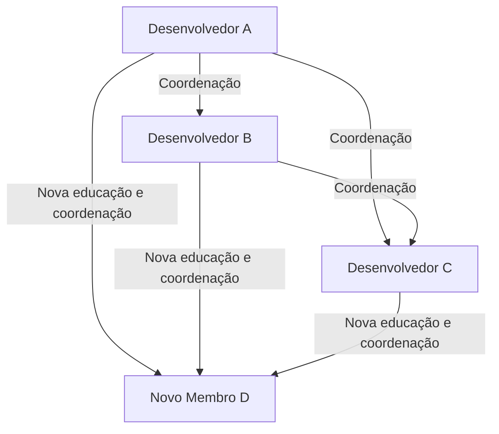
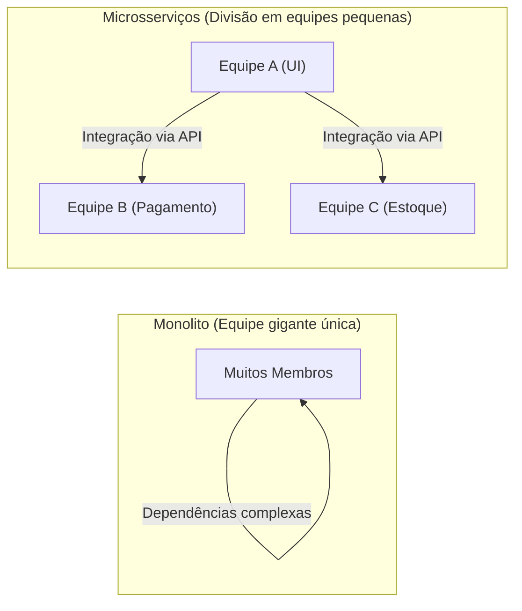

# Introdução: O que é a Lei de Brooks?

Se você está envolvido em desenvolvimento de sistemas, engenharia de software ou gerenciamento de projetos em geral, provavelmente já ouviu falar da "Lei de Brooks" (Brooks's law) pelo menos uma vez.

A Lei de Brooks é uma regra empírica paradoxal e muito famosa em projetos de desenvolvimento de software, proposta em 1975 por Frederick P. Brooks Jr. em seu livro *O Mítico Homem-Mês: Ensaios sobre Engenharia de Software* (The Mythical Man-Month). Essa lei é resumida na seguinte frase:

> **"Adicionar força de trabalho a um projeto de software atrasado o torna ainda mais atrasado."**
> *(Adding manpower to a late software project makes it later.)*

Intuitivamente, parece que se um projeto está atrasado, adicionar mais pessoas faria o trabalho progredir proporcionalmente. É a lógica de que "se um trabalho leva 10 dias para 1 pessoa, deve levar 1 dia para 10 pessoas". No entanto, no mundo do desenvolvimento de software, essa fórmula de cálculo de "homem-mês" não se sustenta.

Neste artigo, desvendaremos por que a Lei de Brooks ocorre e suas causas profundas, e também exploraremos em detalhes como devemos evitar ou mitigar essa lei nos métodos modernos de desenvolvimento de software (Agile, DevOps, etc.).

---

# Por que adicionar pessoal agrava o atraso? 3 Causas Principais

Por que a adição de pessoal, feita pelo gerente de projeto com a boa intenção de recuperar o atraso, acaba resultando em "jogar lenha na fogueira"? Brooks aponta os três principais fatores a seguir como as razões:

## 1. Aumento explosivo na sobrecarga de comunicação

Quanto mais pessoas houver, maior será o custo de comunicação (sobrecarga) para compartilhamento de informações e coordenação.
O número de caminhos (rotas) de comunicação entre os membros da equipe aumenta com base na fórmula $\frac{n(n-1)}{2}$ para o número de membros $n$.

- Para uma equipe de 3 pessoas, há 3 caminhos de comunicação
- Para uma equipe de 5 pessoas, 10 caminhos
- Para uma equipe de 10 pessoas, 45 caminhos
- Para uma equipe de 20 pessoas, 190 caminhos

Dessa forma, à medida que o número de pessoas aumenta, os caminhos de comunicação **aumentam exponencialmente (ou melhor, de forma combinatória)**. Quando novas pessoas são adicionadas, é necessário alinhar com todos quem está fazendo o quê, quais são as diretrizes de design e quais são as especificações das interfaces. O tempo que deveria ser usado para o desenvolvimento acaba sendo consumido por reuniões, discussões e verificação de comunicados.

## 2. Ocorrência de custos de integração (Educação/Aprendizado)

Quando novos membros são adicionados nos estágios finais de um projeto ou enquanto ele está pegando fogo, os membros existentes devem ensinar a esses novos membros o contexto do projeto, a arquitetura do sistema, as convenções de codificação, o conhecimento do domínio de negócios, etc.

Este ato de "ensinar" rouba o tempo dos engenheiros de elite que mais profundamente entendem o projeto. Um certo período de aprendizado (tempo de ramp-up) é necessário antes que os novos membros se tornem produtivos (comecem a contribuir para o projeto), mas durante esse período, a produtividade geral da equipe na verdade **cai mais do que antes da adição**.

## 3. Indivisibilidade do trabalho (Serialidade das tarefas)

Nem todo trabalho pode ser dividido ordenadamente pelo número de pessoas.
Em seu livro, Brooks usa a famosa metáfora: **"Mesmo que haja 9 mulheres grávidas, não é possível dar à luz um bebê em 1 mês."**

- **Tarefas perfeitamente divisíveis:** Cortar grama em um campo, simples entrada de dados, etc. Dobrar o número de pessoas corta o tempo pela metade.
- **Tarefas indivisíveis:** Design básico de software, investigação de bugs complexos, concepção de algoritmos, etc. Exigem uma compreensão do contexto circundante e do quadro geral, e dividi-las à força entre várias pessoas causa bugs e inconsistências durante a integração.

Muitas etapas no desenvolvimento de software têm interdependências, com dependências seriais (o caminho crítico) como não poder testar o módulo B até que o módulo A esteja completo. Injetar um grande número de pessoas aqui não acelera o progresso, apenas aumenta o tempo de espera.

---

# A Estrutura da "Marcha da Morte" (Death March) em Projetos Reais

A Lei de Brooks se manifesta de forma mais cruel nas fases finais, quando o prazo do projeto se aproxima.

1. **Descoberta do atraso:** Uma infinidade de bugs inesperados ocorre em fases como testes de integração, e o atraso no cronograma é descoberto.
2. **Pressão da diretoria:** Vem a ordem: "O prazo é inegociável. Daremos o orçamento, então coloque mais pessoas e dê um jeito."
3. **Adição de pessoal:** Engenheiros disponíveis de outros projetos (mas sem conhecimento do negócio) ou um grande número de programadores de empresas parceiras são trazidos.
4. **O auge da confusão:** Os membros existentes ficam sobrecarregados com o treinamento dos novatos e respondendo a perguntas, perdendo a capacidade de focar em suas próprias tarefas. Os caminhos de comunicação explodem, e o número de reuniões só aumenta.
5. **Declínio da qualidade:** Devido à pressa e à falta de comunicação, os novos membros fazem modificações que quebram as premissas do sistema, criando uma grande quantidade de novos bugs (degradação).
6. **Mais atrasos:** Como resultado, a conclusão é adiada ainda mais do que o programado originalmente, e a equipe de campo fica exausta (conclusão da marcha da morte).

Para quebrar esse ciclo vicioso, os gerentes devem ter opções além de "adicionar pessoas".

---

# Abordagens e Contramedidas Modernas para a Lei de Brooks

Proposta em 1975, esta lei permanece essencialmente válida na engenharia de software moderna, quase meio século depois. No entanto, temos "contramedidas" aprendidas com falhas passadas. Como o desenvolvimento ágil moderno, o DevOps e as organizações de engenharia excepcionais superam essa Lei de Brooks?

## Contramedida 1: Reconsiderar o Cronograma e Reduzir o Escopo

Se um projeto estiver atrasado, as duas soluções mais racionais e menos dolorosas são:

- **Estender o prazo:** Refazer o cronograma com base em estimativas realistas.
- **Reduzir o escopo:** Remover recursos não essenciais (Nice to have) do escopo de lançamento e entregar apenas o valor central até o prazo.

A regra de ouro não é "adicionar pessoas", mas sim "adicionar tempo" ou "reduzir o que será feito". O desenvolvimento ágil (como Scrum) tem mecanismos integrados para evitar forçar um escopo irrealista, consumindo apenas "o backlog que pode ser concluído" dentro de uma sprint fixa.

## Contramedida 2: Equipes Pequenas e Multifuncionais (Two-Pizza Team)

A regra da "Equipe de Duas Pizzas" (Two-Pizza Team) proposta por Jeff Bezos, da Amazon, é uma das respostas perfeitas à Lei de Brooks. É a regra de que "o tamanho da equipe deve ser limitado ao número de pessoas que podem compartilhar duas pizzas (cerca de 6 a 8 pessoas)".

Manter as equipes pequenas evita a explosão dos caminhos de comunicação. Ao construir sistemas em grande escala, em vez de criar uma equipe gigante e única, o sistema é dividido em componentes fracamente acoplados, como em uma arquitetura de microsserviços, e cada componente é gerenciado por uma equipe pequena independente.

## Contramedida 3: Integração Contínua (CI) e Automação de Testes

O que mais assusta quando pessoas são adicionadas é que "os novos membros podem quebrar o código existente (degradação)".
O que previne isso são os testes automatizados e os sistemas de CI (Continuous Integration).
Se houver um ambiente onde, não importa quem altere o código, milhares de testes automatizados são executados em poucos minutos e qualquer bug é detectado imediatamente, os novos membros também podem modificar o código com confiança. É uma abordagem que usa a tecnologia para diminuir os custos e os riscos de aprendizado.

## Contramedida 4: Melhorar a Documentação e Eliminar o Conhecimento Tácito

Para reduzir o custo de integração (onboarding), é necessário diminuir o "conhecimento tácito que não pode ser compreendido sem perguntar diretamente aos membros existentes" e aumentar o "conhecimento explícito que pode ser compreendido lendo".
- Criação de excelentes arquivos README e Wikis
- ADRs (Architecture Decision Records) que registram o contexto das decisões de arquitetura
- Código limpo, legível e autodocumentado
Ao preparar isso em tempos normais, o "custo de educação" de adicionar pessoas pode ser drasticamente reduzido.

---

# Conclusão: Para Enfrentar o Mito

Frederick Brooks afirmou em *O Mítico Homem-Mês* que "Não há Bala de Prata (uma tecnologia ou técnica mágica que resolva todos os problemas do desenvolvimento de software de uma só vez)".

A mentalidade de adição simples de "basta adicionar mais pessoas se estivermos atrasados" não funciona na criação intelectual complexa e invisível que é o software. Para liderar um projeto ao sucesso, não há escolha a não ser entender as estruturas de comunicação, manter o tamanho da equipe adequado e acumular práticas diárias de engenharia (automação, modularização, documentação) com perseverança.

A Lei de Brooks exige que acordemos da "ilusão do homem-mês" e enfrentemos a essência do "trabalho em equipe" tecido por essas entidades complexas que são os seres humanos.
