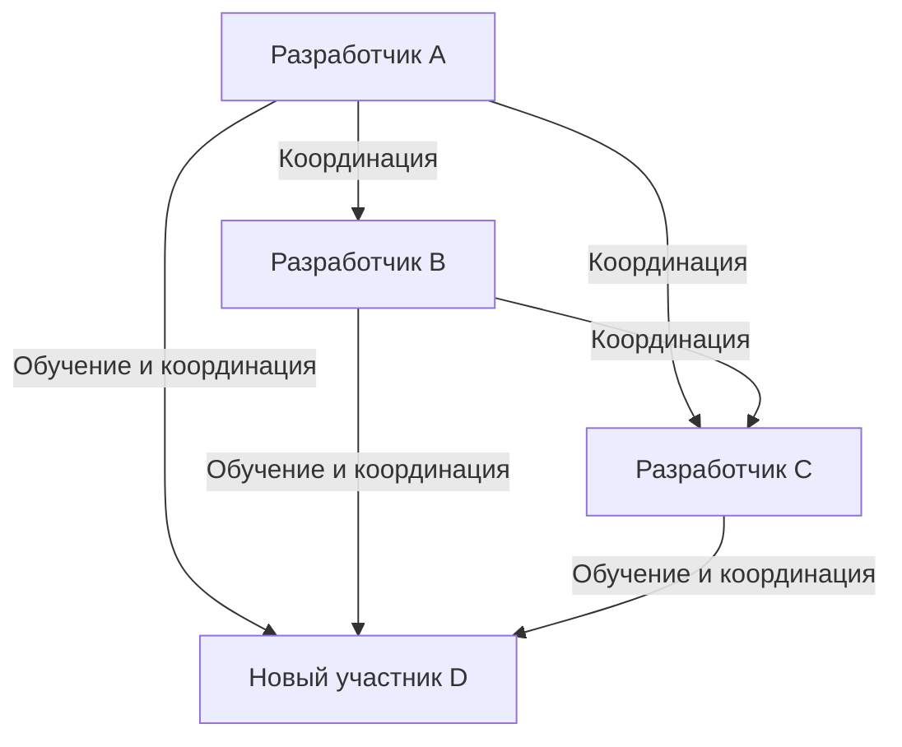
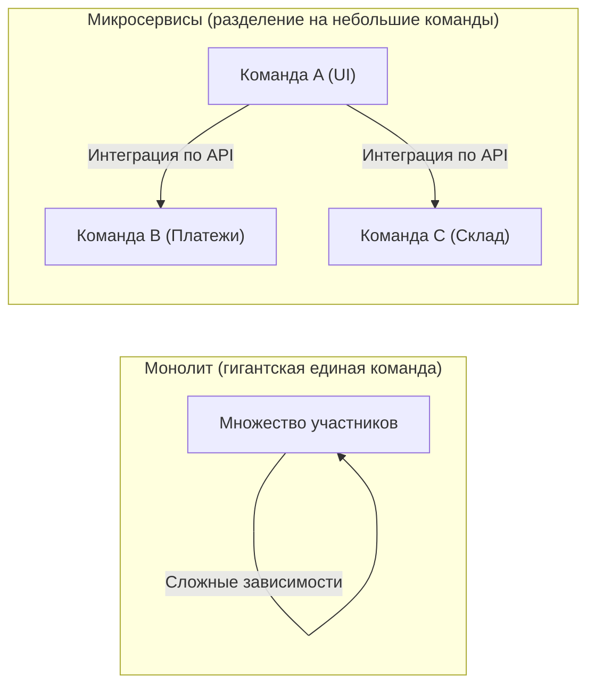

# Введение: Что такое закон Брукса?

Любой, кто связан с разработкой систем, программной инженерией или управлением проектами в целом, наверняка хотя бы раз слышал о «законе Брукса» (Brooks's law).

Закон Брукса — это очень известное и парадоксальное эмпирическое правило в проектах по разработке программного обеспечения, предложенное в 1975 году Фредериком П. Бруксом-младшим (Frederick P. Brooks Jr.) в его книге «Мифический человеко-месяц, или Как создаются программные системы» (The Mythical Man-Month). Этот закон сводится к одному предложению:

> **«Добавление рабочей силы в отстающий программный проект лишь отдаляет срок его завершения.»**
> *(Adding manpower to a late software project makes it later.)*

Интуитивно кажется, что если проект отстает от графика, добавление людей должно ускорить работу. Логика такова: «если одному человеку на работу нужно 10 дней, то 10 человек должны справиться за 1 день». Однако в мире разработки программного обеспечения эта формула расчета «человеко-месяцев» (man-month) не работает.

В этой статье мы подробно рассмотрим, почему возникает закон Брукса, каковы его фундаментальные причины, и как следует избегать или смягчать действие этого закона в современных методологиях разработки (Agile, DevOps и т. д.).

---

# Почему добавление персонала усугубляет отставание? 3 основные причины

Почему добавление сотрудников, которое менеджер проекта делает из лучших побуждений, чтобы наверстать упущенное, в итоге приводит к эффекту «подливания масла в огонь»? Брукс называет три основные причины.

## 1. Взрывной рост накладных расходов на коммуникацию

Чем больше людей, тем выше затраты (накладные расходы) на обмен информацией и координацию.
Количество путей коммуникации (связей) между членами команды увеличивается в соответствии с формулой $\frac{n(n-1)}{2}$ для числа участников $n$.

- В команде из 3 человек — 3 пути коммуникации
- В команде из 5 человек — 10 путей
- В команде из 10 человек — 45 путей
- В команде из 20 человек — 190 путей

Таким образом, по мере увеличения числа людей пути коммуникации возрастают **экспоненциально (точнее, комбинаторно)**. При добавлении новых людей возникает необходимость согласовать со всеми, кто и что делает, какова политика проектирования, каковы спецификации интерфейсов, и время, которое должно было пойти на разработку, отнимается на совещания, встречи и проверку уведомлений.

## 2. Возникновение затрат на онбординг (обучение и адаптацию)

Когда новые участники добавляются в проект на финальной стадии или в момент «пожара», существующим участникам приходится обучать их контексту проекта, архитектуре системы, стандартам кодирования, бизнес-домену и т. д.

Этот процесс обучения отнимает время у самых опытных инженеров, которые лучше всего разбираются в проекте. Новым участникам требуется определенный период обучения (время на раскачку), прежде чем они станут боеспособными (начнут приносить пользу проекту), и в течение этого времени общая производительность команды на самом деле **падает ниже уровня до их добавления**.

## 3. Неделимость задач (последовательный характер работы)

Не всякую работу можно аккуратно разделить на количество людей.
В своей книге Брукс использует известную метафору: **«Девять женщин не могут выносить ребенка за один месяц»**.

- **Полностью делимые задачи:** скашивание травы в поле или простой ввод данных. Если удвоить количество людей, время сократится вдвое.
- **Неделимые задачи:** базовое проектирование программного обеспечения, расследование сложных багов, разработка алгоритмов и т. д. Они требуют понимания контекста и общей картины, и если попытаться принудительно разделить их между несколькими людьми, это приведет к багам и несоответствиям при интеграции.

Многие этапы разработки программного обеспечения взаимозависимы; существуют последовательные зависимости (критический путь), например, когда тестирование модуля B невозможно до завершения модуля A. Даже если направить на это множество людей, время ожидания только увеличится, а прогресс не ускорится.

---

# Структура "марша смерти" (Death March) в реальных проектах

Закон Брукса проявляется наиболее жестоко на финальных стадиях проекта, когда приближаются сроки сдачи.

1. **Обнаружение задержки:** На этапе интеграционного тестирования возникает множество непредвиденных багов, и обнаруживается отставание от графика.
2. **Давление со стороны руководства:** Поступает приказ: «Сроки двигать нельзя. Мы дадим бюджет, привлекайте людей и решайте проблему».
3. **Добавление персонала:** Из других проектов перебрасывают свободных (но не знающих специфики) инженеров, или же нанимают массу программистов от компаний-партнеров.
4. **Пик хаоса:** Текущие участники поглощены обучением новичков и ответами на вопросы, и не могут сосредоточиться на своих задачах. Пути коммуникации взрывообразно множатся, количество совещаний растет.
5. **Снижение качества:** Из-за спешки и недостатка коммуникации новые участники вносят изменения, разрушающие базовую логику системы, порождая массу новых багов (деградацию).
6. **Дальнейшая задержка:** В результате проект завершается еще позже первоначально запланированного срока, а команда полностью истощается (завершение марша смерти).

Чтобы разорвать этот порочный круг, менеджер должен иметь другие варианты действий, кроме «добавления людей».

---

# Современные подходы и меры противодействия закону Брукса

Этот закон, предложенный в 1975 году, по своей сути остается актуальным и в современной программной инженерии почти полвека спустя. Однако у нас есть «меры», извлеченные из прошлых ошибок. Как современные методы разработки Agile, DevOps и передовые инженерные организации преодолевают закон Брукса?

## Мера 1: Пересмотр графика и сокращение объема работ (скоупа)

Если проект отстает, двумя наиболее разумными и безболезненными решениями являются:

- **Продление сроков:** Пересмотр графика на основе реалистичных оценок.
- **Сокращение объема работ:** Исключение необязательных функций (Nice to have) из релиза и предоставление к сроку только основной ценности.

Железное правило — не «добавлять людей», а «увеличивать время» или «уменьшать объем работы». В Agile-разработке (например, в Scrum) заложен механизм выполнения «только того объема бэклога, который можно завершить» в рамках фиксированного спринта, что предотвращает попытки втиснуть нереалистичный объем работ.

## Мера 2: Кросс-функциональные небольшие команды (Правило двух пицц)

Правило двух пицц (Two-Pizza Team), предложенное Джеффом Безосом из Amazon, является одним из идеальных ответов на закон Брукса. Правило гласит: «Размер команды не должен превышать количество людей, которых можно накормить двумя пиццами (примерно от 6 до 8 человек)».

Сохранение небольшого размера команды предотвращает взрывной рост путей коммуникации. При создании крупномасштабных систем вместо формирования одной гигантской команды система разбивается на слабосвязанные компоненты, например, с использованием микросервисной архитектуры, и каждый компонент поручается независимой небольшой команде.

## Мера 3: Непрерывная интеграция (CI) и автоматизация тестирования

Самое страшное при добавлении людей — это то, что «новые участники могут сломать существующий код (вызвать регрессию)».
Этому препятствуют автоматизированное тестирование и механизмы CI (Continuous Integration).
Если в среде, где кто бы ни изменял код, в течение нескольких минут выполняются тысячи автоматических тестов, и любые баги немедленно обнаруживаются, новые участники могут уверенно вносить изменения в код. Это подход, при котором стоимость обучения и риски снижаются с помощью технологий.

## Мера 4: Улучшение документации и устранение неявных знаний

Чтобы снизить затраты на онбординг, необходимо уменьшить объем «неявных знаний, которые можно получить, только спросив существующих участников», и увеличить объем «явных знаний, понятных при чтении».
- Поддержание качественных README и Wiki
- Ведение ADR (Architecture Decision Record), фиксирующих контекст архитектурных решений
- Чистый, легко читаемый самодокументируемый код
Заблаговременная подготовка всего этого в обычное время может значительно сократить «затраты на обучение» при добавлении людей.

---

# Заключение: Как противостоять мифу

В книге «Мифический человеко-месяц» Фредерик Брукс категорично заявляет, что «серебряной пули (магической технологии или метода, который разом решает все проблемы в разработке программного обеспечения) не существует».

Упрощенное мышление типа «мы отстаем, значит надо добавить людей» не работает в такой сложной и невидимой интеллектуальной деятельности, как программное обеспечение. Чтобы привести проект к успеху, нет иного пути, кроме как понимать структуру коммуникации, поддерживать адекватный размер команды и неустанно накапливать ежедневные инженерные практики (автоматизация, модульность, документирование).

Закон Брукса требует, чтобы мы очнулись от «иллюзии человеко-месяца» и столкнулись с истинной сутью «командной работы», сотканной сложными человеческими существами.
