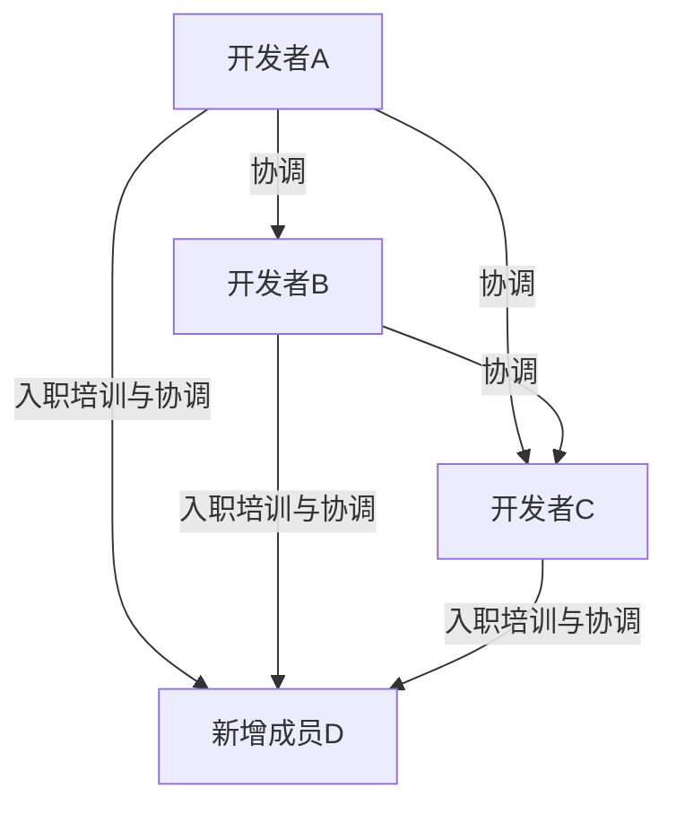
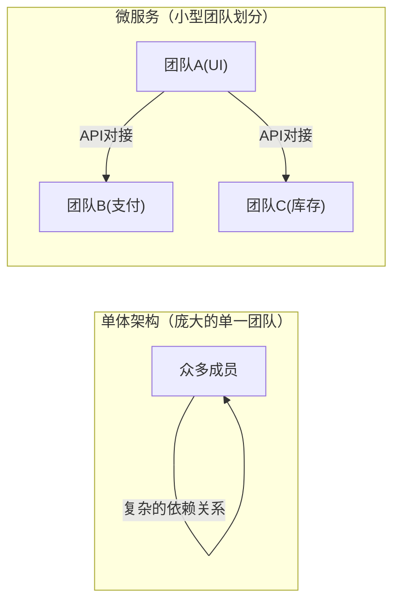

# 引言：什么是布鲁克斯法则？

只要是从事系统开发、软件工程，或者一般项目管理的人，大概都听说过“布鲁克斯法则（Brooks's law）”这个词。

布鲁克斯法则是小弗雷德里克·P·布鲁克斯（Frederick P. Brooks Jr.）于1975年其著作《人月神话》（The Mythical Man-Month）中提出的，在软件开发项目中极为著名且看似违背直觉的经验法则。该法则可以概括为以下这句话：

> **“向进度落后的软件项目增加人手，只会使项目更加落后。”**
> *(Adding manpower to a late software project makes it later.)*

从直觉上看，如果项目延期了，增加人手似乎就能加快进度。其逻辑是“1个人需要10天完成的工作，10个人应该1天就能完成”。然而，在软件开发的世界里，这种“人月（Man-Month）”的计算公式是行不通的。

本文将深入探讨布鲁克斯法则产生的原因、其根本所在，并详细剖析在现代软件开发方法（如敏捷开发、DevOps等）中，应该如何规避和缓解这一法则带来的影响。

---

# 为什么增加人手反而会加剧延期？3个根本原因

项目经理为了赶上进度而出于好意增加人手，为什么会导致“火上浇油”的结果呢？布鲁克斯指出了以下三个主要原因：

## 1. 沟通开销的爆炸性增长

人数越多，用于信息共享和协调的沟通成本（开销）就越大。
团队成员之间的沟通路径数量，随着成员数量 $n$ 的增加，按 $\frac{n(n-1)}{2}$ 的公式增长。

- 3人的团队，沟通路径有 3条
- 5人的团队，10条
- 10人的团队，45条
- 20人的团队，190条

如此一来，随着人数的增加，沟通路径呈**指数级（准确地说应是组合级）增长**。当新成员加入时，所有人需要就谁在做什么、设计方针是什么、接口规范是怎样的达成共识，本应用于开发的时间就这样被会议、讨论和确认联络事项给剥夺了。

## 2. 产生入职引导（培训与学习）成本

在项目后期或是已经陷入混乱时加入新成员，现有成员就必须向新成员传授项目背景、系统架构、编码规范、业务领域知识等内容。

这种“传授”行为，会夺走最了解项目的王牌工程师的时间。新成员成为即战力（开始对项目做出贡献）之前，需要一定的学习期（启动时间），在此期间，整个团队的生产力反而会**降至增加人手之前的水平以下**。

## 3. 任务的不可分割性（任务的串行性）

并非所有的工作都能完美地按人数进行分配。
布鲁克斯在书中用了一个著名的比喻：**“即使有9个孕妇，也无法在1个月内生出一个婴儿。”**

- **完全可分割的任务：** 如田间除草或简单的数据录入。人数翻倍，时间减半。
- **不可分割的任务：** 软件的基础设计、复杂的Bug排查、算法的设计等。这类任务需要掌握前后文脉和整体概况，如果强行分配给多人，反而在整合时会引发Bug或不一致的问题。

软件开发的许多环节具有相互依赖关系，存在着诸如“只有模块A完成了，模块B的测试才能进行”这样的串行依赖关系（关键路径）。在此投入大量人力，只会增加等待时间，并不能加快进度。

---

# 现实项目中“死亡行军”的结构

布鲁克斯法则最残酷的体现，往往是在项目临近交付期的收尾阶段。

1. **发现延期：** 在集成测试等阶段频发意外Bug，发现进度延误。
2. **来自管理层的压力：** 下达“交付日期绝对不能改。预算我们出，多派些人手想办法搞定”的指示。
3. **增加人手：** 从其他项目调来空闲（但缺乏相关业务知识）的工程师，或者从外包公司引入大量程序员。
4. **极度混乱：** 现有成员疲于培训新人和解答问题，无法集中精力处理自己的任务。沟通路径激增，会议不断增加。
5. **质量下降：** 由于焦躁和沟通不足，新成员做出了破坏系统前提的修改，产生了大量新的Bug（退化）。
6. **进一步延期：** 结果就是，完成时间比原计划更加滞后，现场人员疲惫不堪（死亡行军的形成）。

为了打破这种恶性循环，项目经理必须拥有“增加人手”之外的选项。

---

# 针对布鲁克斯法则的现代对策与方法

这一提出于1975年的法则，在经历了近半个世纪后的现代软件工程中本质上依然有效。然而，我们已经从过去的失败中吸取了“对策”。现代的敏捷开发、DevOps，以及优秀的工程组织，是如何克服布鲁克斯法则的呢？

## 对策1：重新评估进度和缩减范围

如果项目延期，最合理且痛苦最小的解决方案有以下两个：

- **延后交付日期：** 基于现实的估算重新制定进度计划。
- **缩减范围：** 将非核心功能（锦上添花的功能）从发布列表中剔除，仅在期限前交付核心价值。

铁律是“增加时间”或“减少工作量”，而不是“增加人手”。在敏捷开发（如Scrum）中，团队在固定的冲刺周期内只消化“能够完成的待办事项（Backlog）”，这种机制本身就能防止强行塞入不合理的范围。

## 对策2：跨职能的小型团队（两个披萨团队）

亚马逊创始人杰夫·贝索斯提出的“两个披萨规则（Two-Pizza Team）”，是对布鲁克斯法则的一个完美回应。该规则的核心是：“团队的人数上限，应该设定在能吃完两块披萨的人数（大约6到8人）之内。”

保持团队的小规模，可以防止沟通路径的激增。在构建大规模系统时，不要建立一个庞大的团队，而是通过微服务架构等方式将系统拆分为松耦合的部分，由独立的小型团队分别负责各个组件。

## 对策3：持续集成（CI）与测试自动化

增加人手时最可怕的事情，莫过于“新成员破坏了现有的代码（退化）”。
防止这种情况发生的机制就是自动化测试和CI（持续集成，Continuous Integration）。
无论谁修改了代码，系统都会在几分钟内运行成千上万个自动化测试，只要发现Bug就能立即被检测出来。有了这样的环境，新成员就可以放心地修改代码。这是一种用技术手段降低学习成本和风险的方法。

## 对策4：完善文档与消除隐性知识

为了降低入职引导成本，必须减少“只有直接向现有成员请教才能了解的隐性知识”，并增加“一读便知的显性知识”。
- 完善高质量的README和Wiki
- 留存架构决策背景的ADR（架构决策记录，Architecture Decision Record）
- 易于阅读、具备自我说明能力的整洁代码（Clean Code）
在平时就完善这些工作，可以大幅削减增加人手时的“教育成本”。

---

# 结语：如何对抗神话

弗雷德里克·布鲁克斯在《人月神话》中曾断言：“没有银弹（指能一举解决软件开发中所有问题的魔法般的技术或方法）。”

“进度落后了就加人”这种简单的加法思维，在软件这种复杂且无形的智力创造物上是行不通的。为了引导项目走向成功，我们只能去理解沟通的结构，保持适当的团队规模，并脚踏实地积累日常的工程实践（自动化、模块化、文档化）。

布鲁克斯法则要求我们从“人月的幻想”中醒来，直面由人类这一复杂存在所交织出的“团队合作”的本质。
