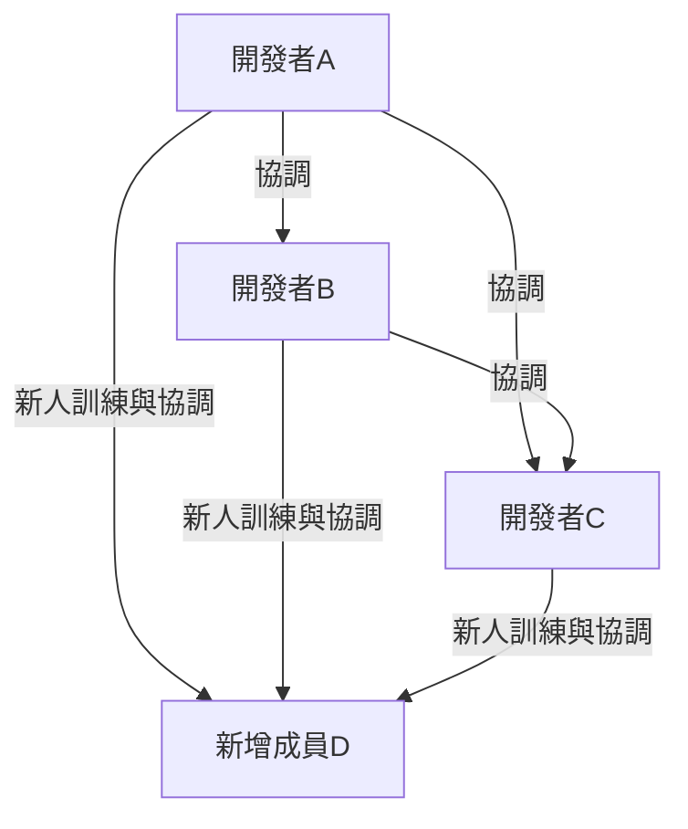
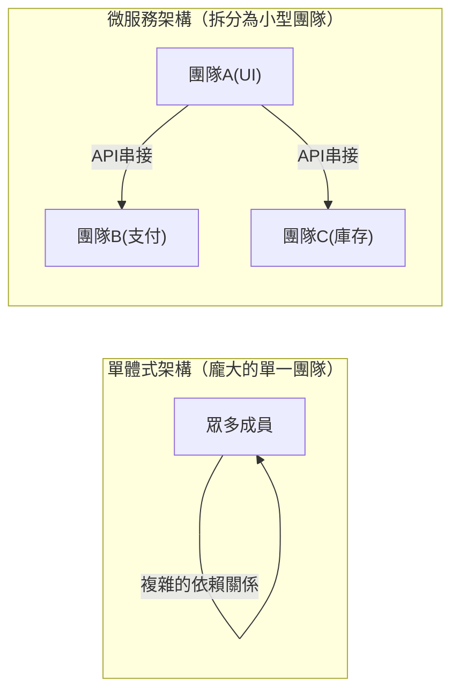

# 前言：什麼是布魯克斯法則（Brooks's law）？

只要是從事系統開發、軟體工程，或是一般的專案管理的人，應該都曾聽過「布魯克斯法則（Brooks's law）」這個詞。

布魯克斯法則是由佛瑞德里克·布魯克斯（Frederick P. Brooks Jr.）在 1975 年的著作《人月神話：軟體專案管理之道（The Mythical Man-Month）》中提出，是軟體開發專案中非常著名且反直覺的經驗法則。該法則可以濃縮為以下這句話：

> **「為延遲的軟體專案增加人力，只會讓專案更延遲。」**
> *(Adding manpower to a late software project makes it later.)*

直覺上，如果專案發生延遲，增加人力似乎就能讓工作進度加快。也就是「1 個人需要 10 天才能完成的工作，10 個人應該 1 天就能完成」的邏輯。然而，在軟體開發的世界裡，這種「人月（Man-Month）」的計算方式是行不通的。

本文將解開布魯克斯法則發生的根本原因，並深入探討在現代軟體開發方法（如敏捷開發、DevOps 等）中，應該如何避免或緩解這個法則帶來的影響。

---

# 為什麼增加人力會加劇延遲？3 個根本原因

專案經理為了挽救延遲的進度而出於好意增加人力，為什麼最後卻導致「火上加油」的結果呢？布魯克斯提出了以下 3 個主要原因：

## 1. 溝通成本（Overhead）的爆炸性增加

人數越多，為了資訊共享和協調所產生的溝通成本（Overhead）就越高。
團隊成員之間的溝通路徑數量，會隨著成員人數 $n$ 以 $\frac{n(n-1)}{2}$ 的公式增加。

- 3 人的團隊，溝通路徑為 3 條
- 5 人的團隊，10 條
- 10 人的團隊，45 條
- 20 人的團隊，190 條

如上所示，隨著人數增加，溝通路徑會呈現**指數型（更準確地說是組合型）增長**。當加入新成員時，所有人都需要重新對齊「誰在做什麼」、「設計方針為何」、「介面規格為何」等資訊。這會導致原本可以用來開發的時間，被會議、討論和確認聯絡事項給佔據。

## 2. 導入（教育與學習）成本的產生

如果在專案尾聲或是正處於「救火」狀態時加入新成員，現有成員就必須向新成員講解專案背景、系統架構、程式碼規範以及業務領域知識等。

這個「教導」的行為，會佔用對專案最了解的王牌工程師的時間。新成員需要一段學習時間（Ramp-up time）才能成為即戰力（開始對專案有實質貢獻），而在這段期間內，團隊整體的生產力反而會**比增加人力前還要低**。

## 3. 工作的不可分割性（任務的序列性）

並非所有的工作都能完美地平均分配給所有人。
布魯克斯在書中用了一個非常有名的比喻：**「即使有 9 個孕婦，也無法在 1 個月內生出一個嬰兒。」**

- **可完全分割的任務：** 如田裡除草或單純的資料輸入等。將人數加倍，時間就能減半。
- **不可分割的任務：** 如軟體基礎設計、複雜的 Bug 排查、演算法構思等。這些工作需要掌握前後脈絡與整體架構，如果硬是分給多人同時進行，反而會在整合時引發 Bug 或不一致的問題。

軟體開發的許多流程都存在著相互依賴的關係。例如「A 模組沒有完成，就無法測試 B 模組」這類序列性的依賴關係（關鍵路徑）。在這種情況下，即使投入大量人力，也只會增加等待時間，無法加快進度。

---

# 真實專案中的「死亡行軍（Death March）」結構

布魯克斯法則最殘酷的體現，通常發生在專案期限逼近的尾聲。

1. **發現延遲：** 在整合測試等階段頻繁出現預期外的 Bug，從而發現進度延遲。
2. **來自管理層的壓力：** 收到「期限絕對不能改。預算我們可以出，總之加人進去解決問題」的指示。
3. **增加人力：** 從其他專案調來有空檔（但缺乏相關業務知識）的工程師，或是從外包公司投入大量程式設計師。
4. **極度混亂：** 現有成員忙於新人訓練和回答問題，無法專注於自己的任務。溝通路徑爆炸，會議數量激增。
5. **品質下降：** 由於焦慮和溝通不良，新成員可能會做出破壞系統前提的修改，從而產生大量新的 Bug（退化）。
6. **進一步延遲：** 結果導致完成時間比原定計畫還要晚，現場人員疲憊不堪（死亡行軍就此成型）。

為了打破這個惡性循環，管理者必須具備「增加人力」以外的選項。

---

# 針對布魯克斯法則的現代對策與方法

這項於 1975 年提出的法則，即使經過了近半個世紀，在現代軟體工程中本質上依然適用。然而，我們有從過去失敗中學到的「對策」。現代的敏捷開發、DevOps，以及優秀的工程組織，是如何克服布魯克斯法則的呢？

## 對策 1：重新評估時程與縮減範疇（Scope）

當專案發生延遲時，最合理且痛苦最小的解決方案有以下兩種：

- **延後期限：** 根據實際的評估重新制定時程表。
- **縮減範疇：** 將非必要的項目（Nice to have）從發布範圍中移除，確保在期限內只提供核心價值。

鐵則不是「增加人力」，而是「增加時間」或「減少工作量」。在敏捷開發（如 Scrum）中，團隊會在固定的衝刺（Sprint）期間內消化「能夠完成的待辦事項（Backlog）」，這種機制能有效防止硬塞過多範疇的情況發生。

## 對策 2：跨職能的小型團隊（兩個披薩團隊原則）

Amazon 創辦人傑夫·貝佐斯（Jeff Bezos）提出的「兩個披薩原則（Two-Pizza Team）」，是對布魯克斯法則的完美解答之一。這個原則是：「團隊人數的上限，應該控制在剛好能吃完兩個披薩的人數（大約 6 到 8 人左右）」。

保持小規模的團隊可以防止溝通路徑爆炸。在建構大型系統時，與其建立一個龐大的團隊，不如利用微服務架構等方式將系統拆分為鬆散耦合的架構，並由各自獨立的小型團隊負責不同的元件。

## 對策 3：持續整合（CI）與測試自動化

增加人力時最可怕的事情，就是「新成員弄壞了現有的程式碼（退化）」。
為了解決這個問題，我們需要自動化測試與 CI（持續整合）的機制。
如果有一個環境，無論誰修改了程式碼，都能在幾分鐘內執行數千個自動化測試，並在發現 Bug 時立即發出警報，新成員就能安心地修改程式碼。這是一種透過技術來降低學習成本與風險的方法。

## 對策 4：完善文件並消除默會知識（Tacit Knowledge）

為了降低導入成本，我們必須減少「只有直接問現有成員才知道的默會知識」，並增加「讀了就能懂的顯性知識」。
- 撰寫優良的 README 或 Wiki
- 記錄架構決策背景的 ADR（架構決策紀錄）
- 易讀且具備自我文件化能力的整潔程式碼
在平時就做好這些準備，能夠大幅降低增加人力時所需的「教育成本」。

---

# 結語：為了迎戰神話

佛瑞德里克·布魯克斯在《人月神話》中斷言：「沒有銀彈（沒有任何一種神奇的技術或方法，可以一次解決軟體開發中的所有問題）」。

「因為延遲所以只要加人就好」這種單純的加法思維，在軟體這種複雜且無形的知識創造物中是行不通的。為了帶領專案走向成功，我們只能理解溝通結構，保持適當的團隊規模，並踏實地累積日常的工程實踐（自動化、模組化、文件化）。

布魯克斯法則要求我們從「人月的幻想」中醒來，並直面由人類這個複雜存在所編織出的「團隊合作」本質。
