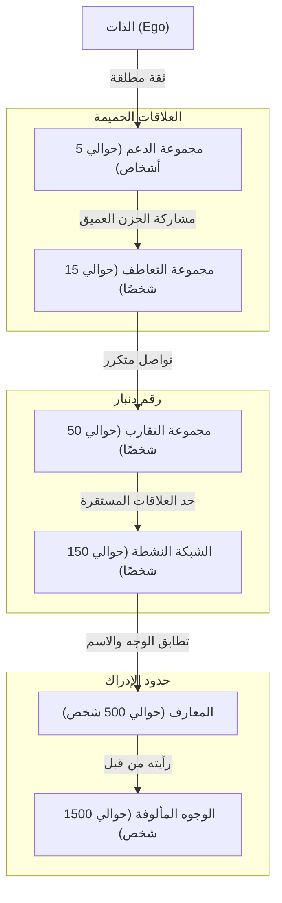
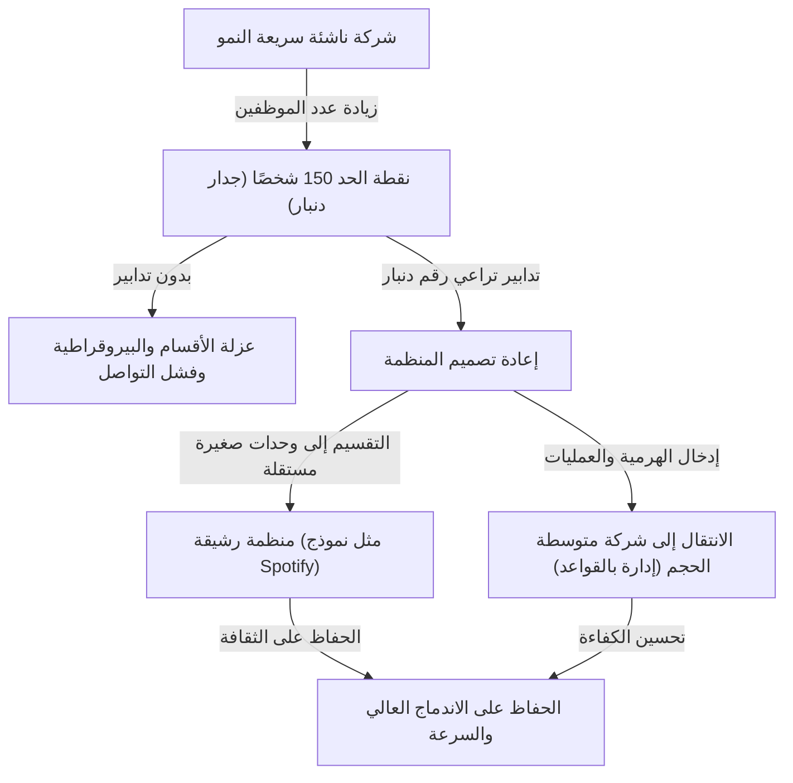

هل هناك حد للعلاقات الإنسانية؟ إلى أي مدى يمكن لأدمغتنا تكوين "تواصل حقيقي" مع الآخرين؟

في المجتمع الحديث، بفتح وسائل التواصل الاجتماعي تجد المئات بل الآلاف من "المتابعين" و"الأصدقاء". ولكن مع كم شخص تمكنا من بناء علاقة حقًا نثق فيها، ونعرف ظروف بعضنا البعض، ويمكننا مساعدة بعضنا البعض؟ هنا يظهر مصطلح **"رقم دنبار (Dunbar's number)"** الذي اقترحه عالم النفس التطوري روبن دنبار.

في هذا المقال، سنشرح مفهوم رقم دنبار بعمق، من الأسس البيولوجية إلى الأدلة التاريخية، وصولاً إلى تطبيقاته في التصميم التنظيمي في المجتمع الرقمي والأعمال اليوم. إذا كنت في موقع قيادي، فإن معرفة هذا القانون ستكون سلاحًا قويًا لبناء منظمة سليمة وعالية الإنتاجية.

---

## 1. ما هو رقم دنبار؟ (المفاهيم الأساسية والأسس البيولوجية)

رقم دنبار هو الحد الأقصى المعرفي الذي ينص على أن **"الحد الأعلى لعدد الأشخاص الذين يمكن للإنسان الحفاظ على علاقات اجتماعية مستقرة معهم هو حوالي 150 شخصًا"**. تم اقتراحه في أوائل التسعينيات من قبل عالم الأنثروبولوجيا وعالم النفس التطوري البريطاني روبن دنبار.

### حجم القشرة المخية الحديثة وحجم المجموعة
كانت نقطة البداية لأبحاث دنبار هي العلاقة بين حجم الدماغ لدى الرئيسيات وحجم المجموعات (الشبكات الاجتماعية) التي تشكلها. تعمق الرئيسيات الروابط الاجتماعية وتحافظ على تناغم المجموعة من خلال تنظيف بعضها البعض (Grooming). اكتشف دنبار أنه كلما كان حجم "القشرة المخية الحديثة (Neocortex)" التي تتحكم في التفكير العالي والاستنتاج واللغة كبيرًا (نسبتها إلى الدماغ بالكامل)، زاد متوسط حجم المجموعة التي يشكلها ذلك النوع.

عند تطبيق حجم القشرة المخية الحديثة للإنسان على المعادلة التي تظهر هذه العلاقة المتبادلة وحسابها، كان الرقم المستنتج هو **"148"**، أي حوالي 150 شخصًا.

### تعريف "العلاقات المستقرة"
لا يشير رقم دنبار الذي يبلغ "150 شخصًا" ببساطة إلى عدد الأشخاص الذين يمكنك مطابقة وجوههم بأسمائهم. العلاقة المقصودة هنا تعني الحالة التالية:
- تعرف من هو الشخص وما هي علاقتك به.
- تفهم كيف يرتبط هذا الشخص بالأعضاء الآخرين.
- تتشاركون الشعور بالواجب الاجتماعي والثقة والقواعد الضمنية، ويمكنكم التعاون لإنجاز الأمور دون الحاجة إلى توجيهات أو إجبار.

إذا تجاوز العدد هذا الحد، يزعم دنبار أنه يتجاوز قدرة معالجة الدماغ المعرفية، ولن تعرف من هو من، وللحفاظ على التماسك الاجتماعي، ستكون هناك حاجة إلى قوانين وقواعد وهيكل إدارة هرمي (بيروقراطية).

---

## 2. دوائر دنبار متحدة المركز: الهيكل الهرمي للعلاقات الإنسانية

لم يشر دنبار فقط إلى حد الـ 150 شخصًا، بل أشار أيضًا إلى أن علاقاتنا الإنسانية تتخذ شكل "طبقات متحدة المركز". كلما اتجهنا من المركز إلى الخارج، تقل درجة الحميمية، ويزداد العدد بمعدل "3 أضعاف (أو حوالي 3 إلى 5 أضعاف)" تقريبًا.

1. **مجموعة الدعم (حوالي 5 أشخاص)**
   الطبقة الأكثر مركزية. علاقات تقدم دعماً عاطفياً متبادلاً ويمكن طلب المساعدة منها دون قيد أو شرط عند الوقوع في أزمة كبرى، مثل الزوج، الأصدقاء المقربين، والعائلة.
2. **مجموعة التعاطف (حوالي 15 شخصًا)**
   مجموعة الأصدقاء المقربين. هؤلاء هم الأشخاص الذين إذا توفوا غدًا، ستشعر بحزن عميق عليهم.
3. **مجموعة التقارب (حوالي 50 شخصًا)**
   طبقة الأصدقاء الجيدين الذين تتواصل معهم بشكل متكرر، وتذهب معهم لتناول الطعام أو الخروج للتنزه.
4. **الشبكة النشطة (حوالي 150 شخصًا)** = رقم دنبار
   الطبقة التي تتواصل معها مرة واحدة على الأقل في السنة، وتمثل الحد الفاصل لمن تدعوهم إلى المناسبات الهامة مثل الزفاف والجنازات. هذا هو "حد العلاقات الإنسانية المستقرة".
5. **المعارف (حوالي 500 شخص)** / **الوجوه المألوفة (حوالي 1500 شخص)**
   إذا تجاوزت هذه الطبقات، سيصبح المستوى "أعرف الاسم" أو "لقد رأيت وجهه"، وتتضاءل الروابط العاطفية والثقة المتبادلة. يقال إن سعة الذاكرة البشرية للتعرف على الوجوه تصل كحد أقصى إلى حوالي 1500 شخص.

---

## 3. عالمية الرقم "150" كما يثبتها التاريخ والمجتمع

الرقم 150 الذي اقترحه دنبار ليس مجرد قيمة حسابية في علم الأعصاب. هناك الكثير من الأدلة في التاريخ، الأنثروبولوجيا، والعلوم العسكرية على أن الرقم "150" كان بمثابة الوحدة الأساسية للمجتمع في مجالات مختلفة.

### قبائل مجتمع الصيد وجمع الثمار
منذ ظهور البشرية وحتى بداية الزراعة لفترة طويلة، عاش أسلافنا حياة تعتمد على الصيد وجمع الثمار. أظهرت دراسة متوسط حجم قرى أو عشائر مجموعات الصيد وجمع الثمار (مثل شعب سان في أفريقيا، والأبورجيين في أستراليا) حول العالم أنها تتكون بشكل متسق مدهش من حوالي 150 شخصًا.

### التشكيل الأساسي للجيش
الجيش هو منظمة حيث يتوجب على الأفراد إيداع حياتهم لبعضهم البعض في أقصى الظروف والقيام بتعاون على مستوى عالٍ. الوحدة التكتيكية الأساسية في جيش الإمبراطورية الرومانية القديمة (مثل مانيبلس والسنتوريا المبكرة) كانت تضم حوالي 130 إلى 160 شخصًا. في الجيوش الحديثة، "السرية (Company)" تتكون عمومًا من حوالي 120 إلى 150 شخصًا. إذا زاد الحجم عن ذلك، يصبح من الصعب على قائد السرية حفظ وجوه وأسماء وقدرات وشخصيات الجميع لإعطاء التوجيهات.

### المجتمعات الدينية والقرى
في المجتمعات ذات نمط العيش الجماعي التقليدي مثل طائفة الأميش والهوتريت في المسيحية، هناك قاعدة صارمة تنص على أنه إذا زاد عدد أفراد المجتمع عن 150 شخصًا، فإنه ينقسم بشكل طبيعي لبناء قرية جديدة. لقد عرفوا من خلال التجربة أنه بمجرد أن يتجاوز العدد 150 شخصًا، لا يمكن الحفاظ على النظام بالاعتماد فقط على ضغط الأقران أو "علاقات المعارف"، وستكون هناك حاجة إلى مؤسسة شرطية وقوانين صارمة.

---

## 4. رقم دنبار في المجتمع الرقمي: هل يمكن لشبكات التواصل الاجتماعي كسر الحد؟

عندما ظهرت وسائل التواصل الاجتماعي مثل Facebook، X (سابقًا Twitter)، Instagram، وLinkedIn، كانت هناك توقعات بأن "الإنترنت سيدمر رقم دنبار، وسنتمكن من بناء علاقات حميمة مع الآلاف من الأشخاص". ولكن ما الذي حدث بالفعل؟

وفقًا لتحليل بيانات وسائل التواصل الاجتماعي الذي أجراه دنبار وباحثون آخرون، **ثبت أن رقم دنبار لا يزال صالحًا حتى في العالم الرقمي**.

في Facebook، حتى المستخدمين الذين لديهم آلاف "الأصدقاء"، فإن عدد الأشخاص الذين يتبادلون الرسائل معهم بانتظام، أو يتركون تعليقات ذات معنى على منشوراتهم في شكل "تفاعل ثنائي الاتجاه"، يتراوح عادة ما بين 100 إلى 200 شخص. علاوة على ذلك، كان الأشخاص الذين يتواصلون معهم بشكل حميمي حقًا يطابقون تمامًا طبقات الـ "15 شخصًا" و"5 أشخاص" المذكورة سابقًا.

شبكات التواصل الاجتماعي تقلل من "تكلفة صيانة" العلاقات (تذكرك بأعياد الميلاد، وتتيح لك الإبلاغ عن حالتك للجميع في وقت واحد)، ولكن لا يمكنها زيادة القدرة المعرفية لأدمغتنا، أو "الحجم الكلي للعاطفة (رأس المال العاطفي)" الذي يمكننا توجيهه للآخرين، أو الوقت الفيزيائي المقيد بـ 24 ساعة في اليوم. في النهاية، يمكن للتكنولوجيا أن توسع "نطاق" العلاقات للحفاظ على الروابط السطحية، ولكن لا يمكنها تجاوز الحد في عدد العلاقات التي تتطلب "العمق".

---

## 5. تطبيقات رقم دنبار في الأعمال والتصميم التنظيمي

أكثر المجالات التي يظهر فيها مفهوم رقم دنبار تأثيره بقوة هو مجال التصميم التنظيمي وبناء فرق العمل في الشركات. في أثناء نمو الشركات الناشئة وزيادة عدد الموظفين، لا بد أن تواجه "جدار التنظيم". وأحد هذه الجدران هو بالفعل جدار الـ 150 شخصًا.

### "جدار الـ 150 شخصًا" في الشركات الناشئة
في الشركات الناشئة في مراحلها الأولى، يعمل الجميع في نفس الغرفة، ويعرف الرئيس أسماء وشخصيات جميع الموظفين، وما يفعلونه حاليًا. يسير العمل بانسجام دون الحاجة إلى قواعد أو عمليات بيروقراطية، تدور الشركة برؤية مشتركة وشعور قوي بالتضامن.

ومع ذلك، عندما يتجاوز عدد الموظفين 100 شخص ويقترب من 150، يبدأ ظهور "أشخاص لا تعرفهم" داخل الشركة. تسمع أصواتًا تقول: "لا أعرف ماذا يفعل هذا القسم" أو "لا أعرف من هو هذا الشخص الجديد".
عندما يتم تجاوز هذا الحد، إذا استمرت الإدارة بالنهج "العائلي/القروي" المعتاد، فإن المنظمة ستنهار حتمًا. تظهر مشاكل مثل التأخير في التواصل، تشكيل فصائل، انخفاض الشعور بالانتماء، وزيادة معدل الدوران الوظيفي.

### مثال شركة جور-تكس: تقسيم المصنع عند بلوغ 150 شخصًا
كمثال معروف على الاستخدام المتعمد لرقم دنبار في الأعمال، توجد سياسة إدارة شركة W.L. Gore & Associates التي تصنع المادة المقاومة للماء القابلة للتنفس "GORE-TEX".

في هذه الشركة، عندما يقترب عدد الموظفين في مصنع أو مكتب واحد من 150 شخصًا، يقومون بفيزيائياً بناء مبنى جديد وتقسيم المنظمة، بغض النظر عن المساحة المتاحة في الموقع. فهم مقتنعون بأنه إذا كان العدد 150 أو أقل، فيمكن للموظفين معرفة بعضهم البعض والتعاون ذاتياً للحفاظ على "بيئة تولد الابتكار"، دون الحاجة إلى رئيس أو هياكل هرمية معقدة أو أدلة عمل صارمة.

### استراتيجية تنظيمية لتجاوز رقم دنبار
للحفاظ على نمو الشركة بعد تجاوز جدار الـ 150 شخصًا، من الضروري إعادة تصميم المنظمة بشكل متعمد كما يلي:

1. **التقسيم إلى قبائل (Tribes)**
   في النماذج التنظيمية الرشيقة مثل تلك المعتمدة في Spotify وغيرها، يتم تقسيم المنظمة إلى "قبائل" تضم ما بين 100 إلى 150 شخصًا. من خلال الحفاظ على تعاون قوي داخل القبيلة وتعاون أكثر مرونة بين القبائل، يمكن الحفاظ على رشاقة الشركة الناشئة حتى في الشركات الكبرى.
2. **إدخال العمليات والأنظمة**
   يجب التوقف عن الاعتماد على التفاهمات الضمنية القائمة على "العلاقات المألوفة"، وإدخال قواعد مكتوبة، أنظمة تقييم، وأنظمة تبادل معلومات (ثقافة التوثيق).
3. **مشاركة الثقافة والمهمة (الخيال المشترك)**
   كما أشار يوفال نوح هراري في كتابه "العاقل: تاريخ موجز للجنس البشري"، فإن البشر يمكنهم تجاوز حد الـ 150 شخصًا والتعاون بأعداد تصل إلى الآلاف أو العشرات الآلاف بفضل "القدرة على الإيمان بأساطير (خيال) مشتركة". في الشركات، يتمثل هذا في "فلسفة الشركة (المهمة، الرؤية، والقيم)". حتى لو لم يكونوا معارف مباشرين، فإن الإدراك بأنهم زملاء يؤمنون بنفس المهمة يعمل كغراء يربط المنظمات الكبيرة.

---

## الخلاصة: ماذا يعلمنا رقم دنبار؟

قد يبدو رقم دنبار رقمًا قاسيًا يوضح حدود الدماغ البشري. إن حقيقة "مهما حاولنا، لا يمكننا أن نمتلك أكثر من حوالي 150 صديقًا حقيقيًا" قد تشعر بشيء من الوحدة للأشخاص في العصر الحديث الذين يحلمون باتصالات لا حصر لها.

ولكن من وجهة نظر أخرى، فهذه رسالة قوية تقول: **"لأنها محدودة، يجب تصميم العلاقات ورعايتها بعناية"**.

في عالم الأعمال، من خلال فهم أن "تخبط المنظمة ليس بسبب شخصيات الأفراد أو قلة الجهد، بل هو بسبب الحدود البيولوجية للـ هومو سابينس"، يمكن التخلي عن الإدارة الشخصية وتوجيه الدفة نحو تصميم تنظيمي منطقي.

في الحياة الخاصة أيضًا، إنها فرصة جيدة لإعادة النظر في لمن ستخصص "مقاعدك الـ 150" القيمة، وحتى "مقاعدك الـ 5" و"مقاعدك الـ 15" الأكثر أهمية. بدلاً من الانشغال بعدد "الإعجابات" والمتابعين على وسائل التواصل الاجتماعي، فإن استثمار الموارد في "اتصالات قليلة عميقة ومستقرة" التي يحتاجها دماغك حقًا، هو النهج الأساسي لبناء حياة غنية ومنظمة قوية.
