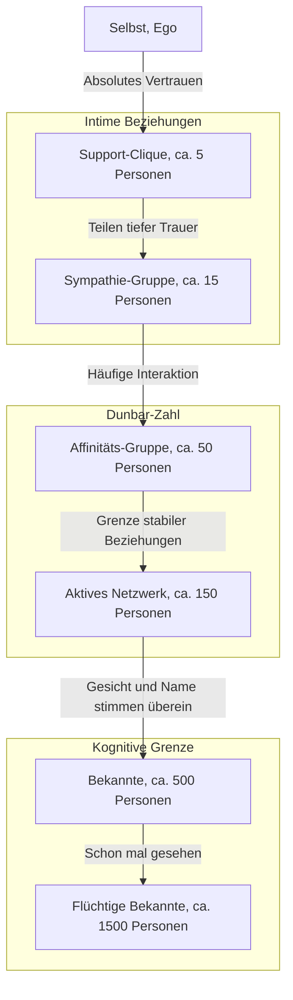

Gibt es eine Grenze für menschliche Beziehungen? Mit wie vielen Menschen kann unser Gehirn tatsächlich „echte Verbindungen“ aufrechterhalten?

In der heutigen Gesellschaft haben wir, wenn wir soziale Netzwerke öffnen, hunderte oder tausende von „Followern“ oder „Freunden“. Aber mit wie vielen von ihnen haben wir eine Beziehung aufgebaut, in der wir uns wirklich vertrauen, die Situation des anderen kennen und uns gegenseitig helfen können? Hier kommt die **„Dunbar-Zahl“ (Dunbar's number)** ins Spiel, die vom Evolutionspsychologen Robin Dunbar vorgeschlagen wurde.

In diesem Artikel werden wir das Konzept der Dunbar-Zahl von seinen biologischen Grundlagen über historische Beweise bis hin zu seiner Anwendung in der heutigen digitalen Gesellschaft und dem Organisationsdesign in der Wirtschaft gründlich untersuchen und erklären. Wenn Sie in einer Führungsposition sind, wird das Wissen um dieses Prinzip eine mächtige Waffe sein, um eine gesunde und hochproduktive Organisation aufzubauen.

---

## 1. Was ist die Dunbar-Zahl? (Grundkonzept und biologische Grundlagen)

Die Dunbar-Zahl ist die kognitive Obergrenze, die besagt, dass **„die maximale Anzahl von Menschen, mit denen ein Mensch stabile soziale Beziehungen aufrechterhalten kann, bei etwa 150 liegt“**. Sie wurde Anfang der 1990er Jahre von dem britischen Anthropologen und Evolutionspsychologen Robin Dunbar vorgeschlagen.

### Die Größe des Neokortex und die Größe der Gruppe
Der Ausgangspunkt von Dunbars Forschung war die Korrelation zwischen der Gehirngröße von Primaten und der Größe der von ihnen gebildeten Gruppen (soziale Netzwerke). Primaten vertiefen soziale Bindungen und bewahren die Harmonie in der Gruppe, indem sie sich gegenseitig pflegen (Grooming). Dunbar fand heraus, dass je größer die Kapazität (der Anteil am Gesamthirn) des „Neokortex“, der für höhere Gedanken, Schlussfolgerungen und Sprache im Primatengehirn verantwortlich ist, desto größer ist die durchschnittliche Gruppengröße, die von dieser Spezies gebildet wird.

Durch die Anwendung der Größe des menschlichen Neokortex auf die Gleichung, die diese Korrelation zeigt, wurde die Zahl **„148“** – also etwa 150 Menschen – abgeleitet.

### Die Definition von „stabilen Beziehungen“
Die von der Dunbar-Zahl angegebenen „150 Menschen“ sind nicht einfach die Anzahl der Personen, deren Gesichter und Namen man zuordnen kann. Die hier gemeinten Beziehungen beziehen sich auf folgende Zustände:
- Man weiß, wer die andere Person ist und in welcher Beziehung man zu ihr steht.
- Man versteht, in welcher Beziehung die andere Person zu anderen Mitgliedern steht.
- Man teilt ein Gefühl sozialer Verpflichtung, gegenseitigen Vertrauens und unausgesprochener Regeln, die es ermöglichen, Dinge kooperativ voranzutreiben, ohne dass Anweisungen oder Zwang erforderlich sind.

Dunbar argumentiert, dass bei einer größeren Anzahl die kognitiven Verarbeitungsgrenzen des Gehirns überschritten werden, man den Überblick darüber verliert, wer wer ist, und Gesetze, Regeln sowie eine hierarchische Managementstruktur (Bürokratie) notwendig werden, um den sozialen Zusammenhalt zu wahren.

---

## 2. Dunbars konzentrische Kreise: Die hierarchische Struktur menschlicher Beziehungen

Dunbar wies nicht nur auf das Limit von 150 Personen hin, sondern auch darauf, dass unsere Beziehungen in „konzentrischen Hierarchien (Schichten)“ strukturiert sind. Wenn man sich vom Zentrum nach außen bewegt, nimmt die Intimität ab und die Anzahl der Personen steigt um etwa das „Dreifache (oder etwa das 3- bis 5-Fache)“.

1. **Support-Clique (ca. 5 Personen)**
   Die zentralste Schicht. Ehepartner, beste Freunde, Familie usw. – Beziehungen, in denen man bei einer ernsten Krise bedingungslos um Hilfe bitten kann und sich gegenseitig emotionale Unterstützung bietet.
2. **Sympathie-Gruppe (ca. 15 Personen)**
   Die Gruppe enger Freunde. Personen, bei denen man denkt: „Wenn diese Person morgen sterben würde, wäre ich zutiefst traurig.“
3. **Affinitäts-Gruppe (ca. 50 Personen)**
   Die Schicht der guten Freunde, mit denen man häufig Kontakt hat, oft essen geht oder Ausflüge macht.
4. **Aktives Netzwerk (ca. 150 Personen)** = Dunbar-Zahl
   Die Schicht, zu der man mindestens einmal im Jahr Kontakt hat, die Grenzlinie dafür, wen man zu Hochzeiten oder Beerdigungen einlädt. Die „Grenze stabiler menschlicher Beziehungen“.
5. **Bekannte (ca. 500 Personen)** / **Flüchtige Bekannte (ca. 1500 Personen)**
   In den darüber liegenden Schichten erreicht man ein Niveau von „Ich kenne den Namen“ oder „Ich habe das Gesicht schon mal gesehen“, wobei die emotionale Bindung und das gegenseitige Vertrauen schwach sind. Man sagt, dass die menschliche Gedächtniskapazität zur Erkennung von Gesichtern auf etwa 1500 Personen begrenzt ist.

---

## 3. Die Universalität der Zahl „150“, bewiesen durch Geschichte und Gesellschaft

Die von Dunbar vorgeschlagene Zahl 150 ist nicht nur ein rechnerischer Wert aus der Neurowissenschaft. Es gibt in verschiedenen Bereichen wie Geschichte, Anthropologie und Militärwissenschaft zahlreiche Beweise dafür, dass die Zahl „150“ als grundlegende Einheit der Gesellschaft funktioniert hat.

### Stämme der Jäger-und-Sammler-Gesellschaften
Für eine lange Zeit, vom Erscheinen der Menschheit bis zum Beginn des Ackerbaus, lebten unsere Vorfahren als Jäger und Sammler. Untersuchungen der durchschnittlichen Größe von Dörfern und Clans von Jäger-und-Sammler-Gesellschaften, die auf der ganzen Welt verblieben sind (wie die San in Afrika oder die Aborigines in Australien), zeigen bemerkenswert übereinstimmend eine Größe von etwa 150 Personen.

### Grundorganisation des Militärs
Das Militär ist eine Organisation, die in extremen Situationen ihr Leben anvertrauen und hochgradig koordinierte Aktionen durchführen muss. Die grundlegende taktische Einheit in der Armee des antiken Römischen Reiches (Manipel und frühe Zenturien) bestand aus etwa 130 bis 160 Personen. Auch eine „Kompanie (Company)“ in modernen Armeen besteht im Allgemeinen aus etwa 120 bis 150 Personen. Wenn die Größe darüber hinausgeht, wird es für den Kompaniechef schwierig, Gesichter, Namen, Fähigkeiten und Persönlichkeiten aller zu kennen und das Kommando zu führen.

### Religiöse Gemeinschaften und Dörfer
In Gemeinschaften, die ein traditionelles gemeinschaftliches Leben führen, wie die Amish oder die Hutterer im Christentum, gibt es eine strikte Regel: Wenn die Gemeinschaft über 150 Personen wächst, teilt sie sich auf natürliche Weise, um ein neues Dorf zu gründen. Aus Erfahrung wissen sie, dass bei einer Anzahl von mehr als 150 Personen die Ordnung nicht mehr allein durch Gruppenzwang oder „bekannte Gesichter“ aufrechterhalten werden kann und polizeiliche Mechanismen sowie strenge Gesetze erforderlich werden.

---

## 4. Die Dunbar-Zahl in der digitalen Gesellschaft: Können soziale Netzwerke die Grenze überschreiten?

Als soziale Netzwerke wie Facebook, X (früher Twitter), Instagram und LinkedIn aufkamen, gab es die Erwartung, dass „das Internet die Dunbar-Zahl zerstören und es uns ermöglichen würde, intime Beziehungen zu Tausenden von Menschen aufzubauen“. Aber wie sah die Realität aus?

Datenanalysen von sozialen Netzwerken durch Dunbar selbst und andere Forscher haben bewiesen, dass **die Dunbar-Zahl auch in der digitalen Welt weiterhin gültig ist**.

Auf Facebook wurde festgestellt, dass selbst bei Benutzern mit Tausenden von „Freunden“ die Anzahl der Personen, mit denen sie regelmäßigen Nachrichtenaustausch oder bedeutungsvolle Interaktionen (wie Kommentare) haben, bei etwa 100 bis 200 Personen liegt. Darüber hinaus stimmten die Personen, mit denen wirklich intime Interaktionen stattfanden, perfekt mit den zuvor erwähnten Schichten von „15 Personen“ und „5 Personen“ überein.

Soziale Medien haben zwar den Effekt, die „Wartungskosten“ von Beziehungen zu senken (sie erinnern an Geburtstage, ermöglichen es, Updates an alle gleichzeitig zu senden), aber sie können die kognitive Kapazität unseres Gehirns, das „emotionale Kapital“, das wir anderen widmen können, und die physische Einschränkung von 24 Stunden am Tag nicht erhöhen. Letztendlich kann Technologie zwar die „Breite“ der Beziehungen erweitern, um oberflächliche Verbindungen aufrechtzuerhalten, jedoch nicht die Grenze der Anzahl von Beziehungen mit echter „Tiefe“ überwinden.

---

## 5. Anwendung der Dunbar-Zahl in Wirtschaft und Organisationsdesign

Das Konzept der Dunbar-Zahl entfaltet seine größte Kraft in den Bereichen des Organisationsdesigns und des Teamaufbaus in Unternehmen. Wenn Startups wachsen und die Anzahl der Mitarbeiter steigt, stoßen sie unweigerlich an „organisatorische Barrieren“. Eine dieser Barrieren ist genau die 150-Personen-Grenze.

### Die „150-Personen-Grenze“ von Startups
In einem Startup in der Gründungsphase arbeiten alle im selben Raum, und der CEO kennt die Namen und Persönlichkeiten aller Mitarbeiter sowie das, woran sie gerade arbeiten. Die Arbeit geht durch „blindes Verständnis“ voran, und das Unternehmen funktioniert durch eine gemeinsame Vision und ein starkes Zusammengehörigkeitsgefühl, ohne dass Regeln oder bürokratische Prozesse erforderlich sind.

Wenn jedoch die Anzahl der Mitarbeiter 100 übersteigt und sich 150 nähert, tauchen im Unternehmen immer mehr „unbekannte Personen“ auf. Man hört Stimmen wie: „Ich weiß nicht, was diese Abteilung macht“ oder „Ich habe keine Ahnung, wer die neue Person ist“.
Wenn diese Grenze überschritten wird und das gleiche „familiäre und dörfliche“ Management fortgesetzt wird, wird die Organisation unweigerlich zusammenbrechen. Probleme wie verzögerte Kommunikation, Bildung von Fraktionen, geringeres Zugehörigkeitsgefühl und erhöhte Fluktuationsraten brechen aus.

### Der Fall Gore-Tex: Eine Fabrik bei 150 Personen aufteilen
Ein bekanntes Geschäftsbeispiel, das die Dunbar-Zahl bewusst nutzt, ist die Managementpolitik von W.L. Gore & Associates, dem Hersteller des wasserdichten, atmungsaktiven Materials „Gore-Tex“.

In diesem Unternehmen wird die Organisation physisch aufgeteilt und ein neues Gebäude errichtet, sobald die Anzahl der Mitarbeiter in einer Fabrik oder einem Büro droht, 150 zu überschreiten – unabhängig davon, wie viel Platz auf dem Gelände noch vorhanden ist. Sie sind überzeugt, dass sie unter 150 Personen ein „innovationsförderndes Umfeld“ aufrechterhalten können, in dem die Mitarbeiter sich gegenseitig kennen und autonom zusammenarbeiten, ohne dass formelle Vorgesetzte, komplexe Hierarchien oder strikte Handbücher erforderlich sind.

### Organisationsstrategien zur Überschreitung der Dunbar-Zahl
Damit ein Unternehmen weiter wachsen und die 150-Personen-Grenze überschreiten kann, ist eine bewusste Neugestaltung der Organisation, wie nachfolgend beschrieben, erforderlich.

1. **Aufteilung in Tribes (Stämme)**
   In agilen Organisationsmodellen, wie sie von Spotify und anderen verwendet werden, wird die Organisation in „Tribes“ von etwa 100 bis 150 Personen aufgeteilt. Durch die Beibehaltung einer starken Koordination innerhalb des Tribes, während die Zusammenarbeit zwischen den Tribes loser gehalten wird, bleibt auch in einem großen Unternehmen die Agilität eines Startups erhalten.
2. **Einführung von Prozessen und Systemen**
   Es ist notwendig, sich nicht mehr auf stillschweigendes Einvernehmen aufgrund von „bekannten Gesichtern“ zu verlassen, sondern ausdrückliche Regeln, Bewertungssysteme und Informationsaustauschsysteme (Dokumentationskultur) einzuführen.
3. **Teilen von Kultur und Mission (Gemeinsame Fiktion)**
   Wie Yuval Noah Harari in seinem Buch *Eine kurze Geschichte der Menschheit (Sapiens)* betonte, liegt der Grund dafür, dass Menschen in der Lage sind, über die Grenze von 150 Personen hinaus in Gruppen von Tausenden oder Zehntausenden zusammenzuarbeiten, in ihrer „Fähigkeit, an gemeinsame Mythen (Fiktionen) zu glauben“. In einem Unternehmen entspricht dies der „Unternehmensphilosophie (Mission, Vision, Werte)“. Das Bewusstsein, Gefährten zu sein, die an dieselbe Mission glauben, auch wenn man sich nicht persönlich kennt, wirkt als Klebstoff, der eine große Organisation zusammenhält.

---

## Fazit: Was lehrt uns die Dunbar-Zahl?

Die Dunbar-Zahl mag als eine kalte Zahl erscheinen, die die Grenzen des menschlichen Gehirns aufzeigt. Die Tatsache, dass „wir, egal wie sehr wir uns bemühen, nur etwa 150 echte Freunde haben können“, könnte für moderne Menschen, die von grenzenlosen Verbindungen träumen, ein wenig traurig wirken.

Aus einer anderen Perspektive betrachtet, ist dies jedoch auch eine starke Botschaft: **„Weil sie begrenzt sind, müssen wir unsere Beziehungen gestalten und sorgfältig pflegen.“**

Im Geschäftsleben ermöglicht das Verständnis, dass „Reibungen in der Organisation nicht auf die Persönlichkeit oder mangelnde Anstrengungen des Einzelnen zurückzuführen sind, sondern auf die biologischen Grenzen des Homo sapiens“, den Weggang vom personenabhängigen Management hin zu einem rationalen Organisationsdesign.

Auch im Privatleben ist es eine gute Gelegenheit zu überdenken, für wen man seine wertvollen „150 Plätze“ – und noch wichtiger, die „5 Plätze“ und „15 Plätze“ – nutzen möchte. Anstatt sich von der Anzahl der „Likes“ oder Follower in den sozialen Medien leiten zu lassen, besteht der fundamentale Ansatz für ein erfülltes Leben und eine starke Organisation darin, seine Ressourcen in „tiefe, stabile, jedoch wenige Verbindungen“ zu investieren, die unser Gehirn wirklich sucht.
