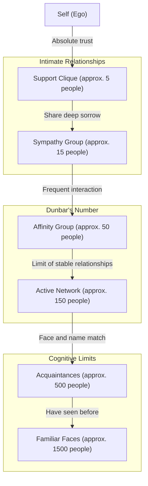
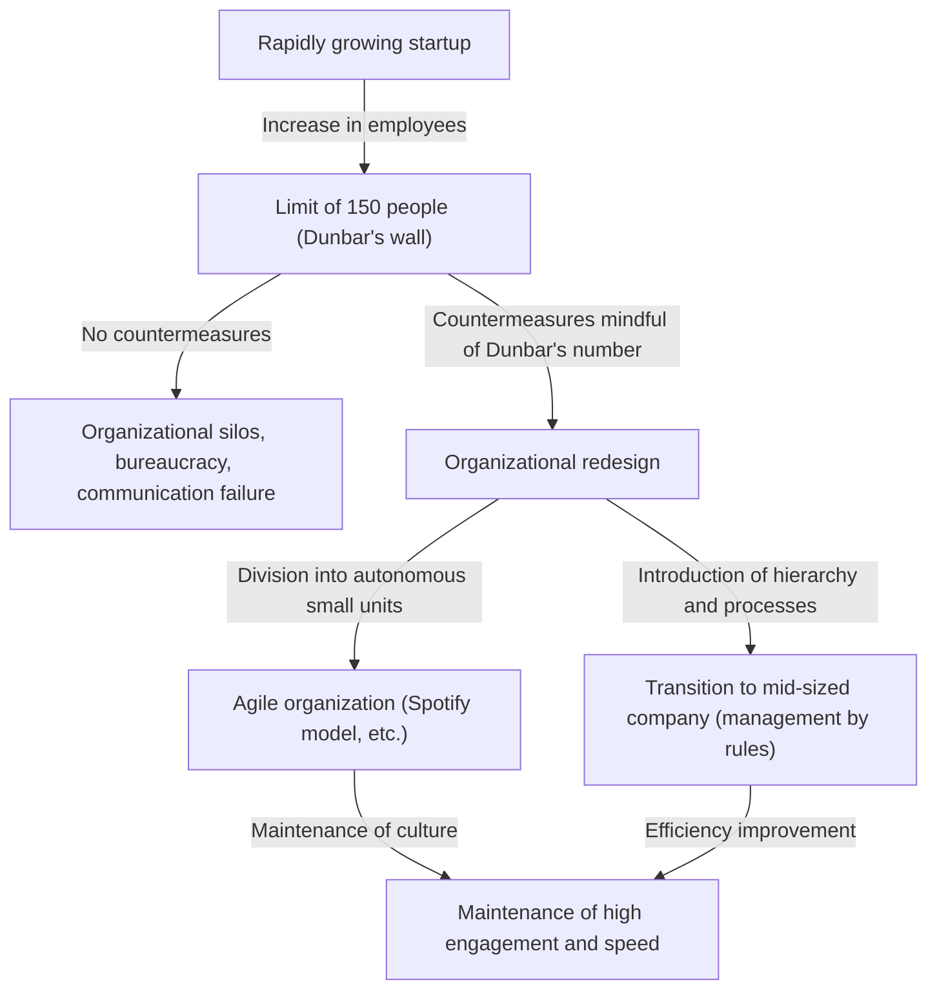

Is there a limit to human relationships? How many people can our brains really have a "true connection" with?

In modern society, opening social media reveals hundreds or thousands of "followers" and "friends." However, how many people have we built relationships with where we truly trust each other, understand each other's situations, and can help one another? This is where **"Dunbar's number"**, proposed by evolutionary psychologist Robin Dunbar, comes into play.

In this article, we will thoroughly explore the concept of Dunbar's number, from its biological foundations and historical evidence to its application in modern digital society and organizational design in business. If you are in a leadership position, knowing this rule will serve as a powerful weapon for building a healthy and highly productive organization.

---

## 1. What is Dunbar's Number? (Basic Concept and Biological Basis)

Dunbar's number is the cognitive limit stating that **"the maximum number of people with whom a human can maintain stable social relationships is approximately 150."** It was proposed in the early 1990s by Robin Dunbar, a British anthropologist and evolutionary psychologist.

### Neocortex Size and Group Size
The starting point of Dunbar's research was the correlation between primate brain size and the size of the groups (social networks) they form. Primates deepen social bonds and maintain group harmony through grooming each other. Dunbar discovered that the larger the capacity (ratio to the whole brain) of the "neocortex," the part of the primate brain responsible for advanced thinking, reasoning, and language, the larger the average size of the group formed by that species.

By applying the size of the human neocortex to the equation showing this correlation, the calculated result was the number **"148"**, or approximately 150 people.

### Definition of a "Stable Relationship"
The "150 people" indicated by Dunbar's number is not simply the number of people whose faces and names match. The relationship referred to here indicates a state like the following:
- You know who the other person is and what kind of relationship they have with you.
- You understand what kind of relationship the other person has with other members.
- You share a sense of social obligation, trust, and implicit rules, and can cooperate to get things done without instructions or coercion.

Dunbar argues that if the number of people exceeds this, it surpasses the limits of the brain's cognitive processing capacity, people can no longer keep track of who is who, and laws, rules, and hierarchical management structures (bureaucracy) become necessary to maintain social cohesion.

---

## 2. Dunbar's Concentric Circles: The Hierarchical Structure of Relationships

Dunbar points out not only the limit of 150 people but also that our relationships have a "concentric hierarchical structure (layers)." There is a rule that as you move outward from the center, the level of intimacy decreases, and the number of people increases at a pace of roughly "3 times (or about 3 to 5 times)."

1. **Support Clique (approx. 5 people)**
   The innermost layer. Relationships like spouses, best friends, and family, where you can unconditionally seek help during a major crisis, and provide emotional support to each other.
2. **Sympathy Group (approx. 15 people)**
   A group of close friends. People who you would think, "If this person died tomorrow, I would be deeply grieved."
3. **Affinity Group (approx. 50 people)**
   The layer of good friends with whom you frequently keep in touch, go out to eat, or hang out.
4. **Active Network (approx. 150 people)** = Dunbar's number
   The layer where you contact them at least once a year, serving as the boundary for whether you would invite them to weddings or funerals. The "limit of stable human relationships."
5. **Acquaintances (approx. 500 people)** / **Familiar Faces (approx. 1500 people)**
   Beyond this layer, it becomes a level of "knowing the name" or "having seen the face," and emotional connections or mutual trust fade. It is said that the limit of human memory capacity for identifying faces is around 1500 people.

---

## 3. The Universality of the Number "150" Proven by History and Society

The number 150 proposed by Dunbar is not just a calculated figure in neuroscience. There is plenty of evidence in various fields such as history, anthropology, and military science that the number "150" has functioned as a basic unit of society.

### Hunter-Gatherer Tribes
For a long time from the dawn of humanity until the beginning of agriculture, our ancestors lived a hunter-gatherer lifestyle. When investigating the average size of villages and clans of hunter-gatherer groups remaining around the world (such as the San people in Africa and the Aboriginals in Australia), it has been found to be surprisingly consistently around 150 people.

### Basic Military Formations
The military is an organization where people must entrust their lives to each other in extreme conditions and achieve high-level coordination. The basic tactical unit in the ancient Roman army (the maniple and early century) was about 130 to 160 men. A modern military "Company" is also generally composed of about 120 to 150 people. This is because if the scale exceeds this, it becomes difficult for the company commander to grasp and command based on the faces, names, abilities, and personalities of everyone.

### Religious Communities and Villages
In communities living traditional communal lives, such as the Christian Amish or Hutterites, there is a strict rule that when the community size exceeds 150 people, they naturally split to form a new village. This is because they know empirically that when the number exceeds 150, they can no longer maintain order just through peer pressure and "face-to-face relationships," and a police mechanism or strict laws become necessary.

---

## 4. Dunbar's Number in Digital Society: Can Social Media Break the Limit?

When social media platforms like Facebook, X (formerly Twitter), Instagram, and LinkedIn emerged, there were expectations that "the internet will destroy Dunbar's number, allowing us to build intimate relationships with thousands of people." But what was the reality?

According to data analysis of social media by Dunbar himself and other researchers, it has been proven that **Dunbar's number is still valid even in the digital world.**

It has been found that even on Facebook, a user with thousands of "friends" only has about 100 to 200 people with whom they engage in "two-way interactions," such as regularly exchanging messages or leaving meaningful comments on posts. Furthermore, the number of people with whom they have truly intimate exchanges perfectly matches the aforementioned layers of "15 people" and "5 people."

While social media does have the effect of lowering the "maintenance cost" of relationships (notifying you of birthdays, allowing simultaneous updates on your status), it cannot physically increase the cognitive capacity of our brains, the "total amount of emotion (emotional capital)" we can pour into others, or the "time constraint" of 24 hours a day. Ultimately, while technology can expand the "breadth" of relationships to maintain superficial connections, it cannot overcome the limit on the number of relationships accompanied by "depth."

---

## 5. Application of Dunbar's Number in Business and Organizational Design

The concept of Dunbar's number is most powerfully demonstrated in the realm of corporate organizational design and team building. In the process of a startup growing and increasing its number of employees, it will inevitably hit an "organizational wall." One of those walls is exactly the wall of 150 people.

### The Startup's "Wall of 150 People"
In an early-stage startup, everyone works in the same room, and the president knows the names, personalities, and what all employees are currently doing. Work progresses through "tacit understanding," and even without rules or bureaucratic processes, the company runs on a shared vision and strong solidarity.

However, as the number of employees exceeds 100 and approaches 150, the number of "unknown people" in the company begins to increase. You start hearing things like, "I don't know what that department is doing," or "I don't know who that new person is."
When this limit is exceeded, if you continue with the same "family-like/village-like" management as before, the organization will certainly collapse. Problems such as delayed communication, faction formation, decreased sense of belonging, and increased turnover rates will erupt.

### The Case of Gore-Tex: Dividing Factories at 150 People
A famous business example that intentionally utilizes Dunbar's number is the management policy of W.L. Gore & Associates, the manufacturer of the waterproof, breathable material "GORE-TEX."

At this company, when the number of employees in a single factory or office is about to exceed 150, no matter how much space is left on the premises, they physically build a new building and divide the organization. They are convinced that if it is 150 people or less, even without bosses, complex hierarchical structures, or strict manuals, employees can know each other's faces and maintain an "environment that breeds innovation" where they can cooperate autonomously.

### Organizational Strategies to Surpass Dunbar's Number
For a company to continue growing beyond the wall of 150 people, intentional organizational redesigns such as the following are necessary.

1. **Division into Tribes**
   In the agile organizational model adopted by Spotify and others, the organization is divided into units called "Tribes" of about 100 to 150 people. By maintaining strong collaboration within the Tribe while keeping coordination between Tribes looser, even large enterprises can maintain startup-like agility.
2. **Introduction of Processes and Systems**
   It is necessary to stop relying on implicit understandings based on "face-to-face relationships" and introduce explicit rules, evaluation systems, and information sharing systems (document culture).
3. **Sharing Culture and Mission (Sharing Fictions)**
   As Yuval Noah Harari pointed out in his book *Sapiens: A Brief History of Humankind*, the reason humans can overcome the limit of 150 people and cooperate on a scale of thousands or tens of thousands is because of our "ability to believe in common myths (fictions)." In companies, this corresponds to the "corporate philosophy (mission, vision, values)." Even if they are not direct acquaintances, the recognition that they are comrades who believe in the same mission serves as the glue that binds a large-scale organization together.

---

## Conclusion: What Dunbar's Number Teaches Us

Dunbar's number may seem like a cold figure indicating the limits of the human brain. The fact that "no matter how hard we try, we can only have about 150 true friends" might feel a bit lonely to modern people dreaming of infinite connections.

However, from another perspective, this is a powerful message that **"precisely because it is finite, we must design and carefully nurture our relationships."**

In business, by understanding that "organizational friction is not due to individual personalities or lack of effort, but the biological limits of Homo sapiens," you can break away from personality-dependent management and steer toward rational organizational design.

Even in our private lives, it serves as a good opportunity to re-evaluate who we use our precious "150 seats," and more importantly, our "5 seats" and "15 seats" for. Rather than being caught up in the number of "likes" or followers on social media, investing resources in the "deep, stable, and small number of connections" that the brain truly seeks can be said to be the essential approach to building a rich life and strong organizations.
