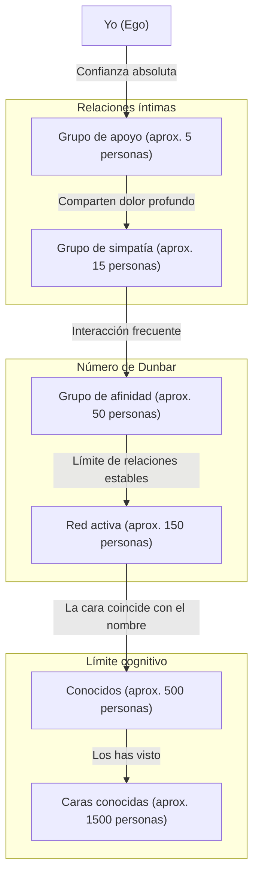
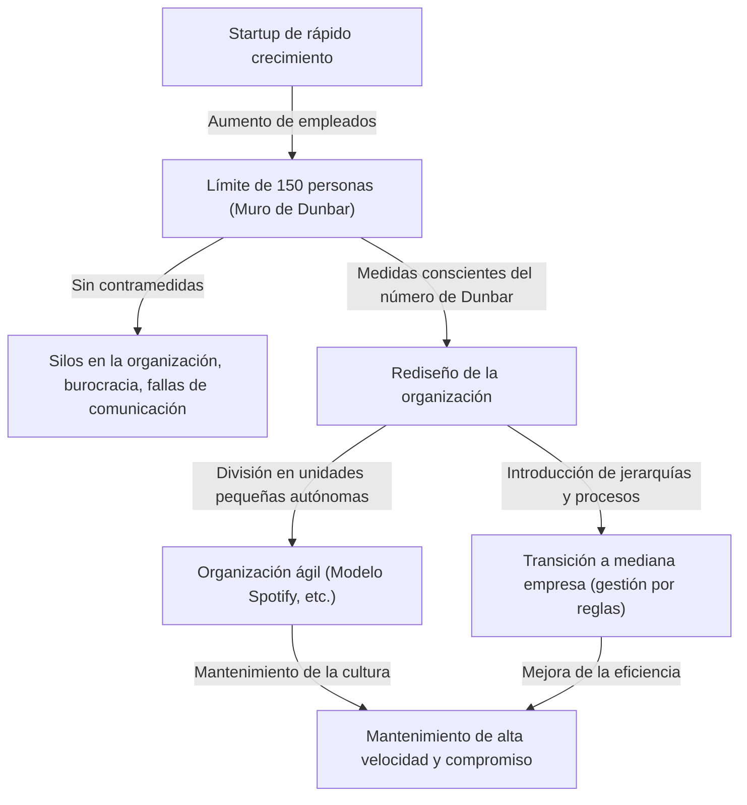

¿Tienen un límite las relaciones humanas? ¿Con cuántas personas puede nuestro cerebro tener una "conexión real"?

En la sociedad moderna, al abrir las redes sociales encontramos cientos o miles de "seguidores" o "amigos". Sin embargo, ¿con cuántas personas hemos construido realmente una relación en la que podamos confiar, conocer su situación y ayudarnos mutuamente? Aquí es donde entra en juego el **"Número de Dunbar" (Dunbar's number)**, propuesto por el psicólogo evolutivo Robin Dunbar.

En este artículo, explicaremos a fondo el concepto del número de Dunbar, desde sus fundamentos biológicos y evidencias históricas, hasta su aplicación en el diseño organizacional en la sociedad digital y empresarial moderna. Si te encuentras en una posición de liderazgo, conocer esta regla será un arma poderosa para crear una organización sana y altamente productiva.

---

## 1. ¿Qué es el número de Dunbar? (Concepto básico y base biológica)

El número de Dunbar es el límite cognitivo que establece que **"el límite máximo de personas con las que un ser humano puede mantener relaciones sociales estables es de aproximadamente 150"**. Fue propuesto a principios de la década de 1990 por el antropólogo y psicólogo evolutivo británico Robin Dunbar.

### El tamaño del neocórtex y el tamaño del grupo
El punto de partida de la investigación de Dunbar fue la correlación entre el tamaño del cerebro de los primates y el tamaño de los grupos (redes sociales) que forman. Los primates profundizan sus lazos sociales acicalándose mutuamente (grooming) para mantener la armonía del grupo. Dunbar descubrió que cuanto mayor es el volumen del "neocórtex" (la proporción respecto a todo el cerebro), encargado de pensamientos avanzados, razonamiento y lenguaje en el cerebro de los primates, mayor es el tamaño promedio del grupo que forma esa especie.

Al aplicar el tamaño del neocórtex humano a la ecuación que muestra esta correlación, el resultado obtenido fue el número **"148"**, es decir, aproximadamente 150 personas.

### Definición de "relación estable"
Las "150 personas" que indica el número de Dunbar no son simplemente la cantidad de personas cuyas caras coinciden con sus nombres. La relación a la que se refiere aquí indica el siguiente estado:
- Sabes quién es la otra persona y qué relación tiene contigo.
- Conoces qué relación tiene esa persona con los demás miembros.
- Comparten mutuamente un sentido de obligación social, confianza y reglas no escritas, y pueden cooperar y avanzar en las cosas sin instrucciones ni coerción.

Dunbar sostiene que si el número de personas supera este límite, se sobrepasa la capacidad de procesamiento cognitivo del cerebro, no se sabe quién es quién, y se hacen necesarias leyes, reglamentos y estructuras de gestión jerárquica (burocracia) para mantener la cohesión social.

---

## 2. Los círculos concéntricos de Dunbar: Estructura jerárquica de las relaciones humanas

Dunbar señala no solo el límite de 150 personas, sino también que nuestras relaciones humanas están en "capas concéntricas". Existe la regla de que a medida que nos movemos del centro hacia afuera, la intimidad disminuye y el número de personas aumenta aproximadamente a un ritmo de "3 veces (o unas 3 a 5 veces)".

1. **Grupo de apoyo (aprox. 5 personas)**
   La capa más céntrica. Cónyuges, mejores amigos, familiares, etc., relaciones en las que se brindan apoyo emocional mutuo y a las que se puede pedir ayuda incondicionalmente en caso de una crisis grave.
2. **Grupo de simpatía (aprox. 15 personas)**
   El grupo de amigos cercanos. Son personas de las que pensarías: "Si esta persona muriera mañana, me sumiría en un profundo dolor".
3. **Grupo de afinidad (aprox. 50 personas)**
   La capa de buenos amigos con los que te comunicas frecuentemente y con los que sales a comer o a divertirte.
4. **Red activa (aprox. 150 personas)** = Número de Dunbar
   La capa fronteriza con la que te comunicas al menos una vez al año, y a los que invitarías a bodas o funerales. Es el "límite de las relaciones humanas estables".
5. **Conocidos (aprox. 500 personas)** / **Caras conocidas (aprox. 1500 personas)**
   En capas superiores a esta, se llega al nivel de "conozco el nombre" o "he visto su cara", y los vínculos emocionales y la confianza mutua se debilitan. Se dice que el límite de la capacidad de memoria humana para identificar caras es de unas 1500 personas.

---

## 3. La universalidad del número "150" demostrada por la historia y la sociedad

El número 150 propuesto por Dunbar no se queda en un simple valor calculado por la neurociencia. Existe mucha evidencia de que el número "150" ha funcionado como unidad básica de la sociedad en diversos campos como la historia, la antropología y la ciencia militar.

### Tribus de sociedades cazadoras-recolectoras
Durante mucho tiempo, desde la aparición de la humanidad hasta el inicio de la agricultura, nuestros antepasados llevaron una vida de caza y recolección. Al investigar el tamaño promedio de las aldeas o clanes de cazadores-recolectores que quedan en el mundo (por ejemplo, los San en África o los aborígenes en Australia), se ha descubierto que es sorprendentemente consistente en alrededor de 150 personas.

### Organización básica del ejército
El ejército es una organización en la que se deben confiar vidas mutuamente en situaciones extremas y tener una alta coordinación. La unidad táctica básica (manípulo y centuria inicial) en el ejército del antiguo Imperio Romano era de unas 130 a 160 personas. Una "Compañía" en un ejército moderno también suele consistir en unas 120 a 150 personas. Si la escala es mayor que esto, se vuelve difícil para el comandante de la compañía conocer la cara, el nombre, la capacidad y la personalidad de todos para poder dirigirlos.

### Comunidades religiosas y aldeas
En comunidades de vida tradicional como los Amish o los Huteritas del cristianismo, existe una regla estricta de que cuando el número de personas en la comunidad supera las 150, se dividen naturalmente y forman una nueva aldea. Porque saben por experiencia que al superar las 150 personas, no se puede mantener el orden solo con la presión social o las "relaciones de conocidos", y se hace necesario un sistema policial y leyes estrictas.

---

## 4. El número de Dunbar en la sociedad digital: ¿Pueden las redes sociales superar el límite?

Cuando aparecieron redes sociales como Facebook, X (antes Twitter), Instagram, LinkedIn, etc., hubo expectativas de que "Internet destruiría el número de Dunbar y podríamos construir relaciones íntimas con miles de personas". Sin embargo, ¿qué pasó realmente?

Según el análisis de datos de redes sociales por parte del propio Dunbar y otros investigadores, se ha demostrado que **el número de Dunbar sigue siendo válido en el mundo digital**.

En Facebook, se sabe que incluso para los usuarios que tienen miles de "amigos", el número de personas con las que tienen una "interacción bidireccional", como intercambiar mensajes regularmente o dejar comentarios significativos en publicaciones, se sitúa entre unas 100 y 200 personas. Además, los interlocutores con los que tienen interacciones verdaderamente íntimas coincidían completamente con las capas de "15 personas" y "5 personas" mencionadas anteriormente.

Las redes sociales tienen el efecto de reducir los "costos de mantenimiento" de las relaciones (como decirnos los cumpleaños o informar nuestra situación reciente a todos a la vez), pero no pueden aumentar físicamente la capacidad cognitiva de nuestro cerebro, la "cantidad total de emoción (capital emocional)" que podemos dedicar a otros, ni la "restricción de tiempo" de 24 horas al día. Al final, la tecnología puede ampliar la "amplitud" de las relaciones y mantener conexiones superficiales, pero no puede superar el límite del número de relaciones con "profundidad".

---

## 5. Aplicación del número de Dunbar en los negocios y el diseño organizacional

El concepto del número de Dunbar ejerce su mayor poder en el ámbito del diseño organizacional de las empresas y la formación de equipos. A medida que una startup crece y el número de empleados aumenta, inevitablemente choca con el "muro de la organización". Uno de esos muros es precisamente el muro de las 150 personas.

### El "muro de las 150 personas" en las startups
En una startup en etapa inicial, todos trabajan en la misma habitación y el presidente conoce el nombre, la personalidad y lo que está haciendo cada empleado. El trabajo avanza "con sincronía perfecta", y sin reglas ni procesos burocráticos, la empresa funciona con una visión común y un fuerte sentido de solidaridad.

Sin embargo, cuando el número de empleados supera los 100 y se acerca a los 150, comienzan a aumentar las "personas desconocidas" en la empresa. Se empiezan a escuchar voces como "No sé qué está haciendo ese departamento" o "No sé quién es la persona nueva que entró".
Cuando se supera este límite, si se continúa con la gestión "familiar/de aldea" como hasta ahora, la organización se colapsará sin duda. Surgen problemas como el retraso en la comunicación, la formación de facciones, la disminución del sentido de pertenencia y el aumento de la tasa de rotación.

### El caso de Gore-Tex: Dividir fábricas por 150 personas
Como ejemplo empresarial famoso que utilizó intencionadamente el número de Dunbar, está la política de gestión de W.L. Gore & Associates, que fabrica el material impermeable y transpirable "GORE-TEX".

En esta empresa, cuando el número de empleados en una fábrica u oficina está a punto de superar las 150 personas, sin importar cuánto terreno sobre, construyen físicamente un nuevo edificio y dividen la organización. Están convencidos de que si hay 150 personas o menos, incluso sin jefes, estructuras jerárquicas complejas o manuales estrictos, los empleados se conocen entre sí y pueden mantener un "entorno que genere innovación" donde puedan cooperar de forma autónoma.

### Estrategias organizacionales para superar el número de Dunbar
Para que una empresa continúe creciendo más allá del muro de las 150 personas, es necesario un rediseño organizacional intencional como el siguiente.

1. **División en Tribus**
   En el modelo de organización ágil adoptado por empresas como Spotify, la organización se divide en unidades llamadas "Tribus (Tribe)" de unas 100 a 150 personas. Al mantener una fuerte colaboración dentro de la tribu y una colaboración más laxa entre tribus, se mantiene la agilidad de una startup incluso en una gran empresa.
2. **Introducción de procesos y sistemas**
   Es necesario dejar de depender de entendimientos tácitos basados en "relaciones de caras conocidas" y adoptar reglas explícitas, sistemas de evaluación y sistemas de intercambio de información (cultura de la documentación).
3. **Compartir cultura y misión (compartir una ficción)**
   Como señaló Yuval Noah Harari en su libro "Sapiens: De animales a dioses", la razón por la que los humanos pueden superar el límite de 150 personas y cooperar a una escala de miles o decenas de miles es porque tenemos "la capacidad de creer en un mito común (ficción)". En una empresa, esto corresponde a la "filosofía corporativa (misión, visión, valores)". El reconocimiento de que son compañeros que creen en la misma misión, incluso si no se conocen directamente, se convierte en el pegamento que une a una gran organización.

---

## Resumen: Qué nos enseña el número de Dunbar

El número de Dunbar puede parecer un número frío que muestra los límites del cerebro humano. El hecho de que "por mucho que nos esforcemos, solo podemos tener unos 150 amigos reales" puede resultar un poco triste para las personas modernas que sueñan con conexiones infinitas.

Sin embargo, desde otro punto de vista, también es un poderoso mensaje que dice: **"Precisamente porque es finito, necesitamos diseñar nuestras relaciones y cultivarlas cuidadosamente"**.

En los negocios, comprender que "la fricción en una organización no es culpa de la personalidad o la falta de esfuerzo del individuo, sino de las limitaciones biológicas del Homo sapiens", nos permite alejarnos de una gestión que depende de las personas individuales y orientarnos hacia un diseño organizacional racional.

También en nuestra vida privada, es una buena oportunidad para reconsiderar para quién usamos nuestros valiosos "150 asientos", e incluso los "5 asientos" y "15 asientos" más importantes. En lugar de estar atados a la cantidad de "me gusta" o seguidores en las redes sociales, invertir nuestros recursos en el "número pequeño de conexiones profundas y estables" que nuestro cerebro realmente anhela, es el enfoque fundamental para construir una vida rica y una organización fuerte.
