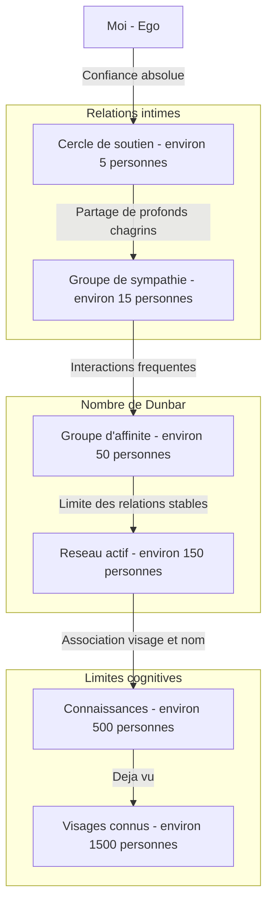
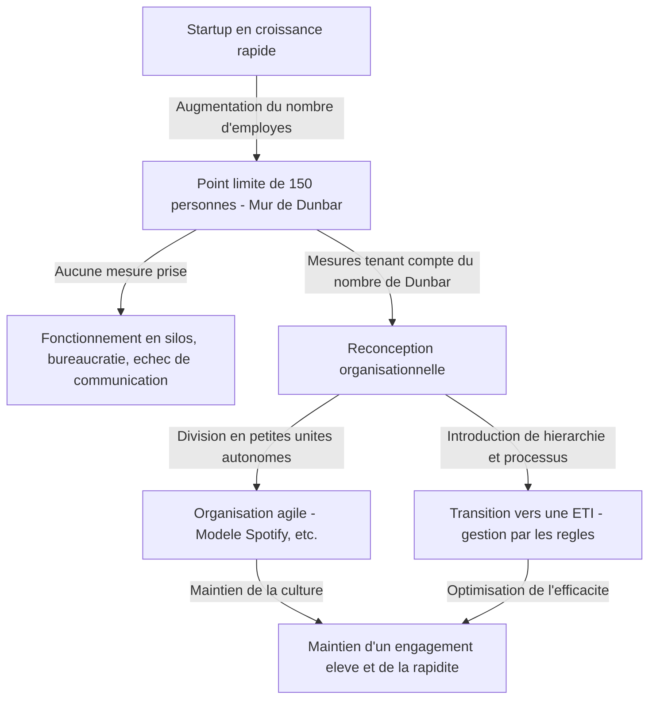

Les relations humaines ont-elles des limites ? Avec combien de personnes notre cerveau peut-il réellement établir une « véritable connexion » ?

Dans la société moderne, il suffit d'ouvrir un réseau social pour trouver des centaines, voire des milliers de « followers » ou d'« amis ». Cependant, avec combien d'entre eux avons-nous réellement construit une relation basée sur la confiance, la compréhension mutuelle de notre situation et l'entraide ? C'est ici qu'intervient le **« nombre de Dunbar »**, un concept proposé par le psychologue évolutionniste Robin Dunbar.

Dans cet article, nous explorerons en profondeur ce concept de nombre de Dunbar, de ses fondements biologiques et preuves historiques, jusqu'à son application dans la société numérique moderne et la conception organisationnelle en entreprise. Si vous occupez un poste de direction, connaître cette loi sera une arme puissante pour créer une organisation saine et productive.

---

## 1. Qu'est-ce que le nombre de Dunbar ? (Concept de base et fondements biologiques)

Le nombre de Dunbar est la limite cognitive stipulant que **« le nombre maximum de relations sociales stables qu'un être humain peut maintenir est d'environ 150 personnes »**. Ce concept a été proposé au début des années 1990 par l'anthropologue et psychologue évolutionniste britannique Robin Dunbar.

### La taille du néocortex et la taille du groupe
Le point de départ des recherches de Dunbar était la corrélation entre la taille du cerveau des primates et la taille des groupes (réseaux sociaux) qu'ils forment. Les primates approfondissent leurs liens sociaux et maintiennent l'harmonie du groupe en se toilettant mutuellement (grooming). Dunbar a découvert que plus la taille (ratio par rapport au cerveau entier) du « néocortex », la partie du cerveau responsable des pensées complexes, du raisonnement et du langage, est grande, plus la taille moyenne du groupe formé par cette espèce est importante.

En appliquant la taille du néocortex humain à l'équation décrivant cette corrélation, le chiffre obtenu fut **« 148 »**, soit environ 150 personnes.

### Définition d'une « relation stable »
Les « 150 personnes » du nombre de Dunbar ne représentent pas simplement le nombre de personnes dont on peut associer le visage au nom. Le type de relation dont il est question ici désigne les états suivants :
- Savoir qui est l'autre personne et quelle est notre relation avec elle.
- Comprendre les relations que cette personne entretient avec les autres membres.
- Partager un sentiment mutuel d'obligation sociale, de confiance et des règles tacites, permettant de coopérer sans avoir besoin d'ordres ou de coercition.

Dunbar soutient qu'au-delà de ce nombre, les limites de la capacité de traitement cognitif du cerveau sont dépassées, nous ne savons plus qui est qui, et il devient nécessaire de recourir à des lois, des règles et une structure de gestion hiérarchique (bureaucratie) pour maintenir la cohésion sociale.

---

## 2. Les cercles concentriques de Dunbar : la structure hiérarchique des relations humaines

Dunbar a souligné non seulement la limite de 150 personnes, mais aussi le fait que nos relations humaines sont structurées en « couches concentriques ». Plus on s'éloigne du centre, plus l'intimité diminue, et le nombre de personnes augmente à un rythme d'environ « 3 fois » (ou environ 3 à 5 fois).

1. **Cercle de soutien (environ 5 personnes)**
   La couche la plus centrale. Conjoints, meilleurs amis, famille, etc. Ce sont les personnes à qui l'on peut demander de l'aide inconditionnellement en cas de crise majeure, formant une relation de soutien émotionnel mutuel.
2. **Groupe de sympathie (environ 15 personnes)**
   Le groupe d'amis proches. Ce sont les personnes pour lesquelles on ressentirait une profonde tristesse si elles venaient à mourir demain.
3. **Groupe d'affinité (environ 50 personnes)**
   La couche des bons amis avec qui l'on communique fréquemment, avec qui l'on va manger ou sortir.
4. **Réseau actif (environ 150 personnes)** = Nombre de Dunbar
   La couche des personnes que l'on contacte au moins une fois par an, qui marque la limite pour inviter quelqu'un à un mariage ou à des funérailles. C'est la « limite des relations humaines stables ».
5. **Connaissances (environ 500 personnes)** / **Visages connus (environ 1500 personnes)**
   Au-delà, la relation se limite à « je connais le nom » ou « j'ai déjà vu son visage », et les liens émotionnels ou la confiance mutuelle s'estompent. On estime que la limite de la capacité de mémoire humaine pour reconnaître des visages est d'environ 1500 personnes.

---

## 3. L'universalité du chiffre « 150 » prouvée par l'histoire et la société

Le chiffre 150 proposé par Dunbar ne se limite pas à un simple calcul neuroscientifique. Il existe de nombreuses preuves dans divers domaines, tels que l'histoire, l'anthropologie et les sciences militaires, que le chiffre « 150 » a fonctionné comme unité de base de la société.

### Les tribus des sociétés de chasseurs-cueilleurs
Pendant une longue période depuis l'apparition de l'humanité jusqu'au début de l'agriculture, nos ancêtres ont vécu comme chasseurs-cueilleurs. Des enquêtes sur la taille moyenne des villages et des clans de chasseurs-cueilleurs à travers le monde (par exemple les San en Afrique ou les Aborigènes en Australie) ont révélé de manière remarquablement constante qu'elle est d'environ 150 personnes.

### La formation de base de l'armée
L'armée est une organisation où les individus doivent se confier leur vie dans des conditions extrêmes et faire preuve d'une coordination de haut niveau. L'unité tactique de base dans l'armée de l'Empire romain antique (le manipule ou les premières centuries) comptait environ 130 à 160 hommes. Dans les armées modernes, une « compagnie (Company) » est également généralement composée d'environ 120 à 150 soldats. Au-delà de cette taille, il devient difficile pour le commandant de la compagnie de connaître les visages, les noms, les compétences et les caractères de chacun pour les diriger efficacement.

### Les communautés religieuses et les villages
Dans les communautés traditionnelles telles que les Amish ou les Huttérites chrétiens, il existe une règle stricte selon laquelle, lorsque la communauté dépasse 150 personnes, elle se divise naturellement pour former un nouveau village. Ils savent d'expérience qu'au-delà de 150 personnes, la pression sociale et les « relations de connaissances » ne suffisent plus à maintenir l'ordre, rendant nécessaire la mise en place de forces de police ou de lois strictes.

---

## 4. Le nombre de Dunbar dans la société numérique : les réseaux sociaux peuvent-ils briser cette limite ?

Lors de l'apparition de réseaux sociaux tels que Facebook, X (anciennement Twitter), Instagram ou LinkedIn, certains espéraient qu'« Internet détruirait le nombre de Dunbar et nous permettrait de nouer des relations intimes avec des milliers de personnes ». Mais qu'en a-t-il été en réalité ?

Selon les analyses de données des réseaux sociaux menées par Dunbar lui-même et d'autres chercheurs, **le nombre de Dunbar reste valable même dans le monde numérique**.

Sur Facebook, même les utilisateurs ayant des milliers d'« amis » interagissent de manière significative (échange régulier de messages, commentaires pertinents sur les publications) avec seulement environ 100 à 200 d'entre eux. De plus, le nombre de personnes avec lesquelles ils ont des échanges véritablement intimes correspond parfaitement aux cercles de « 15 personnes » et « 5 personnes » mentionnés précédemment.

Les réseaux sociaux ont pour effet de réduire le « coût de maintien » des relations (ils nous rappellent les anniversaires, permettent de donner des nouvelles à tous en une seule fois), mais ils ne peuvent pas augmenter physiquement la capacité cognitive de notre cerveau, la « quantité totale d'émotions (capital émotionnel) » que nous pouvons accorder aux autres, ou la « contrainte de temps » des 24 heures d'une journée. En fin de compte, si la technologie peut élargir l'« étendue » des relations et maintenir des liens superficiels, elle ne peut pas dépasser la limite du nombre de relations ayant de la « profondeur ».

---

## 5. L'application du nombre de Dunbar dans les affaires et la conception organisationnelle

Le concept du nombre de Dunbar s'avère extrêmement puissant dans le domaine de la conception organisationnelle et du team building en entreprise. À mesure qu'une startup se développe et que le nombre de ses employés augmente, elle se heurte inévitablement au « mur organisationnel ». L'un de ces murs est précisément la limite des 150 personnes.

### Le mur des 150 personnes pour les startups
Dans une startup à ses débuts, tout le monde travaille dans la même pièce, et le dirigeant connaît le nom, le caractère et les tâches de chaque employé. Le travail avance grâce à une « compréhension mutuelle », et même sans règles ni processus bureaucratiques, l'entreprise fonctionne grâce à une vision commune et un fort sentiment de solidarité.

Cependant, lorsque le nombre d'employés dépasse la centaine et s'approche des 150, on commence à voir de plus en plus d'« inconnus » dans l'entreprise. On commence à entendre des remarques comme « Je ne sais pas ce que fait ce département » ou « Je ne sais pas qui est cette nouvelle recrue ».
Lorsque cette limite est franchie, si l'on continue à appliquer une gestion de type « familiale ou de village », l'organisation s'effondrera inévitablement. Des problèmes tels que des retards de communication, la formation de factions, une baisse du sentiment d'appartenance et une augmentation du taux de rotation du personnel feront surface.

### L'exemple de Gore-Tex : diviser les usines à 150 personnes
Un exemple célèbre d'utilisation délibérée du nombre de Dunbar dans les affaires est la politique de gestion de l'entreprise W.L. Gore & Associates, qui fabrique le matériau imperméable et respirant « Gore-Tex ».

Dans cette entreprise, lorsque le nombre d'employés d'une usine ou d'un bureau s'apprête à dépasser 150, l'organisation est physiquement divisée en construisant un nouveau bâtiment, même s'il reste beaucoup d'espace disponible sur le site. Ils sont convaincus que si le nombre d'employés reste inférieur à 150, il est possible de maintenir un « environnement propice à l'innovation » où les employés se connaissent et coopèrent de manière autonome, sans avoir besoin de superviseurs, de structures hiérarchiques complexes ou de manuels stricts.

### Stratégies organisationnelles pour dépasser le nombre de Dunbar
Pour qu'une entreprise continue de croître au-delà de la barrière des 150 personnes, une reconception intentionnelle de l'organisation est nécessaire, telle que :

1. **Division en tribus (Tribes)**
   Dans les modèles d'organisation agile adoptés par des entreprises comme Spotify, l'organisation est divisée en unités appelées « tribus (Tribes) » comptant environ 100 à 150 personnes. En maintenant une forte cohésion au sein de chaque tribu tout en gardant des liens plus souples entre les tribus, il est possible de conserver l'agilité d'une startup même au sein d'une grande entreprise.
2. **Introduction de processus et de systèmes**
   Il est nécessaire de cesser de s'appuyer sur les accords tacites découlant de « relations de visages connus » et d'introduire des règles écrites, des systèmes d'évaluation et des systèmes de partage d'informations (culture de la documentation).
3. **Partage de la culture et de la mission (Partage de fictions)**
   Comme l'a souligné Yuval Noah Harari dans son livre « Sapiens : Une brève histoire de l'humanité », si les humains peuvent coopérer à l'échelle de milliers ou de dizaines de milliers de personnes en dépassant la limite des 150, c'est grâce à leur « capacité à croire en des mythes communs (fictions) ». En entreprise, cela correspond à la « philosophie d'entreprise (Mission, Vision, Valeurs) ». Même s'ils ne se connaissent pas directement, la conscience d'être des alliés croyant en la même mission agit comme un ciment pour unifier une organisation à grande échelle.

---

## Conclusion : ce que le nombre de Dunbar nous enseigne

Le nombre de Dunbar peut sembler être un chiffre froid illustrant les limites du cerveau humain. Le fait que « peu importe nos efforts, nous ne pouvons avoir qu'environ 150 véritables amis » peut sembler un peu triste pour les personnes modernes qui rêvent de connexions infinies.

Cependant, vu sous un autre angle, il s'agit également d'un message puissant signifiant que **« c'est précisément parce qu'elles sont limitées qu'il est nécessaire de concevoir ses relations et d'en prendre grand soin »**.

Dans les affaires, comprendre que « les dysfonctionnements d'une organisation ne sont pas dus au caractère des individus ou à un manque d'effort, mais aux limites biologiques de l'Homo sapiens » permet de s'affranchir d'un management centré sur les personnes et de s'orienter vers une conception organisationnelle rationnelle.

Dans la vie privée également, cela constitue une excellente occasion de repenser pour qui utiliser ses précieux « 150 sièges », et a fortiori les plus importants « 5 sièges » et « 15 sièges ». Plutôt que de se laisser obséder par le nombre de « j'aime » ou de followers sur les réseaux sociaux, investir ses ressources dans « un petit nombre de relations profondes et stables » que le cerveau recherche véritablement est l'approche fondamentale pour construire une vie riche et une organisation forte.
