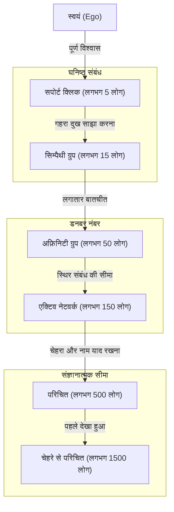
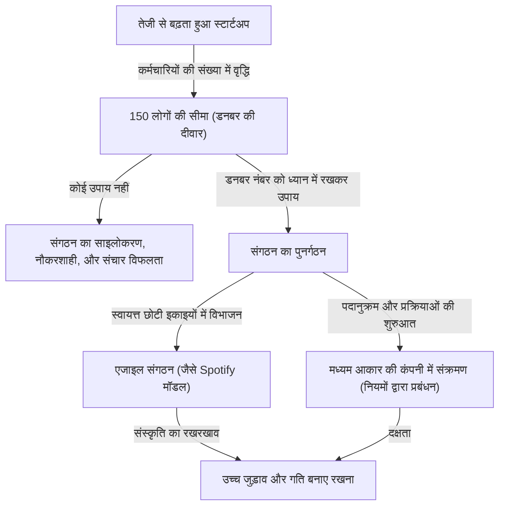

क्या मानवीय संबंधों की कोई सीमा है? हमारा मस्तिष्क वास्तव में कितने लोगों के साथ "सच्चा संबंध" रख सकता है?

आज के समाज में, यदि आप सोशल मीडिया खोलते हैं, तो आपको सैकड़ों या हजारों "फॉलोअर्स" और "दोस्त" मिलेंगे। हालाँकि, कितने लोग ऐसे हैं जिन पर हम वास्तव में भरोसा कर सकते हैं, जिनकी स्थिति को समझ सकते हैं और जिनके साथ परस्पर सहायता का संबंध बना सकते हैं? यहीं पर विकासवादी मनोवैज्ञानिक रॉबिन डनबर (Robin Dunbar) द्वारा प्रस्तावित **"डनबर नंबर (Dunbar's number)"** सामने आता है।

इस लेख में, हम डनबर नंबर की अवधारणा, इसके जैविक आधारों, ऐतिहासिक प्रमाणों, और आधुनिक डिजिटल समाज तथा व्यापार में संगठनात्मक डिजाइन में इसके अनुप्रयोगों पर गहराई से विचार करेंगे। यदि आप नेतृत्व की स्थिति में हैं, तो इस नियम को जानना एक स्वस्थ और उत्पादक संगठन बनाने के लिए एक शक्तिशाली उपकरण होगा।

---

## 1. डनबर नंबर क्या है? (मूल अवधारणा और जैविक आधार)

डनबर नंबर एक संज्ञानात्मक सीमा है जो बताती है कि **"मनुष्य द्वारा स्थिर सामाजिक संबंध बनाए रखने की अधिकतम सीमा लगभग 150 लोगों की होती है।"** इसे 1990 के दशक की शुरुआत में ब्रिटिश मानवविज्ञानी और विकासवादी मनोवैज्ञानिक रॉबिन डनबर ने प्रस्तावित किया था।

### नियोकोर्टेक्स का आकार और समूह का आकार
डनबर के शोध का शुरुआती बिंदु प्राइमेट्स (वानर गण) के मस्तिष्क के आकार और उनके द्वारा बनाए जाने वाले समूहों (सामाजिक नेटवर्क) के आकार के बीच संबंध था। प्राइमेट्स एक-दूसरे की ग्रूमिंग (बाल संवारना) करके सामाजिक बंधन गहरे करते हैं और समूह में सामंजस्य बनाए रखते हैं। डनबर ने पाया कि प्राइमेट के मस्तिष्क में उच्च-स्तरीय सोच, तर्क और भाषा के लिए जिम्मेदार "नियोकोर्टेक्स (Neocortex)" का आकार (मस्तिष्क के कुल आकार के अनुपात में) जितना बड़ा होता है, उस प्रजाति द्वारा बनाए जाने वाले समूह का औसत आकार भी उतना ही बड़ा होता है।

इस संबंध को दर्शाने वाले समीकरण में मानव नियोकोर्टेक्स के आकार को लागू करने पर जो संख्या निकली, वह **"148"** थी, यानी लगभग 150 लोग।

### "स्थिर संबंध" की परिभाषा
डनबर नंबर द्वारा दर्शाए गए "150 लोग" केवल उन लोगों की संख्या नहीं है जिनके चेहरे और नाम आप याद रख सकते हैं। यहाँ संबंध का अर्थ निम्नलिखित स्थितियों से है:
- आप जानते हैं कि वह व्यक्ति कौन है और आपका उसके साथ कैसा संबंध है।
- आप जानते हैं कि वह व्यक्ति अन्य सदस्यों के साथ कैसा संबंध रखता है।
- आप एक-दूसरे के साथ सामाजिक दायित्व, विश्वास और अनकहे नियमों को साझा करते हैं, और बिना किसी निर्देश या दबाव के सहयोग से काम कर सकते हैं।

डनबर का तर्क है कि जब संख्या इससे अधिक हो जाती है, तो यह मस्तिष्क की संज्ञानात्मक प्रसंस्करण क्षमता की सीमा को पार कर जाती है, जिससे यह याद रखना मुश्किल हो जाता है कि कौन कौन है। फिर सामाजिक एकजुटता बनाए रखने के लिए कानूनों, नियमों और पदानुक्रमित प्रबंधन संरचना (नौकरशाही) की आवश्यकता होती है।

---

## 2. डनबर के संकेंद्रित वृत्त: मानवीय संबंधों की पदानुक्रमित संरचना

डनबर न केवल 150 लोगों की सीमा को इंगित करते हैं, बल्कि यह भी बताते हैं कि हमारे मानवीय संबंध "संकेंद्रित वृत्तों (परतों)" के रूप में संरचित होते हैं। केंद्र से बाहर की ओर जाने पर, घनिष्ठता कम हो जाती है, और लोगों की संख्या लगभग "3 गुना (या लगभग 3 से 5 गुना)" की दर से बढ़ती है।

1. **सपोर्ट क्लिक (लगभग 5 लोग)**
   यह सबसे भीतरी परत है। इसमें जीवनसाथी, सबसे अच्छे दोस्त और परिवार शामिल हैं - वे लोग जिनसे आप किसी बड़े संकट के समय बिना शर्त मदद मांग सकते हैं, जो भावनात्मक सहारा प्रदान करते हैं।
2. **सिम्पैथी ग्रुप (लगभग 15 लोग)**
   करीबी दोस्तों का समूह। ये वे लोग हैं जिनके बारे में आप सोच सकते हैं, "अगर इस व्यक्ति की कल मृत्यु हो जाए, तो मुझे बहुत दुख होगा।"
3. **अफ़िनिटी ग्रुप (लगभग 50 लोग)**
   अच्छे दोस्तों की परत जिनके साथ आप लगातार संपर्क में रहते हैं, साथ खाना खाने जाते हैं या घूमने जाते हैं।
4. **एक्टिव नेटवर्क (लगभग 150 लोग)** = डनबर नंबर
   यह वह परत है जो यह तय करती है कि आप उन्हें शादियों या अंतिम संस्कार में बुलाएंगे या नहीं, जिनसे आप साल में कम से कम एक बार संपर्क करते हैं। यह "स्थिर मानवीय संबंधों की सीमा" है।
5. **परिचित (लगभग 500 लोग) / चेहरे से परिचित (लगभग 1500 लोग)**
   इससे आगे की परतों में संबंध "मैं उनका नाम जानता हूँ" या "मैंने उनका चेहरा देखा है" के स्तर पर होते हैं, और भावनात्मक जुड़ाव तथा आपसी विश्वास कमजोर हो जाता है। कहा जाता है कि मानव स्मृति क्षमता के अनुसार, उन चेहरों को पहचानने की सीमा लगभग 1500 लोगों की है।

---

## 3. इतिहास और समाज "150" की संख्या की सार्वभौमिकता को प्रमाणित करते हैं

डनबर द्वारा प्रस्तावित संख्या 150 केवल मस्तिष्क विज्ञान की कोई गणितीय गणना नहीं है। इतिहास, मानव विज्ञान और सैन्य विज्ञान जैसे विभिन्न क्षेत्रों में ऐसे कई प्रमाण हैं जो बताते हैं कि "150" की संख्या ने समाज की एक बुनियादी इकाई के रूप में कार्य किया है।

### शिकारी-संग्रहकर्ता समाजों की जनजातियाँ
मानव की उत्पत्ति से लेकर कृषि शुरू करने तक के लंबे समय के दौरान, हमारे पूर्वज शिकारी-संग्रहकर्ता (hunter-gatherers) के रूप में जीवन व्यतीत करते थे। दुनिया भर में बचे हुए शिकारी-संग्रहकर्ता समाजों (जैसे अफ्रीका के सैन लोग या ऑस्ट्रेलिया के मूल निवासी) के गांवों और कुलों के औसत आकार का अध्ययन करने पर, यह आश्चर्यजनक रूप से पाया गया है कि यह संख्या लगातार लगभग 150 लोग रही है।

### सेना का मूल संगठन
सेना एक ऐसा संगठन है जिसमें चरम परिस्थितियों में एक-दूसरे पर जीवन के लिए निर्भर रहना पड़ता है और उच्च स्तर का समन्वय बनाए रखना होता है। प्राचीन रोमन साम्राज्य की सेना में बुनियादी सामरिक इकाई (मनिपुल्स और प्रारंभिक सेंचुरिया) लगभग 130 से 160 लोगों की होती थी। आधुनिक सेना में "कंपनी (Company)" में भी आम तौर पर लगभग 120 से 150 लोग होते हैं। जब आकार इससे बड़ा हो जाता है, तो कंपनी कमांडर के लिए सभी के चेहरे, नाम, क्षमताओं और व्यक्तित्व को याद रखना और नेतृत्व करना मुश्किल हो जाता है।

### धार्मिक समुदाय और गांव
अमीश (Amish) और हटरराइट्स (Hutterites) जैसे पारंपरिक ईसाई समुदायों में, जो साझा जीवन जीते हैं, एक सख्त नियम है कि जब समुदाय की संख्या 150 से अधिक हो जाती है, तो यह स्वाभाविक रूप से विभाजित हो जाता है और एक नया गांव बनाता है। वे अनुभव से जानते हैं कि जब यह संख्या 150 को पार कर जाती है, तो केवल "चेहरे से परिचित होने" के आधार पर व्यवस्था बनाए रखना संभव नहीं रहता, और एक पुलिस बल या सख्त कानूनों की आवश्यकता होने लगती है।

---

## 4. डिजिटल समाज में डनबर नंबर: क्या सोशल मीडिया इस सीमा को पार कर सकता है?

जब Facebook, X (पूर्व में Twitter), Instagram और LinkedIn जैसे सोशल मीडिया प्लेटफॉर्म आए, तो कुछ लोगों ने उम्मीद जताई कि "इंटरनेट डनबर नंबर को नष्ट कर देगा और हम हजारों लोगों के साथ घनिष्ठ संबंध बना सकेंगे।" लेकिन वास्तव में क्या हुआ?

डनबर और अन्य शोधकर्ताओं द्वारा सोशल मीडिया डेटा के विश्लेषण के अनुसार, यह साबित हो गया है कि **डिजिटल दुनिया में भी डनबर नंबर अभी भी लागू होता है**।

Facebook पर, यह पाया गया है कि हजारों "दोस्तों" वाले उपयोगकर्ताओं के लिए भी, उन लोगों की संख्या जिनके साथ वे नियमित रूप से संदेशों का आदान-प्रदान करते हैं या पोस्ट पर सार्थक टिप्पणियां छोड़ते हैं ("द्वि-तरफ़ा बातचीत"), लगभग 100 से 200 के बीच होती है। इसके अलावा, वास्तव में घनिष्ठ संबंध रखने वाले लोगों की संख्या ऊपर बताई गई "15" और "5" लोगों की परतों से पूरी तरह मेल खाती है।

हालाँकि सोशल मीडिया मानवीय संबंधों की "रखरखाव लागत" को कम करता है (जैसे कि आपको जन्मदिन की याद दिलाना, या एक साथ सभी को अपने बारे में अपडेट देना), यह हमारे मस्तिष्क की संज्ञानात्मक क्षमता, दूसरों पर खर्च की जा सकने वाली "भावनाओं की कुल मात्रा (इमोशनल कैपिटल)" और 1 दिन में 24 घंटे की "समय की बाधा" को भौतिक रूप से नहीं बढ़ा सकता है। आखिरकार, तकनीक रिश्तों के "विस्तार" को बढ़ाकर सतही संबंधों को बनाए रखने में मदद कर सकती है, लेकिन यह "गहराई" वाले संबंधों की संख्या की सीमा को पार नहीं कर सकती।

---

## 5. व्यापार और संगठनात्मक डिजाइन में डनबर नंबर का अनुप्रयोग

डनबर नंबर की अवधारणा कॉर्पोरेट संगठनात्मक डिजाइन और टीम बिल्डिंग के क्षेत्र में सबसे शक्तिशाली रूप से लागू होती है। जैसे-जैसे एक स्टार्टअप बढ़ता है और कर्मचारियों की संख्या में वृद्धि होती है, यह हमेशा "संगठन की दीवार" से टकराता है। उनमें से एक दीवार ठीक 150 लोगों की दीवार है।

### स्टार्टअप की "150 लोगों की दीवार"
प्रारंभिक चरण के स्टार्टअप में, सभी लोग एक ही कमरे में काम करते हैं, और अध्यक्ष सभी कर्मचारियों के नाम, व्यक्तित्व और वे वर्तमान में क्या कर रहे हैं, यह जानता है। काम बिना किसी नियम या नौकरशाही प्रक्रियाओं के, साझा दृष्टिकोण और मजबूत एकजुटता की भावना के साथ "परस्पर समझ" के माध्यम से सुचारू रूप से चलता है।

हालाँकि, जब कर्मचारियों की संख्या 100 को पार करती है और 150 के करीब पहुंचती है, तो कंपनी के भीतर "अज्ञात लोग" बढ़ने लगते हैं। आप ऐसी आवाजें सुनना शुरू कर देते हैं जैसे "मुझे नहीं पता कि वह विभाग क्या कर रहा है" या "मुझे नहीं पता कि यह नया व्यक्ति कौन है।"
जब इस सीमा को पार कर लिया जाता है, यदि आप उसी "पारिवारिक या ग्राम-शैली" प्रबंधन को जारी रखते हैं, तो संगठन निश्चित रूप से ढह जाएगा। संचार में देरी, गुटबाजी, जुड़ाव में कमी, और कर्मचारियों के नौकरी छोड़ने की उच्च दर जैसी समस्याएं उभरने लगती हैं।

### गोरे-टेक्स का उदाहरण: कारखानों को 150 लोगों में विभाजित करना
डनबर नंबर का जानबूझकर उपयोग करने वाला एक प्रसिद्ध व्यावसायिक उदाहरण डब्लू.एल. गोर एंड एसोसिएट्स (W.L. Gore & Associates) की प्रबंधन नीति है, जो वाटरप्रूफ और सांस लेने योग्य सामग्री "गोरे-टेक्स (GORE-TEX)" का निर्माण करती है।

इस कंपनी में, जब किसी कारखाने या कार्यालय में कर्मचारियों की संख्या 150 से अधिक होने वाली होती है, तो वे भौतिक रूप से एक नई इमारत बनाते हैं और संगठन को विभाजित करते हैं, भले ही उस स्थल पर कितनी भी जगह क्यों न बची हो। उनका दृढ़ विश्वास है कि यदि यह 150 लोगों से कम है, तो वे एक "नवाचार-उत्पादक वातावरण" बनाए रख सकते हैं जहां कर्मचारी एक-दूसरे को जानते हैं और किसी बॉस, जटिल पदानुक्रम या सख्त नियमावली के बिना स्वायत्त रूप से सहयोग कर सकते हैं।

### डनबर नंबर को पार करने के लिए संगठनात्मक रणनीतियाँ
कंपनियों को 150-व्यक्तियों की बाधा को पार करने और बढ़ने के लिए निम्नलिखित जानबूझकर संगठनात्मक पुनर्रचना की आवश्यकता है।

1. **ट्राइब्स (जनजातियों) में विभाजन**
   Spotify जैसी कंपनियों द्वारा अपनाए गए एजाइल संगठनात्मक मॉडल में, संगठन को लगभग 100 से 150 लोगों के "ट्राइब्स (Tribes)" में विभाजित किया जाता है। एक ट्राइब के भीतर मजबूत सहयोग बनाए रखते हुए, ट्राइब्स के बीच एक शिथिल सहयोग रखा जाता है, जिससे बड़े कॉर्पोरेशन होने के बावजूद स्टार्टअप जैसी चपलता बनी रहती है।
2. **प्रक्रियाओं और प्रणालियों की शुरुआत**
   "चेहरे से पहचानने वाले संबंधों" के अलिखित नियमों पर निर्भर रहने के बजाय, स्पष्ट लिखित नियमों, मूल्यांकन प्रणालियों और सूचना साझा करने की प्रणालियों (दस्तावेज़ीकरण संस्कृति) को पेश करना आवश्यक है।
3. **संस्कृति और मिशन साझा करना (कल्पना साझा करना)**
   जैसा कि युवल नूह हरारी ने अपनी पुस्तक "सेपियंस: ए ब्रीफ हिस्ट्री ऑफ हुमनकाइंड" में बताया है, मनुष्य 150 की सीमा को पार कर हजारों या लाखों के पैमाने पर सहयोग कर सकते हैं, क्योंकि उनमें "साझा मिथकों (कल्पनाओं) में विश्वास करने की क्षमता" है। एक कंपनी में, यह "कॉर्पोरेट दर्शन (मिशन, विजन, वैल्यूज़)" से मेल खाता है। यह मान्यता कि वे समान मिशन में विश्वास करने वाले साथी हैं, भले ही वे सीधे तौर पर एक-दूसरे को न जानते हों, वह गोंद बन जाती है जो एक बड़े संगठन को एक साथ बांधती है।

---

## निष्कर्ष: डनबर नंबर हमें क्या सिखाता है?

डनबर नंबर एक कठोर संख्या लग सकती है जो मानव मस्तिष्क की सीमाओं को दर्शाती है। यह तथ्य कि "चाहे हम कितनी भी कोशिश कर लें, हमारे पास केवल लगभग 150 सच्चे दोस्त हो सकते हैं," आधुनिक लोगों के लिए थोड़ा निराशाजनक महसूस हो सकता है जो अनंत संबंधों का सपना देखते हैं।

हालाँकि, एक अलग दृष्टिकोण से, यह एक शक्तिशाली संदेश भी है कि **"क्योंकि ये सीमित हैं, इसलिए संबंधों को डिज़ाइन करने और सावधानीपूर्वक पोषित करने की आवश्यकता है।"**

व्यवसाय में, यह समझना कि "संगठन में होने वाली समस्याएं व्यक्तिगत व्यक्तित्व या प्रयास की कमी के कारण नहीं, बल्कि होमो सेपियंस की जैविक सीमाओं के कारण होती हैं," आपको व्यक्ति-निर्भर प्रबंधन से दूर जाने और एक तर्कसंगत संगठनात्मक डिजाइन की ओर बढ़ने में मदद करता है।

व्यक्तिगत जीवन में भी, यह एक अच्छा अवसर है कि आप अपनी कीमती "150 सीटों," और इससे भी महत्वपूर्ण "5 सीटों" और "15 सीटों" को फिर से देखें, कि आप उनका उपयोग किसके लिए करते हैं। सोशल मीडिया पर "लाइक्स" या फॉलोअर्स की संख्या से भ्रमित होने के बजाय, आपके मस्तिष्क को वास्तव में जिस "गहरे, स्थिर और थोड़े से संबंधों" की आवश्यकता है, उस पर अपने संसाधनों का निवेश करना एक समृद्ध जीवन और मजबूत संगठन बनाने का आवश्यक तरीका है।
