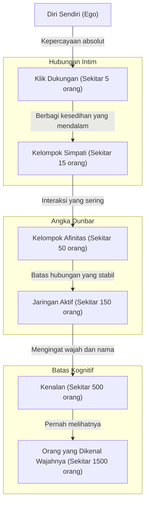
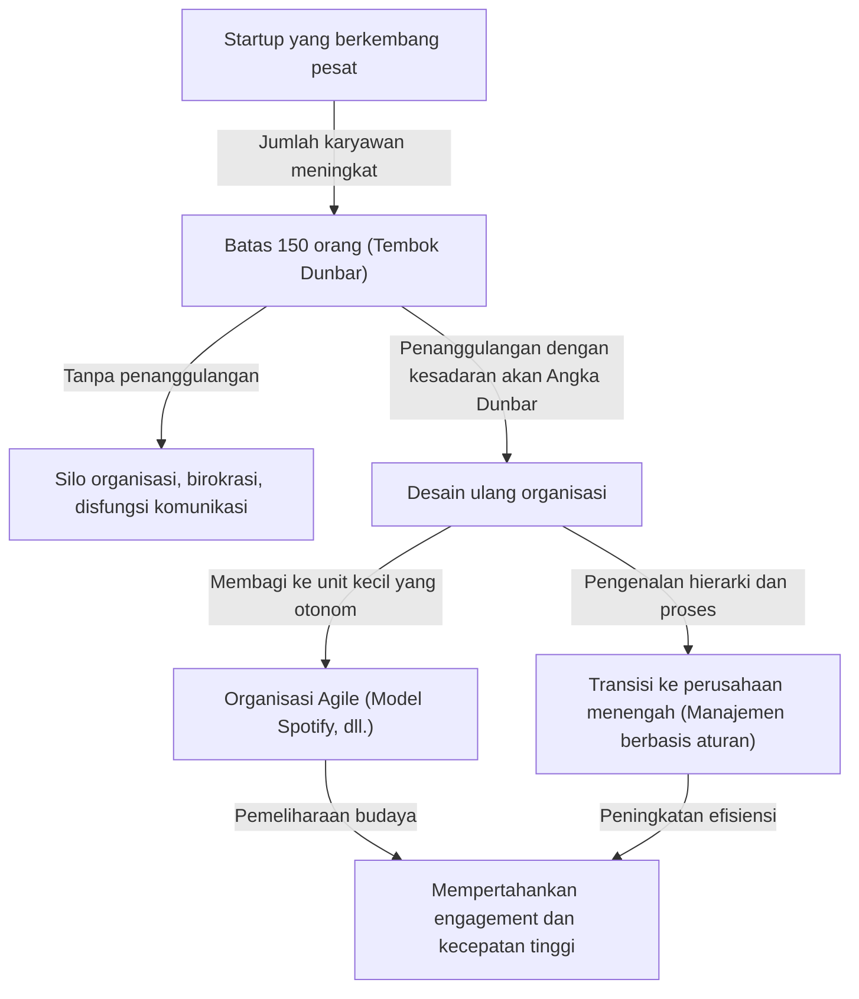

Apakah ada batasan dalam hubungan manusia? Berapa banyak orang yang sebenarnya bisa dijangkau oleh otak kita untuk memiliki "hubungan yang nyata"?

Dalam masyarakat modern, saat kita membuka media sosial, ada ratusan atau ribuan "pengikut" dan "teman". Namun, berapa banyak orang yang benar-benar kita percayai, saling memahami kondisi masing-masing, dan dapat membangun hubungan yang saling membantu? Di sinilah konsep **"Angka Dunbar (Dunbar's number)"** yang diajukan oleh psikolog evolusioner Robin Dunbar muncul.

Dalam artikel ini, kami akan menjelaskan secara mendalam tentang konsep Angka Dunbar ini, mulai dari dasar biologis hingga bukti historisnya, serta aplikasinya pada desain organisasi di era digital dan bisnis modern. Jika Anda berada pada posisi kepemimpinan, mengetahui hukum ini akan menjadi senjata yang ampuh untuk membangun organisasi yang sehat dan produktif.

---

## 1. Apa itu Angka Dunbar? (Konsep Dasar dan Dasar Biologis)

Angka Dunbar adalah batas kognitif yang menyatakan bahwa **"batas maksimal jumlah orang di mana manusia dapat mempertahankan hubungan sosial yang stabil adalah sekitar 150 orang"**. Konsep ini dikemukakan pada awal 1990-an oleh Robin Dunbar, seorang antropolog dan psikolog evolusioner asal Inggris.

### Ukuran Neokorteks dan Skala Kelompok
Titik awal penelitian Dunbar terletak pada korelasi antara ukuran otak primata dan skala kelompok (jaringan sosial) yang mereka bentuk. Primata memperdalam ikatan sosial dan menjaga keharmonisan kelompok dengan saling merawat (grooming). Dunbar menemukan bahwa semakin besar kapasitas (rasio terhadap keseluruhan otak) dari "neokorteks", bagian otak primata yang mengendalikan pemikiran tingkat tinggi, penalaran, dan bahasa, maka semakin besar pula rata-rata ukuran kelompok yang dibentuk oleh spesies tersebut.

Dengan menerapkan persamaan korelasi ini pada ukuran neokorteks manusia, angka yang didapatkan adalah **"148"**, atau sekitar 150 orang.

### Definisi "Hubungan yang Stabil"
Angka "150 orang" dalam Angka Dunbar bukan sekadar jumlah orang yang wajah dan namanya bisa kita ingat. Hubungan yang dimaksud di sini merujuk pada kondisi berikut:
- Mengetahui siapa orang tersebut dan apa hubungannya dengan diri kita.
- Mengetahui bagaimana hubungan orang tersebut dengan anggota kelompok lainnya.
- Memiliki rasa kewajiban sosial dan saling percaya, serta mampu bekerja sama tanpa perlu adanya instruksi atau paksaan.

Dunbar berpendapat bahwa jika jumlahnya melebihi ini, kapasitas pemrosesan kognitif otak akan terlampaui. Kita tidak akan tahu lagi siapa adalah siapa, dan untuk mempertahankan kohesi sosial, kita mulai membutuhkan hukum, peraturan, dan struktur manajemen hierarkis (birokrasi).

---

## 2. Lingkaran Konsentris Dunbar: Struktur Hierarkis Hubungan Manusia

Dunbar tidak hanya menunjukkan batas 150 orang, tetapi juga menunjukkan bahwa hubungan manusia kita terstruktur dalam "lapisan hierarkis konsentris (layer)". Terdapat hukum di mana semakin jauh dari pusat, tingkat kedekatan akan menurun, dan jumlah orang akan meningkat dengan rasio sekitar "3 kali (atau sekitar 3 hingga 5 kali)".

1. **Klik Dukungan (Sekitar 5 orang)**
   Lapisan paling tengah. Ini adalah hubungan di mana kita dapat saling memberikan dukungan emosional tanpa syarat dan meminta bantuan saat menghadapi krisis besar, seperti pasangan, sahabat, atau keluarga.
2. **Kelompok Simpati (Sekitar 15 orang)**
   Kelompok teman dekat. Mereka adalah orang-orang yang membuat Anda berpikir, "Jika orang ini meninggal besok, saya akan sangat berduka."
3. **Kelompok Afinitas (Sekitar 50 orang)**
   Lapisan teman baik yang sering berkomunikasi, pergi makan bersama, atau jalan-jalan bersama.
4. **Jaringan Aktif (Sekitar 150 orang)** = Angka Dunbar
   Lapisan batas untuk memutuskan siapa yang akan diundang ke acara pernikahan atau pemakaman, atau orang yang setidaknya Anda hubungi setahun sekali. Ini adalah "batas hubungan manusia yang stabil".
5. **Kenalan (Sekitar 500 orang)** / **Orang yang Dikenal Wajahnya (Sekitar 1500 orang)**
   Pada lapisan di luar itu, hubungannya hanya sebatas "tahu namanya" atau "pernah melihat wajahnya", di mana ikatan emosional dan rasa saling percaya sangat tipis. Sebagai kapasitas memori manusia, dikatakan bahwa batas mengenali wajah adalah sekitar 1500 orang.

---

## 3. Universalitas Angka "150" yang Dibuktikan oleh Sejarah dan Masyarakat

Angka 150 yang dicetuskan oleh Dunbar bukan sekadar angka perhitungan dalam ilmu otak. Terdapat banyak bukti dari berbagai bidang seperti sejarah, antropologi, dan ilmu militer bahwa angka "150" telah berfungsi sebagai unit dasar masyarakat.

### Suku Pemburu-Pengumpul
Untuk waktu yang sangat lama sejak munculnya umat manusia hingga dimulainya pertanian, nenek moyang kita hidup sebagai pemburu-pengumpul. Jika kita mengamati rata-rata ukuran desa atau klan masyarakat pemburu-pengumpul yang masih ada di seluruh dunia (seperti suku San di Afrika atau Aborigin di Australia), kita akan menemukan secara konsisten bahwa jumlahnya sangat mendekati 150 orang.

### Formasi Dasar Militer
Militer adalah organisasi yang harus saling mempercayakan nyawa dalam kondisi ekstrem dan membutuhkan koordinasi tingkat tinggi. Unit taktis dasar (Manipulus dan Centuria awal) dalam pasukan Kekaisaran Romawi kuno adalah sekitar 130 hingga 160 orang. Di militer modern, sebuah "Kompi (Company)" umumnya juga terdiri dari sekitar 120 hingga 150 orang. Hal ini karena jika ukurannya melebihi ini, akan sulit bagi komandan kompi untuk mengingat wajah, nama, kemampuan, dan kepribadian semua anggotanya saat memberikan komando.

### Komunitas Agama dan Desa
Dalam komunitas kehidupan komunal tradisional seperti Amish atau Hutterite dalam agama Kristen, terdapat aturan ketat di mana komunitas akan berpisah dan membentuk desa baru secara alami begitu jumlah anggotanya melebihi 150 orang. Hal ini karena mereka tahu dari pengalaman bahwa setelah melewati batas 150 orang, ketertiban tidak dapat lagi dipertahankan hanya dengan tekanan sosial (peer pressure) dan "hubungan saling kenal", melainkan akan membutuhkan lembaga kepolisian dan peraturan hukum yang ketat.

---

## 4. Angka Dunbar di Era Digital: Bisakah Media Sosial Menembus Batas?

Ketika media sosial seperti Facebook, X (sebelumnya Twitter), Instagram, dan LinkedIn bermunculan, ada harapan bahwa "Internet akan menghancurkan Angka Dunbar, dan kita akan mampu membangun hubungan dekat dengan ribuan orang". Namun, bagaimana kenyataannya?

Menurut analisis data media sosial oleh Dunbar sendiri dan para peneliti lain, telah terbukti bahwa **Angka Dunbar masih tetap berlaku bahkan di dunia digital**.

Di Facebook, bahkan bagi pengguna yang memiliki ribuan "teman", jumlah orang di mana mereka melakukan "interaksi dua arah" dengan bertukar pesan secara rutin atau meninggalkan komentar bermakna pada unggahan ternyata hanya berkisar antara 100 hingga 200 orang. Lebih lanjut lagi, orang-orang yang benar-benar berinteraksi intim dengan mereka sangat cocok dengan lapisan "15 orang" dan "5 orang" yang telah disebutkan sebelumnya.

Meskipun media sosial memiliki efek menurunkan "biaya pemeliharaan" hubungan (seperti memberitahukan hari ulang tahun atau melaporkan aktivitas terkini secara massal), teknologi tersebut tidak dapat secara fisik meningkatkan kapasitas kognitif otak kita, "jumlah emosi (emotional capital)" yang dapat dicurahkan kepada orang lain, atau "keterbatasan waktu" 24 jam sehari. Pada akhirnya, meskipun teknologi dapat memperluas "kelebaran" hubungan dan mempertahankan ikatan dangkal, ia tidak dapat melampaui batas jumlah hubungan yang memiliki "kedalaman".

---

## 5. Aplikasi Angka Dunbar dalam Bisnis dan Desain Organisasi

Konsep Angka Dunbar menunjukkan kekuatannya yang paling ampuh dalam bidang desain organisasi perusahaan dan team building. Ketika perusahaan rintisan (startup) tumbuh dan jumlah karyawannya bertambah, mereka pasti akan membentur "tembok organisasi". Salah satu tembok tersebut adalah tembok 150 orang.

### "Tembok 150 Orang" pada Startup
Pada masa awal pendirian startup, semua orang bekerja di ruangan yang sama, dan presiden (CEO) memahami nama, kepribadian, dan apa yang sedang dikerjakan oleh semua karyawan. Pekerjaan berjalan dengan pemahaman tanpa kata-kata, dan meskipun tidak ada aturan atau proses birokrasi, perusahaan beroperasi dengan visi bersama dan rasa solidaritas yang kuat.

Namun, ketika jumlah karyawan melewati 100 orang dan mendekati 150 orang, mulai banyak "orang yang tidak dikenal" di dalam perusahaan. Suara-suara seperti "Saya tidak tahu apa yang dilakukan departemen itu" atau "Saya tidak tahu siapa orang baru itu" mulai terdengar.
Ketika melewati batas ini, jika manajemen bergaya "kekeluargaan/pedesaan" seperti sebelumnya tetap dipertahankan, organisasi pasti akan runtuh. Masalah-masalah seperti keterlambatan komunikasi, pembentukan faksi, penurunan rasa memiliki, dan peningkatan tingkat turnover (keluar-masuk karyawan) akan bermunculan.

### Kasus Gore-Tex: Membagi Pabrik pada 150 Orang
Salah satu contoh bisnis terkenal yang dengan sengaja memanfaatkan Angka Dunbar adalah kebijakan manajemen W.L. Gore & Associates, produsen bahan tahan air dan bernapas "GORE-TEX".

Di perusahaan ini, setiap kali jumlah karyawan di satu pabrik atau kantor hampir melampaui 150 orang, terlepas dari seberapa banyak lahan yang tersisa, mereka akan secara fisik membangun gedung baru dan membagi organisasinya. Mereka meyakini bahwa selama jumlahnya 150 orang atau kurang, karyawan dapat saling mengenal dan bekerja sama secara mandiri untuk mempertahankan "lingkungan yang melahirkan inovasi" tanpa membutuhkan atasan, struktur hierarki yang rumit, atau manual yang ketat.

### Strategi Organisasi untuk Melampaui Angka Dunbar
Agar perusahaan dapat melampaui tembok 150 orang dan terus berkembang, diperlukan desain ulang organisasi yang disengaja seperti berikut:

1. **Pembagian menjadi Tribe (Suku)**
   Dalam model organisasi tangkas (agile) yang diadopsi oleh Spotify dan lainnya, organisasi dibagi menjadi unit-unit bernama "Tribe" yang terdiri dari sekitar 100 hingga 150 orang. Sambil mempertahankan koordinasi yang kuat di dalam tribe, koordinasi antar-tribe dibuat lebih longgar. Dengan demikian, meskipun menjadi perusahaan besar, kelincahan seperti startup tetap dapat dipertahankan.
2. **Pengenalan Proses dan Sistem**
   Penting untuk berhenti mengandalkan pemahaman tersirat melalui "hubungan saling kenal" dan mulai memperkenalkan aturan tertulis, sistem evaluasi, serta sistem berbagi informasi (budaya dokumentasi).
3. **Berbagi Budaya dan Misi (Berbagi Fiksi)**
   Seperti yang ditunjukkan oleh Yuval Noah Harari dalam bukunya "Sapiens: A Brief History of Humankind", kemampuan manusia untuk melampaui batas 150 orang dan bekerja sama dalam skala ribuan atau puluhan ribu adalah karena adanya "kemampuan untuk mempercayai mitos bersama (fiksi)". Dalam sebuah perusahaan, hal ini setara dengan "filosofi perusahaan (Misi, Visi, Nilai)". Bahkan jika mereka tidak saling mengenal secara langsung, kesadaran bahwa mereka adalah rekan yang mempercayai misi yang sama akan menjadi perekat yang menyatukan organisasi berskala besar.

---

## Kesimpulan: Apa yang Angka Dunbar Ajarkan kepada Kita

Angka Dunbar mungkin terlihat seperti angka dingin yang menunjukkan batas otak manusia. Kenyataan bahwa "sekeras apa pun kita berusaha, kita hanya bisa memiliki sekitar 150 teman sejati" mungkin terasa sedikit menyedihkan bagi orang modern yang memimpikan koneksi tanpa batas.

Namun, jika dilihat dari sudut pandang lain, ini juga merupakan pesan yang kuat bahwa **"justru karena jumlahnya terbatas, kita perlu mendesain dan merawat hubungan tersebut dengan hati-hati"**.

Dalam bisnis, dengan memahami bahwa "kekacauan dalam organisasi bukan disebabkan oleh kepribadian individu atau kurangnya usaha, melainkan batas biologis Homo sapiens", kita bisa beralih dari manajemen yang bergantung pada individu (person-dependent) ke desain organisasi yang masuk akal.

Bahkan dalam kehidupan pribadi, ini menjadi kesempatan baik untuk memikirkan kembali untuk siapa Anda akan memberikan "150 kursi" yang berharga, dan bahkan "5 kursi" serta "15 kursi" yang paling penting. Daripada terpaku pada jumlah "Likes" atau pengikut di media sosial, berinvestasi pada "hubungan kecil yang dalam dan stabil" yang benar-benar dicari oleh otak adalah pendekatan fundamental untuk membangun kehidupan yang kaya dan organisasi yang kuat.
