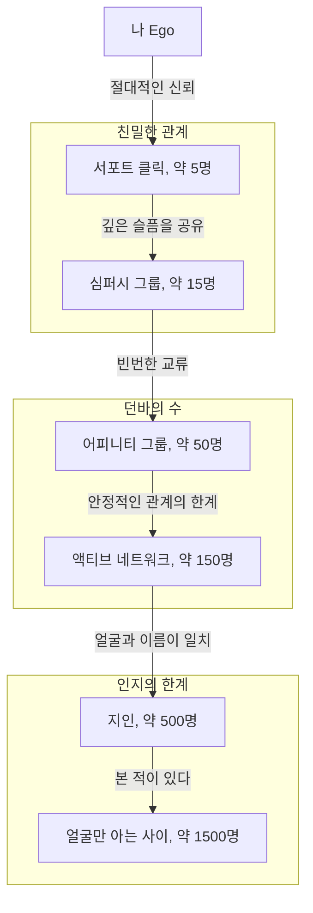
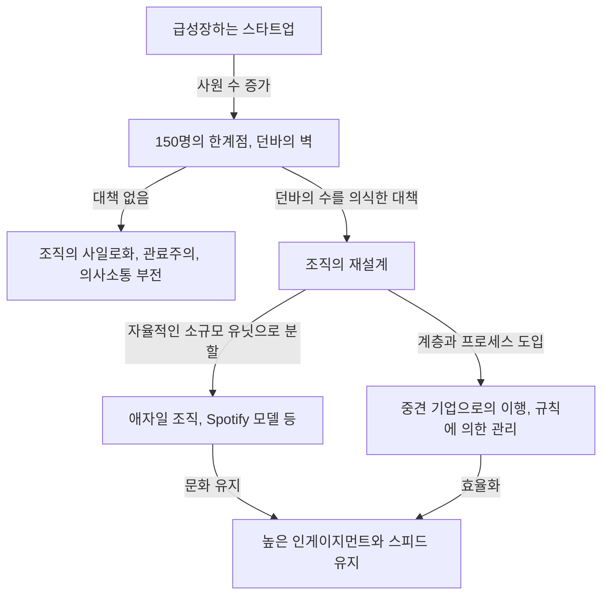

인간관계에는 한계가 있을까? 우리의 뇌는 대체 얼마나 많은 사람과 '진정한 유대'를 맺을 수 있을까?

현대 사회에서 SNS를 열면 수백, 수천 명의 '팔로워'나 '친구'가 존재합니다. 하지만 우리가 진심으로 신뢰하고 서로의 상황을 파악하며 도울 수 있는 관계를 구축한 사람은 얼마나 될까요? 여기서 등장하는 것이 진화심리학자 로빈 던바(Robin Dunbar)가 제창한 **'던바의 수(Dunbar's number)'**입니다.

본 기사에서는 이 던바의 수라는 개념에 대해, 생물학적 근거부터 역사적 증거, 나아가 현대의 디지털 사회나 비즈니스에서의 조직 디자인에의 응용까지 철저하게 파헤쳐 해설합니다. 리더십을 발휘하는 입장에 있다면, 이 법칙을 아는 것은 건전하고 생산성 높은 조직을 만들기 위한 강력한 무기가 될 것입니다.

---

## 1. 던바의 수란 무엇인가? (기본 개념과 생물학적 근거)

던바의 수란 **'인간이 안정적인 사회적 관계를 유지할 수 있는 인원의 상한선은 대략 150명이다'**라는 인지적 한계치입니다. 1990년대 초반에 영국의 인류학자이자 진화심리학자인 로빈 던바에 의해 제창되었습니다.

### 대뇌 신피질의 크기와 무리의 규모
던바의 연구 출발점은 영장류의 뇌 크기와 그들이 형성하는 무리(사회적 네트워크)의 규모 간의 상관관계에 있었습니다. 영장류는 서로 털 고르기(그루밍)를 함으로써 사회적 유대를 깊게 하고 무리의 화합을 유지합니다. 던바는 영장류의 뇌 속에서 고도의 사고나 추론, 언어 등을 관장하는 '대뇌 신피질(네오코텍스)'의 용량(전체 뇌에 대한 비율)이 클수록 그 종이 형성하는 무리의 평균 크기도 커진다는 사실을 발견했습니다.

이 상관관계를 나타내는 방정식에 인간 대뇌 신피질의 크기를 대입해 계산한 결과 도출된 것이 **'148'**이라는 숫자, 즉 약 150명이었습니다.

### '안정적인 관계'의 정의
던바의 수가 나타내는 '150명'은 단순히 얼굴과 이름이 일치하는 사람의 수가 아닙니다. 여기서 말하는 관계성이란 다음과 같은 상태를 가리킵니다.
- 상대가 누구이며 자신과 어떤 관계인지 알고 있다.
- 상대가 다른 멤버와 어떤 관계에 있는지 파악하고 있다.
- 서로 사회적 의무감이나 신뢰감, 암묵적인 룰을 공유하고 있으며, 지시나 강제가 없어도 협력해서 일을 진행할 수 있다.

이 이상의 인원이 되면 뇌의 인지적 처리 능력의 한계를 넘어버려, 누가 누군지 알 수 없게 되고 사회적 결속을 유지하기 위해 법률이나 규칙, 계층적인 관리 구조(관료제)가 필요해진다고 던바는 주장합니다.

---

## 2. 던바의 동심원: 인간관계의 계층 구조

던바는 150명이라는 한계뿐만 아니라, 우리의 인간관계가 '동심원 형태의 계층(레이어)'으로 되어 있다는 점도 지적하고 있습니다. 중심에서 바깥쪽으로 갈수록 친밀도는 낮아지고, 인원은 대략 '3배(또는 약 3~5배)'의 속도로 늘어난다는 법칙이 있습니다.

1. **서포트 클릭(약 5명)**
   가장 중심에 있는 층. 배우자, 절친한 친구, 가족 등 뭔가 중대한 위기에 빠졌을 때 무조건적으로 도움을 청할 수 있고 감정적인 지원을 주고받는 관계입니다.
2. **심퍼시 그룹(약 15명)**
   친한 친구 그룹. '만약 이 사람이 내일 죽는다면 깊은 슬픔에 잠길 것이다'라고 생각할 수 있는 사람들입니다.
3. **어피니티 그룹(약 50명)**
   자주 연락을 주고받으며 함께 밥을 먹으러 가거나 놀러 가는 좋은 친구 층.
4. **액티브 네트워크(약 150명)** = 던바의 수
   1년에 한 번은 연락을 취하는, 관혼상제에 부를지 말지의 경계선이 되는 층. '안정적인 인간관계의 한계'입니다.
5. **지인(약 500명)** / **얼굴만 아는 사이(약 1500명)**
   그 이상의 층이 되면 '이름은 안다', '얼굴은 본 적 있다' 수준이 되어 감정적인 유대나 상호 신뢰 관계는 옅어집니다. 인간의 기억 용량으로서 얼굴을 식별할 수 있는 한계는 1500명 정도라고 합니다.

---

## 3. 역사와 사회가 증명하는 '150'이라는 숫자의 보편성

던바가 제창한 150이라는 숫자는 단순한 뇌과학의 계산상 수치에 그치지 않습니다. 역사학, 인류학, 군사학 등 다양한 분야에서 '150'이라는 숫자가 사회의 기본적인 유닛으로 기능해 온 증거가 다수 존재합니다.

### 수렵채집 사회의 부족
인류가 탄생하고 농경을 시작하기 전까지 오랜 기간 동안, 우리 조상들은 수렵채집 생활을 했습니다. 전 세계에 남아 있는 수렵채집민(예를 들어 아프리카의 산족이나 호주의 애버리지니 등)의 마을이나 씨족의 평균적인 규모를 조사해 보면, 놀랍도록 일관되게 약 150명이라는 것을 알 수 있습니다.

### 군대의 기본 편성
군대는 극한 상황 속에서 목숨을 서로 맡기고 고도의 연계를 취해야 하는 조직입니다. 고대 로마 제국 군대의 기본적인 전술 단위(마니풀루스나 초기의 켄투리아)는 대략 130~160명이었습니다. 현대 군대의 '중대(Company)' 역시 일반적으로 120~150명 정도로 구성되어 있습니다. 이 이상의 규모가 되면 중대장이 전원의 얼굴과 이름, 능력, 성격을 파악하고 지휘하기가 어려워지기 때문입니다.

### 종교 공동체와 촌락
기독교의 아미시나 후터파 같은 전통적인 공동 생활을 하는 커뮤니티에서는, 커뮤니티의 인원이 150명을 넘으면 자연스럽게 분열하여 새로운 마을을 만든다는 엄격한 규칙이 존재합니다. 150명을 넘으면 동조 압력이나 '얼굴 아는 관계'만으로는 질서를 유지할 수 없게 되어 경찰 기구나 엄격한 법률이 필요해진다는 것을 그들은 경험적으로 알고 있기 때문입니다.

---

## 4. 디지털 사회에서의 던바의 수: SNS는 한계를 돌파할 수 있을까?

Facebook, X(구 Twitter), Instagram, LinkedIn 등의 SNS가 등장했을 때, '인터넷은 던바의 수를 파괴하고 우리는 수천 명과 친밀한 관계를 구축할 수 있게 될 것'이라고 기대하는 목소리가 있었습니다. 하지만 실제로는 어땠을까요?

던바 본인이나 다른 연구자들의 SNS 데이터 분석에 따르면, **디지털 세계에서도 던바의 수는 여전히 유효하다**는 것이 증명되고 있습니다.

Facebook에서 수천 명의 '친구'가 있는 유저라도, 정기적으로 메시지를 주고받거나 게시물에 의미 있는 댓글을 남기는 '쌍방향 교류'를 하는 상대의 수는 대략 100~200명 선에 머무는 것으로 나타났습니다. 나아가 진심으로 친밀한 대화를 나누는 상대는 앞서 언급한 '15명', '5명' 층과 완전히 일치했습니다.

SNS는 인간관계의 '유지 비용'을 낮추는(생일을 알려주거나 근황을 일제히 보고할 수 있는) 효과는 있지만, 우리 뇌의 인지 용량이나 타인에게 쏟을 수 있는 '감정의 총량(이모셔널 캐피탈)', 그리고 하루 24시간이라는 '시간적 제약'을 물리적으로 늘릴 수는 없습니다. 결국 테크놀로지는 관계의 '폭'을 넓혀 표면적인 유대를 유지하게 해줄 수는 있어도, '깊이'를 수반하는 관계의 수적 한계를 뛰어넘게 할 수는 없는 것입니다.

---

## 5. 비즈니스와 조직 디자인에서의 던바의 수 응용

던바의 수 개념이 가장 강력하게 힘을 발휘하는 곳은 기업의 조직 디자인이나 팀 빌딩 영역입니다. 스타트업 기업이 성장하며 사원 수가 늘어나는 과정에서 반드시 '조직의 벽'에 부딪히게 됩니다. 그 벽 중 하나가 바로 150명의 벽입니다.

### 스타트업의 '150명의 벽'
창업기 스타트업에서는 전원이 같은 방에서 일하며, 사장이 전 사원의 이름과 성격, 지금 무엇을 하고 있는지 파악하고 있습니다. 눈빛만으로도 일이 진행되며, 규칙이나 관료적인 프로세스가 없어도 공통의 비전과 강한 연대감으로 회사는 돌아갑니다.

하지만 사원 수가 100명을 넘어 150명에 가까워지면 사내에 '모르는 사람'이 늘어나기 시작합니다. '저 부서는 무엇을 하는지 모르겠다', '새로 들어온 사람이 누군지 모르겠다'는 목소리가 들리게 됩니다.
이 한계를 넘었을 때 예전처럼 '가족적·촌락적' 관리를 계속하면 조직은 확실하게 붕괴합니다. 의사소통의 지연, 파벌 형성, 소속감 저하, 이직률 증가 등의 문제가 분출하는 것입니다.

### 고어텍스의 사례: 공장을 150명으로 분할하다
던바의 수를 의도적으로 활용한 유명한 비즈니스 사례로 방수 투습 소재 '고어텍스(GORE-TEX)'를 제조하는 W.L.고어 앤 어소시에이츠사의 경영 방침이 있습니다.

이 회사는 한 공장이나 사무실의 직원 수가 150명을 넘을 것 같으면, 부지가 얼마나 남아있든 물리적으로 새로운 건물을 지어 조직을 분할합니다. 그들은 150명 이하라면 상사나 복잡한 계층 구조, 엄격한 매뉴얼이 없어도 직원들끼리 서로 얼굴을 알고 자율적으로 협력할 수 있는 '혁신을 낳는 환경'을 유지할 수 있다고 확신하기 때문입니다.

### 던바의 수를 넘기 위한 조직 전략
기업이 150명의 벽을 넘어 계속 성장하기 위해서는 다음과 같은 의도적인 조직 재설계가 필요합니다.

1. **트라이브(부족)로의 분할**
   Spotify 등이 채택하고 있는 애자일 조직 모델에서는 대략 100~150명 단위의 '트라이브(Tribe)'라는 단위로 조직을 분할합니다. 트라이브 내에서는 강한 연계를 유지하면서 트라이브 간은 좀 더 느슨한 연계에 머물게 함으로써, 대기업이더라도 스타트업 같은 민첩성을 유지합니다.
2. **프로세스와 시스템의 도입**
   '얼굴 아는 관계'에 의한 암묵적 양해에 의존하는 것을 그만두고, 명문화된 규칙, 평가 제도, 정보 공유 시스템(문서화 문화)을 도입할 필요가 있습니다.
3. **문화와 미션의 공유(허구의 공유)**
   유발 하라리가 저서 『사피엔스』에서 지적했듯, 인간이 150명의 한계를 넘어 수천, 수만 명의 규모로 협력할 수 있는 것은 '공통의 신화(허구)를 믿는 능력'이 있기 때문입니다. 기업에 있어서 그것은 '기업 이념(미션·비전·밸류)'에 해당합니다. 직접 아는 사이가 아니더라도 같은 미션을 믿는 동료라는 인식이 대규모 조직을 묶는 접착제가 됩니다.

---

## 요약: 던바의 수는 우리에게 무엇을 가르쳐 주는가

던바의 수는 인간 뇌의 한계를 보여주는 냉혹한 숫자로 보일지도 모릅니다. '우리는 아무리 노력해도 150명 정도밖에 진짜 친구를 가질 수 없다'는 사실은 무한한 유대를 꿈꾸는 현대인에게는 조금 쓸쓸하게 느껴지는 부분도 있을 것입니다.

하지만 시각을 달리하면, 이는 **'유한하기 때문에 관계성을 디자인하고 소중히 키워야 한다'**는 강력한 메시지이기도 합니다.

비즈니스에 있어서는 '조직이 삐걱거리는 것은 개인의 성격이나 노력 부족 탓이 아니라 호모 사피엔스의 생물학적 한계이다'라고 이해함으로써, 특정인에게 의존하는 관리에서 벗어나 이치에 맞는 조직 디자인으로 방향을 틀 수 있습니다.

사생활에서도 나의 귀중한 '150개의 자리', 나아가 가장 중요한 '5명의 자리', '15명의 자리'를 누구를 위해 쓸지 다시 한번 생각해 보는 좋은 기회가 됩니다. SNS의 '좋아요' 수나 팔로워 수에 얽매이는 것이 아니라, 뇌가 진정으로 원하는 '깊고 안정적인 소수의 유대'에 리소스를 투자하는 것이야말로 풍요로운 삶과 강한 조직을 만들기 위한 본질적인 접근법이라고 할 수 있을 것입니다.
