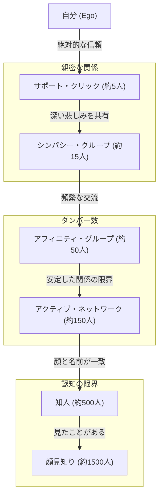
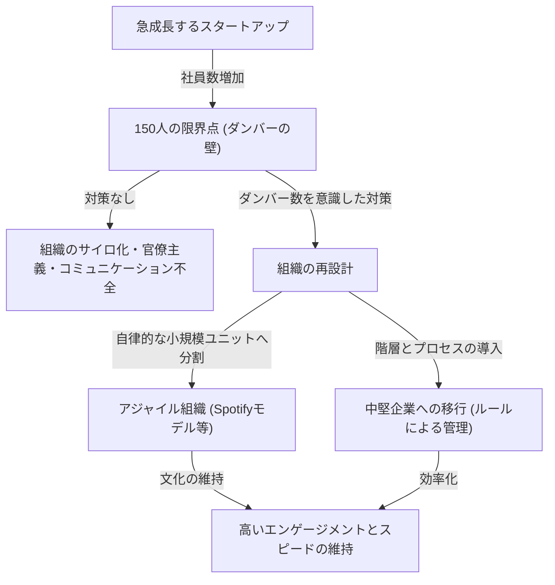

人間関係には限界があるのだろうか？私たちの脳は、一体どれだけの人と「本当の繋がり」を持つことができるのか？

現代社会において、SNSを開けば何百、何千という「フォロワー」や「友達」が存在します。しかし、私たちが本当に信頼し、互いの状況を把握し、助け合える関係を築けている人はどれくらいいるでしょうか。ここで登場するのが、進化心理学者ロビン・ダンバーが提唱した**「ダンバー数（Dunbar's number）」**です。

本記事では、このダンバー数という概念について、生物学的な根拠から歴史的な証拠、さらには現代のデジタル社会やビジネスにおける組織デザインへの応用まで、徹底的に深掘りして解説します。あなたがリーダーシップを発揮する立場にあるなら、この法則を知ることは、健全で生産性の高い組織を作るための強力な武器となるでしょう。

---

## 1. ダンバー数とは何か？（基本概念と生物学的根拠）

ダンバー数とは、<strong>「人間が安定した社会的な関係を維持できる人数の上限は、およそ150人である」</strong>とする認知的な限界値のことです。1990年代初頭に、イギリスの人類学者であり進化心理学者であるロビン・ダンバー（Robin Dunbar）によって提唱されました。

### 大脳新皮質のサイズと群れの規模
ダンバーの研究の出発点は、霊長類の脳の大きさと、彼らが形成する群れ（社会的ネットワーク）の規模との相関関係にありました。霊長類は、お互いに毛づくろい（グルーミング）をすることで社会的な絆を深め、群れの和を保ちます。ダンバーは、霊長類の脳の中で高度な思考や推論、言語などを司る「大脳新皮質（ネオコルテックス）」の容量（全体の脳に対する比率）が大きければ大きいほど、その種が形成する群れの平均サイズも大きくなることを発見しました。

この相関関係を示す方程式に、人間の大脳新皮質のサイズを当てはめて計算した結果、導き出されたのが<strong>「148」</strong>という数字、つまり約150人だったのです。

### 「安定した関係」の定義
ダンバー数が示す「150人」とは、単に顔と名前が一致する人の数ではありません。ここで言う関係性とは、以下のような状態を指します。
- 相手が誰で、自分とどのような関係にあるかを知っている。
- 相手が他のメンバーとどのような関係にあるかを把握している。
- 互いに社会的な義務感や信頼感、暗黙のルールを共有しており、指示や強制がなくとも協力して物事を進めることができる。

これ以上の人数になると、脳の認知的な処理能力の限界を超えてしまい、誰が誰だか分からなくなり、社会的な結束を維持するために法律や規則、階層的な管理構造（官僚制）が必要になってくるとダンバーは主張しています。

---

## 2. ダンバーの同心円：人間関係の階層構造

ダンバーは、150人という限界だけでなく、私たちの人間関係が「同心円状の階層（レイヤー）」になっていることも指摘しています。中心から外側に向かうにつれて、親密度は下がり、人数はおよそ「3倍（または約3〜5倍）」のペースで増えていくという法則があります。

1. **サポート・クリック（約5人）**
   最も中心にある層。配偶者、親友、家族など、何か重大な危機に陥ったときに無条件で助けを求められる、感情的な支援を与え合う関係です。
2. **シンパシー・グループ（約15人）**
   親しい友人のグループ。「もしこの人が明日亡くなったら、深い悲しみに暮れるだろう」と思える人たちです。
3. **アフィニティ・グループ（約50人）**
   頻繁に連絡を取り合い、一緒に食事に行ったり、遊びに行ったりする良い友人の層。
4. **アクティブ・ネットワーク（約150人）**＝ダンバー数
   年に一度は連絡を取り合う、冠婚葬祭に呼ぶかどうかの境界線となる層。「安定した人間関係の限界」です。
5. **知人（約500人）** / **顔見知り（約1500人）**
   それ以上の層になると、「名前は知っている」「顔は見たことがある」といったレベルになり、感情的な結びつきや相互の信頼関係は薄れます。人間の記憶容量として、顔を識別できる限界は1500人程度だと言われています。

---

## 3. 歴史と社会が証明する「150」という数字の普遍性

ダンバーが提唱した150という数字は、単なる脳科学の計算上の数値にとどまりません。歴史学、人類学、軍事学など、様々な分野で「150」という数字が社会の基本的なユニットとして機能してきた証拠が多数存在します。

### 狩猟採集社会の部族
人類が誕生してから農耕を始めるまでの長い間、私たちの祖先は狩猟採集生活を送っていました。世界中に残る狩猟採集民（例えばアフリカのサン人や、オーストラリアのアボリジニなど）の村や氏族の平均的な規模を調査すると、驚くほど一貫して約150人であることが分かっています。

### 軍隊の基本編成
軍隊は、極限状態の中で命を預け合い、高度な連携をとらなければならない組織です。古代ローマ帝国の軍隊における基本的な戦術単位（マニプルスや初期のケントゥリア）はおよそ130〜160人でした。現代の軍隊における「中隊（Company）」も、一般的に120〜150人程度で構成されています。これ以上の規模になると、中隊長が全員の顔と名前、能力、性格を把握して指揮することが困難になるからです。

### 宗教共同体と村落
キリスト教のアーミッシュやフッター派といった伝統的な共同生活を送るコミュニティでは、コミュニティの人数が150人を超えると、自然と分裂して新しい村を作るという厳格なルールが存在します。150人を超えると、同調圧力や「顔見知りの関係」だけでは秩序を保てなくなり、警察機構や厳格な法律が必要になってしまうことを、彼らは経験的に知っているからです。

---

## 4. デジタル社会におけるダンバー数：SNSは限界を突破できるか？

Facebook、X（旧Twitter）、Instagram、LinkedInなどのSNSが登場したとき、「インターネットはダンバー数を破壊し、私たちは数千人と親密な関係を築けるようになる」と期待する声がありました。しかし、実際はどうだったでしょうか。

ダンバー自身や他の研究者によるSNSのデータ分析によれば、**デジタルの世界でもダンバー数は依然として有効である**ことが証明されています。

Facebookにおいて、何千人という「友達」がいるユーザーであっても、定期的にメッセージのやり取りをしたり、投稿に意味のあるコメントを残したりする「双方向の交流」を持っている相手の数は、およそ100〜200人に収まることが分かっています。さらに、本当に親密なやり取りをする相手は、前述の「15人」「5人」の層と完全に一致していました。

SNSは、人間関係の「維持コスト」を下げる（誕生日を教えてくれる、近況を一斉に報告できる）効果はありますが、私たちの脳の認知容量や、他者に注ぐことのできる「感情の総量（エモーショナル・キャピタル）」、そして1日24時間という「時間の制約」を物理的に増やすことはできません。結局のところ、テクノロジーは関係の「幅」を広げて表面的な繋がりを維持することはできても、「深さ」を伴う関係の数の限界を超えることはできないのです。

---

## 5. ビジネスと組織デザインにおけるダンバー数の応用

ダンバー数の概念が最も強力に力を発揮するのは、企業の組織デザインやチームビルディングの領域です。スタートアップ企業が成長し、社員数が増えていく過程で、必ず「組織の壁」にぶつかります。その壁の一つがまさに150人の壁なのです。

### スタートアップの「150人の壁」
創業期のスタートアップでは、全員が同じ部屋で働き、社長が全社員の名前と性格、今何をしているかを把握しています。「阿吽の呼吸」で仕事が進み、ルールや官僚的なプロセスがなくても、共通のビジョンと強い連帯感で会社は回ります。

しかし、社員数が100人を超え、150人に近づくと、社内に「知らない人」が増え始めます。「あの部署は何をやっているのか分からない」「新しく入った人が誰だか分からない」といった声が聞こえるようになります。
この限界を超えたとき、今まで通りの「家族的・村落的」なマネジメントを続けると、組織は確実に崩壊します。意思疎通の遅れ、派閥の形成、帰属意識の低下、離職率の増加などの問題が噴出するのです。

### ゴアテックスの事例：工場を150人で分割する
ダンバー数を意図的に活用した有名なビジネス事例として、防水透湿素材「ゴアテックス（GORE-TEX）」を製造するW.L.ゴア＆アソシエイツ社の経営方針があります。

同社では、一つの工場やオフィスの従業員数が150人を超えそうになると、敷地がどれだけ余っていても、物理的に新しい建物を建てて組織を分割します。彼らは、150人以下であれば、上司や複雑な階層構造、厳格なマニュアルがなくても、従業員同士が互いに顔を知り、自律的に協力し合える「イノベーションを生む環境」を維持できると確信しているからです。

### ダンバー数を超えるための組織戦略
企業が150人の壁を超えて成長し続けるためには、以下のような意図的な組織の再設計が必要です。

1. **トライブ（部族）への分割**
   Spotifyなどが採用しているアジャイルな組織モデルでは、およそ100〜150人単位の「トライブ（Tribe）」という単位で組織を分割します。トライブ内では強い連携を保ちつつ、トライブ間はより緩やかな連携に留めることで、大企業であってもスタートアップのような俊敏性を維持します。
2. **プロセスとシステムの導入**
   「顔の見える関係」による暗黙の了解に頼るのをやめ、明文化されたルール、評価制度、情報共有システム（ドキュメント文化）を導入する必要があります。
3. **文化とミッションの共有（虚構の共有）**
   ユヴァル・ノア・ハラリが著書『サピエンス全史』で指摘したように、人間が150人の限界を超えて数千・数万の規模で協力できるのは、「共通の神話（虚構）を信じる能力」があるからです。企業においては、それが「企業理念（ミッション・ビジョン・バリュー）」にあたります。直接の知り合いでなくても、同じミッションを信じる仲間であるという認識が、大規模な組織を束ねる接着剤となります。

---

## まとめ：ダンバー数は私たちに何を教えてくれるのか

ダンバー数は、人間の脳の限界を示す冷酷な数字に見えるかもしれません。「私たちはどんなに頑張っても150人程度しか本当の友人を持ち得ない」という事実は、無限の繋がりを夢見る現代人にとっては少し寂しく感じる部分もあるでしょう。

しかし、見方を変えれば、これは<strong>「有限であるからこそ、関係性をデザインし、大切に育む必要がある」</strong>という強力なメッセージでもあります。

ビジネスにおいては、「組織がギクシャクするのは個人の性格や努力不足のせいではなく、ホモ・サピエンスの生物学的な限界である」と理解することで、属人的なマネジメントから脱却し、理にかなった組織デザインへと舵を切ることができます。

プライベートにおいても、自分の貴重な「150の席」、さらには最も重要な「5人の席」「15人の席」を誰のために使うのかを見つめ直す良い機会になります。SNSの「いいね」の数やフォロワー数にとらわれるのではなく、脳が本当に求めている「深く、安定した少数の繋がり」にリソースを投資することこそが、豊かな人生と強い組織を作るための本質的なアプローチだと言えるでしょう。
