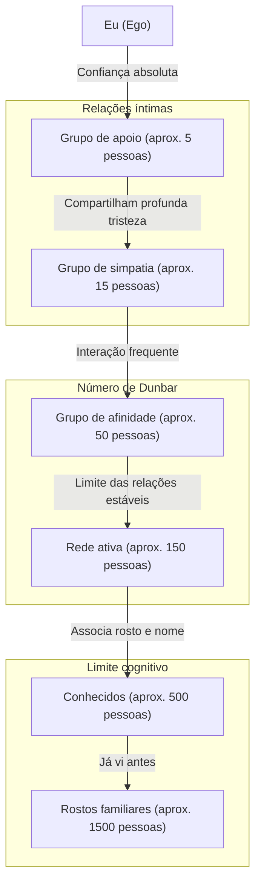
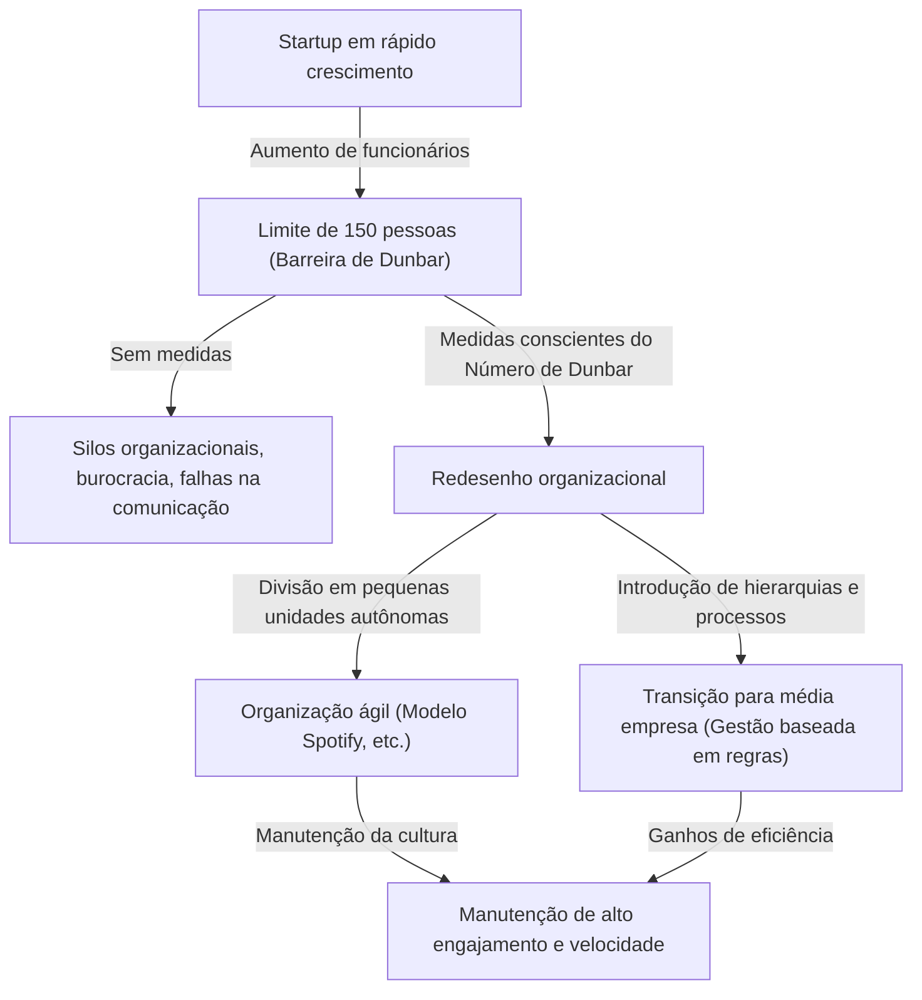

Existem limites para as relações humanas? Com quantas pessoas o nosso cérebro consegue realmente ter uma "conexão verdadeira"?

Na sociedade moderna, se abrirmos as redes sociais, existem centenas ou milhares de "seguidores" ou "amigos". No entanto, com quantas pessoas conseguimos construir uma relação em que realmente confiamos, conhecemos a situação um do outro e podemos nos ajudar? É aqui que entra o **"Número de Dunbar" (Dunbar's number)**, proposto pelo psicólogo evolucionista Robin Dunbar.

Neste artigo, explicaremos a fundo o conceito do Número de Dunbar, desde as bases biológicas e evidências históricas, até a sua aplicação na sociedade digital moderna e no design organizacional nos negócios. Se você estiver numa posição de liderança, conhecer esta regra será uma arma poderosa para criar uma organização saudável e altamente produtiva.

---

## 1. O que é o Número de Dunbar? (Conceito básico e base biológica)

O Número de Dunbar é um limite cognitivo que afirma que **"o limite superior de pessoas com quem um ser humano consegue manter uma relação social estável é de aproximadamente 150 pessoas"**. Foi proposto no início da década de 1990 pelo antropólogo e psicólogo evolucionista britânico Robin Dunbar.

### O tamanho do neocórtex e o tamanho do grupo
O ponto de partida da pesquisa de Dunbar foi a correlação entre o tamanho do cérebro dos primatas e o tamanho dos grupos (redes sociais) que eles formam. Os primatas aprofundam os laços sociais através de cuidados mútuos (grooming) e mantêm a harmonia do grupo. Dunbar descobriu que quanto maior for o volume (em proporção ao cérebro total) do "neocórtex", a parte do cérebro dos primatas responsável por pensamentos complexos, raciocínio e linguagem, maior será o tamanho médio do grupo formado por essa espécie.

Ao aplicar o tamanho do neocórtex humano nesta equação de correlação, o número derivado foi **"148"**, ou seja, cerca de 150 pessoas.

### Definição de "relação estável"
As "150 pessoas" indicadas pelo Número de Dunbar não são simplesmente pessoas cujos rostos e nomes você consegue associar. A relação a que se refere aqui indica os seguintes estados:
- Você sabe quem é a pessoa e qual é a relação dela com você.
- Você entende a relação da pessoa com os outros membros.
- Vocês compartilham um senso de obrigação social, confiança mútua e regras implícitas, podendo cooperar e avançar nas coisas sem necessidade de instruções ou coerção.

Dunbar argumenta que se o número de pessoas ultrapassar isso, excede os limites de capacidade de processamento cognitivo do cérebro, tornando-se impossível saber quem é quem, sendo necessárias leis, regras e estruturas de gestão hierárquica (burocracia) para manter a coesão social.

---

## 2. Os círculos concêntricos de Dunbar: A estrutura hierárquica das relações humanas

Dunbar aponta não só para o limite de 150 pessoas, mas também que as nossas relações humanas estão dispostas numa "hierarquia de círculos concêntricos (camadas)". Existe uma regra em que a intimidade diminui à medida que nos afastamos do centro em direção ao exterior, e o número de pessoas aumenta num ritmo de aproximadamente "3 vezes (ou cerca de 3 a 5 vezes)".

1. **Grupo de apoio (aprox. 5 pessoas)**
   A camada mais central. Cônjuge, melhores amigos, família, etc., relações onde se oferece apoio emocional e a quem se pode pedir ajuda incondicional numa crise grave.
2. **Grupo de simpatia (aprox. 15 pessoas)**
   O grupo de amigos próximos. São pessoas de quem você pensaria: "Se esta pessoa morresse amanhã, eu ficaria profundamente triste".
3. **Grupo de afinidade (aprox. 50 pessoas)**
   A camada de bons amigos com quem se entra em contato com frequência, com quem se sai para comer ou para se divertir juntos.
4. **Rede ativa (aprox. 150 pessoas)** = Número de Dunbar
   A camada que marca o limite de pessoas com as quais se mantém contato pelo menos uma vez por ano e que se consideraria convidar para casamentos e funerais. É o "limite das relações humanas estáveis".
5. **Conhecidos (aprox. 500 pessoas)** / **Rostos familiares (aprox. 1500 pessoas)**
   Nas camadas além destas, o nível torna-se algo como "conheço o nome" ou "já vi o rosto", e os laços emocionais e a confiança mútua diminuem. Diz-se que o limite da capacidade de memória humana para reconhecer rostos é de cerca de 1500 pessoas.

---

## 3. A universalidade do número "150" comprovada pela história e pela sociedade

O número 150 proposto por Dunbar não é apenas um valor calculado da neurociência. Existem muitas evidências em diversas áreas, como história, antropologia e ciência militar, onde o número "150" funcionou como unidade básica da sociedade.

### Tribos de sociedades caçadoras-coletoras
Durante muito tempo, desde o surgimento da humanidade até o início da agricultura, nossos ancestrais viveram como caçadores-coletores. Ao investigar o tamanho médio de aldeias e clãs de caçadores-coletores remanescentes em todo o mundo (como os San na África e os aborígenes australianos), descobre-se que é consistentemente de cerca de 150 pessoas de forma surpreendente.

### Formação básica militar
O exército é uma organização que, em condições extremas, precisa confiar a vida uns aos outros e ter um alto nível de coordenação. A unidade tática básica do antigo exército do Império Romano (os manípulos e as primeiras centúrias) era de aproximadamente 130 a 160 homens. A "Companhia (Company)" nos exércitos modernos também é geralmente composta por cerca de 120 a 150 homens. Isto porque, se a escala for maior, torna-se difícil para o comandante da companhia conhecer o rosto, o nome, as habilidades e a personalidade de todos e comandá-los.

### Comunidades religiosas e aldeias
Em comunidades com vida comunitária tradicional, como os Amish e os Hutteritas do cristianismo, existe uma regra rigorosa de que quando o número de pessoas na comunidade ultrapassa 150, a comunidade naturalmente se divide e forma uma nova aldeia. Eles sabem, por experiência própria, que quando ultrapassa 150 pessoas, não é mais possível manter a ordem apenas através da pressão dos pares ou das "relações de conhecimento", sendo necessária uma força policial e leis rígidas.

---

## 4. O Número de Dunbar na sociedade digital: Podem as redes sociais quebrar o limite?

Quando surgiram redes sociais como o Facebook, o X (antigo Twitter), o Instagram e o LinkedIn, houve vozes que esperavam que "a internet destruirá o Número de Dunbar e nos permitirá construir relações íntimas com milhares de pessoas". No entanto, o que aconteceu na realidade?

Segundo análises de dados de redes sociais realizadas pelo próprio Dunbar e por outros pesquisadores, está provado que **o Número de Dunbar continua válido no mundo digital**.

No Facebook, mesmo os utilizadores com milhares de "amigos" interagem bidirecionalmente trocando mensagens regularmente ou deixando comentários significativos em publicações com apenas cerca de 100 a 200 pessoas. Além disso, o número de pessoas com as quais realmente têm interações íntimas coincidiu completamente com as camadas de "15 pessoas" e "5 pessoas" mencionadas anteriormente.

As redes sociais têm o efeito de reduzir os "custos de manutenção" das relações (notificando sobre aniversários, relatando o status a todos de uma vez), mas não podem aumentar fisicamente a nossa capacidade cognitiva do cérebro, a "quantidade total de emoção (capital emocional)" que podemos dedicar aos outros e a "restrição de tempo" de 24 horas por dia. Em última análise, a tecnologia pode expandir a "largura" das relações e manter laços superficiais, mas não pode ultrapassar o limite do número de relações com "profundidade".

---

## 5. A aplicação do Número de Dunbar nos negócios e no design organizacional

A área onde o conceito do Número de Dunbar exerce maior poder é no design organizacional e na formação de equipes nas empresas. Durante o processo de crescimento de uma startup e aumento do número de funcionários, a empresa ineviramente se depara com a "barreira organizacional". Uma dessas barreiras é precisamente a barreira das 150 pessoas.

### A "barreira das 150 pessoas" numa startup
Na fase inicial de uma startup, todos trabalham na mesma sala e o presidente conhece o nome, a personalidade e o que cada funcionário está fazendo. O trabalho avança por "sintonia total" e, mesmo sem regras ou processos burocráticos, a empresa funciona com uma visão partilhada e um forte sentido de solidariedade.

No entanto, quando o número de funcionários ultrapassa os 100 e se aproxima dos 150, começam a aumentar as "pessoas desconhecidas" dentro da empresa. Começam a surgir comentários como "Não sei o que aquele departamento está fazendo" ou "Não conheço a pessoa que acabou de entrar".
Quando esse limite é ultrapassado e a gestão "familiar e de aldeia" continua como antes, a organização entrará inevitavelmente em colapso. Começam a surgir problemas como atrasos na comunicação, formação de facções, diminuição do sentimento de pertencimento e aumento da rotatividade.

### O caso da Gore-Tex: Dividir as fábricas em 150 pessoas
Como um caso de negócios famoso que utilizou intencionalmente o Número de Dunbar, existe a política de gestão da W. L. Gore & Associates, que fabrica o material impermeável e respirável "GORE-TEX".

Nesta empresa, quando o número de funcionários de uma fábrica ou escritório está prestes a ultrapassar 150 pessoas, independentemente de quanto espaço haja no terreno, eles constroem fisicamente um novo edifício e dividem a organização. Eles estão convencidos de que, se for inferior a 150 pessoas, mesmo sem chefes, estruturas hierárquicas complexas ou manuais rigorosos, os funcionários podem manter um "ambiente que gera inovação" onde se conhecem e cooperam de forma autônoma.

### Estratégias organizacionais para superar o Número de Dunbar
Para as empresas continuarem a crescer ultrapassando a barreira das 150 pessoas, é necessário um redesenho organizacional intencional como o seguinte:

1. **Divisão em tribos**
   Em modelos de organização ágeis adotados pelo Spotify e outros, a organização é dividida em unidades chamadas "Tribos (Tribes)" de cerca de 100 a 150 pessoas. Mantendo uma forte colaboração dentro da tribo, mas mantendo a colaboração entre as tribos mais branda, é possível manter a agilidade de uma startup mesmo sendo uma grande empresa.
2. **Introdução de processos e sistemas**
   É necessário deixar de depender de acordos implícitos baseados em "relações com rostos familiares" e introduzir regras explícitas, sistemas de avaliação e sistemas de partilha de informação (cultura de documentação).
3. **Compartilhar a cultura e a missão (compartilhamento de ficção)**
   Como Yuval Noah Harari apontou no seu livro "Sapiens: Uma Breve História da Humanidade", a razão pela qual os humanos conseguem ultrapassar o limite das 150 pessoas e cooperar na escala de milhares ou dezenas de milhares, é porque têm a "capacidade de acreditar em mitos (ficções) partilhados". Nas empresas, isto corresponde à "filosofia corporativa (missão, visão, valores)". O reconhecimento de que são parceiros que acreditam na mesma missão, mesmo que não sejam conhecidos diretos, atua como um elemento aglutinador para unir grandes organizações.

---

## Conclusão: O que o Número de Dunbar nos ensina?

O Número de Dunbar pode parecer um número cruel que indica os limites do cérebro humano. O fato de "não importa o quanto tentemos, só conseguiremos ter cerca de 150 amigos verdadeiros", pode parecer um pouco triste para as pessoas modernas que sonham com conexões infinitas.

No entanto, mudando a perspectiva, esta é também uma poderosa mensagem de que **"exatamente por ser finito, é necessário projetar relações e cultivá-las com cuidado"**.

Nos negócios, compreender que "o desentendimento na organização não se deve à personalidade dos indivíduos ou à falta de esforço, mas sim ao limite biológico do Homo sapiens", permite abandonar a gestão baseada na personalidade e mudar para um design organizacional racional.

Na vida privada também, é uma boa oportunidade para reavaliar a quem você destinará seus preciosos "150 assentos", bem como os ainda mais importantes "5 assentos" e "15 assentos". Em vez de se prender ao número de "curtidas" ou seguidores nas redes sociais, investir recursos no "pequeno número de conexões profundas e estáveis" que o cérebro realmente procura, pode ser considerado a abordagem essencial para construir uma vida rica e uma organização forte.
