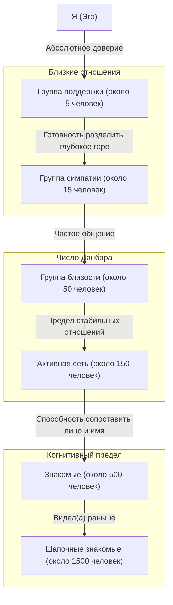
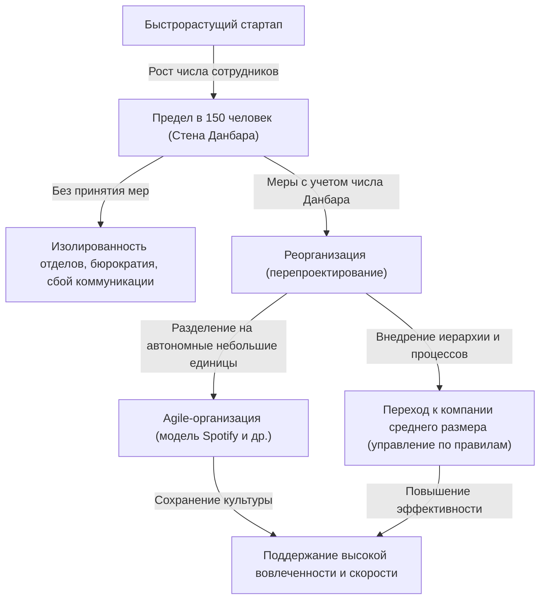

Есть ли предел человеческим отношениям? Со сколькими людьми наш мозг действительно способен поддерживать «настоящую связь»?

В современном обществе, открыв социальные сети, мы видим сотни, а то и тысячи «подписчиков» или «друзей». Но со сколькими из них мы действительно построили отношения, в которых можем доверять друг другу, быть в курсе дел и помогать в трудную минуту? Здесь на сцену выходит **«число Данбара (Dunbar's number)»**, предложенное эволюционным психологом Робином Данбаром.

В этой статье мы подробно разберем концепцию числа Данбара: от её биологических основ и исторических доказательств до применения в современном цифровом обществе и организационном дизайне в бизнесе. Если вы занимаете руководящую должность, знание этого закона станет для вас мощным инструментом для создания здоровой и продуктивной организации.

---

## 1. Что такое число Данбара? (Базовая концепция и биологическое обоснование)

Число Данбара — это когнитивный предел, утверждающий, что **«верхний предел количества людей, с которыми человек может поддерживать стабильные социальные отношения, составляет примерно 150 человек»**. Эта концепция была предложена в начале 1990-х годов британским антропологом и эволюционным психологом Робином Данбаром.

### Размер неокортекса и размер группы
Отправной точкой исследований Данбара стала корреляция между размером мозга приматов и размером групп (социальных сетей), которые они формируют. Приматы укрепляют социальные связи и поддерживают гармонию в группе путем взаимного груминга (ухода за шерстью). Данбар обнаружил, что чем больше объем (относительно всего мозга) «неокортекса» — части мозга приматов, отвечающей за высшее мышление, рассуждение и язык, тем больше средний размер группы, образуемой этим видом.

Подставив размер неокортекса человека в уравнение, показывающее эту корреляцию, он получил число **«148»**, то есть около 150 человек.

### Определение «стабильных отношений»
«150 человек», на которые указывает число Данбара, — это не просто количество людей, чьи лица вы можете сопоставить с именами. Отношения, о которых идет речь, подразумевают следующие состояния:
- Вы знаете, кто этот человек и в каких отношениях он с вами находится.
- Вы понимаете, в каких отношениях этот человек находится с другими членами группы.
- Вы разделяете чувство социальных обязательств, доверие и негласные правила, и можете сотрудничать без прямых указаний или принуждения.

Данбар утверждает, что при превышении этого числа мы выходим за пределы когнитивных возможностей нашего мозга по обработке информации. Мы перестаем понимать, кто есть кто, и для поддержания социальной сплоченности требуются законы, правила и иерархическая структура управления (бюрократия).

---

## 2. Концентрические круги Данбара: Иерархическая структура человеческих отношений

Данбар указывает не только на предел в 150 человек, но и на то, что наши человеческие отношения имеют структуру «концентрических слоев». От центра к периферии уровень близости снижается, а количество людей увеличивается примерно в «3 раза» (или от 3 до 5 раз).

1. **Группа поддержки (около 5 человек)**
   Самый внутренний слой. Супруги, лучшие друзья, семья — люди, к которым вы можете безоговорочно обратиться за помощью в случае серьезного кризиса, отношения, обеспечивающие взаимную эмоциональную поддержку.
2. **Группа симпатии (около 15 человек)**
   Группа близких друзей. Люди, о которых вы подумаете: «Если бы этот человек умер завтра, я бы погрузился в глубокую скорбь».
3. **Группа близости (около 50 человек)**
   Хорошие друзья, с которыми вы часто общаетесь, вместе ходите в рестораны или развлекаетесь.
4. **Активная сеть (около 150 человек)** = Число Данбара
   Слой людей, с которыми вы общаетесь хотя бы раз в год; граница тех, кого вы пригласили бы на свадьбу или похороны. Это «предел стабильных человеческих отношений».
5. **Знакомые (около 500 человек)** / **Шапочные знакомые (около 1500 человек)**
   На более широких уровнях отношения переходят в стадию «знаю по имени» или «видел это лицо раньше», а эмоциональные связи и взаимное доверие ослабевают. Считается, что объем человеческой памяти позволяет распознавать около 1500 лиц.

---

## 3. Универсальность числа «150», доказанная историей и обществом

Число 150, предложенное Данбаром, — это не просто расчетное значение в нейробиологии. В истории, антропологии, военном деле и других областях существует множество свидетельств того, что число «150» функционировало как базовая социальная единица.

### Племена в обществах охотников-собирателей
На протяжении долгого времени, от зарождения человечества до начала земледелия, наши предки вели жизнь охотников-собирателей. Исследования среднего размера деревень и кланов охотников-собирателей, сохранившихся по всему миру (например, бушменов в Африке или аборигенов в Австралии), показывают поразительно последовательную цифру — около 150 человек.

### Базовое подразделение в армии
Армия — это организация, в которой в экстремальных ситуациях люди должны доверять друг другу свои жизни и действовать в условиях высокой координации. Базовые тактические подразделения в армии Древнего Рима (манипулы и ранние центурии) составляли примерно от 130 до 160 человек. «Рота» в современных вооруженных силах также обычно состоит примерно из 120–150 человек. При превышении этого размера командиру роты становится сложно управлять, помня лица, имена, способности и характеры каждого.

### Религиозные общины и деревни
В сообществах, ведущих традиционный совместный образ жизни, таких как христианские амиши или гуттериты, существует строгое правило: когда численность общины превышает 150 человек, она естественным образом разделяется на две, чтобы основать новую деревню. Они из опыта знают, что при превышении числа в 150 человек поддерживать порядок с помощью давления группы и «знакомства в лицо» становится невозможным, и требуются полиция и строгие законы.

---

## 4. Число Данбара в цифровом обществе: Могут ли социальные сети преодолеть этот предел?

Когда появились такие социальные сети, как Facebook, X (ранее Twitter), Instagram и LinkedIn, звучали надежды на то, что «Интернет разрушит число Данбара, и мы сможем строить близкие отношения с тысячами людей». Но что произошло на самом деле?

Анализ данных социальных сетей, проведенный самим Данбаром и другими исследователями, доказал, что **число Данбара по-прежнему действует и в цифровом мире**.

Выяснилось, что в Facebook даже у тех пользователей, у которых тысячи «друзей», количество людей, с которыми они поддерживают «двустороннее общение» — регулярно обмениваются сообщениями или оставляют содержательные комментарии к постам, — ограничивается примерно 100–200. Более того, количество людей, с которыми ведется по-настоящему близкое общение, полностью совпадает с вышеупомянутыми слоями «15 человек» и «5 человек».

Социальные сети снижают «стоимость поддержания» отношений (напоминают о днях рождения, позволяют массово сообщать о своих делах), но они не могут физически увеличить когнитивную емкость нашего мозга, «общий объем эмоций (эмоциональный капитал)», который мы можем отдать другим, и 24-часовое ограничение времени в сутках. В конечном счете, хотя технологии и могут расширить «ширину» связей для поддержания поверхностных контактов, они не способны преодолеть предел количества отношений, обладающих «глубиной».

---

## 5. Применение числа Данбара в бизнесе и организационном дизайне

Концепция числа Данбара наиболее сильно проявляется в сфере организационного дизайна и тимбилдинга компаний. По мере роста стартапа и увеличения числа сотрудников он неизбежно сталкивается с «организационным барьером». Одним из таких барьеров и является стена в 150 человек.

### «Стена 150 человек» в стартапе
На этапе основания стартапа все работают в одной комнате, а генеральный директор знает имена и характеры всех сотрудников, а также чем они сейчас занимаются. Работа спорится с полуслова, и даже без правил или бюрократических процессов компания работает благодаря общему видению и сильному чувству солидарности.

Однако, когда число сотрудников превышает 100 и приближается к 150, в компании начинает появляться все больше «незнакомцев». Можно услышать фразы вроде: «Я не знаю, чем занимается этот отдел» или «Я понятия не имею, кто этот новенький».
Когда этот предел превышен, если продолжать применять прежний стиль управления «в духе семьи или деревни», организация неизбежно рухнет. Возникнут такие проблемы, как задержки в коммуникации, образование группировок, снижение чувства принадлежности и рост текучести кадров.

### Пример Gore-Tex: Разделение фабрик по 150 человек
Известным бизнес-примером сознательного использования числа Данбара является стратегия управления компании W.L. Gore & Associates, производящей водонепроницаемый дышащий материал Gore-Tex.

В этой компании, когда число сотрудников на одной фабрике или в офисе приближается к 150, они физически строят новое здание и разделяют организацию, независимо от того, сколько свободного места еще осталось. Они убеждены, что при численности 150 человек и менее можно поддерживать «среду, порождающую инновации», в которой сотрудники знают друг друга в лицо и могут автономно сотрудничать без начальства, сложных иерархических структур или строгих инструкций.

### Организационные стратегии для преодоления числа Данбара
Чтобы компания продолжала расти, преодолев стену в 150 человек, необходимо целенаправленное изменение дизайна организации, например:

1. **Разделение на «племена» (Tribes)**
   В гибких (Agile) организационных моделях, таких как та, которую использует Spotify, организация делится на единицы, называемые «племенами (Tribe)», насчитывающие около 100–150 человек. Поддерживая сильное взаимодействие внутри племени и ограничиваясь более свободными связями между племенами, можно сохранять маневренность, подобную стартапу, даже в крупной корпорации.
2. **Внедрение процессов и систем**
   Необходимо перестать полагаться на неявное согласие, основанное на том, что все знают друг друга, и внедрить письменные правила, системы оценки и системы обмена информацией (культуру документирования).
3. **Обмен культурой и миссией (разделение вымысла)**
   Как отмечал Юваль Ной Харари в своей книге «Sapiens: Краткая история человечества», способность людей сотрудничать в масштабах тысяч и десятков тысяч, преодолевая предел в 150 человек, обусловлена способностью «верить в общий миф (вымысел)». Для компании это эквивалентно «корпоративной философии (миссия, видение, ценности)». Осознание того, что вы товарищи, верящие в одну и ту же миссию, даже если вы не знакомы напрямую, становится тем клеем, который скрепляет крупную организацию.

---

## Заключение: Чему нас учит число Данбара

Число Данбара может показаться жестокой цифрой, указывающей на предел человеческого мозга. Факт, что «как бы мы ни старались, у нас может быть только около 150 настоящих друзей», может показаться немного грустным современному человеку, мечтающему о безграничных связях.

Однако, если взглянуть на это с другой стороны, это также мощное послание: **«Именно потому, что они ограничены, необходимо проектировать отношения и бережно их взращивать»**.

В бизнесе понимание того, что «напряженность в организации обусловлена не характерами людей или их недостаточными усилиями, а биологическими ограничениями Homo sapiens», позволяет отойти от управления, зависящего от конкретных личностей, и перейти к разумному организационному дизайну.

В личной жизни это хорошая возможность переосмыслить, на кого вы тратите свои драгоценные «150 мест», а тем более самые важные «5 мест» и «15 мест». Вместо того, чтобы зацикливаться на количестве лайков или подписчиков в социальных сетях, инвестирование ресурсов в «глубокие и стабильные связи с небольшим числом людей», которых действительно желает наш мозг, можно назвать фундаментальным подходом к созданию богатой жизни и сильной организации.
