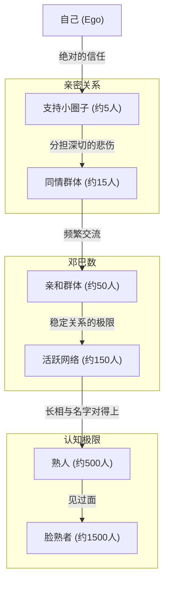
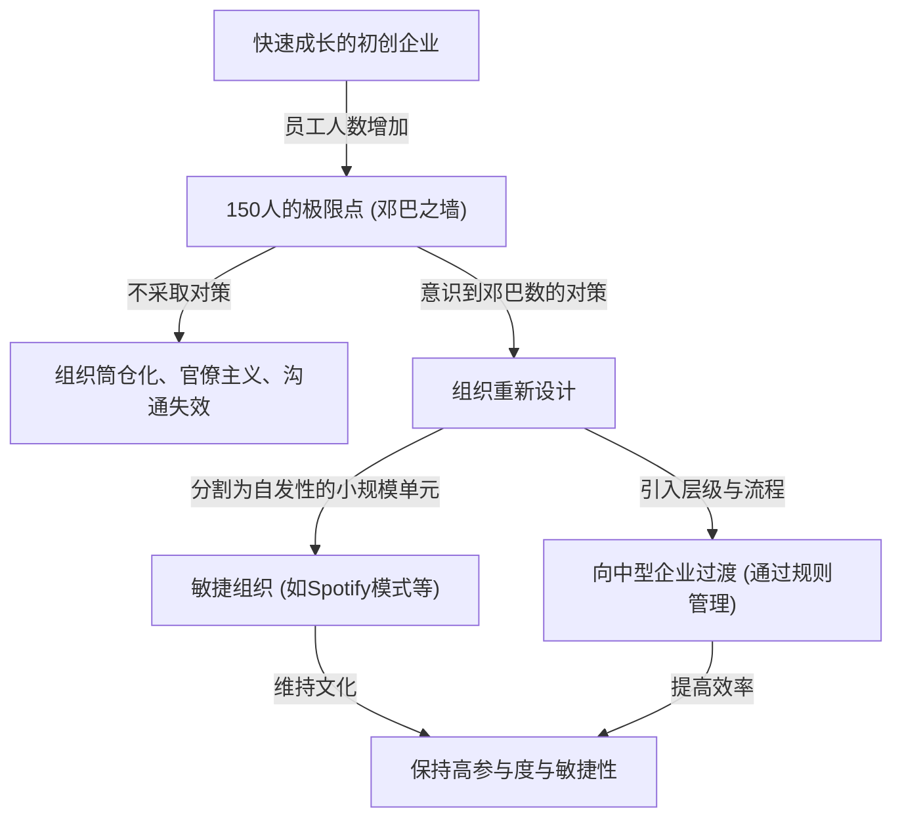

人际关系存在极限吗？我们的大脑究竟能和多少人建立“真正的联系”？

在现代社会，打开社交网络（SNS），我们会有成百上千的“粉丝”或“好友”。然而，我们真正信任、了解彼此近况、能够互相帮助的人到底有多少？这就引出了进化心理学家罗宾·邓巴（Robin Dunbar）提出的**“邓巴数（Dunbar's number）”**。

本文将从生物学依据到历史证据，再到现代数字社会与商业中组织设计的应用，对邓巴数这一概念进行全面深入的解读。如果你处于领导地位，了解这一法则将成为你打造健康、高效组织的有力武器。

---

## 1. 什么是邓巴数？（基本概念与生物学依据）

邓巴数是指**“人类能够维持稳定社交关系的人数上限大约为150人”**的认知极限值。它由英国人类学家兼进化心理学家罗宾·邓巴于20世纪90年代初提出。

### 新皮质大小与群体规模
邓巴研究的出发点在于灵长类动物大脑的尺寸与其形成的群体（社交网络）规模之间的相关性。灵长类动物通过互相理毛（grooming）来加深社会羁绊，维持群体的和谐。邓巴发现，在灵长类动物大脑中，掌管高级思考、推理和语言等功能的“新皮质（Neocortex）”的容量（占整个大脑的比例）越大，该物种形成的群体平均规模也就越大。

将人类新皮质的大小代入显示这种相关性的方程式中进行计算，得出的数字是**“148”**，即大约150人。

### “稳定关系”的定义
邓巴数所指的“150人”，并不仅仅是你能叫出名字并认出长相的人数。这里所说的关系状态指的是：
- 知道对方是谁，以及对方与自己是什么关系。
- 掌握对方与其他成员之间的关系。
- 彼此共享社会义务感、信任感和潜规则，即使没有指示或强制也能合作推进事务。

邓巴主张，一旦人数超过这个限度，就会超出大脑认知处理能力的极限，导致无法分清谁是谁，此时就需要法律、规则和等级管理结构（官僚制）来维持社会的团结。

---

## 2. 邓巴的同心圆：人际关系的层次结构

邓巴不仅指出了150人这一极限，还指出我们的人际关系呈现出“同心圆状的层次（Layer）”结构。有一个规律是，从中心向外侧延伸，亲密度会降低，而人数则以大约“3倍（或约3至5倍）”的速度增加。

1. **支持小圈子（约5人）**
   最核心的层次。包括配偶、挚友、家人等，在遇到重大危机时可以无条件求助、相互给予情感支持的关系。
2. **同情群体（约15人）**
   亲密朋友的群体。是让你觉得“如果这个人明天去世，我会陷入深深的悲伤”的人。
3. **亲和群体（约50人）**
   频繁联系，一起去吃饭、游玩的好友阶层。
4. **活跃网络（约150人）**＝邓巴数
   至少每年联系一次，是决定是否邀请参加婚丧嫁娶的边界阶层。这是“稳定人际关系的极限”。
5. **熟人（约500人）** / **脸熟者（约1500人）**
   到了这个层次，就只停留在“知道名字”、“见过面”的水平，情感联系和相互信任感变得淡薄。作为人类的记忆容量，能够识别人脸的极限据说在1500人左右。

---

## 3. 历史与社会证明的“150”这一数字的普遍性

邓巴提出的150这个数字，不仅仅是大脑科学计算出的理论值。在历史学、人类学、军事学等多个领域，都有大量证据表明“150”这个数字曾作为社会的基本单位发挥作用。

### 狩猎采集社会的部落
从人类诞生到开始农耕之前的漫长岁月中，我们的祖先一直过着狩猎采集的生活。调查世界各地遗留下来的狩猎采集者（例如非洲的桑人、澳大利亚的原住民等）的村落或氏族平均规模时发现，其人数惊人地一致，约为150人。

### 军队的基本编制
军队是一个在极端状态下必须互相托付生命、并进行高度协作的组织。古罗马帝国军队的基本战术单位（中队或早期的百人队）大约在130到160人之间。现代军队中的“连（Company）”通常也由120到150人左右组成。如果规模超过这个数量，连长就很难掌握所有人的长相、名字、能力和性格并进行指挥。

### 宗教社区与村落
在基督教的阿米什人或哈特派等过着传统集体生活的社区中，存在着一条严格的规定：当社区人数超过150人时，就会自然分裂去建立新的村落。因为他们从经验中得知，一旦超过150人，仅靠从众压力和“熟人关系”将无法维持秩序，必须建立警察机构或严格的法律。

---

## 4. 数字社会中的邓巴数：SNS能突破极限吗？

当Facebook、X（原Twitter）、Instagram、LinkedIn等社交媒体出现时，有人期待“互联网将打破邓巴数，让我们能够与数千人建立亲密关系”。然而，事实真的如此吗？

根据邓巴本人以及其他研究者对社交网络数据的分析表明，**在数字世界中，邓巴数依然有效**。

在Facebook上，即使是拥有数千名“好友”的用户，其定期交换信息、或在帖子上留下有意义评论的“双向交流”对象，数量也基本维持在100到200人之间。此外，真正进行亲密交流的对象数量，与前面提到的“15人”和“5人”层次完全一致。

社交网络确实起到了降低人际关系“维护成本”的作用（例如提醒生日、一键汇报近况），但它无法物理性地增加我们大脑的认知容量、能够倾注给他人“情感总量（情感资本）”以及每天24小时的“时间限制”。归根结底，技术虽然能拓宽关系的“广度”以维持表面上的联系，但无法突破伴随“深度”的关系数量的极限。

---

## 5. 邓巴数在商业与组织设计中的应用

邓巴数的概念在企业组织设计和团队建设领域发挥着最强大的作用。初创企业在成长、员工人数增加的过程中，必然会撞上“组织之墙”。其中一堵墙正是150人之墙。

### 初创企业的“150人之墙”
在创业初期的初创企业中，所有人都在同一个房间里工作，总裁了解所有员工的名字、性格以及他们目前正在做的事情。工作在“心照不宣”中推进，即使没有规则或官僚化的流程，公司也能凭借共同的愿景和强烈的团结感运转。

然而，当员工人数超过100人，接近150人时，公司内“不认识的人”开始增多。会开始听到“不知道那个部门在做什么”、“不知道新来的人是谁”这样的声音。
当超越这个极限时，如果继续采用以往那种“家族式、村落式”的管理方式，组织肯定会崩溃。沟通迟缓、派系形成、归属感降低、离职率上升等问题将会爆发。

### 戈尔特斯（Gore-Tex）的案例：将工厂按150人进行分割
作为一个有意识地利用邓巴数的著名商业案例，制造防水透气材料“戈尔特斯（Gore-Tex）”的W.L. Gore & Associates公司有着独特的经营方针。

在这家公司，当一个工厂或办公室的员工人数快要超过150人时，无论厂区还有多少空地，他们都会物理性地建造一栋新大楼来分割组织。因为他们坚信，只要人数在150人以下，即使没有上司、复杂的层级结构或严格的手册，员工之间也能互相认识脸庞，自发地相互合作，从而维持“孕育创新的环境”。

### 突破邓巴数的组织战略
企业要想在突破150人之墙后继续成长，需要进行如下有意识的组织重新设计。

1. **划分为部落（Tribe）**
   在Spotify等公司采用的敏捷组织模型中，组织被划分为以大约100到150人为单位的“部落（Tribe）”。部落内部保持紧密的合作，而部落之间则保持较松散的联系，以此使大企业也能维持初创企业般的敏捷性。
2. **引入流程与系统**
   必须停止依赖“熟人关系”带来的默契，引入成文的规则、评估制度和信息共享系统（文档文化）。
3. **共享文化与使命（共享虚构）**
   正如尤瓦尔·赫拉利在《人类简史》中指出的那样，人类之所以能够突破150人的极限，进行数千甚至数万规模的合作，是因为我们拥有“相信共同神话（虚构）的能力”。在企业中，这相当于“企业理念（使命、愿景、价值观）”。即使不是直接认识的人，只要认识到大家是信仰同一使命的同伴，这就能成为凝聚大规模组织的粘合剂。

---

## 总结：邓巴数告诉了我们什么

邓巴数可能看起来像是一个冷酷地指出人类大脑极限的数字。“无论我们怎么努力，也只能拥有大约150个真正的朋友”，这个事实对于梦想拥有无限联系的现代人来说，或许会感到有些失落。

但是，换个角度来看，这同样传达了一个强有力的信息：**“正因为关系是有限的，所以我们才需要去设计并用心去培养它。”**

在商业上，通过理解“组织的僵硬并不是因为个人的性格或努力不够，而是智人的生物学极限”，我们就能摆脱过于依赖个人的管理方式，转而迈向合理的组织设计。

在私人生活中，这也是一个重新审视自己宝贵的“150个席位”，乃至最重要的“5个席位”和“15个席位”应该留给谁的好机会。不要拘泥于社交网络上的“点赞”数和粉丝数，而是将资源投资于大脑真正渴望的“深刻、稳定且少数的联系”，这才是打造丰富人生和强大组织的本质途径。
