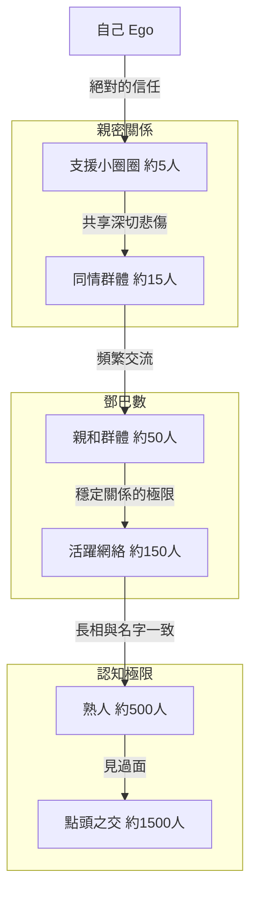
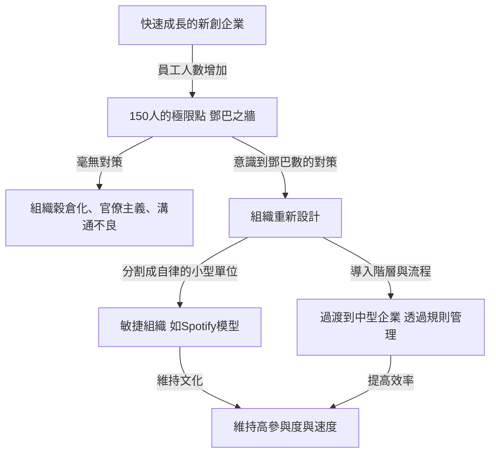

人際關係是否有極限？我們的大腦究竟能與多少人建立「真正的連結」？

在現代社會，打開社群媒體（SNS），我們可能有幾百、甚至幾千個「追蹤者」或「朋友」。但是，我們真正信任、互相了解近況、能互相幫助的人有多少呢？這就是演化心理學家羅賓·鄧巴（Robin Dunbar）提出的**「鄧巴數（Dunbar's number）」**。

本文將針對鄧巴數這個概念，從生物學基礎到歷史證據，再到現代數位社會與商業組織設計的應用，進行徹底的深入解說。如果你身處發揮領導力的職位，了解這個法則將成為你打造健全、高生產力組織的強大武器。

---

## 1. 什麼是鄧巴數？（基本概念與生物學基礎）

鄧巴數是指**「人類能夠維持穩定社會關係的人數上限，大約為150人」**的一種認知極限值。這是在1990年代初期，由英國人類學家兼演化心理學家羅賓·鄧巴（Robin Dunbar）所提出。

### 新皮質的大小與群體的規模
鄧巴研究的出發點，在於靈長類大腦的大小與其所形成的群體（社會網絡）規模之間的相關性。靈長類透過互相理毛（Grooming）來加深社會羈絆，維持群體和諧。鄧巴發現，在靈長類的大腦中，掌管高度思考、推論、語言等功能的「新皮質（Neocortex）」容量（佔整個大腦的比例）越大，該物種形成的群體平均規模就越大。

將人類新皮質的大小代入顯示這種相關性的方程式中進行計算，得出的數字就是**「148」**，也就是大約150人。

### 「穩定關係」的定義
鄧巴數所指的「150人」，並不單單是指能把長相和名字對號入座的人數。這裡所說的關係，是指以下狀態：
- 知道對方是誰，並了解對方與自己的關係。
- 了解對方與其他成員的關係。
- 彼此共享社會責任感、信任感及默契，即使沒有指示或強迫，也能互相合作推進事務。

鄧巴主張，當人數超過這個極限，就會超出大腦認知處理能力的極限，變得無法辨識誰是誰，為維持社會團結，就需要法律、規則或階層化的管理結構（官僚制度）。

---

## 2. 鄧巴的同心圓：人際關係的階層結構

鄧巴不僅指出了150人的極限，還指出我們的人際關係呈現「同心圓狀的階層（Layer）」。有一個法則指出，從中心向外，親密程度會下降，而人數則以大約「3倍（或約3到5倍）」的速度增加。

1. **支援小圈圈（約5人）**
   位於最中心的階層。像是配偶、摯友、家人等，當陷入重大危機時，能無條件求助、互相提供情感支持的關係。
2. **同情群體（約15人）**
   親密朋友的群體。是那些「如果這個人明天過世，我會陷入深深悲傷」的人。
3. **親和群體（約50人）**
   頻繁聯絡，會一起去吃飯、遊玩的好朋友階層。
4. **活躍網絡（約150人）**＝鄧巴數
   至少每年聯絡一次，是決定是否邀請參加婚喪喜慶的界線。「穩定人際關係的極限」。
5. **熟人（約500人）** / **點頭之交（約1500人）**
   到了這個以上的階層，就只剩下「知道名字」、「見過長相」的程度，情感上的連結和相互信任感變得很薄弱。就人類的記憶容量而言，能辨識長相的極限據說大約是1500人。

---

## 3. 歷史與社會證明的「150」這個數字的普遍性

鄧巴提出的150這個數字，不僅僅是大腦科學計算上的數值。在歷史學、人類學、軍事學等許多領域，都有大量證據表明「150」這個數字作為社會的基本單位發揮著作用。

### 狩獵採集社會的部落
在人類誕生到開始農耕的漫長歲月裡，我們的祖先過著狩獵採集的生活。調查世界各地殘留的狩獵採集民（例如非洲的桑人、澳洲的原住民等）村落或氏族的平均規模，會發現驚人的一致，大約都是150人。

### 軍隊的基本編制
軍隊是在極端狀態下必須互相託付性命、並採取高度協作的組織。古羅馬帝國軍隊的基本戰術單位（中隊或早期的百人隊）大約是130到160人。現代軍隊中的「連（Company）」一般也由120到150人左右組成。這是因為規模若超過此數，連長就很難掌握所有人的長相、名字、能力和性格來進行指揮。

### 宗教共同體與村落
在基督教的阿米甚人（Amish）或胡特爾派（Hutterite）等過著傳統共同生活的社群中，有一條嚴格的規定：當社群人數超過150人時，就會自然分裂並建立新的村落。因為他們從經驗中得知，當人數超過150人，光靠同儕壓力或「熟人關係」就無法維持秩序，勢必需要警察機構或嚴格的法律。

---

## 4. 數位社會中的鄧巴數：SNS能突破極限嗎？

當Facebook、X（舊Twitter）、Instagram、LinkedIn等社群媒體出現時，曾有人期待「網際網路將破壞鄧巴數，我們將能與數千人建立親密關係」。但實際情況如何呢？

根據鄧巴本人及其他研究人員對SNS數據的分析證明，**在數位世界中，鄧巴數依然有效**。

在Facebook上，即使是擁有數千名「朋友」的用戶，他們會定期傳送訊息、或在貼文留下有意義評論等有「雙向交流」的對象數量，大約落在100到200人之間。此外，真正進行親密互動的對象，與前述的「15人」、「5人」階層完全一致。

SNS雖然具有降低人際關係「維持成本」（例如提醒生日、一次性報告近況）的效果，但無法實質上增加我們大腦的認知容量、能傾注在他人身上的「情感總量（情感資本）」，以及一天只有24小時的「時間限制」。歸根究柢，科技也許能擴展關係的「廣度」以維持表面上的連結，但卻無法超越伴隨「深度」關係數量的極限。

---

## 5. 鄧巴數在商業與組織設計上的應用

鄧巴數的概念發揮最大威力的地方，在於企業的組織設計與團隊建設領域。新創企業在成長、員工人數增加的過程中，必然會撞上「組織之牆」。其中一堵牆，正是150人之牆。

### 新創企業的「150人之牆」
在創業初期的新創企業中，所有人都在同一個房間工作，總經理掌握所有員工的名字、性格以及他們現在在做什麼。工作靠著「默契」推進，即使沒有規則或官僚程序，公司也能靠著共同願景與強烈的連帶感運作。

但是，當員工人數超過100人、逼近150人時，公司內部就會開始出現「不認識的人」。會開始聽到「不知道那個部門在做什麼」、「不知道新進來的人是誰」這樣的聲音。
當超過這個極限，如果繼續維持過去那種「家族式、村落式」的管理，組織肯定會崩潰。會湧現出溝通遲緩、派系形成、歸屬感下降、離職率增加等問題。

### 戈爾公司的案例：以150人為單位分割工廠
有意運用鄧巴數的著名商業案例之一，是製造防水透氣材質「GORE-TEX（戈爾特斯）」的W.L. Gore & Associates公司的經營方針。

在該公司，當一個工廠或辦公室的員工人數快要超過150人時，無論廠區還有多少空間，他們都會在物理上建造一棟新建築來分割組織。因為他們深信，只要人數在150人以下，即使沒有主管、複雜的階層結構或嚴格的手冊，員工彼此之間也能認識，並維持能自律互助的「孕育創新的環境」。

### 跨越鄧巴數的組織策略
為了讓企業能跨越150人之牆並持續成長，需要以下這類有意識的組織重新設計。

1. **分割成部落（Tribe）**
   在Spotify等公司採用的敏捷組織模型中，會以大約100到150人為單位分割成「部落（Tribe）」。部落內部保持緊密合作，而部落之間則維持較鬆散的聯繫，藉此讓即使是大企業也能保持像新創企業般的敏捷性。
2. **導入流程與系統**
   必須停止依賴建立在「看得見臉的關係」上的默契，而是導入明文規定的規則、評估制度和資訊共享系統（文件文化）。
3. **共享文化與使命（共享虛構）**
   正如尤瓦爾·諾亞·赫拉利（Yuval Noah Harari）在著作《人類大歷史》中所指出的，人類之所以能超越150人的極限，以數千、數萬的規模進行合作，是因為擁有「相信共同神話（虛構）的能力」。在企業中，這就相當於「企業理念（Mission・Vision・Value）」。即使不是直接認識的人，只要認知到彼此是相信同一使命的夥伴，這就會成為凝聚大規模組織的黏著劑。

---

## 總結：鄧巴數教會了我們什麼？

鄧巴數看起來可能是一個顯示人類大腦極限的冷酷數字。「不管我們再怎麼努力，大約也只能擁有150個真正的朋友」，這個事實對於夢想擁有無限連結的現代人來說，或許會感到有些落寞。

然而，換個角度看，這也是一個強烈的訊息：**「正因為有限，我們才需要設計關係，並小心呵護。」**

在商業上，如果能理解「組織運作不順暢並非個人性格或努力不夠所致，而是智人的生物學極限」，就能擺脫依賴個人的管理方式，轉向合理的組織設計。

在私生活方面，這也是一個重新審視的好機會，看看自己寶貴的「150個位子」，甚至是更重要的「5個位子」、「15個位子」是留給了誰。不要拘泥於社群媒體的「讚」數或追蹤人數，將資源投資在我們大腦真正渴望的「深厚、穩定的少數連結」上，這可以說是打造豐富人生與堅強組織的本質性做法。
