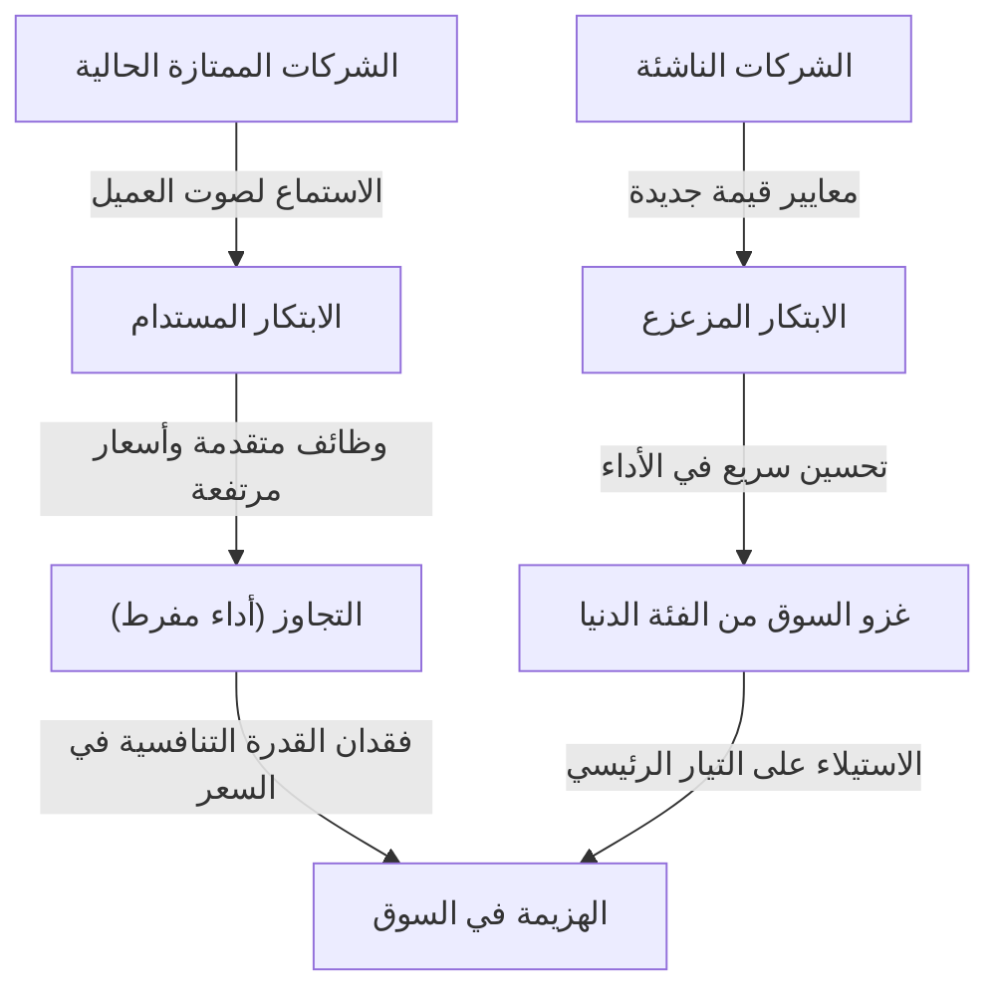
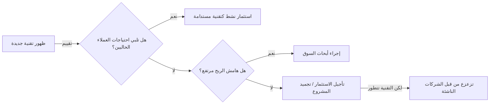

## مقدمة: لماذا تفشل الشركات التي تطبق "الإدارة المثالية"؟

في عالم الأعمال، نادراً ما نجد مفهوماً أثر بعمق وأحدث صدمة بين المديرين ورواد الأعمال مثل "معضلة المبتكر" (The Innovator's Dilemma). هذه النظرية، التي طرحها الراحل كلايتون كريستنسن، الأستاذ في كلية هارفارد للأعمال، في كتابه الذي يحمل نفس الاسم والصادر عام 1997، تجاوزت كونها مجرد فقرة في كتاب أعمال لتصبح واحدة من أهم النماذج الأساسية في استراتيجيات الشركات الحديثة.

قواعد النجاح التجاري التي نفكر فيها عادة هي: "الاستماع إلى صوت العميل"، "التحسين المستمر للمنتج"، و"الاستثمار في الأسواق ذات هوامش الربح الأعلى". هذه هي أساسيات "الإدارة الصحيحة" المكتوبة في كل كتاب دراسي للإدارة. ومع ذلك، كشفت أبحاث كريستنسن عن حقيقة مذهلة: **"بالتحديد لأنها تنفذ هذه الإدارة الصحيحة بشكل مثالي، تفشل الشركات العظيمة أمام الشركات الناشئة."** وهذه هي المفارقة.

في هذا المقال، سنقوم بتحليل عميق ومفصل للآلية الكامنة وراء "معضلة المبتكر"، والفرق بين الابتكار المستدام والابتكار المزعزع، وأمثلة تاريخية محددة، وكيف يمكن للشركات الحديثة تجنب هذا الفخ واستراتيجيات لتصبح هي نفسها المزعزعة.

---

## 1. مساران للابتكار

لفهم معضلة المبتكر، فإن الفرضية الأهم هي تصنيف الابتكار. قسم كريستنسن التطور التكنولوجي إلى فئتين رئيسيتين: "الابتكار المستدام" (Sustaining Innovation) و"الابتكار المزعزع" (Disruptive Innovation).

### الابتكار المستدام (Sustaining Innovation)

الابتكار المستدام هو ابتكار يعمل على تحسين أداء المنتجات أو الخدمات وفقاً لمؤشرات الأداء التي يقدرها العملاء الرئيسيون الحاليون. يمكن أن يكون هذا "تدريجياً" (يتحسن شيئاً فشيئاً) أو "جذرياً" (يقفز الأداء دفعة واحدة)، ولكن الاتجاه دائماً نحو "تحسين معايير التقييم الحالية في السوق الحالي".

الشركات الممتازة بارعة جداً في هذا الابتكار المستدام. فهي تجري أبحاثاً شاملة للعملاء، وتضيف الميزات التي يرغبون فيها، وتدمج عملية تقديم منتجات عالية الجودة بأسعار أعلى (وهوامش ربح أعلى) في الحمض النووي لمؤسساتها.

### الابتكار المزعزع (Disruptive Innovation)

من ناحية أخرى، الابتكار المزعزع هو ابتكار يقدم معايير قيمة جديدة تماماً (مثل أن يكون رخيصاً، صغيراً، بسيطاً، سهل الاستخدام) على الرغم من أنه قد يبدو للعملاء الرئيسيين الحاليين "منخفض الأداء وكأنه لعبة".

في البداية، يتم تجاهله في السوق السائد، ويتم قبوله ببطء في أسواق جديدة متخصصة أو في أسواق الفئة الدنيا (الأسعار المنخفضة). ومع ذلك، نظراً لأن سرعة التطور التكنولوجي أسرع من سرعة تطور احتياجات العملاء، فإن أداء التكنولوجيا المزعزعة يتحسن في النهاية ليلبي الحد الأدنى من متطلبات الأداء التي يبحث عنها عملاء السوق الحالي (تلبية احتياجات التيار الرئيسي وليس احتياجات الفئة العليا). في تلك اللحظة، يحدث تبديل دراماتيكي في السوق.

---

## 2. لماذا تتجاهل الشركات الممتازة التكنولوجيا المزعزعة؟ (هيكل المعضلة)

هنا يطرح سؤال: لماذا تُهزم الشركات الممتازة التي تمتلك ميزانيات بحث وتطوير ضخمة وموارد بشرية ممتازة أمام التقنيات "الرديئة" للشركات الناشئة؟
لم تكن هذه الشركات تفتقر إلى الكفاءة التكنولوجية. بل على العكس، في كثير من الحالات، تم تطوير النماذج الأولية للتكنولوجيا المزعزعة بواسطة الشركات الممتازة الحالية.

السبب وراء فشل الشركات الممتازة هو أنه **"نتيجة لعملية اتخاذ قرار عقلانية"**. العوامل التالية توضح هذا وتشكل معضلة قوية.

### 1. آلية تخصيص الموارد
يتم تخصيص موارد الشركة (المال، الأفراد، الوقت) بشكل تفضيلي للمشاريع ذات هوامش الربح الأعلى وحجم السوق الأكبر. مشاريع "الابتكار المستدام" التي عليها طلب قوي من العملاء الحاليين يمكنها بسهولة الحصول على الموافقة الداخلية لأنه من السهل التنبؤ بمبيعات وأرباح عالية. من ناحية أخرى، يتم رفض التقنيات المزعزعة بشكل "عقلاني" من منظور العائد على الاستثمار (ROI) لأن حجم السوق في المراحل الأولى يكون صغيراً وهوامش الربح منخفضة.

### 2. لعنة "صوت العميل"
تستمع الشركات الممتازة إلى عملائها الممتازين (العملاء الذين يدفعون أكثر). ومع ذلك، حتى لو أظهروا نسخة أولية من التكنولوجيا المزعزعة لهؤلاء العملاء، فإن الرد سيكون ببساطة: "لا نحتاج إلى شيء منخفض الأداء كهذا، قم بتحسين مواصفات المنتج الحالي أكثر". وبما أن الشركة مخلصة لعملائها، فإنها تشيح بنظرها عن التكنولوجيا المزعزعة.

### 3. القيود التي تفرضها شبكة القيمة (Value Network)
لا توجد الشركات بمعزل عن غيرها، بل ضمن "شبكة قيمة" تضم الموردين والموزعين والعملاء وغيرهم. ولأن هذه الشبكة بأكملها تمتلك ثقافة وهيكلاً يفضلان المنتجات ذات "الأداء العالي والسعر المرتفع"، فإن توزيع منتجات رخيصة ومنخفضة المواصفات تخرج عن هذا النطاق يواجه مقاومة من الشبكة بأكملها.

---

## 3. نمطان للابتكار المزعزع

هناك نمطان رئيسيان للابتكار المزعزع بناءً على كيفية استهداف السوق.

### التزعزع من الفئة الدنيا (Low-end Disruption)
وهو نهج يستهدف العملاء في السوق الحالي الذين تم "خدمتهم بشكل مفرط" (Overserved)، والذين يفكرون قائلين: "لا نحتاج إلى أداء عالي جداً، بل نود استخدامه إذا كان رخيصاً".
تسعد الشركات القائمة بالتنازل عن أسواق الفئة الدنيا ذات الأرباح المنخفضة للشركات الناشئة، لأنها تحول تركيزها (Upmarket Migration) نحو أسواق الفئة العليا الأكثر ربحية. ومع ذلك، تستخدم الشركات الناشئة الفئة الدنيا كنقطة انطلاق لتعزيز قدراتها التكنولوجية تدريجياً، ثم تتوسع بمرور الوقت لغزو الطبقات المتوسطة والعليا.
**(مثال: صناعة الصلب حيث دمرت مصانع الصلب الصغيرة (أفران القوس الكهربائي) شركات الأفران العالية، والدخول المبكر لشركة تويوتا إلى السوق الأمريكية)**

### التزعزع عبر سوق جديد (New-market Disruption)
وهو نهج يخلق سوقاً جديداً تماماً باستهداف "غير المستهلكين" الذين لم يتمكنوا من استهلاك المنتج في الماضي لأسباب مثل نقص المال، المهارات، أو الوقت.
من خلال توفير منتج "أبسط وأكثر راحة وبسعر معقول" مقارنة بالمنتجات الحالية، فإنه يحفز طلباً لم يكن موجوداً من قبل. من وجهة نظر الشركات الحالية، لا يبدو أن هناك من يسرق حصتها في السوق، مما يؤدي إلى تأخر في الشعور بالخطر.
**(مثال: الحواسيب الشخصية مقارنة بالحواسيب الكبيرة، الهواتف المحمولة المبكرة مقارنة بالهواتف الثابتة، وأجهزة سوني ووكمان مقارنة بأسطوانات الفينيل)**

---

## 4. مسار "التزعزع" الذي يثبته التاريخ: دراسات حالة

### الحالة 1: صناعة محركات الأقراص الصلبة (HDD)
الصناعة التي درسها كريستنسن بتفصيل كبير هي صناعة الأقراص الصلبة. خلال عملية التصغير من 14 بوصة إلى 8 بوصات ثم 5.25 و 3.5 بوصة، فقدت الشركات الرائدة الحالية في كل مرة تقريباً هيمنتها على الحجم التالي لصالح الشركات الناشئة.
كان عملاء الحواسيب المركزية يطلبون زيادة في السعة للأقراص ذات 14 بوصة (ابتكار مستدام)، وتجاهلوا الأقراص المبكرة ذات 8 بوصات (التي كانت سعتها صغيرة وموجهة للحواسيب الصغيرة). استمعت الشركات الحالية لعملائها وأخرت استثماراتها في الأقراص ذات 8 بوصات، ونتيجة لذلك، تم ابتلاعها بالكامل من قبل الشركات الناشئة ذات 8 بوصات التي برزت مع نمو سوق الحواسيب الصغيرة.

### الحالة 2: الكاميرات الرقمية تدمر فيلم هاليد الفضة
كانت كوداك واحدة من أوائل الشركات في العالم التي طورت كاميرا رقمية. ومع ذلك، خوفاً من تدمير نموذج أعمالها (شبكة القيمة) المتمثل في "الأفلام والتطوير" والذي كان يولد أرباحاً هائلة، ترددت الشركة في الانتقال الكامل إلى الرقمنة. كانت الكاميرات الرقمية المبكرة ذات جودة صورة رديئة، واعتبرها المصورون المحترفون "لعبة"، ولكن بالنسبة للمستخدمين العاديين، كانت القيمة الجديدة (الابتكار المزعزع) المتمثلة في "إمكانية رؤية الصور على الفور دون الحاجة لدفع تكاليف التحميض" قيمة لا تقاوم. عندما وصلت جودة الصورة إلى مستوى معين، انقلب السوق رأساً على عقب في لحظة.

### الحالة 3: البرمجيات كخدمة (SaaS) والحوسبة السحابية
في مواجهة شركات مثل أوراكل وSAP التي كانت تقدم برامج ضخمة للشركات تعتمد على التشغيل الداخلي، ظهرت شركات SaaS مثل سيلزفورس في البداية كـ "أدوات بسيطة للشركات الصغيرة والمتوسطة (الفئة الدنيا)". تجنبت الشركات الكبيرة SaaS بدعوى "المخاوف الأمنية" و"نقص الميزات"، لكن شركات SaaS حسّنت ميزاتها وأمنها بسرعة، وأصبحت الآن تلعب دوراً أساسياً في سوق الشركات الكبيرة (الفئة العليا).

---

## 5. "استراتيجيات الإدارة" للتغلب على معضلة المبتكر

للهروب من "فخ العقلانية" القوي هذا، وحتى تتمكن الشركات الحالية من خلق ابتكارات مزعزعة بنفسها (أو البقاء على قيد الحياة)، هناك حاجة إلى إدارة تقلب المعتقدات التقليدية.

### 1. تأسيس منظمات مستقلة وعمليات انفصال (Spin-outs)
لا ينبغي محاولة تنمية مشاريع مزعزعة داخل العمليات ومعايير القيمة الخاصة بالمنظمات الضخمة الحالية. فبالنسبة لقسم يحقق مبيعات بـ 100 مليار ين، يعتبر العمل الجديد الذي يدر مليار ين مجرد "هامش خطأ"، وسيخسر حتماً في الاجتماعات التي تتنافس فيها المشاريع على الموارد.
تحتاج التقنيات المزعزعة إلى **"منظمة مستقلة تماماً يمكن أن تتحمس حتى لسوق صغير وتعمل وفقاً لمعايير هامش الربح الخاصة بها"**.

### 2. نهج استكشافي مبني على فرضية "الفشل" (Discovery-driven Planning)
في الابتكار المستدام، من الممكن وضع خطط عمل دقيقة بناءً على البيانات التاريخية. ومع ذلك، نظراً لأن سوق الابتكار المزعزع "غير موجود بعد"، فإن التنبؤات المسبقة تكون خاطئة بنسبة 100%.
بدلاً من تنفيذ استراتيجية مثالية منذ البداية، من الضروري تبني نهج مشابه لـ Lean Startup: "وضع فرضيات، اختبارها بمبلغ صغير من التمويل، التعلم من السوق، وتصحيح مسار الاستراتيجية (المحور)".

### 3. فهم العميل من خلال "نظرية الوظائف" (Jobs to be Done)
بدلاً من النظر إلى السوق من خلال "سمات العميل" (مثل العمر والجنس) أو "ميزات المنتج"، يجب إعادة النظر فيه من زاوية: "ما هي الوظيفة (المهمة) التي يوظف العميل هذا المنتج لإنجازها؟".
من خلال ذلك، يمكن منع إضافة ميزات مفرطة للمنتجات الحالية (التجاوز)، واكتشاف "فرص للتزعزع" تنجز مهام العميل بسعر رخيص وبساطة باستخدام نهج مختلف تماماً.

### 4. تقييم الموارد، العمليات، ومعايير القيمة (إطار عمل RPV)
ما يمكن وما لا يمكن للشركة فعله يتحدد بثلاثة عوامل: "الموارد (Resource)"، "العمليات (Process)"، و"معايير القيمة (Values)". بينما تمتلك الشركات الممتازة "موارد" وفيرة، فإن "العمليات" المحسّنة للأعمال الحالية، و"معايير القيمة" التي تتطلب هوامش ربح عالية، تقف عائقاً أمام الابتكار المزعزع. يجب على القادة إعادة تصميم الهيكل التنظيمي نفسه حتى لا يتم تطبيق العمليات ومعايير القيمة الحالية على الأعمال الجديدة.

---

## 6. معضلة المبتكر في العصر الحديث (عصر الذكاء الاصطناعي والويب 3)

اليوم، مع صعود الذكاء الاصطناعي التوليدي (مثل ChatGPT)، يُقال إن شركات التكنولوجيا العملاقة مثل جوجل وأبل تواجه معضلة المبتكر.
على سبيل المثال، تمتلك جوجل محرك بحث بدقة لا مثيل لها (قمة الابتكار المستدام) ونموذج إعلاني قوي. ثم ظهر الذكاء الاصطناعي التوليدي، الذي يعطي إجابات مباشرة بتنسيق حواري، على الرغم من أنه يعاني أحياناً من هلوسات (تقديم معلومات خاطئة). نظراً لأن الذكاء الاصطناعي التوليدي يهدد بتدمير نموذج الربح الحالي المتمثل في "البحث والنقر على الروابط ورؤية الإعلانات"، فإن عملاق البحث يواجه معضلة في الانتقال الكامل إلى الذكاء الاصطناعي.

وبهذه الطريقة، في العصر الحديث حيث يتسارع تطور التكنولوجيا، أصبحت دورة "التزعزع" أقصر من أي وقت مضى. في قطاع البرمجيات والمجال الرقمي، حيث القيود المادية قليلة، يمكن أن يحدث الغزو من الفئة الدنيا إلى الفئة العليا في غضون سنوات أو شهور، وليس عقوداً.

---

## الخاتمة: تقبل المعضلة ودمر نفسك بنفسك

أهم درس يمكن استخلاصه من "معضلة المبتكر" لكلايتون كريستنسن هو أن **"نقاط القوة التي تدعم نجاحك الحالي ستصبح هي نفسها نقاط ضعفك القاتلة في المستقبل"**.

ما يُطلب من المديرين والقادة هو ممارسة "المنظمة المزدوجة البراعة" (Ambidextrous Organization) التي تسعى لتحقيق الكفاءة والنمو المستدام في الأعمال الحالية، مع التحلي بالشجاعة لتدمير أعمالهم التي تدر السيولة (البقرة الحلوب) بأيديهم في بعض الأحيان.
"هل تنتظر ظهور تقنية تدمر شركتك، أم تبتكرها بنفسك؟"
يمكن القول إن الاستمرار في مواجهة هذا السؤال هو السبيل الوحيد للبقاء في بيئة الأعمال المضطربة اليوم.

(انتهى)
