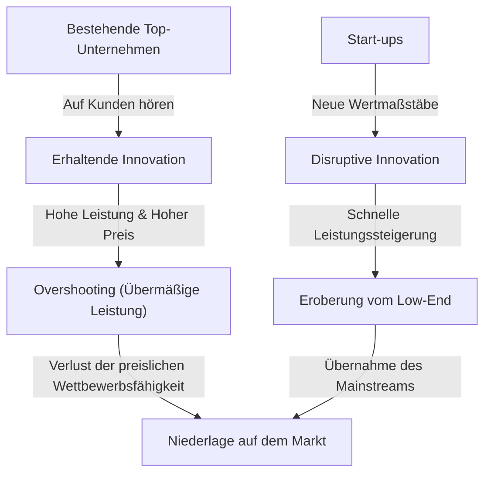
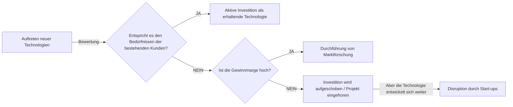

+++
title: "【Vollständige Erklärung】Was ist das Innovator's Dilemma? Der Mechanismus, wie Top-Unternehmen gegen disruptive Innovationen verlieren und Strategien zur Überwindung"
description: "Eine ausführliche Erklärung des von Clayton Christensen vorgeschlagenen \"Innovator's Dilemma\", in der der Mechanismus disruptiver Innovationen, die Fallen, in die Top-Unternehmen tappen, sowie konkrete Fallstudien und Strategien zur Überwindung detailliert beleuchtet werden."
slug: "business-innovators-dilemma"
categories: ["business"]
tags: ["innovators-dilemma", "innovation", "management"]
image: "eyecatch.jpg"
+++

## Einleitung: Warum scheitern Unternehmen, die "perfektes Management" betreiben?

In der Geschäftswelt haben nur wenige Konzepte Managern und Unternehmern so tiefe Einblicke und einen solchen Schock versetzt wie "The Innovator's Dilemma". Diese Theorie, die 1997 vom verstorbenen Professor der Harvard Business School, Clayton Christensen, in seinem gleichnamigen Buch vorgestellt wurde, ist weit mehr als nur ein Abschnitt in einem Wirtschaftsbuch und hat sich als eines der wichtigsten Paradigmen der modernen Unternehmensstrategie etabliert.

Die Erfolgsgesetze im Geschäftsleben, an die wir normalerweise denken, lauten: "auf die Stimme der Kunden hören", "Produkte kontinuierlich verbessern" und "in die profitabelsten Märkte investieren". Dies sind die Grundlagen des "richtigen Managements", die in jedem Lehrbuch der Betriebswirtschaftslehre stehen. Christensens Forschung offenbarte jedoch eine erstaunliche Tatsache. Es ist das Paradoxon: **"Gerade weil sie dieses 'richtige Management' perfekt ausführen, werden große Unternehmen von Start-ups besiegt."**

In diesem Artikel werden der zugrunde liegende Mechanismus dieses "Innovator's Dilemma", der Unterschied zwischen erhaltenden und disruptiven Innovationen, spezifische historische Fallstudien und Strategien, wie moderne Unternehmen diese Falle vermeiden und selbst zu Disruptoren werden können, ausführlich und tiefgehend erklärt.

---

## 1. Zwei Pfade der Innovation

Die wichtigste Voraussetzung für das Verständnis des Innovator's Dilemma ist die Klassifizierung von Innovationen. Christensen unterteilte die technologische Evolution grob in zwei Kategorien: "Erhaltende Innovation" (Sustaining Innovation) und "Disruptive Innovation".

### Erhaltende Innovation (Sustaining Innovation)

Eine erhaltende Innovation ist eine Innovation, die die Leistung eines Produkts oder einer Dienstleistung entlang der Leistungsindikatoren verbessert, die von den bestehenden Hauptkunden geschätzt werden. Dies kann "inkrementell" (allmählich besser werdend) oder "bahnbrechend" (ein plötzlicher Leistungssprung) sein, aber der Vektor zeigt immer in Richtung "Verbesserung bestehender Bewertungskriterien im bestehenden Markt".

Top-Unternehmen sind hervorragend in dieser erhaltenden Innovation. Sie führen gründliche Kundenbefragungen durch, fügen die von den Kunden gewünschten Funktionen hinzu und haben den Prozess der Bereitstellung hochwertigerer Produkte zu höheren Preisen (hohen Gewinnmargen) als organisatorische DNA integriert.

### Disruptive Innovation

Andererseits ist eine disruptive Innovation eine Innovation, die aus Sicht der bestehenden Hauptkunden "eine geringe Leistung aufweist und wie ein Spielzeug aussieht", aber völlig neue Wertmaßstäbe (wie billig, klein, einfach, benutzerfreundlich usw.) bietet.

Anfangs werden sie vom bestehenden Mainstream-Markt ignoriert und in neuen Nischen- oder Low-End-Märkten (Niedrigpreissegment) nur langsam akzeptiert. Da die technologische Entwicklung jedoch schneller voranschreitet als die Bedürfnisse der Kunden, verbessert sich die Leistung der disruptiven Technologie schließlich und erfüllt das Mindestleistungsniveau, das die Kunden des bestehenden Marktes verlangen (Mainstream-Bedürfnisse, nicht High-End-Bedürfnisse). In diesem Moment findet ein dramatischer Marktwechsel statt.

---

## 2. Warum übersehen Top-Unternehmen disruptive Technologien? (Die Struktur des Dilemmas)

Hier stellt sich eine Frage: Warum werden erstklassige Unternehmen mit enormen F&E-Budgets und talentierten Mitarbeitern von der "minderwertigen" Technologie von Start-ups besiegt?
Es liegt nicht daran, dass sie technisch inkompetent waren. Vielmehr waren es oft die bestehenden Top-Unternehmen, die die frühen Prototypen der disruptiven Technologien entwickelt haben.

Der Grund für das Scheitern von Top-Unternehmen ist **"das Ergebnis eines rationalen Entscheidungsprozesses"**. Die folgenden Faktoren, die dies erklären, bilden ein starkes Dilemma.

### 1. Mechanismus der Ressourcenallokation
Unternehmensressourcen (Kapital, Personal, Zeit) werden vorrangig den Projekten mit den höchsten Gewinnmargen und dem größten Marktvolumen zugewiesen. "Erhaltende Innovationsprojekte" mit starken Anforderungen bestehender Kunden lassen sich in internen Genehmigungsverfahren leicht durchsetzen, da hohe Umsätze und Gewinne vorhersehbar sind. Andererseits haben disruptive Technologien in der Anfangsphase ein geringes Marktvolumen und niedrige Gewinnmargen, weshalb sie unter dem Gesichtspunkt des Return on Investment (ROI) "rational" abgelehnt werden.

### 2. Der Fluch der "Stimme des Kunden"
Top-Unternehmen hören auf die Stimme ihrer besten Kunden (derjenigen, die am meisten bezahlen). Zeigt man jedoch den besten Kunden eine frühe Version einer disruptiven Technologie, sagen sie nur: "Wir brauchen etwas mit so geringer Leistung nicht", oder "Verbessern Sie lieber die Spezifikationen des aktuellen Produkts." Weil Unternehmen ihren Kunden treu sind, wenden sie den Blick von disruptiven Technologien ab.

### 3. Fesseln des Value Networks (Wertnetzwerk)
Unternehmen existieren in einem "Wertnetzwerk", das nicht nur das eigene Unternehmen, sondern auch Lieferanten, Händler, Kunden usw. umfasst. Da das gesamte Netzwerk eine Kultur und Struktur aufweist, die "funktionalere und teurere Dinge" bevorzugt, stößt der Vertrieb billiger Produkte mit geringen Spezifikationen, die von dieser Norm abweichen, auf Widerstand im gesamten Netzwerk.

---

## 3. Zwei Muster der disruptiven Innovation

Es gibt hauptsächlich zwei Muster disruptiver Innovationen, abhängig vom Ansatz zur Markterschließung.

### Low-End-Disruption (Low-end Disruption)
Ein Ansatz, der auf "übersättigte Kunden" (overserved customers) in bestehenden Märkten abzielt, die denken: "Ich brauche nicht so viel Leistung, würde es aber nutzen, wenn es billig wäre."
Bestehende Unternehmen überlassen Start-ups gerne den margenschwachen Low-End-Markt. Das liegt daran, dass sie einen Wechsel zu rentableren High-End-Märkten anstreben (Upmarket-Migration). Die Start-ups nutzen das Low-End jedoch als Sprungbrett, um ihre technologischen Fähigkeiten allmählich zu verbessern und schließlich in die mittleren und oberen Segmente einzudringen.
**(Beispiel: Disruption der Hochofenhersteller durch Minimills (Elektrolichtbogenöfen) in der Stahlindustrie, Toyotas früher Eintritt in den US-Markt)**

### New-Market-Disruption (New-market Disruption)
Ein Ansatz zur Schaffung eines völlig neuen Marktes, der sich an "Nicht-Konsumenten" richtet, die bisher keine Produkte konsumieren konnten, weil sie weder Geld noch Fähigkeiten oder Zeit hatten.
Indem Produkte "einfacher, bequemer und erschwinglicher" als bestehende angeboten werden, wird eine Nachfrage geweckt, die bisher nicht existierte. Aus der Sicht etablierter Unternehmen sieht es nicht so aus, als ob ihnen Marktanteile gestohlen würden, weshalb sie erst spät misstrauisch werden.
**(Beispiel: Personal Computer gegen Großrechner, frühe Mobiltelefone gegen Festnetztelefone, Sonys Walkman gegen Schallplatten)**

---

## 4. Die durch die Geschichte bewiesene Spur der "Disruption": Fallstudien

### Fallstudie 1: Die Festplatten-Laufwerk (HDD)-Industrie
Die Industrie, die Christensen am detailliertesten untersucht hat, war die Festplattenindustrie. Während des Miniaturisierungsprozesses von 14 Zoll auf 8 Zoll, 5,25 Zoll und 3,5 Zoll wurden die bestehenden Top-Unternehmen fast jedes Mal von Start-ups um die Vorherrschaft bei der nächsten Generation gebracht.
Mainframe-Kunden forderten eine Kapazitätserhöhung bei 14-Zoll-Laufwerken (erhaltende Innovation) und ignorierten frühe 8-Zoll-Laufwerke (geringe Kapazität, für Minicomputer gedacht). Etablierte Unternehmen hörten auf ihre Kunden und verzögerten Investitionen in 8-Zoll-Laufwerke, was dazu führte, dass sie von 8-Zoll-Start-ups, die mit dem Wachstum des Minicomputermarktes aufstiegen, mitsamt dem späteren Markt verschluckt wurden.

### Fallstudie 2: Disruption von Silberhalogenid-Filmen durch Digitalkameras
Kodak war eines der ersten Unternehmen der Welt, das eine Digitalkamera entwickelte. Sie zögerten jedoch, den vollständigen Übergang zur Digitalisierung zu vollziehen, aus Angst, ihr Geschäftsmodell (Value Network) von "Film und Entwicklung", das enorme Gewinne generierte, zu zerstören. Frühe Digitalkameras hatten eine schlechte Bildqualität und professionelle Fotografen bewerteten sie als "Spielzeug". Für normale Benutzer war der neue Wert (disruptive Innovation), "keine Entwicklungskosten zu haben und Bilder sofort sehen zu können", jedoch überwältigend. Als die Bildqualität ein bestimmtes Niveau erreichte, kippte der Markt augenblicklich.

### Fallstudie 3: SaaS und Cloud-Computing
Im Gegensatz zu Unternehmen wie Oracle und SAP, die riesige On-Premise-Software für Unternehmen anboten, traten SaaS-Unternehmen wie Salesforce anfangs als "einfache Tools für kleine und mittlere Unternehmen (Low-End)" in Erscheinung. Große Unternehmen mieden SaaS aus Sorge um "mangelnde Sicherheit" und "fehlende Funktionen", aber die SaaS-Anbieter verbesserten Funktionalität und Sicherheit rasant und bilden heute den Kern des Marktes für Großunternehmen (High-End).

---

## 5. "Managementstrategien" zur Überwindung des Innovator's Dilemma

Um dieser starken "Falle der Rationalität" zu entkommen und es bestehenden Unternehmen zu ermöglichen, selbst disruptive Innovationen hervorzubringen (oder zu überleben), ist ein Management erforderlich, das bisherige Konventionen auf den Kopf stellt.

### 1. Gründung unabhängiger Organisationen / Spin-offs
Versuchen Sie nicht, disruptive Projekte innerhalb der Prozesse und Werte einer bestehenden, riesigen Organisation zu fördern. Für eine Abteilung mit 100 Milliarden Yen Umsatz ist ein neues Geschäft mit 1 Milliarde Yen nur eine "Fehlertoleranz" und wird in Meetings, in denen um Ressourcen gekämpft wird, unweigerlich verlieren.
Disruptive Technologien benötigen **"eine völlig unabhängige, separate Organisation, die sich auch in kleinen Märkten ausreichend begeistern kann und nach eigenen Rentabilitätsstandards arbeitet"**.

### 2. Heuristischer Ansatz unter der Prämisse des Scheiterns (Discovery-driven Planning)
Bei der erhaltenden Innovation sind detaillierte Geschäftspläne auf der Grundlage historischer Daten möglich. Da der Markt für disruptive Innovationen jedoch "noch nicht existiert", werden Vorhersagen im Vorfeld zu 100 % falsch sein.
Anstatt von Anfang an eine perfekte Strategie umzusetzen, ist ein Lean-Startup-Ansatz unerlässlich: "Hypothesen aufstellen, mit einem kleinen Budget testen, vom Markt lernen und die Strategie anpassen (Pivot)".

### 3. Kundenverständnis durch die "Jobs to be Done"-Theorie
Dies bedeutet, den Markt nicht anhand von "Kundenattributen (Alter, Geschlecht usw.)" oder "Produktfunktionen" zu betrachten, sondern aus der Perspektive: "Für welche Aufgabe (Job) hat der Kunde dieses Produkt beauftragt (hired)?"
Dadurch kann die Hinzufügung übermäßiger Funktionen zu bestehenden Produkten (Overshooting) verhindert und eine "Gelegenheit zur Disruption" entdeckt werden, um die Aufgabe des Kunden auf eine völlig andere Weise kostengünstig und einfach zu lösen.

### 4. Bewertung von Ressourcen, Prozessen und Werten (RPV-Framework)
Was ein Unternehmen kann und was nicht, wird durch drei Faktoren bestimmt: "Ressourcen (Resources)", "Prozesse (Processes)" und "Werte (Values)". Top-Unternehmen verfügen über reichlich "Ressourcen", aber ihre auf das bestehende Geschäft ausgerichteten "Prozesse" und ihre "Werte", die hohe Gewinnmargen anstreben, behindern disruptive Innovationen. Führungskräfte müssen die organisatorische Struktur selbst neu gestalten, um sicherzustellen, dass bestehende Prozesse und Werte nicht auf neue Geschäfte angewendet werden.

---

## 6. Das Innovator's Dilemma in der heutigen Zeit (KI & Web3-Ära)

Es wird gesagt, dass große Tech-Unternehmen wie Google und Apple heute aufgrund des Aufstiegs generativer KI (wie ChatGPT) mit dem Innovator's Dilemma konfrontiert sind.
Zum Beispiel verfügt Google über eine Suchmaschine mit überwältigender Genauigkeit (der Höhepunkt der erhaltenden Innovation) und ein Werbemodell. Nun ist generative KI aufgetaucht, die zwar gelegentlich Fakten verfälscht (Halluzinationen), aber Antworten direkt im Dialog liefert. Da generative KI das bestehende Ertragsmodell von "Suchen, auf Links klicken und Werbung sehen" zerstören könnte, steht der Suchgigant bei einem vollständigen Übergang zu KI vor einem Dilemma.

Auf diese Weise ist in der heutigen Zeit der beschleunigten technologischen Entwicklung der Zyklus der "Disruption" kürzer denn je. Da es im Software- und Digitalbereich weniger physische Einschränkungen gibt, kann die Invasion vom Low-End ins High-End nicht in Jahrzehnten, sondern in Jahren oder Monaten erfolgen.

---

## Fazit: Akzeptiere das Dilemma und zerstöre dich selbst

Die größte Lektion aus Clayton Christensens "Innovator's Dilemma" lautet: **"Gerade die Stärken, die den aktuellen Erfolg unterstützen, werden in der Zukunft zu einer fatalen Schwäche."**

Was von Managern und Führungskräften verlangt wird, ist eine "beidhändige Organisation (Ambidextrous Organization)", die die Effizienz und das nachhaltige Wachstum des bestehenden Geschäfts verfolgt, während sie gleichzeitig den Mut aufbringt, die eigene Cashcow gelegentlich mit den eigenen Händen zu zerstören.
"Warten Sie darauf, dass eine Technologie auftaucht, die Ihr Unternehmen zerstört, oder erschaffen Sie diese selbst?"
Die ständige Auseinandersetzung mit dieser Frage ist der einzige Weg, um im heutigen turbulenten Geschäftsumfeld zu überleben.

(Ende)
