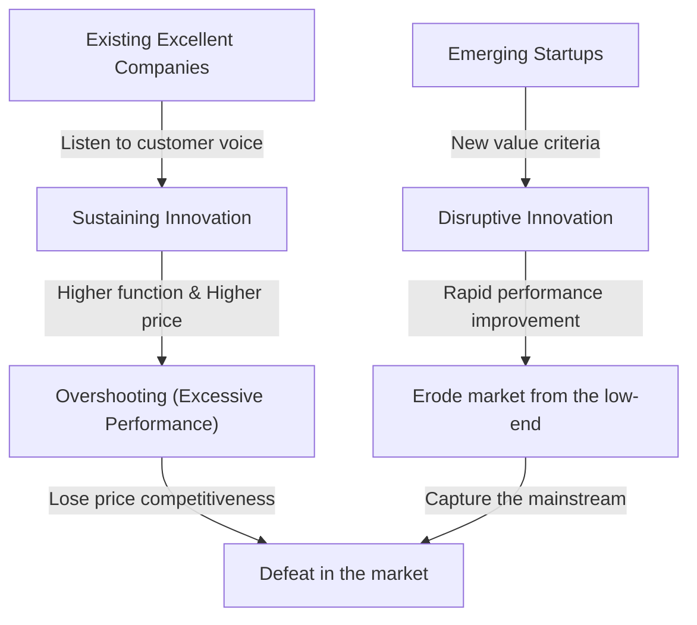
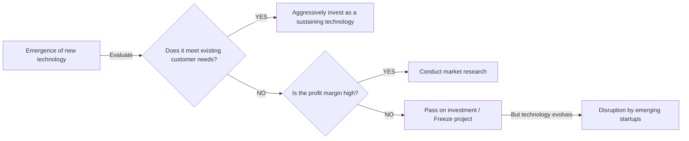

## Introduction: Why do companies practicing "perfect management" fail?

In the business world, few concepts have provided as deep insight and shock to executives and entrepreneurs as "The Innovator's Dilemma." Proposed by the late Clayton Christensen, a professor at Harvard Business School, in his 1997 book of the same name, this theory has moved beyond a mere passage in a business book to become established as one of the most important paradigms in modern corporate strategy.

The success rules of business we usually think of are "listen to the voice of the customer," "continuously improve products," and "invest in the most profitable markets." These are the basics of "correct management" that are always written in business administration textbooks. However, Christensen's research revealed an astonishing fact. It is the paradox that **"precisely because they flawlessly execute this 'correct management,' great companies are defeated by emerging startups."**

In this article, we will thoroughly explore and explain the mechanisms underlying this "Innovator's Dilemma," the difference between sustaining and disruptive innovation, concrete historical examples, and the strategies for modern companies to avoid this trap and become disruptors themselves.

---

## 1. Two Trajectories of Innovation

To understand the Innovator's Dilemma, the most important premise is the classification of innovation. Christensen broadly categorized the evolution of technology into two types: "Sustaining Innovation" and "Disruptive Innovation."

### Sustaining Innovation

Sustaining innovation is innovation that improves the performance of products and services along the performance metrics valued by existing mainstream customers. This can be "incremental" (getting slightly better over time) or "breakthrough" (performance jumping all at once), but the vector is always directed towards "improving existing evaluation criteria in existing markets."

Excellent companies are extremely good at this sustaining innovation. They thoroughly conduct customer surveys, add features that customers desire, and embed the process of providing higher quality products at higher prices (high profit margins) into the organization's DNA.

### Disruptive Innovation

On the other hand, disruptive innovation provides an entirely new set of value criteria (such as being cheap, small, simple, or easy to use) for something that appears to existing mainstream customers as "low performance and looking like a toy."

Initially, it is ignored by the existing mainstream market and is only accepted modestly in niche new markets or low-end (low price range) markets. However, because the speed of technological evolution is faster than the speed at which customer needs evolve, the performance of the disruptive technology eventually improves and meets the minimum performance level required by customers in the existing market (not the high-end needs, but the mainstream needs). At that moment, a dramatic market replacement occurs.

---

## 2. Why do excellent companies miss disruptive technologies? (The Structure of the Dilemma)

A question arises here. Why do excellent companies with massive R&D budgets and talented personnel lose to the "cheap" technologies of emerging startups?
It's not that they were technically incompetent. In fact, it is often the existing excellent companies that develop the initial prototypes of disruptive technologies.

The reason excellent companies fail is **"the result of a rational decision-making process."** The following factors explain this, forming a robust dilemma.

### 1. Resource Allocation Mechanism
Corporate resources (capital, talent, time) are preferentially allocated to projects with the highest profit margins and largest market sizes. "Sustaining innovation" projects, which have strong demands from existing customers, easily pass internal approval because high sales and profits are easy to predict. On the other hand, disruptive technologies have small market sizes and low profit margins in the early stages, so they are "rationally" rejected from a return on investment (ROI) perspective.

### 2. The Curse of the "Voice of the Customer"
Excellent companies listen to the voices of their best customers (those who pay the most). However, even if they show an early version of a disruptive technology to their existing best customers, they are only told, "We don't need something with such low performance," or "Improve the specs of the current product more." Because companies are honest to their customers, they end up turning a blind eye to disruptive technologies.

### 3. Constraints of the Value Network
Companies exist within a "value network" that includes not only themselves but also suppliers, distributors, and customers. Because this entire network has a culture and structure that favors "higher function and higher unit price," distributing cheap, low-spec products that deviate from this meets with resistance from the entire network.

---

## 3. Two Patterns of Disruptive Innovation

Disruptive innovation mainly has two patterns depending on how the market is attacked.

### Low-end Disruption
This is an approach targeting "overserved customers" in the existing market who think, "I don't need such high performance, but I'd use it if it were cheap."
Existing companies gladly hand over the low-margin low-end market to emerging startups. This is because they are proceeding with an upmarket migration to higher-margin high-end markets. However, the emerging startups use the low-end as a foothold to gradually improve their technological capabilities, eventually eroding the middle and upper tiers.
**(Example: Disruption of integrated steelmakers by minimills (electric arc furnaces) in the steel industry, Toyota's initial entry into the US market)**

### New-market Disruption
This is an approach that creates an entirely new market by targeting "non-consumers" who previously could not consume a product due to lack of money, skill, or time.
By providing something "simpler, more convenient, and more affordable" than existing products, it stimulates a demand that did not exist before. From the perspective of existing companies, it does not look like their market pie is being stolen, which delays their vigilance.
**(Example: Personal computers vs. mainframe computers, early mobile phones vs. landlines, Sony's Walkman vs. record players)**

---

## 4. Traces of "Disruption" Proven by History: Case Studies

### Case 1: Hard Disk Drive (HDD) Industry
The industry Christensen investigated most thoroughly was the HDD industry. During the miniaturization process from 14 inches to 8 inches, 5.25 inches, and 3.5 inches, the existing top companies almost always lost the hegemony of the next generation size to emerging startups.
Mainframe customers demanded capacity improvements (sustaining innovation) in 14-inch drives and ignored the early 8-inch HDDs (which had low capacity and were aimed at minicomputers). Existing companies listened to the voice of the customer and delayed their investment in 8-inch drives, resulting in being swallowed along with the entire market by the emerging 8-inch startups that rose alongside the growth of the minicomputer market.

### Case 2: Disruption of Silver Halide Film by Digital Cameras
Kodak was one of the first companies in the world to develop a digital camera. However, fearing the disruption of their "film and development" business model (value network) that generated massive profits for the company, they hesitated to fully transition to digital. Early digital cameras had poor image quality, and existing professional photographers dismissed them as "toys," but for general users, the new value (disruptive innovation) of "being able to view immediately without development costs" was overwhelming. When the image quality reached a certain level, the market flipped in an instant.

### Case 3: SaaS and Cloud Computing
Against companies like Oracle and SAP, which provided massive on-premises (in-house operated) software for enterprises, SaaS companies like Salesforce initially appeared as "simple tools for small and medium-sized enterprises (low-end)." Large enterprises shunned SaaS, citing "security concerns" and "lack of features," but the SaaS side rapidly improved functionality and security, and now plays a core role in the large enterprise market (high-end).

---

## 5. "Management Strategies" to Overcome the Innovator's Dilemma

To escape this robust "trap of rationality" and for existing companies to cause disruptive innovation themselves (or survive it), management that overturns conventional wisdom is required.

### 1. Establish an Independent Organization / Spin-out
Do not try to nurture disruptive projects within the processes and value criteria of a massive existing organization. For a department with 100 billion yen in sales, a new business of 100 million yen is merely an "error" and will definitely lose in meetings competing for resources.
Disruptive technologies must be given a **"completely independent, separate organization that can get excited enough even in a small market and can operate on its own standards of profit margin."**

### 2. Discovery-driven Planning Assuming "Failure"
In sustaining innovation, precise business planning based on past data is possible. However, because the market for disruptive innovation "does not yet exist," prior predictions will be 100% wrong.
Rather than executing a perfect strategy from the start, a lean startup-like approach of "forming hypotheses, testing with small amounts of funding, learning from the market, and correcting the strategy (pivoting)" is essential.

### 3. Understanding Customers through the "Jobs to be Done" Theory
Instead of looking at the market from the perspective of customer "attributes (age, gender, etc.)" or "product features," reconsider it from the perspective of "What job is the customer trying to get done by hiring (buying) that product?"
By doing this, you can prevent excessive feature additions (overshooting) of existing products and discover "opportunities for disruption" that get the customer's job done cheaply and simply with an entirely different approach.

### 4. Evaluation of Resources, Processes, and Values (RPV Framework)
What a company can and cannot do is determined by three things: "Resources," "Processes," and "Values." Excellent companies have abundant "Resources," but the "Processes" optimized for existing businesses and the "Values" that demand high profit margins hinder disruptive innovation. Leaders must redesign the very structure of the organization so that existing processes and values are not applied to new businesses.

---

## 6. The Innovator's Dilemma in the Modern Era (AI / Web3 Era)

Currently, with the rise of Generative AI (such as ChatGPT), massive tech companies like Google and Apple are said to be facing the Innovator's Dilemma.
For example, Google has an overwhelmingly accurate search engine (the extreme of sustaining innovation) and an advertising model. Into this space comes Generative AI, which provides direct answers in a conversational format, despite sometimes suffering from hallucinations (factual errors). Because Generative AI threatens to disrupt the existing revenue model of "searching, clicking links, and viewing ads," the search giant faces a dilemma in fully transitioning to AI.

In this way, in the modern era where technological evolution accelerates, the cycle of "disruption" is shorter than ever. In the software and digital realms, where physical constraints are minimal, the erosion from the low-end to the high-end can happen in years or even months, rather than decades.

---

## Conclusion: Accept the Dilemma and Disrupt Yourself

The greatest lesson taught by Clayton Christensen's "Innovator's Dilemma" is that **"the very strengths supporting your current success will become your fatal weaknesses in the future."**

What is required of executives and leaders is to have the courage to practice "Ambidextrous Organization"—pursuing efficiency and sustained growth of existing businesses—while sometimes disrupting their own cash cow businesses with their own hands.
"Will you wait for a technology to appear that disrupts your company, or will you create it yourself?"
Continuing to face this question might be the only way to survive the turbulent business environment of the modern era.

(End)
