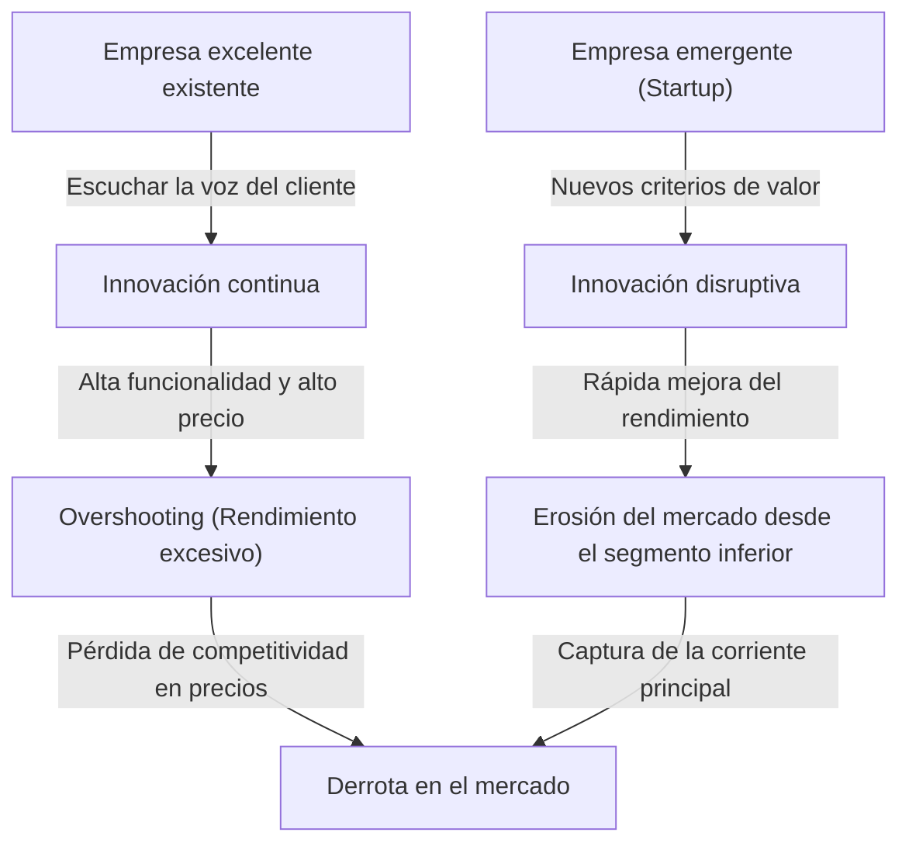
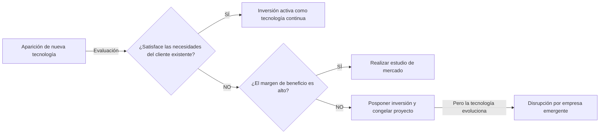

+++
title: "【Guía Completa】¿Qué es el Dilema del Innovador? El mecanismo por el cual las empresas de excelencia fracasan ante la innovación disruptiva y estrategias para superarlo"
description: "Analizamos en profundidad el \"Dilema del Innovador\" propuesto por Clayton Christensen: desde los mecanismos de la innovación disruptiva y las trampas en las que caen las empresas destacadas, hasta casos reales y estrategias para superarlo."
slug: "business-innovators-dilemma"
categories: ["business"]
tags: ["innovators-dilemma", "innovation", "management"]
image: "eyecatch.jpg"
+++

## Introducción: ¿Por qué fracasan las empresas que llevan a cabo una "gestión perfecta"?

En el mundo de los negocios, pocos conceptos han dado a líderes empresariales y emprendedores reflexiones e impactos tan profundos como "El Dilema del Innovador" (The Innovator's Dilemma). Esta teoría, propuesta en 1997 en el libro del mismo nombre por el difunto Clayton Christensen, profesor de la Escuela de Negocios de Harvard, va más allá de un simple pasaje en un libro de negocios y se ha consolidado como uno de los paradigmas más importantes en la estrategia corporativa moderna.

Las reglas del éxito empresarial que normalmente consideramos son: "escuchar la voz del cliente", "mejorar continuamente los productos" e "invertir en los mercados con los márgenes de beneficio más altos". Estos son los conceptos básicos de la "gestión correcta" que se encuentran en cualquier libro de texto de administración. Sin embargo, la investigación de Christensen reveló un hecho sorprendente. Esa es la paradoja de que **"precisamente porque ejecutan perfectamente esa 'gestión correcta', las grandes empresas son derrotadas por las nuevas empresas (startups)"**.

En este artículo, explicaremos en profundidad los mecanismos subyacentes a este "Dilema del Innovador", las diferencias entre la innovación continua (sostenible) y la innovación disruptiva, ejemplos históricos concretos, y las estrategias sobre cómo las empresas modernas pueden evitar esta trampa y convertirse ellas mismas en disruptoras.

---

## 1. Dos trayectorias de la innovación

Para entender el Dilema del Innovador, la premisa más importante es la clasificación de la innovación. Christensen dividió la evolución de la tecnología en dos grandes categorías: "Innovación Sostenible (Sustaining Innovation)" e "Innovación Disruptiva (Disruptive Innovation)".

### Innovación Sostenible (Sustaining Innovation)

La innovación sostenible es aquella que mejora el rendimiento de los productos o servicios a lo largo de los indicadores de rendimiento valorados por los clientes principales existentes. Puede ser "incremental" (mejoras progresivas) o "radical" (saltos masivos en el rendimiento), pero el vector siempre apunta hacia "la mejora de los criterios de evaluación existentes en el mercado actual".

Las empresas destacadas son extremadamente buenas en esta innovación sostenible. Investigan exhaustivamente a los clientes, agregan las funciones que desean, y tienen incorporado en el ADN de su organización el proceso de proporcionar productos de mayor calidad a precios más altos (con mayores márgenes de beneficio).

### Innovación Disruptiva (Disruptive Innovation)

Por otro lado, la innovación disruptiva proporciona estándares de valor completamente nuevos (como barato, pequeño, simple, fácil de usar), aunque desde la perspectiva de los clientes principales existentes, "el rendimiento es bajo y parece un juguete".

Al principio, es ignorada por el mercado principal y solo es aceptada gradualmente en nuevos nichos de mercado o en el mercado de gama baja (low-end). Sin embargo, como la velocidad del avance tecnológico supera la velocidad a la que evolucionan las necesidades de los clientes, el rendimiento de la tecnología disruptiva eventualmente mejora hasta alcanzar los niveles mínimos de rendimiento requeridos por los clientes del mercado existente (no las necesidades de gama alta, sino las necesidades convencionales). En ese instante, se produce un dramático reemplazo en el mercado.

---

## 2. ¿Por qué las empresas excelentes pasan por alto las tecnologías disruptivas? (La estructura del dilema)

Aquí surge una pregunta. ¿Por qué las empresas excelentes, que cuentan con enormes presupuestos de investigación y desarrollo, así como talento humano sobresaliente, son derrotadas por las tecnologías "rudimentarias" de las empresas emergentes?
No es que fueran tecnológicamente incompetentes. De hecho, en muchos casos son las mismas empresas excelentes existentes las que desarrollan los primeros prototipos de la tecnología disruptiva.

La razón por la que fracasan las empresas excelentes es **"el resultado de un proceso de toma de decisiones racional"**. Los siguientes factores explican cómo se forma este sólido dilema.

### 1. El mecanismo de asignación de recursos
Los recursos de una empresa (capital, talento, tiempo) se asignan prioritariamente a los proyectos con los márgenes de beneficio más altos y los mercados más grandes. Los proyectos de "innovación sostenible", fuertemente solicitados por los clientes existentes, predicen fácilmente altas ventas y ganancias, por lo que aprueban los procesos de autorización interna sin problema. En cambio, las tecnologías disruptivas en sus etapas iniciales tienen un mercado pequeño y bajos márgenes de beneficio, por lo que son rechazadas "racionalmente" desde la perspectiva del retorno de la inversión (ROI).

### 2. La maldición de la "voz del cliente"
Las empresas de excelencia escuchan a sus mejores clientes (los que pagan más). Sin embargo, si muestran una versión inicial de una tecnología disruptiva a esos buenos clientes, estos solo dirán: "No queremos algo con tan bajo rendimiento" o "Mejoren las especificaciones del producto actual". Dado que las empresas son leales a sus clientes, terminan apartando la vista de las tecnologías disruptivas.

### 3. La restricción de la red de valor (Value Network)
Una empresa existe dentro de una "red de valor" que incluye no solo a sí misma, sino también a proveedores, distribuidores, clientes, etc. Toda esta red tiene una cultura y estructura que valora "lo que tiene más funciones y mayor precio unitario", por lo que introducir un producto barato y de bajas especificaciones que se sale de ese marco, se enfrenta a la resistencia de toda la red.

---

## 3. Dos patrones de innovación disruptiva

La innovación disruptiva tiene principalmente dos patrones dependiendo de cómo se ataque el mercado.

### Disrupción de gama baja (Low-end Disruption)
Es el enfoque dirigido a los clientes del mercado existente que están "sobre-satisfechos" (Overserved), aquellos que piensan: "No necesito tanto rendimiento, pero lo usaría si fuera barato".
Las empresas existentes ceden con gusto los mercados de gama baja, que tienen bajos márgenes de beneficio, a los nuevos participantes. ¿Por qué? Porque están llevando a cabo un cambio hacia mercados de gama alta, más rentables (Upmarket migration). Sin embargo, las nuevas empresas utilizan la gama baja como punto de apoyo, mejoran gradualmente sus capacidades tecnológicas y, con el tiempo, erosionan los segmentos medios y altos.
**(Ejemplo: La disrupción de las siderúrgicas integradas por las minimills (hornos de arco eléctrico) en la industria del acero, la entrada inicial de Toyota en el mercado estadounidense.)**

### Disrupción de nuevos mercados (New-market Disruption)
Es el enfoque que crea un mercado completamente nuevo dirigido a los "no consumidores", personas que antes no podían consumir el producto por falta de dinero, habilidades o tiempo.
Al ofrecer algo "más simple, más conveniente y más asequible" que los productos existentes, se despierta una demanda que no existía antes. Desde la perspectiva de las empresas establecidas, no parece que les estén robando su porción del mercado, por lo que se retrasan en tomar precauciones.
**(Ejemplo: Las computadoras personales frente a las grandes computadoras (mainframes), los primeros teléfonos móviles frente a la telefonía fija, el Walkman de Sony frente a los discos de vinilo.)**

---

## 4. La trayectoria de la "disrupción" demostrada por la historia: Casos de estudio

### Caso 1: La industria de las unidades de disco duro (HDD)
La industria que Christensen investigó con mayor detalle fue la de los discos duros. En el proceso de miniaturización, pasando de 14 pulgadas a 8, 5.25 y 3.5 pulgadas, las empresas líderes de cada época casi siempre perdieron la hegemonía de la siguiente generación ante empresas emergentes.
Los clientes de los mainframes buscaban el aumento de capacidad en las 14 pulgadas (innovación sostenible) e ignoraron los primeros discos duros de 8 pulgadas (de poca capacidad, destinados a minicomputadoras). Las empresas establecidas, escuchando a sus clientes, retrasaron su inversión en las 8 pulgadas. Como resultado, fueron devoradas junto con su mercado por las nuevas empresas de 8 pulgadas, que surgieron con el crecimiento del mercado de minicomputadoras.

### Caso 2: La disrupción de la película fotográfica por la cámara digital
Kodak fue una de las primeras empresas del mundo en desarrollar una cámara digital. Sin embargo, por temor a destruir el modelo de negocio (red de valor) de "película y revelado" que les generaba enormes beneficios, dudaron en hacer una transición completa a lo digital. Las primeras cámaras digitales tenían mala calidad de imagen y los fotógrafos profesionales las consideraban "juguetes", pero para el usuario general, el nuevo valor de "poder ver la foto inmediatamente sin pagar por el revelado" (innovación disruptiva) fue abrumador. Cuando la calidad de imagen alcanzó cierto nivel, el mercado dio un vuelco en un instante.

### Caso 3: SaaS y Cloud Computing
Frente a empresas como Oracle y SAP, que ofrecían enorme software on-premise (instalación local) para grandes corporaciones, las empresas de SaaS como Salesforce aparecieron inicialmente como "herramientas simples para pequeñas y medianas empresas (gama baja)". Las grandes empresas evitaban el SaaS argumentando "preocupaciones de seguridad" y "falta de funciones", pero los proveedores de SaaS mejoraron rápidamente sus funciones y seguridad, hasta el punto de que hoy en día forman el núcleo del mercado de las grandes empresas (gama alta).

---

## 5. "Estrategias de gestión" para superar el dilema del innovador

Para escapar de esta sólida "trampa de la racionalidad" y lograr que las empresas existentes generen (o sobrevivan a) innovaciones disruptivas por sí mismas, se requiere una gestión que desafíe el sentido común convencional.

### 1. Establecimiento de una organización independiente o spin-out
No se debe intentar cultivar un proyecto disruptivo dentro de los procesos y criterios de valor de una organización existente masiva. Para un departamento que factura 100 mil millones, un nuevo negocio de 100 millones es solo un "margen de error", y siempre perderá en las reuniones donde se compite por los recursos.
La tecnología disruptiva debe recibir **"una organización completamente independiente que pueda emocionarse con un mercado pequeño y operar bajo sus propios estándares de margen de beneficio"**.

### 2. Enfoque de descubrimiento asumiendo el "fracaso" (Discovery-driven Planning)
En la innovación sostenible, es posible hacer planes de negocios precisos basados en datos pasados. Sin embargo, debido a que los mercados para la innovación disruptiva "aún no existen", las predicciones previas serán erróneas en un 100%.
En lugar de ejecutar una estrategia perfecta desde el principio, es esencial un enfoque al estilo Lean Startup: "formular hipótesis, probar con pequeñas cantidades de capital, aprender del mercado y corregir el rumbo de la estrategia (pivotar)".

### 3. Comprensión del cliente mediante la "Teoría de los Trabajos (Jobs to be Done)"
Consiste en revisar el mercado no desde la perspectiva de los "atributos del cliente (edad, género, etc.)" o "las funciones del producto", sino desde la pregunta: "¿Qué tarea (trabajo) intenta realizar el cliente cuando contrata (usa) ese producto?".
Esto previene la adición excesiva de funciones a los productos existentes (overshooting) y permite descubrir "oportunidades de disrupción" mediante un enfoque completamente diferente, resolviendo el trabajo del cliente de forma más barata y sencilla.

### 4. Evaluación de Recursos, Procesos y Valores (Marco RPV)
Lo que una empresa puede y no puede hacer se determina por tres elementos: "Recursos (Resources)", "Procesos (Processes)" y "Valores (Values)". Las empresas excelentes tienen abundantes "recursos", pero sus "procesos" optimizados para los negocios existentes y sus "valores" que buscan altos márgenes de beneficio se convierten en obstáculos para la innovación disruptiva. Los líderes deben rediseñar la propia estructura de la organización para no aplicar los procesos y valores existentes a los nuevos negocios.

---

## 6. El dilema del innovador en la actualidad (Era de la IA y Web3)

Actualmente, con el auge de la inteligencia artificial generativa (como ChatGPT), se dice que gigantes tecnológicos como Google y Apple se enfrentan al dilema del innovador.
Por ejemplo, Google posee un motor de búsqueda con una precisión abrumadora (el pináculo de la innovación sostenible) y un modelo publicitario sólido. Sin embargo, ha surgido la IA generativa, que, aunque a veces sufre de errores (alucinaciones), ofrece respuestas directas en formato de diálogo. Dado que la IA generativa amenaza con destruir el modelo de ingresos existente de "buscar, hacer clic en enlaces y ver anuncios", el gigante de las búsquedas enfrenta un dilema respecto a la transición completa hacia la IA.

De esta manera, en la actualidad donde la evolución tecnológica se acelera, el ciclo de "disrupción" es más corto que nunca. En el ámbito del software y lo digital, al haber pocas restricciones físicas, la invasión desde la gama baja a la gama alta puede ocurrir no en décadas, sino en cuestión de años o meses.

---

## Conclusión: Acepta el dilema y destruye a ti mismo

La mayor lección que nos enseña el "Dilema del Innovador" de Clayton Christensen es que **"las mismas fortalezas que sustentan el éxito actual se convertirán en debilidades fatales en el futuro"**.

Lo que se exige a los directivos y líderes es practicar una "organización ambidiestra (Ambidextrous Organization)", que persiga la eficiencia y el crecimiento sostenible del negocio existente, mientras tienen el valor de destruir con sus propias manos sus "vacas lecheras" (negocios altamente rentables) cuando sea necesario.
"¿Esperar a que aparezca una tecnología que destruya su empresa o crearla ustedes mismos?"
Seguir enfrentando esta pregunta es, probablemente, la única forma de sobrevivir en el turbulento entorno empresarial actual.

(Fin)
