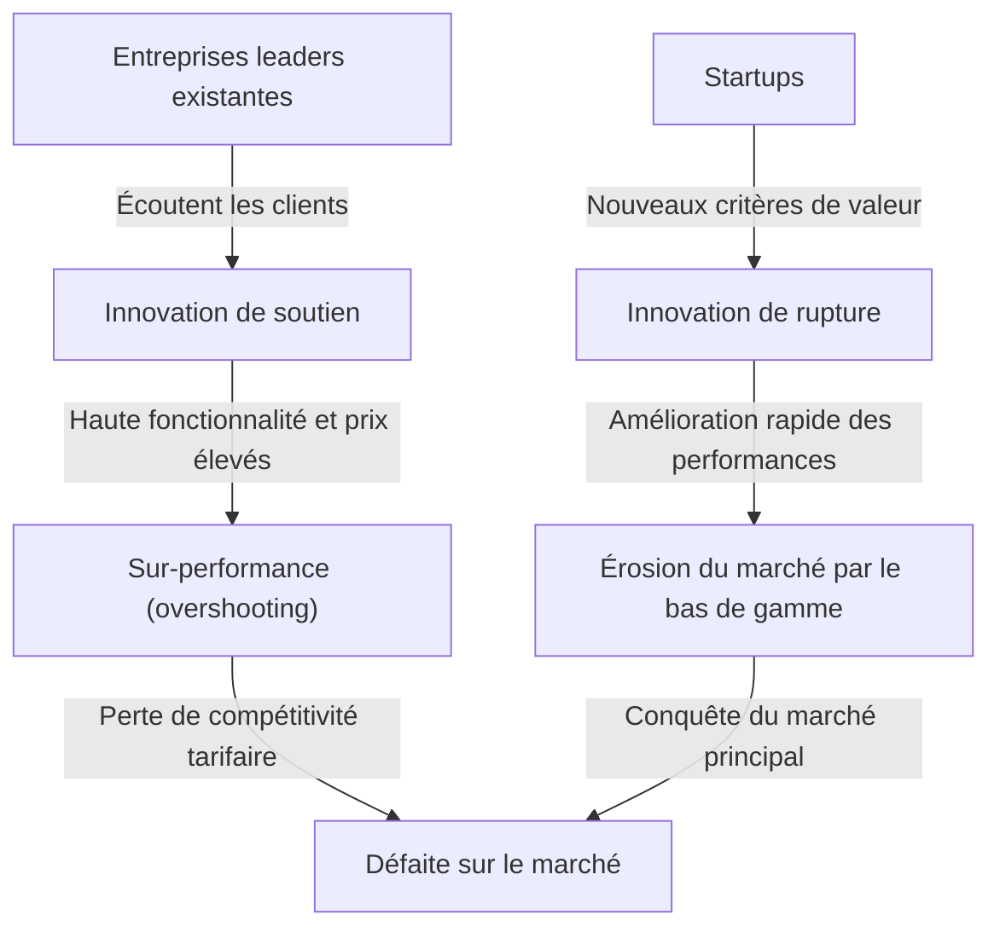
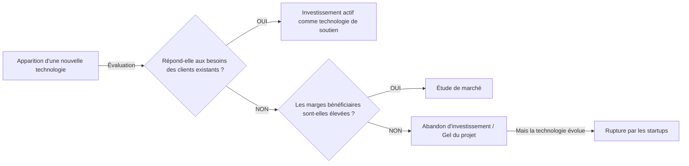

## Introduction : Pourquoi les entreprises ayant une « gestion parfaite » échouent-elles ?

Dans le monde des affaires, peu de concepts ont offert des perspectives et provoqué un choc aussi profond chez les dirigeants et entrepreneurs que « Le dilemme de l'innovateur » (The Innovator's Dilemma). Cette théorie, proposée par feu Clayton Christensen, professeur à la Harvard Business School, dans son livre éponyme publié en 1997, dépasse le simple cadre du livre de business pour s'imposer comme l'un des paradigmes les plus importants de la stratégie d'entreprise moderne.

Les règles du succès en affaires que nous considérons habituellement sont « écouter la voix des clients », « améliorer continuellement les produits » et « investir dans les marchés les plus rentables ». Ce sont les bases d'une « bonne gestion » inscrites dans tous les manuels de management. Cependant, les recherches de Christensen ont révélé un fait surprenant. Il s'agit du paradoxe suivant : **« C'est précisément parce qu'elles exécutent parfaitement cette 'bonne gestion' que les grandes entreprises sont vaincues par des startups. »**

Dans cet article, nous explorerons en profondeur le mécanisme sous-jacent à ce « dilemme de l'innovateur », la différence entre l'innovation de soutien et l'innovation de rupture, des études de cas historiques concrètes, ainsi que les stratégies permettant aux entreprises modernes d'éviter ce piège et de devenir elles-mêmes des disrupteurs.

---

## 1. Les deux trajectoires de l'innovation

Pour comprendre le dilemme de l'innovateur, la prémisse la plus importante est la classification des innovations. Christensen a divisé l'évolution technologique en deux grandes catégories : l'« innovation de soutien » (Sustaining Innovation) et l'« innovation de rupture » (Disruptive Innovation).

### Innovation de soutien (Sustaining Innovation)

L'innovation de soutien est une innovation qui améliore les performances d'un produit ou d'un service selon les indicateurs de performance valorisés par les principaux clients existants. Elle peut être « incrémentale » (s'améliorant peu à peu) ou « révolutionnaire » (faisant un bond soudain en termes de performances), mais le vecteur est toujours orienté vers « l'amélioration des critères d'évaluation existants sur les marchés existants ».

Les grandes entreprises excellent dans cette innovation de soutien. Elles mènent des enquêtes approfondies auprès des clients, ajoutent les fonctionnalités souhaitées et intègrent dans l'ADN de leur organisation le processus visant à fournir des produits de meilleure qualité à des prix plus élevés (avec des marges bénéficiaires élevées).

### Innovation de rupture (Disruptive Innovation)

D'un autre côté, l'innovation de rupture est une innovation qui, du point de vue des principaux clients existants, offre des « performances inférieures et ressemble à un jouet », mais propose de tout nouveaux critères de valeur (bon marché, compact, simple, facile à utiliser, etc.).

Au début, elle est ignorée par les marchés grand public existants et n'est modestement acceptée que dans de nouveaux marchés de niche ou des marchés bas de gamme. Cependant, comme la vitesse d'évolution de la technologie est plus rapide que celle des besoins des clients, les performances de la technologie de rupture s'améliorent avec le temps et finissent par atteindre le niveau de performance minimum exigé par les clients du marché existant (pas les besoins haut de gamme, mais ceux du grand public). À ce moment précis, un basculement spectaculaire du marché se produit.

---

## 2. Pourquoi les grandes entreprises manquent-elles la technologie de rupture ? (La structure du dilemme)

Ici surgit une question. Pourquoi de grandes entreprises dotées de budgets de R&D massifs et de talents brillants sont-elles vaincues par des technologies « bon marché » de startups ?
Elles n'étaient pas technologiquement incompétentes. Au contraire, ce sont souvent les entreprises leaders existantes qui développent les premiers prototypes de la technologie de rupture.

La raison de l'échec des grandes entreprises est le **« résultat d'un processus de prise de décision rationnel »**. Les facteurs suivants qui l'expliquent forment un dilemme solide.

### 1. Mécanisme d'allocation des ressources
Les ressources d'une entreprise (fonds, personnel, temps) sont allouées en priorité aux projets ayant les marges bénéficiaires les plus élevées et la plus grande taille de marché. Les projets d'« innovation de soutien », fortement demandés par les clients existants, passent facilement les processus d'approbation internes car leurs ventes et leurs profits élevés sont faciles à prévoir. D'autre part, la technologie de rupture, à ses débuts, présente une petite taille de marché et de faibles marges, et est donc « rationnellement » rejetée du point de vue du retour sur investissement (ROI).

### 2. Le sortilège de la « voix du client »
Les grandes entreprises écoutent la voix de leurs meilleurs clients (ceux qui paient le plus). Cependant, si elles montrent la version initiale d'une technologie de rupture à ces clients, on leur répondra simplement : « Nous ne voulons pas d'une chose aussi peu performante » ou « Améliorez plutôt les spécifications des produits actuels ». C'est précisément parce que les entreprises sont loyales envers leurs clients qu'elles finissent par détourner le regard des technologies de rupture.

### 3. L'entrave du réseau de valeur (Value Network)
Une entreprise existe au sein d'un « réseau de valeur » qui comprend non seulement elle-même, mais aussi ses fournisseurs, ses distributeurs et ses clients. Puisque ce réseau entier possède une culture et une structure valorisant des produits « plus performants et plus chers », la distribution de produits bon marché et aux spécifications plus faibles se heurte à la résistance de l'ensemble du réseau.

---

## 3. Les deux modèles d'innovation de rupture

Il existe principalement deux modèles d'innovation de rupture en fonction de l'approche du marché.

### Rupture par le bas de gamme (Low-end Disruption)
C'est une approche qui cible, sur les marchés existants, les « clients sur-servis » qui pensent : « Je n'ai pas besoin d'une telle performance, mais je l'utiliserais si c'était moins cher ».
Les entreprises existantes sont heureuses de céder le marché bas de gamme à faible marge aux startups. En effet, elles progressent vers une migration vers le marché haut de gamme (upmarket migration) aux marges plus élevées. Cependant, les startups utilisent le bas de gamme comme tremplin pour améliorer progressivement leurs capacités technologiques et finissent par empiéter sur les segments de milieu et de haut de gamme.
**(Exemple : La destruction des constructeurs de hauts fourneaux par les mini-usines (fours électriques) dans l'industrie sidérurgique, l'entrée initiale de Toyota sur le marché américain)**

### Rupture de nouveau marché (New-market Disruption)
Il s'agit d'une approche qui crée un tout nouveau marché en ciblant les « non-consommateurs » qui, jusqu'à présent, ne pouvaient pas consommer le produit par manque d'argent, de compétences ou de temps.
En proposant des produits « plus simples, plus pratiques et plus abordables » que les produits existants, elle stimule une demande qui n'existait pas auparavant. Du point de vue des entreprises existantes, elles ne semblent pas perdre leur part de marché, de sorte que leur vigilance est retardée.
**(Exemple : Les ordinateurs personnels face aux ordinateurs centraux, les premiers téléphones portables face aux téléphones fixes, le Walkman de Sony face aux disques vinyles)**

---

## 4. La trajectoire de la « rupture » prouvée par l'histoire : Études de cas

### Cas 1 : L'industrie des disques durs (HDD)
L'industrie des disques durs est celle que Christensen a étudiée de la manière la plus détaillée. Au cours du processus de miniaturisation de 14 pouces à 8 pouces, puis 5,25 pouces et 3,5 pouces, les entreprises leaders existantes se sont presque toujours fait voler l'hégémonie de la taille de nouvelle génération par des startups.
Les clients des ordinateurs centraux (mainframes) exigeaient une augmentation de la capacité des 14 pouces (innovation de soutien) et ne prêtaient aucune attention aux premiers disques durs de 8 pouces (qui avaient peu de capacité et étaient destinés aux mini-ordinateurs). Les entreprises existantes ont écouté la voix de leurs clients et retardé leurs investissements dans les 8 pouces. Par conséquent, elles ont ensuite été englouties, avec tout le marché, par les startups du 8 pouces qui ont émergé avec la croissance du marché des mini-ordinateurs.

### Cas 2 : La destruction du film argentique par les appareils photo numériques
Kodak a été l'une des premières entreprises au monde à développer un appareil photo numérique. Cependant, par crainte de détruire son modèle commercial de « pellicule et développement » (réseau de valeur) qui générait d'énormes profits, l'entreprise a hésité à faire une transition complète vers le numérique. Les premiers appareils photo numériques avaient une mauvaise qualité d'image et étaient considérés comme des « jouets » par les photographes professionnels existants, mais pour l'utilisateur moyen, la nouvelle valeur (innovation de rupture) consistant à « ne pas avoir à payer pour le développement et pouvoir voir la photo immédiatement » était écrasante. Lorsque la qualité de l'image a atteint un certain niveau, le marché a basculé en un instant.

### Cas 3 : Le SaaS et le cloud computing
Face à Oracle ou SAP qui fournissaient d'immenses logiciels sur site (on-premise) pour les grandes entreprises, les entreprises SaaS comme Salesforce sont initialement apparues comme des « outils simples pour les petites et moyennes entreprises (bas de gamme) ». Les grandes entreprises ont boudé le SaaS en disant qu'« il y a des inquiétudes en matière de sécurité » ou qu'« il manque de fonctionnalités », mais les acteurs du SaaS ont rapidement amélioré leurs fonctions et leur sécurité, devenant aujourd'hui le cœur du marché des grandes entreprises (haut de gamme).

---

## 5. « Stratégies de gestion » pour surmonter le dilemme de l'innovateur

Pour échapper à ce solide « piège de la rationalité » et permettre aux entreprises existantes de déclencher elles-mêmes une innovation de rupture (ou d'y survivre), il faut un management qui bouleverse le bon sens conventionnel.

### 1. Création d'organisations indépendantes ou de spin-offs
Il ne faut pas essayer de cultiver des projets disruptifs au sein des processus et des critères de valeur d'une organisation existante et gigantesque. Pour un département qui réalise 100 milliards de yens de chiffre d'affaires, une nouvelle activité d'un milliard de yens n'est qu'une « marge d'erreur », et elle perdra inévitablement lors des réunions d'allocation des ressources.
Il faut accorder aux technologies de rupture **« une organisation distincte et totalement indépendante, capable d'être suffisamment enthousiaste même pour un petit marché et de fonctionner selon ses propres normes de marge bénéficiaire »**.

### 2. L'approche heuristique basée sur l'« échec comme prémisse » (Discovery-driven Planning)
Dans l'innovation de soutien, des plans d'affaires précis basés sur des données passées sont possibles. Cependant, comme le marché de l'innovation de rupture « n'existe pas encore », les prévisions initiales seront fausses à 100 %.
Au lieu d'exécuter une stratégie parfaite dès le départ, il est essentiel d'adopter une approche de type Lean Startup consistant à « émettre des hypothèses, tester avec peu de fonds, apprendre du marché et réorienter la stratégie (pivot) ».

### 3. Comprendre le client via la théorie des « Jobs to be Done » (Tâches à accomplir)
Il s'agit de reconsidérer le marché non pas sous l'angle des « attributs du client (âge, sexe, etc.) » ou des « fonctionnalités du produit », mais sous l'angle de : « Pour accomplir quelle tâche (job) le client 'embauche'-t-il (hire) ce produit ? »
Cela permet d'éviter l'ajout excessif de fonctionnalités aux produits existants (overshooting) et de découvrir des « opportunités de rupture » qui accomplissent le travail du client de manière moins chère et plus simple, avec une approche totalement différente.

### 4. Évaluation des ressources, processus et valeurs (Cadre RPV)
Ce qu'une entreprise peut ou ne peut pas faire est déterminé par trois éléments : les « ressources » (Resource), les « processus » (Process) et les « valeurs » (Values). Les grandes entreprises ont des « ressources » abondantes, mais les « processus » optimisés pour les activités existantes et les « valeurs » exigeant des marges bénéficiaires élevées deviennent des obstacles à l'innovation de rupture. Les dirigeants doivent repenser la structure même de l'organisation afin de ne pas appliquer les processus et valeurs existants aux nouvelles activités.

---

## 6. Le dilemme de l'innovateur à l'époque contemporaine (Ère de l'IA et du Web3)

Actuellement, avec l'essor de l'IA générative (comme ChatGPT), on dit que des géants de la technologie tels que Google et Apple sont confrontés au dilemme de l'innovateur.
Par exemple, Google possède un moteur de recherche d'une précision écrasante (le sommet de l'innovation de soutien) et un modèle publicitaire. C'est là qu'est apparue l'IA générative, qui fournit des réponses directes sous forme de dialogue, bien qu'elle provoque parfois des erreurs factuelles (hallucinations). Comme l'IA générative menace de détruire le modèle de revenus existant consistant à « chercher, cliquer sur des liens et voir des publicités », le géant de la recherche fait face à un dilemme quant à une transition complète vers l'IA.

Ainsi, dans le monde d'aujourd'hui où l'évolution technologique s'accélère, le cycle de « destruction » est plus court que jamais. Dans le domaine des logiciels et du numérique, où les contraintes physiques sont moindres, l'érosion du bas de gamme vers le haut de gamme peut se produire en quelques années, voire quelques mois, au lieu de quelques décennies.

---

## Conclusion : Acceptez le dilemme et détruisez-vous vous-même

La plus grande leçon que nous enseigne « Le dilemme de l'innovateur » de Clayton Christensen est que **« les forces mêmes qui soutiennent le succès actuel deviendront les faiblesses fatales de l'avenir »**.

Ce qui est exigé des dirigeants et des managers, c'est de pratiquer une « organisation ambidextre » (Ambidextrous Organization) qui poursuit l'efficacité et la croissance continue des activités existantes, tout en ayant parfois le courage de détruire eux-mêmes leurs vaches à lait (cash cows) existantes.
« Attendre que la technologie qui détruira votre entreprise apparaisse, ou la créer vous-même. »
Continuer à faire face à cette question est sans doute le seul moyen de survivre dans l'environnement commercial turbulent d'aujourd'hui.

(Fin)
