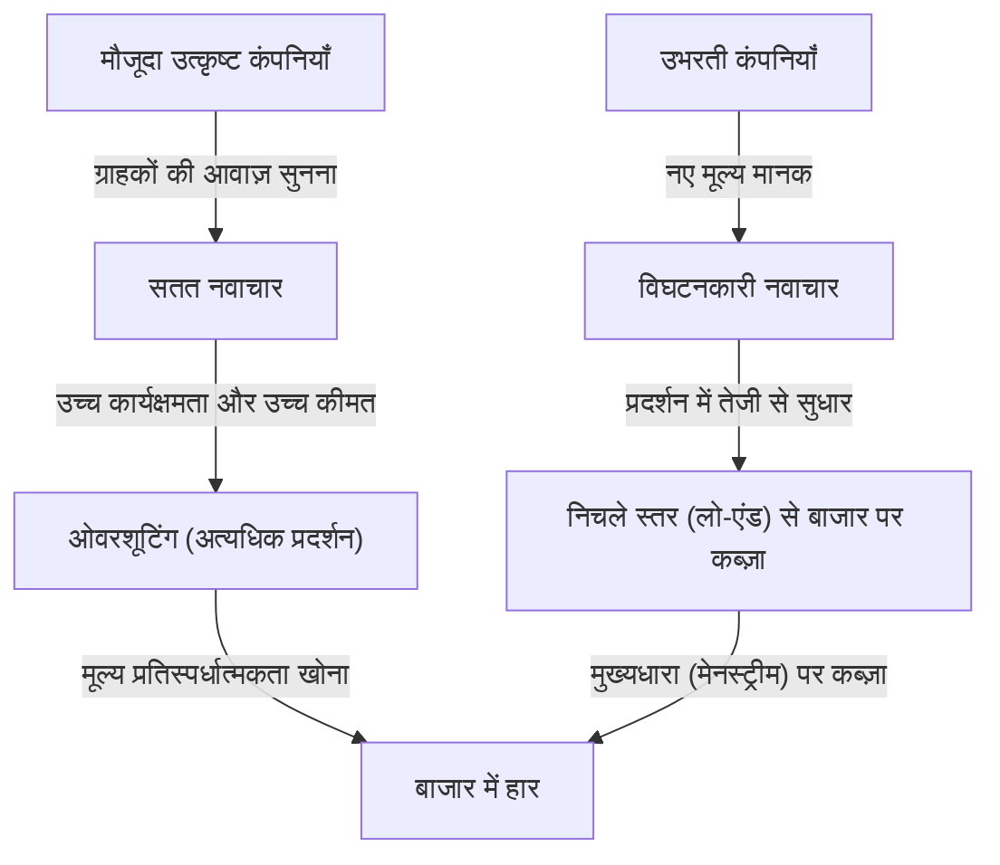
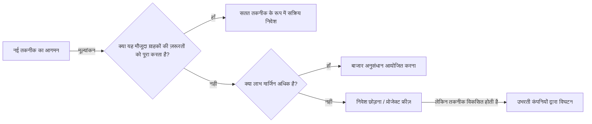

## परिचय: "उत्तम प्रबंधन" वाली कंपनियाँ क्यों विफल हो जाती हैं?

व्यापार की दुनिया में, "इनोवेटर्स डिलेमा (The Innovator's Dilemma)" जितनी गहरी अंतर्दृष्टि और प्रभाव प्रबंधकों और उद्यमियों पर शायद ही किसी अन्य अवधारणा ने डाला हो। हार्वर्ड बिजनेस स्कूल के पूर्व प्रोफेसर स्वर्गीय क्लेटन क्रिस्टेंसन द्वारा 1997 में अपनी इसी नाम की पुस्तक में प्रस्तावित यह सिद्धांत, केवल एक व्यावसायिक पुस्तक के अंश से आगे बढ़कर आधुनिक कॉर्पोरेट रणनीति के सबसे महत्वपूर्ण प्रतिमानों में से एक बन गया है।

सफलता का वह नियम जो हम आमतौर पर व्यापार में सोचते हैं, वह है "ग्राहकों की बात सुनना", "उत्पादों में लगातार सुधार करना", और "सबसे अधिक लाभदायक बाजारों में निवेश करना"। ये "सही प्रबंधन" के मूल तत्व हैं जो किसी भी प्रबंधन पाठ्यपुस्तक में लिखे होते हैं। हालाँकि, क्रिस्टेंसन के शोध ने एक आश्चर्यजनक तथ्य का खुलासा किया। वह विरोधाभास यह है कि **"ठीक इसी 'सही प्रबंधन' को पूरी तरह से लागू करने के कारण ही, महान कंपनियाँ उभरते स्टार्टअप्स से हार जाती हैं।"**

इस लेख में, हम इस "इनोवेटर्स डिलेमा" के अंतर्निहित तंत्र, सतत नवाचार (Sustaining Innovation) और विघटनकारी नवाचार (Disruptive Innovation) के बीच के अंतर, विशिष्ट ऐतिहासिक उदाहरण, और इस जाल से कैसे बचा जाए और खुद को एक विघटनकारी (Disruptor) कैसे बनाया जाए, इसकी रणनीतियों पर गहराई से चर्चा करेंगे।

---

## 1. नवाचार के 2 प्रक्षेपवक्र (Trajectories)

इनोवेटर्स डिलेमा को समझने के लिए सबसे महत्वपूर्ण आधार नवाचार का वर्गीकरण है। क्रिस्टेंसन ने तकनीकी विकास को दो मुख्य श्रेणियों में विभाजित किया: "सतत नवाचार (Sustaining Innovation)" और "विघटनकारी नवाचार (Disruptive Innovation)"।

### सतत नवाचार (Sustaining Innovation)

सतत नवाचार वह नवाचार है जो उत्पादों और सेवाओं के प्रदर्शन को उन प्रदर्शन मेट्रिक्स के अनुसार सुधारता है जिन्हें मौजूदा मुख्य ग्राहक महत्व देते हैं। यह "क्रमिक (धीरे-धीरे सुधारने वाला)" भी हो सकता है, और "सफलतापूर्ण (अचानक प्रदर्शन में छलांग)" भी हो सकता है, लेकिन इसकी दिशा हमेशा "मौजूदा बाजार में मौजूदा मूल्यांकन मानकों को सुधारने" की ओर होती है।

उत्कृष्ट कंपनियाँ इस सतत नवाचार में अत्यंत कुशल होती हैं। वे पूरी तरह से ग्राहक अनुसंधान करते हैं, ग्राहकों द्वारा वांछित सुविधाएँ जोड़ते हैं, और उच्च गुणवत्ता वाले उत्पादों को उच्च कीमत (उच्च लाभ मार्जिन) पर प्रदान करने की प्रक्रिया को अपने संगठन के डीएनए में शामिल करते हैं।

### विघटनकारी नवाचार (Disruptive Innovation)

दूसरी ओर, विघटनकारी नवाचार वह नवाचार है जो मौजूदा मुख्य ग्राहकों के दृष्टिकोण से "कम प्रदर्शन करने वाला और खिलौने जैसा दिखता है", लेकिन पूरी तरह से नए मूल्य मानकों (जैसे सस्ता, छोटा, सरल, उपयोग में आसान आदि) को प्रदान करता है।

शुरू में, इसे मौजूदा मुख्यधारा के बाजार में नजरअंदाज कर दिया जाता है और इसे केवल आला (niche) नए बाजारों या लो-एंड (कम कीमत वाले) बाजारों में थोड़ी बहुत स्वीकृति मिलती है। हालाँकि, प्रौद्योगिकी के विकास की गति ग्राहकों की आवश्यकताओं के विकास की गति से तेज होती है, इसलिए अंततः विघटनकारी प्रौद्योगिकी के प्रदर्शन में सुधार होता है और यह मौजूदा बाजार के ग्राहकों द्वारा आवश्यक न्यूनतम प्रदर्शन स्तर (हाई-एंड की जरूरतें नहीं, बल्कि मुख्यधारा की जरूरतें) को पूरा करने लगता है। उस क्षण, बाजार का नाटकीय रूप से प्रतिस्थापन होता है।

---

## 2. उत्कृष्ट कंपनियाँ विघटनकारी तकनीक से क्यों चूक जाती हैं? (दुविधा की संरचना)

यहाँ एक प्रश्न उठता है। बड़ी शोध एवं विकास लागत और बेहतरीन प्रतिभा वाली उत्कृष्ट कंपनियाँ स्टार्टअप्स की "सस्ती" तकनीक से क्यों हार जाती हैं?
ऐसा नहीं था कि वे तकनीकी रूप से अक्षम थे। वास्तव में, ऐसे कई मामले हैं जहां विघटनकारी तकनीक के शुरुआती प्रोटोटाइप मौजूदा उत्कृष्ट कंपनियों द्वारा ही विकसित किए गए थे।

उत्कृष्ट कंपनियों के विफल होने का कारण **"तर्कसंगत निर्णय लेने की प्रक्रिया का परिणाम"** है। निम्नलिखित कारक जो इसे समझाते हैं, वे एक मजबूत दुविधा (Dilemma) बनाते हैं।

### 1. संसाधन आवंटन तंत्र (Resource Allocation Mechanism)
कंपनी के संसाधन (धन, लोग, समय) प्राथमिकता के आधार पर उन परियोजनाओं को आवंटित किए जाते हैं जिनका लाभ मार्जिन सबसे अधिक होता है और जिनका बाजार आकार बड़ा होता है। मौजूदा ग्राहकों की मजबूत मांग के साथ "सतत नवाचार" परियोजनाओं को कंपनी के भीतर आसानी से मंजूरी मिल जाती है क्योंकि उच्च बिक्री और मुनाफे की भविष्यवाणी करना आसान होता है। दूसरी ओर, विघटनकारी तकनीक को निवेश पर प्रतिफल (ROI) के दृष्टिकोण से "तार्किक रूप से" खारिज कर दिया जाता है क्योंकि शुरुआती चरणों में बाजार का आकार छोटा होता है और लाभ मार्जिन कम होता है।

### 2. "ग्राहकों की आवाज़" का बंधन
उत्कृष्ट कंपनियाँ अपने बेहतरीन ग्राहकों (वे ग्राहक जो सबसे ज्यादा पैसे देते हैं) की बात सुनती हैं। हालाँकि, यदि आप किसी विघटनकारी तकनीक का प्रारंभिक संस्करण किसी मौजूदा बेहतरीन ग्राहक को दिखाते हैं, तो वे बस इतना कहेंगे, "हमें इतना कम प्रदर्शन वाला उत्पाद नहीं चाहिए" या "मौजूदा उत्पाद के विनिर्देशों (specs) में और सुधार करें।" क्योंकि कंपनियाँ अपने ग्राहकों के प्रति वफादार होती हैं, वे विघटनकारी तकनीक से अपनी आँखें मूंद लेती हैं।

### 3. वैल्यू नेटवर्क (मूल्य मानकों का जाल) का बंधन
कंपनियां केवल अपने आप में नहीं बल्कि एक "वैल्यू नेटवर्क" में मौजूद होती हैं जिसमें आपूर्तिकर्ता, वितरक, ग्राहक आदि शामिल होते हैं। क्योंकि इस पूरे नेटवर्क की संस्कृति और संरचना "उच्च कार्यक्षमता और उच्च इकाई मूल्य" वाली चीजों का समर्थन करती है, इसलिए ऐसे सस्ते और कम-विशिष्ट उत्पादों को वितरित करने से पूरे नेटवर्क के प्रतिरोध का सामना करना पड़ता है।

---

## 3. विघटनकारी नवाचार के 2 पैटर्न

बाजार पर कैसे हमला किया जाए, इसके आधार पर विघटनकारी नवाचार के मुख्य रूप से दो पैटर्न हैं।

### लो-एंड विघटन (Low-end Disruption)
यह उन "अति-संतुष्ट (overserved) ग्राहकों" को लक्षित करने वाला दृष्टिकोण है, जो मौजूदा बाजार में मानते हैं कि "हमें इतने उच्च प्रदर्शन की आवश्यकता compelling नहीं है, लेकिन अगर यह सस्ता है, तो हम इसका उपयोग करना चाहेंगे।"
मौजूदा कंपनियां कम लाभ मार्जिन वाले लो-एंड बाजार को उभरती कंपनियों को सौंपकर खुश होती हैं। इसका कारण यह है कि वे अधिक लाभदायक हाई-एंड बाजारों (अपमार्केट माइग्रेशन) की ओर बढ़ रहे हैं। हालाँकि, उभरती कंपनियाँ लो-एंड का उपयोग एक पायदान के रूप में करती हैं और धीरे-धीरे अपनी तकनीकी क्षमताओं में सुधार करती हैं, और अंततः मध्य-स्तरीय और उच्च-स्तरीय स्तरों पर आक्रमण करती हैं।
**(उदाहरण: इस्पात उद्योग में मिनी-मिल (इलेक्ट्रिक फर्नेस) द्वारा ब्लास्ट फर्नेस निर्माताओं का विघटन, टोयोटा मोटर्स का अमेरिकी बाजार में प्रारंभिक प्रवेश)**

### नया बाजार विघटन (New-market Disruption)
यह पूरी तरह से नए बाजार बनाने का एक दृष्टिकोण है, जो उन "गैर-उपभोक्ताओं" को लक्षित करता है जो पहले पैसे, कौशल या समय की कमी के कारण उत्पाद का उपभोग नहीं कर सकते थे।
मौजूदा उत्पादों की तुलना में उत्पादों को "सरल, अधिक सुविधाजनक और सस्ती कीमत" पर पेश करके, वे ऐसी मांग पैदा करते हैं जो पहले मौजूद नहीं थी। मौजूदा कंपनियों के नजरिए से, ऐसा नहीं लगता कि उनके बाजार का हिस्सा छीना जा रहा है, इसलिए उनकी सतर्कता में देरी होती है।
**(उदाहरण: बड़े कंप्यूटरों के विरुद्ध पर्सनल कंप्यूटर, लैंडलाइन के विरुद्ध प्रारंभिक मोबाइल फोन, रिकॉर्ड के विरुद्ध सोनी का वॉकमैन)**

---

## 4. "विघटन" का प्रक्षेपवक्र जिसे इतिहास सिद्ध करता है: केस स्टडीज़

### केस 1: हार्ड डिस्क ड्राइव (HDD) उद्योग
क्रिस्टेंसन ने जिस उद्योग की सबसे विस्तार से जांच की वह एचडीडी (HDD) उद्योग था। 14 इंच से 8 इंच, 5.25 इंच और 3.5 इंच तक लघुकरण (miniaturization) की प्रक्रिया में, लगभग हर बार मौजूदा शीर्ष कंपनियों ने अगली पीढ़ी के आकार का आधिपत्य उभरती कंपनियों से खो दिया।
मेनफ्रेम के ग्राहक 14-इंच की क्षमता में सुधार (सतत नवाचार) की मांग कर रहे थे, और उन्होंने शुरुआती 8-इंच एचडीडी (कम क्षमता, मिनीकंप्यूटर के लिए) को नजरअंदाज कर दिया। मौजूदा कंपनियों ने ग्राहकों की आवाज़ सुनी और 8-इंच में निवेश में देरी की, जिसके परिणामस्वरूप उन्हें 8-इंच वाली उभरती कंपनियों ने निगल लिया जो मिनीकंप्यूटर बाजार के विकास के साथ आगे बढ़ीं।

### केस 2: डिजिटल कैमरों द्वारा सिल्वर हलाइड फिल्म का विघटन
कोडक दुनिया में डिजिटल कैमरा विकसित करने वाली पहली कंपनियों में से एक थी। हालाँकि, उन्हें अपने अत्यधिक लाभदायक "फिल्म और विकास (developing)" व्यवसाय मॉडल (वैल्यू नेटवर्क) को नष्ट करने का डर था, और उन्होंने डिजिटलीकरण में पूर्ण परिवर्तन करने में संकोच किया। शुरुआती डिजिटल कैमरों की छवि गुणवत्ता खराब थी, और मौजूदा पेशेवर फोटोग्राफरों ने उन्हें "खिलौने" के रूप में मूल्यांकन किया, लेकिन आम उपयोगकर्ताओं के लिए नया मूल्य (विघटनकारी नवाचार) कि "आप तुरंत फोटो देख सकते हैं, और विकास शुल्क की आवश्यकता नहीं है" भारी था। जब छवि गुणवत्ता एक निश्चित स्तर पर पहुंच गई, तो बाजार पलक झपकते ही उलट गया।

### केस 3: SaaS और क्लाउड कंप्यूटिंग
ओरेकल और एसएपी जैसी कंपनियों के विपरीत, जो उद्यमों (enterprises) के लिए बड़े पैमाने पर ऑन-प्रिमाइसेस (इन-हाउस) सॉफ्टवेयर प्रदान करती थीं, सेल्सफोर्स जैसी सास (SaaS) कंपनियां शुरू में "छोटे और मध्यम उद्यमों (लो-एंड) के लिए सरल उपकरण" के रूप में दिखाई दीं। बड़ी कंपनियों ने "सुरक्षा चिंताओं" और "सुविधाओं की कमी" का हवाला देते हुए SaaS से परहेज किया, लेकिन SaaS प्रदाताओं ने तेजी से अपने कार्यों और सुरक्षा में सुधार किया, और आज वे बड़े उद्यम बाजार (हाई-एंड) का मूल बन गए हैं।

---

## 5. इनोवेटर्स डिलेमा पर काबू पाने के लिए "प्रबंधन रणनीतियाँ"

इस मजबूत "तर्कसंगतता के जाल" से बचने और मौजूदा कंपनियों के लिए विघटनकारी नवाचार (या जीवित रहने) के लिए, ऐसे प्रबंधन की आवश्यकता है जो पारंपरिक ज्ञान को उलट दे।

### 1. एक स्वतंत्र संगठन/स्पिन-आउट की स्थापना
विघटनकारी परियोजनाओं को मौजूदा विशाल संगठनों की प्रक्रियाओं और मूल्य मानकों के भीतर विकसित करने का प्रयास न करें। एक ऐसे विभाग के लिए जिसकी बिक्री 100 अरब येन है, 100 मिलियन येन का नया व्यवसाय केवल एक "त्रुटि" है, और यह निश्चित रूप से संसाधनों के लिए प्रतिस्पर्धा करने वाली बैठकों में हार जाएगा।
विघटनकारी प्रौद्योगिकियों को **"एक पूरी तरह से स्वतंत्र, अलग संगठन दिया जाना चाहिए जो एक छोटे बाजार में भी पर्याप्त रूप से उत्साहित हो सके और अपने स्वयं के लाभ मार्जिन मानकों पर काम कर सके।"**

### 2. खोज-संचालित दृष्टिकोण (Discovery-driven Planning) जो "विफलता को एक आधार मानता है"
सतत नवाचार में, पिछले डेटा के आधार पर विस्तृत व्यवसाय योजना संभव है। हालाँकि, चूंकि विघटनकारी नवाचार के लिए बाजार "अभी तक मौजूद नहीं है," पूर्व भविष्यवाणियां 100% गलत होंगी।
शुरू से ही एक आदर्श रणनीति को क्रियान्वित करने के बजाय, एक लीन स्टार्टअप-जैसा (lean startup-like) दृष्टिकोण आवश्यक है, जिसमें "परिकल्पनाएं बनाना, छोटी मात्रा में धन के साथ परीक्षण करना, बाजार से सीखना और अपनी रणनीति को सही करना (पिवोटिंग) शामिल है।"

### 3. "जॉब्स टू बी डन (Jobs to be Done)" सिद्धांत के माध्यम से ग्राहकों को समझना
बाज़ार की समीक्षा ग्राहकों के "गुणों (उम्र, लिंग, आदि)" या "उत्पाद सुविधाओं" के परिप्रेक्ष्य से नहीं, बल्कि "उस उत्पाद को किस काम (जॉब) को पूरा करने के लिए ग्राहक द्वारा काम पर रखा (hired) जा रहा है?" के दृष्टिकोण से की जानी चाहिए।
यह मौजूदा उत्पादों में अत्यधिक सुविधाओं को जोड़ने (ओवरशूटिंग) से रोकता है, और ग्राहकों के कार्यों को सस्ते और सरलता से पूरा करने के लिए पूरी तरह से अलग दृष्टिकोण का उपयोग करके "विघटन के अवसर" खोजने में मदद करता है।

### 4. संसाधन, प्रक्रिया, मूल्य मानक (RPV फ्रेमवर्क) का मूल्यांकन
कोई कंपनी क्या कर सकती है और क्या नहीं कर सकती है, यह तीन बातों से निर्धारित होता है: "संसाधन (Resources)", "प्रक्रियाएँ (Processes)", और "मूल्य (Values)"। उत्कृष्ट कंपनियों के पास प्रचुर मात्रा में "संसाधन" होते हैं, लेकिन मौजूदा व्यवसायों और उच्च लाभ मार्जिन की मांग करने वाले "मूल्यों" के लिए अनुकूलित "प्रक्रियाएं" विघटनकारी नवाचार में बाधा उत्पन्न करती हैं। लीडर्स को संगठनात्मक ढांचे को फिर से डिजाइन करना चाहिए ताकि यह सुनिश्चित हो सके कि मौजूदा प्रक्रियाएं और मूल्य नए व्यवसायों पर लागू न हों।

---

## 6. आधुनिक समय में (AI और Web3 युग) इनोवेटर्स डिलेमा

वर्तमान में, जेनरेटिव AI (जैसे ChatGPT) के उदय के साथ, यह कहा जाता है कि Google और Apple जैसी विशाल तकनीकी कंपनियां इनोवेटर्स डिलेमा का सामना कर रही हैं।
उदाहरण के लिए, Google के पास एक अत्यंत सटीक खोज इंजन (सतत नवाचार का चरम) और एक विज्ञापन मॉडल है। वहां, जेनरेटिव एआई दिखाई दिया है, जो बातचीत के प्रारूप में सीधे उत्तर प्रदान करता है, हालांकि यह कभी-कभी गलत तथ्य (मतिभ्रम/hallucination) पैदा करता है। चूँकि जेनरेटिव AI मौजूदा "खोजें, लिंक पर क्लिक करें और विज्ञापन देखें" राजस्व मॉडल को नष्ट करने की धमकी देता है, इसलिए खोज दिग्गज को AI में पूर्ण संक्रमण के साथ दुविधा (dilemma) का सामना करना पड़ रहा है।

इस तरह, आधुनिक दुनिया में जहां प्रौद्योगिकी का विकास तेज हो रहा है, "विघटन" का चक्र पहले से कहीं अधिक छोटा हो गया है। सॉफ्टवेयर और डिजिटल डोमेन में, भौतिक बाधाएं कम हैं, इसलिए लो-एंड से हाई-एंड तक का क्षरण (erosion) दशकों के बजाय वर्षों या महीनों में हो सकता है।

---

## निष्कर्ष: दुविधा को स्वीकार करें और खुद को विघटित करें

क्लेटन क्रिस्टेंसन के "इनोवेटर्स डिलेमा" से सीखा गया सबसे बड़ा सबक यह है कि **"वही ताकतें जो आपकी वर्तमान सफलता का समर्थन करती हैं, वे भविष्य की घातक कमजोरियां बन जाएंगी।"**

प्रबंधकों और लीडर्स से जो आवश्यक है वह यह है कि वे मौजूदा व्यवसायों की दक्षता और निरंतर विकास को आगे बढ़ाने के लिए "उभयहस्त प्रबंधन (Ambidextrous Organization)" का अभ्यास करें, और साथ ही साथ कभी-कभी अपने स्वयं के हाथों से मौजूदा कैश काउ (लाभदायक व्यवसाय) को नष्ट करने का साहस रखें।
"क्या हम ऐसी तकनीक के प्रकट होने की प्रतीक्षा कर रहे हैं जो हमारी कंपनी को नष्ट कर देगी, या हम इसे स्वयं बनाएंगे?"
इस प्रश्न का सामना करते रहना आज के उथल-पुथल भरे कारोबारी माहौल में जीवित रहने का एकमात्र तरीका है।

(समाप्त)
