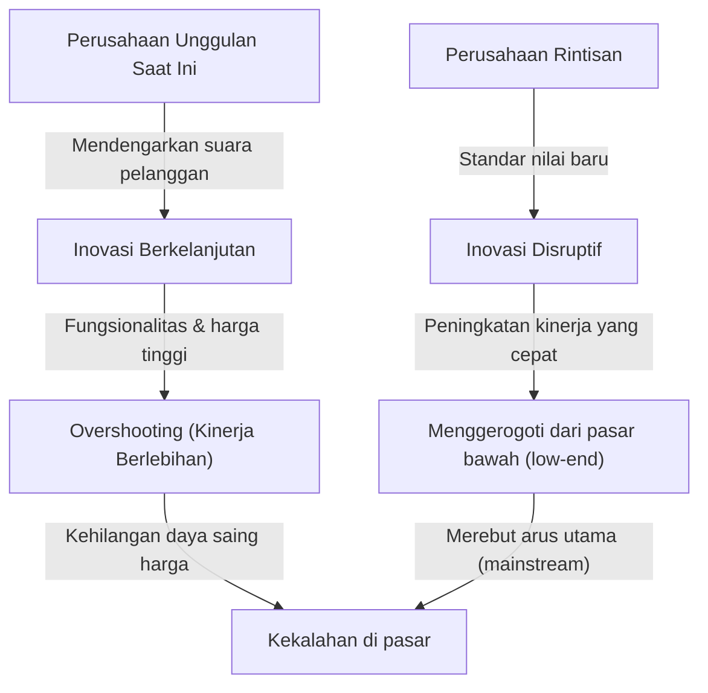
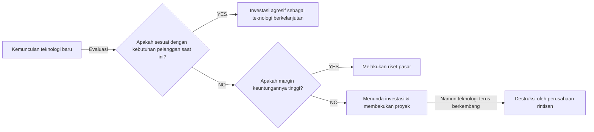

+++
title: "[Panduan Lengkap] Apa itu Dilema Inovator? Mekanisme Perusahaan Unggulan Kalah oleh Inovasi Destruktif dan Strategi Mengatasinya"
description: "Mengenai \"Dilema Inovator\" yang dikemukakan oleh Clayton Christensen, kami membahas secara mendalam mekanisme inovasi disruptif, jebakan yang menjerat perusahaan unggulan, serta strategi mengatasinya melalui studi kasus nyata dalam volume ribuan kata."
slug: "business-innovators-dilemma"
categories: ["business"]
tags: ["innovators-dilemma", "innovation", "management"]
image: "eyecatch.jpg"
+++

## Pendahuluan: Mengapa Perusahaan yang Menjalankan "Manajemen Sempurna" Bisa Gagal?

Dalam dunia bisnis, mungkin hanya sedikit konsep yang memberikan wawasan dan kejutan yang begitu dalam bagi para manajer dan wirausahawan seperti "Dilema Inovator (The Innovator's Dilemma)". Teori yang dikemukakan dalam buku berjudul sama yang diterbitkan pada tahun 1997 oleh mendiang Profesor Clayton Christensen dari Harvard Business School ini, telah melampaui sekadar kutipan buku bisnis dan menetap sebagai salah satu paradigma paling penting dalam strategi perusahaan modern.

Aturan kesuksesan bisnis yang biasa kita pikirkan adalah "mendengarkan suara pelanggan", "terus memperbaiki produk", dan "berinvestasi pada pasar dengan margin keuntungan tertinggi". Ini adalah dasar-dasar "manajemen yang benar" yang selalu tertulis di buku teks manajemen. Namun, penelitian Christensen mengungkapkan fakta yang mengejutkan. Yaitu, paradoks bahwa **"justru karena mereka mengeksekusi 'manajemen yang benar' dengan sempurna, perusahaan hebat bisa dikalahkan oleh perusahaan rintisan (startup)."**

Dalam artikel ini, kami akan membahas secara mendalam mekanisme yang mendasari "Dilema Inovator" ini, perbedaan antara inovasi berkelanjutan (Sustaining Innovation) dan inovasi disruptif (Disruptive Innovation), studi kasus sejarah yang konkret, serta strategi tentang bagaimana perusahaan modern dapat menghindari jebakan ini dan menjadi perusak (disruptor) itu sendiri.

---

## 1. Dua Lintasan Inovasi

Dalam memahami Dilema Inovator, premis yang paling penting adalah klasifikasi inovasi. Christensen membagi secara garis besar evolusi teknologi menjadi dua, yaitu "Inovasi Berkelanjutan (Sustaining Innovation)" dan "Inovasi Disruptif (Disruptive Innovation)".

### Inovasi Berkelanjutan (Sustaining Innovation)

Inovasi Berkelanjutan adalah inovasi yang meningkatkan kinerja produk atau layanan berdasarkan metrik kinerja yang dihargai oleh pelanggan utama yang ada. Ini bisa berupa peningkatan yang "bertahap (sedikit demi sedikit)" atau "revolusioner (kinerja melonjak drastis)", tetapi vektornya selalu mengarah pada "peningkatan standar evaluasi yang ada di pasar yang sudah ada".

Perusahaan unggulan sangat baik dalam inovasi berkelanjutan ini. Mereka memasukkan proses melakukan riset pelanggan secara menyeluruh, menambahkan fitur yang diinginkan pelanggan, dan menyediakan produk berkualitas lebih tinggi dengan harga yang lebih tinggi (margin keuntungan tinggi) sebagai DNA organisasi mereka.

### Inovasi Disruptif (Disruptive Innovation)

Di sisi lain, inovasi disruptif adalah inovasi yang, meskipun dari sudut pandang pelanggan utama saat ini terlihat "berkinerja rendah dan seperti mainan", menawarkan standar nilai yang sama sekali baru (murah, kecil, sederhana, mudah digunakan, dll.).

Pada awalnya, ini diabaikan oleh pasar arus utama (mainstream) yang ada dan hanya diterima secara perlahan di ceruk pasar baru atau pasar kelas bawah (low-end). Namun, kecepatan evolusi teknologi lebih cepat daripada kecepatan evolusi kebutuhan pelanggan, sehingga pada akhirnya kinerja teknologi disruptif meningkat dan memenuhi standar kinerja minimum (bukan kebutuhan kelas atas, tetapi kebutuhan arus utama) yang dicari oleh pelanggan di pasar yang sudah ada. Pada saat itulah, pergeseran pasar yang dramatis terjadi.

---

## 2. Mengapa Perusahaan Unggulan Mengabaikan Teknologi Disruptif? (Struktur Dilema)

Di sini muncul satu pertanyaan. Mengapa perusahaan unggulan yang memiliki dana penelitian dan pengembangan yang besar serta sumber daya manusia yang brilian, bisa kalah oleh teknologi "murahan" dari perusahaan rintisan?
Bukan berarti mereka tidak kompeten secara teknis. Sebaliknya, dalam banyak kasus, prototipe awal dari teknologi disruptif justru dikembangkan oleh perusahaan unggulan itu sendiri.

Alasan mengapa perusahaan unggulan gagal adalah **"akibat dari proses pengambilan keputusan yang rasional"**. Faktor-faktor berikut yang menjelaskannya membentuk dilema yang sangat kuat.

### 1. Mekanisme Alokasi Sumber Daya
Sumber daya perusahaan (dana, SDM, waktu) dialokasikan secara prioritas ke proyek-proyek dengan margin keuntungan tertinggi dan ukuran pasar terbesar. Proyek "inovasi berkelanjutan" yang memiliki permintaan kuat dari pelanggan yang ada, mudah disetujui secara internal karena prediksi penjualan dan keuntungannya tinggi. Di sisi lain, teknologi disruptif pada tahap awal memiliki ukuran pasar yang kecil dan margin keuntungan yang rendah, sehingga secara "rasional" ditolak dari sudut pandang Return on Investment (ROI).

### 2. Kutukan "Suara Pelanggan"
Perusahaan unggulan mendengarkan suara pelanggan unggulan (pelanggan yang paling banyak membayar). Namun, ketika memperlihatkan versi awal teknologi disruptif kepada pelanggan unggulan tersebut, mereka hanya akan berkata, "Kami tidak butuh barang dengan kinerja serendah ini" atau "Tingkatkan saja spesifikasi produk yang ada sekarang". Justru karena perusahaan setia kepada pelanggan, mereka malah berpaling dari teknologi disruptif.

### 3. Ikatan Value Network (Jaringan Nilai)
Sebuah perusahaan tidak berdiri sendiri, melainkan berada dalam sebuah "jaringan nilai" (Value Network) yang mencakup pemasok, distributor, dan pelanggan. Karena seluruh jaringan ini memiliki budaya dan struktur yang mengutamakan "produk dengan fungsionalitas dan harga yang lebih tinggi", mendistribusikan produk yang murah dengan spesifikasi rendah di luar kebiasaan tersebut akan menghadapi resistensi dari seluruh jaringan.

---

## 3. Dua Pola Inovasi Disruptif

Inovasi disruptif secara garis besar memiliki dua pola berdasarkan cara menyerang pasarnya.

### Destruksi Tipe Low-end (Low-end Disruption)
Ini adalah pendekatan yang menargetkan "pelanggan yang terlalu terlayani (over-served)" di pasar yang sudah ada, yang berpikir "saya tidak butuh kinerja setinggi itu, asalkan murah saya mau menggunakannya".
Perusahaan yang sudah mapan dengan senang hati menyerahkan pasar kelas bawah yang bermargin rendah ini kepada perusahaan rintisan. Mengapa? Karena mereka sedang beralih ke pasar kelas atas (upmarket migration) yang lebih menguntungkan. Namun, perusahaan rintisan menggunakan pasar kelas bawah sebagai pijakan untuk secara bertahap meningkatkan kemampuan teknis mereka, dan pada akhirnya menggerogoti kelas menengah dan atas.
**(Contoh: Kehancuran produsen tanur tiup oleh pabrik baja mini (tanur listrik) di industri baja, masuknya Toyota pada masa awal ke pasar Amerika)**

### Destruksi Tipe Pasar Baru (New-market Disruption)
Ini adalah pendekatan yang menciptakan pasar yang sama sekali baru dengan menargetkan "non-konsumen" yang sebelumnya tidak dapat mengonsumsi produk karena alasan tidak punya uang, tidak punya keterampilan, atau tidak punya waktu.
Dengan menyediakan produk yang "lebih sederhana, lebih nyaman, dan dengan harga lebih terjangkau" daripada produk yang sudah ada, hal ini membangkitkan permintaan yang sebelumnya tidak ada. Dari sudut pandang perusahaan yang sudah mapan, sepertinya pangsa pasar mereka tidak direbut, sehingga mereka terlambat waspada.
**(Contoh: Komputer personal vs komputer mainframe besar, telepon seluler awal vs telepon kabel, Sony Walkman vs pemutar piringan hitam)**

---

## 4. Bukti Sejarah dari Jejak "Destruksi": Studi Kasus

### Kasus 1: Industri Hard Disk Drive (HDD)
Industri yang diteliti paling rinci oleh Christensen adalah industri HDD. Dalam proses pengecilan ukuran dari 14 inci menjadi 8 inci, 5,25 inci, hingga 3,5 inci, perusahaan teratas yang ada hampir selalu kehilangan supremasi ukuran generasi berikutnya ke tangan perusahaan rintisan.
Pelanggan mainframe menginginkan peningkatan kapasitas untuk ukuran 14 inci (inovasi berkelanjutan) dan tidak melirik HDD 8 inci awal (kapasitas kecil, untuk minikomputer). Perusahaan yang ada mendengarkan suara pelanggan dan menunda investasi di ukuran 8 inci, yang pada akhirnya ditelan seluruhnya oleh perusahaan rintisan 8 inci yang bangkit bersamaan dengan pertumbuhan pasar minikomputer.

### Kasus 2: Destruksi Film Perak Halida oleh Kamera Digital
Kodak adalah salah satu perusahaan pertama di dunia yang mengembangkan kamera digital. Namun, karena takut menghancurkan model bisnis "film dan pencucian" (value network) mereka yang menghasilkan keuntungan luar biasa, mereka ragu-ragu untuk beralih sepenuhnya ke digital. Kamera digital awal memiliki kualitas gambar yang buruk, dan fotografer profesional menganggapnya sebagai "mainan", tetapi bagi pengguna umum, nilai baru (inovasi disruptif) berupa "bisa langsung dilihat tanpa biaya cuci cetak" sangatlah luar biasa. Ketika kualitas gambar mencapai standar tertentu, pasar berbalik seketika.

### Kasus 3: SaaS dan Komputasi Awan (Cloud Computing)
Menghadapi Oracle dan SAP yang menyediakan perangkat lunak on-premise (dikelola sendiri) berukuran raksasa untuk perusahaan besar (enterprise), perusahaan SaaS seperti Salesforce pada awalnya muncul sebagai "alat sederhana untuk usaha kecil dan menengah (low-end)". Perusahaan besar menghindari SaaS dengan alasan "masalah keamanan" atau "kekurangan fitur", tetapi pihak SaaS dengan cepat meningkatkan fungsi dan keamanannya, hingga saat ini menjadi pilar utama pasar perusahaan besar (high-end).

---

## 5. "Strategi Manajemen" untuk Mengatasi Dilema Inovator

Agar dapat keluar dari "jebakan rasionalitas" yang kuat ini dan memicu inovasi disruptif sendiri (atau bertahan hidup), perusahaan yang sudah ada memerlukan manajemen yang mengubah cara pandang konvensional.

### 1. Mendirikan Organisasi Independen / Spin-out
Jangan mencoba mengembangkan proyek disruptif di dalam proses atau standar nilai organisasi raksasa yang sudah ada. Bagi departemen dengan omzet 100 miliar yen, bisnis baru bernilai 100 juta yen hanyalah sebuah "margin error", dan pasti akan kalah dalam rapat perebutan sumber daya.
Teknologi disruptif harus diberikan **"organisasi terpisah yang sepenuhnya independen, yang cukup bergairah meski di pasar kecil, dan dapat beroperasi dengan standar margin keuntungan yang mandiri"**.

### 2. Pendekatan Penemuan yang "Berasumsi pada Kegagalan" (Discovery-driven Planning)
Dalam inovasi berkelanjutan, rencana bisnis yang akurat dapat dibuat berdasarkan data masa lalu. Namun, karena pasar inovasi disruptif "belum ada", prediksi awal pasti 100% meleset.
Pendekatan gaya Lean Startup, yaitu "jangan menjalankan strategi sempurna sejak awal, melainkan buat hipotesis, uji dengan dana kecil, pelajari dari pasar, dan sesuaikan strategi (pivot)", sangatlah penting.

### 3. Pemahaman Pelanggan melalui "Teori Pekerjaan (Jobs to be Done)"
Daripada melihat dari "atribut (usia, jenis kelamin, dll.)" pelanggan atau "fitur produk", tinjau ulang pasar dari sudut pandang "pekerjaan (job) apa yang ingin diselesaikan pelanggan, sehingga mereka mempekerjakan (hire) produk tersebut?".
Dengan ini, Anda dapat mencegah penambahan fitur yang berlebihan (overshooting) pada produk yang ada, dan menemukan "peluang destruksi" untuk menyelesaikan pekerjaan pelanggan dengan pendekatan yang sama sekali berbeda, lebih murah, dan lebih sederhana.

### 4. Evaluasi Sumber Daya, Proses, dan Standar Nilai (Kerangka Kerja RPV)
Apa yang dapat dan tidak dapat dilakukan oleh sebuah perusahaan ditentukan oleh tiga hal: "Sumber Daya (Resource)", "Proses (Process)", dan "Standar Nilai (Values)". Perusahaan unggulan memiliki "Sumber Daya" yang berlimpah, tetapi "Proses" yang dioptimalkan untuk bisnis yang ada dan "Standar Nilai" yang menuntut margin keuntungan tinggi menjadi penghalang bagi inovasi disruptif. Para pemimpin harus mendesain ulang sistem organisasi agar tidak menerapkan proses dan standar nilai yang ada pada bisnis baru.

---

## 6. Dilema Inovator di Era Modern (Era AI & Web3)

Saat ini, dengan bangkitnya AI generatif (seperti ChatGPT), raksasa teknologi seperti Google dan Apple dikatakan sedang menghadapi dilema inovator.
Misalnya, Google memiliki mesin pencari dengan akurasi yang luar biasa (puncak inovasi berkelanjutan) dan model periklanan. Kemudian muncul AI generatif yang, meskipun terkadang memberikan fakta yang salah (halusinasi), mampu memberikan jawaban langsung dalam format percakapan. Karena AI generatif berpotensi menghancurkan model pendapatan yang ada (mencari, mengklik tautan, dan melihat iklan), raksasa pencari ini menghadapi dilema dalam beralih sepenuhnya ke AI.

Dengan demikian, di era modern di mana evolusi teknologi semakin cepat, siklus "destruksi" menjadi lebih singkat dari sebelumnya. Di ranah perangkat lunak dan digital, karena batasan fisiknya sedikit, pergeseran dari kelas bawah ke kelas atas dapat terjadi dalam hitungan bulan atau tahun, bukan lagi puluhan tahun.

---

## Kesimpulan: Terimalah Dilema, dan Hancurkan Diri Sendiri

Pelajaran terbesar dari "Dilema Inovator" karya Clayton Christensen adalah **"kekuatan yang menopang kesuksesan Anda saat ini akan menjadi kelemahan yang fatal di masa depan"**.

Yang dituntut dari manajer dan pemimpin adalah menerapkan "Organisasi Ambidextrous" (Ambidextrous Organization) yang mengejar efisiensi dan pertumbuhan berkelanjutan dari bisnis yang ada, sambil sesekali memiliki keberanian untuk menghancurkan *cash cow* (bisnis tambang emas) mereka yang ada dengan tangan mereka sendiri.
"Apakah akan menunggu munculnya teknologi yang menghancurkan perusahaan kita, ataukah kita menciptakannya sendiri?"
Terus menghadapi pertanyaan ini adalah satu-satunya cara untuk bertahan hidup di lingkungan bisnis modern yang penuh gejolak.

(Selesai)
