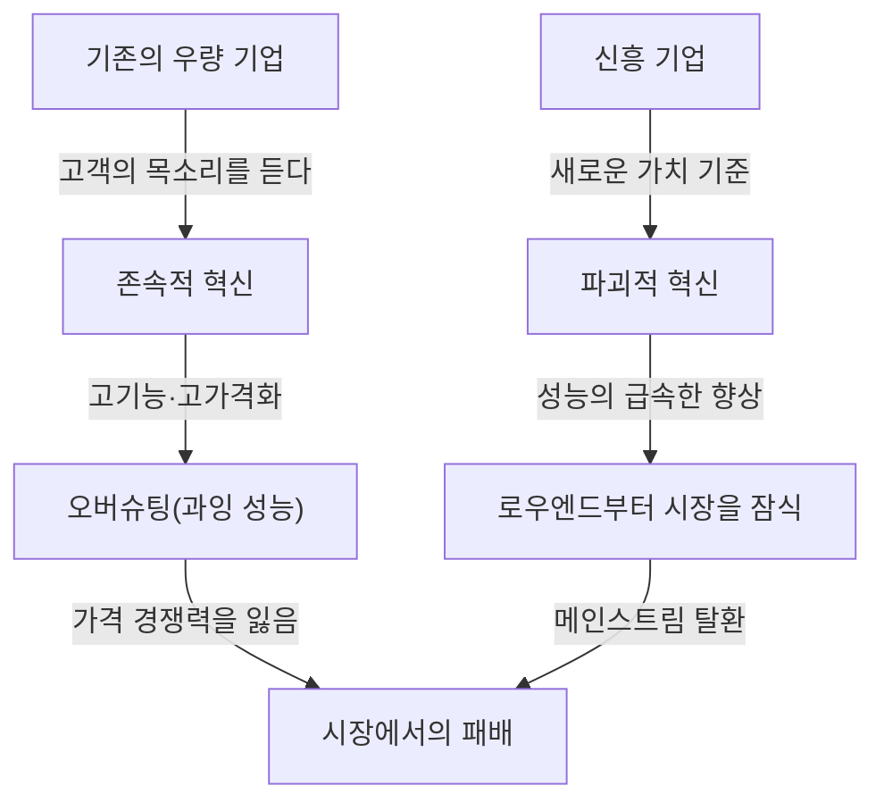
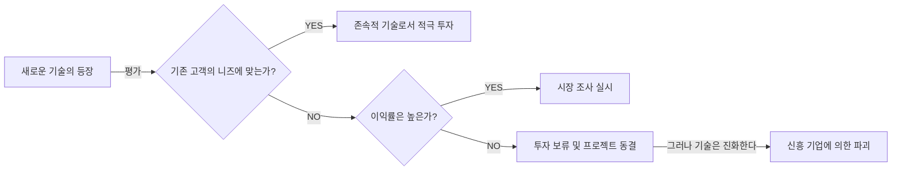

+++
title: "【완벽 해설】 혁신가의 딜레마란? 우량 기업이 파괴적 혁신에 패배하는 메커니즘과 극복 전략"
description: "클레이튼 크리스텐슨이 제창한 '혁신가의 딜레마'에 대해, 파괴적 혁신의 메커니즘, 우량 기업이 빠지는 함정, 구체적인 사례부터 극복을 위한 전략까지 수천 자의 분량으로 철저하게 깊이 파헤쳐 해설합니다."
slug: "business-innovators-dilemma"
categories: ["business"]
tags: ["innovators-dilemma", "innovation", "management"]
image: "eyecatch.jpg"
+++

## 서론: 왜 '완벽한 경영'을 하는 기업이 실패하는가?

비즈니스 세계에서 '혁신가의 딜레마(The Innovator's Dilemma)'만큼 경영자나 창업가들에게 깊은 통찰과 충격을 준 개념은 드물 것입니다. 하버드 비즈니스 스쿨 교수였던 고 클레이튼 크리스텐슨이 1997년에 발표한 동명의 저서에서 제창된 이 이론은 단순한 비즈니스 서적의 한 구절을 넘어, 현대 기업 전략에서 가장 중요한 패러다임 중 하나로 자리 잡았습니다.

우리가 보통 생각하는 비즈니스의 성공 법칙은 '고객의 목소리에 귀를 기울이고', '지속적으로 제품을 개량하며', '가장 이익률이 높은 시장에 투자하는' 것입니다. 이들은 경영학 교과서에 반드시 쓰여 있는 '올바른 경영'의 기본입니다. 하지만 크리스텐슨의 연구는 놀라운 사실을 밝혀냈습니다. 그것은 **"바로 그 '올바른 경영'을 완벽하게 실행하고 있기 때문에 위대한 기업이 신흥 기업에게 패배하고 만다"**는 역설입니다.

본 기사에서는 이 '혁신가의 딜레마'의 근저에 있는 메커니즘, 존속적 혁신과 파괴적 혁신의 차이, 구체적인 역사적 사례, 그리고 현대 기업이 이 함정을 어떻게 회피하고 스스로 파괴자가 되기 위한 전략에 대해 철저하게 깊이 파헤쳐 해설합니다.

---

## 1. 혁신의 2가지 궤적

혁신가의 딜레마를 이해하는 데 있어 가장 중요한 전제가 되는 것이 혁신의 분류입니다. 크리스텐슨은 기술의 진화를 '존속적 혁신(Sustaining Innovation)'과 '파괴적 혁신(Disruptive Innovation)' 두 가지로 크게 나누었습니다.

### 존속적 혁신 (Sustaining Innovation)

존속적 혁신이란 기존의 주요 고객이 중시하는 성능 지표에 따라 제품이나 서비스의 성능을 향상시키는 혁신입니다. 이는 '점진적(조금씩 좋아지는)'인 것도 있고, '획기적(단번에 성능이 뛰어오르는)'인 것도 있지만, 방향성은 항상 '기존 시장에서의 기존 평가 기준의 향상'을 향하고 있습니다.

우량 기업은 이 존속적 혁신에 있어 매우 우수합니다. 이들은 고객 조사를 철저히 실시하고, 고객이 원하는 기능을 추가하며, 더 높은 품질의 제품을 더 높은 가격(높은 이익률)으로 제공하는 프로세스를 조직의 DNA로 내재화하고 있습니다.

### 파괴적 혁신 (Disruptive Innovation)

반면 파괴적 혁신이란 기존의 주요 고객이 보기에는 '성능이 낮고 장난감처럼 보이는' 것이지만, 전혀 새로운 가치 기준(저렴함, 소형, 단순함, 사용 편의성 등)을 제공하는 혁신입니다.

처음에는 기존 주류 시장에서 외면받고 틈새 신시장이나 로우엔드(저가) 시장에서 근근이 받아들여집니다. 그러나 기술의 진화 속도는 고객의 니즈가 진화하는 속도보다 빠르기 때문에, 이내 파괴적 기술의 성능은 향상되어 기존 시장의 고객이 요구하는 최소한의 성능 수준(하이엔드의 니즈가 아닌 주류의 니즈)을 충족하게 됩니다. 그 순간, 극적인 시장의 교체가 발생합니다.

---

## 2. 왜 우량 기업은 파괴적 기술을 놓치는가? (딜레마의 구조)

여기서 하나의 의문이 생깁니다. 왜 막대한 연구 개발비와 우수한 인재를 보유한 우량 기업이 신흥 기업의 '보잘것없는' 기술에 패배하고 마는 것일까요?

그들이 기술적으로 무능했던 것은 아닙니다. 오히려 파괴적 기술의 초기 프로토타입을 개발한 것은 기존의 우량 기업인 경우도 많습니다.

우량 기업이 실패하는 이유는 **"합리적인 의사결정 프로세스의 결과"**입니다. 이를 설명하는 다음의 요인들이 강력한 딜레마를 형성하고 있습니다.

### 1. 리소스 배분의 메커니즘
기업의 리소스(자금, 인재, 시간)는 가장 이익률이 높고 시장 규모가 큰 프로젝트에 우선적으로 배분됩니다. 기존 고객의 강한 요구가 있는 '존속적 혁신' 프로젝트는 높은 매출과 이익을 예측하기 쉽기 때문에 사내 결재를 쉽게 통과합니다. 반면 파괴적 기술은 초기 단계에서는 시장 규모가 작고 이익률도 낮기 때문에 투자 대비 효과(ROI) 관점에서 '합리적'으로 기각되고 맙니다.

### 2. '고객의 목소리'라는 주술
우량 기업은 우량 고객(가장 돈을 많이 지불하는 고객)의 목소리에 귀를 기울입니다. 그러나 파괴적 기술의 초기 버전을 기존의 우량 고객에게 보여주어도 "이렇게 성능이 낮은 것은 필요 없다", "지금 제품의 스펙을 더 올려달라"는 말만 들을 뿐입니다. 기업은 고객에게 성실하기 때문에 파괴적 기술을 외면하게 됩니다.

### 3. 가치 네트워크(가치 기준의 망)의 속박
기업은 자사뿐만 아니라 공급업체, 유통업체, 고객 등을 포함하는 '가치 네트워크' 속에 존재합니다. 이 네트워크 전체가 '더 고기능이고 고단가인 것'을 좋게 여기는 문화와 구조를 가지고 있기 때문에, 거기서 벗어난 저렴하고 스펙이 낮은 제품을 유통시키는 것은 네트워크 전체의 저항에 부딪힙니다.

---

## 3. 파괴적 혁신의 2가지 패턴

파괴적 혁신에는 시장을 공략하는 방식에 따라 주로 2가지 패턴이 존재합니다.

### 로우엔드형 파괴 (Low-end Disruption)
기존 시장에서 '그렇게까지 고성능은 요구하지 않지만, 저렴하다면 사용하고 싶다'고 생각하는 '오버서브(과잉 만족)된 고객'을 타겟으로 하는 접근 방식입니다.
기존 기업은 이익률이 낮은 로우엔드 시장을 기꺼이 신흥 기업에 내어줍니다. 왜냐하면 더 이익률이 높은 하이엔드 시장으로의 이동(업마켓 마이그레이션)을 추진하고 있기 때문입니다. 그러나 신흥 기업은 로우엔드를 발판으로 점차 기술력을 높여 이내 중위층, 상위층으로 잠식해 들어갑니다.
**(예: 철강 업계에서 미니밀(전기로)에 의한 고로 메이커의 파괴, 도요타 자동차의 미국 시장 초기 진출)**

### 신시장형 파괴 (New-market Disruption)
지금까지 돈이 없다, 기술이 없다, 시간이 없다 등의 이유로 제품을 소비할 수 없었던 '비소비자'를 타겟으로 전혀 새로운 시장을 창출하는 접근 방식입니다.
기존 제품보다 '단순하고, 편리하며, 저렴한 가격'으로 제공함으로써 지금까지 존재하지 않았던 수요를 환기합니다. 기존 기업이 보기에는 자신들의 시장 파이를 빼앗기고 있는 것처럼 보이지 않기 때문에 경계가 늦어집니다.
**(예: 대형 컴퓨터에 대한 개인용 컴퓨터, 유선 전화에 대한 초기 휴대전화, 레코드에 대한 소니의 워크맨)**

---

## 4. 역사가 증명하는 '파괴'의 궤적: 케이스 스터디

### 케이스 1: 하드 디스크 드라이브(HDD) 업계
크리스텐슨이 가장 상세하게 조사한 곳이 HDD 업계입니다. 14인치에서 8인치, 5.25인치, 3.5인치로 소형화가 진행되는 과정에서 기존의 선두 기업들은 거의 매번 차세대 사이즈의 패권을 신흥 기업에게 빼앗겼습니다.
메인프레임 고객들은 14인치의 용량 향상(존속적 혁신)을 요구하고 있었으며, 초기의 8인치 HDD(용량이 적고 미니컴퓨터용)에는 눈길도 주지 않았습니다. 기존 기업은 고객의 목소리를 듣고 8인치에 대한 투자를 미루었고, 결과적으로 미니컴퓨터 시장의 성장과 함께 대두된 8인치 신흥 기업에게 이후의 시장 전체를 먹혀버렸습니다.

### 케이스 2: 디지털 카메라에 의한 은염 필름의 파괴
코닥은 세계 최초로 디지털 카메라를 개발한 기업 중 하나였습니다. 그러나 자사의 막대한 이익을 창출하고 있던 '필름과 현상'의 비즈니스 모델(가치 네트워크)을 파괴하는 것을 두려워하여 디지털화로의 본격적인 전환을 망설였습니다. 초기의 디카는 화질이 나빠서 기존의 프로 사진가들은 '장난감'이라고 평가했지만, 일반 사용자에게 '현상비가 필요 없고 바로 볼 수 있다'는 새로운 가치(파괴적 혁신)는 압도적이었습니다. 화질이 일정한 수준에 도달했을 때, 시장은 순식간에 뒤집혔습니다.

### 케이스 3: SaaS와 클라우드 컴퓨팅
엔터프라이즈용의 거대한 온프레미스(자체 구축형) 소프트웨어를 제공하던 오라클이나 SAP에 대해, 세일즈포스 등의 SaaS 기업은 당초 '중소기업용 간이 도구(로우엔드)'로서 등장했습니다. 대기업은 '보안이 불안하다', '기능이 부족하다'며 SaaS를 기피했지만, SaaS 측은 급속도로 기능과 보안을 향상시켜 현재는 대기업 시장(하이엔드)의 핵심을 담당하기에 이르렀습니다.

---

## 5. 혁신가의 딜레마를 극복하는 '매니지먼트 전략'

이 견고한 '합리성의 함정'에서 벗어나 기존 기업이 파괴적 혁신을 스스로 일으키기(혹은 살아남기) 위해서는 지금까지의 상식을 뒤엎는 매니지먼트가 필요합니다.

### 1. 독립된 조직·스핀아웃 설립
파괴적 프로젝트를 기존의 거대한 조직의 프로세스나 가치 기준 속에서 키우려 해서는 안 됩니다. 1,000억 엔의 매출이 있는 부서에게 1억 엔의 신규 사업은 '오차'에 불과하며, 리소스를 다투는 회의에서 반드시 패배하고 맙니다.
파괴적 기술에는 **"작은 시장에서도 충분히 흥분할 수 있고, 독자적인 이익률 기준으로 움직일 수 있는 완전히 독립된 별도 조직"**을 부여할 필요가 있습니다.

### 2. '실패를 전제'로 한 발견적 접근 (Discovery-driven Planning)
존속적 혁신에서는 과거의 데이터에 기반한 정교한 사업 계획이 가능합니다. 그러나 파괴적 혁신 시장은 '아직 존재하지 않기' 때문에 사전 예측은 100% 빗나갑니다.
처음부터 완벽한 전략을 실행하는 것이 아니라, "가설을 세우고, 소액의 자금으로 테스트하며, 시장으로부터 학습하여 전략을 궤도 수정하는(피벗)" 린 스타트업적인 접근이 필수적입니다.

### 3. '잡 이론(Jobs to be Done)'에 의한 고객 이해
고객의 '속성(연령, 성별 등)'이나 '제품의 기능'이 아니라, "고객이 어떠한 용무(잡)를 해결하기 위해 그 제품을 고용(하이어)하고 있는가?"라는 관점으로 시장을 다시 보는 것입니다.
이를 통해 기존 제품의 과도한 기능 추가(오버슈팅)를 방지하고, 전혀 다른 접근 방식으로 고객의 잡을 저렴하고 단순하게 처리하는 '파괴의 기회'를 발견할 수 있습니다.

### 4. 자원·프로세스·가치 기준(RPV 프레임워크)의 평가
기업이 할 수 있는 것과 할 수 없는 것은 '자원(Resource)', '프로세스(Process)', '가치 기준(Values)' 세 가지로 결정됩니다. 우량 기업은 풍부한 '자원'을 가지고 있지만, 기존 사업에 최적화된 '프로세스'와 높은 이익률을 추구하는 '가치 기준'이 파괴적 혁신을 방해합니다. 리더는 신규 사업에 대해 기존 프로세스와 가치 기준을 적용하지 않도록 조직의 구조 자체를 재설계해야 합니다.

---

## 6. 현대(AI·Web3 시대)의 혁신가의 딜레마

현재 생성형 AI(ChatGPT 등)의 대두로 인해 Google이나 Apple 등 거대 테크 기업들이 혁신가의 딜레마에 직면해 있다고 합니다.
예를 들어, Google은 압도적인 정밀도의 검색 엔진(존속적 혁신의 극치)과 광고 모델을 가지고 있습니다. 거기에 때때로 사실 오인(환각)을 일으키지만, 대화 형식으로 직접 답을 내는 생성형 AI가 등장했습니다. 생성형 AI는 기존의 '검색해서 링크를 클릭하고, 광고를 본다'는 수익 모델을 파괴할 우려가 있기 때문에, 검색의 거인은 AI로의 전면 이행에 딜레마를 안고 있습니다.

이처럼 기술의 진화가 가속화되는 현대에 있어 '파괴'의 주기는 그 어느 때보다 짧아지고 있습니다. 소프트웨어나 디지털 영역에서는 물리적인 제약이 적기 때문에, 로우엔드에서 하이엔드로의 잠식이 수십 년이 아니라 수년, 수개월 단위로 일어날 수 있습니다.

---

## 결어: 딜레마를 받아들이고, 스스로를 파괴하라

클레이튼 크리스텐슨의 '혁신가의 딜레마'가 가르쳐주는 가장 큰 교훈은 **"현재의 성공을 뒷받침하고 있는 강점 자체가 미래의 치명적인 약점이 된다"**는 것입니다.

경영자나 리더에게 요구되는 것은 기존 사업의 효율화와 지속적 성장을 추구하는 '양손잡이 경영(Ambidextrous Organization)'을 실천하면서, 때로는 자신의 손으로 기존의 캐시카우(수익창출원)를 파괴할 용기를 갖는 것입니다.
"자사를 파괴할 기술이 나타나기를 기다릴 것인가, 아니면 스스로 만들어낼 것인가."
이 질문을 계속 마주하는 것만이 현대의 격동적인 비즈니스 환경에서 살아남는 유일한 길이라 할 수 있을 것입니다.

(끝)
