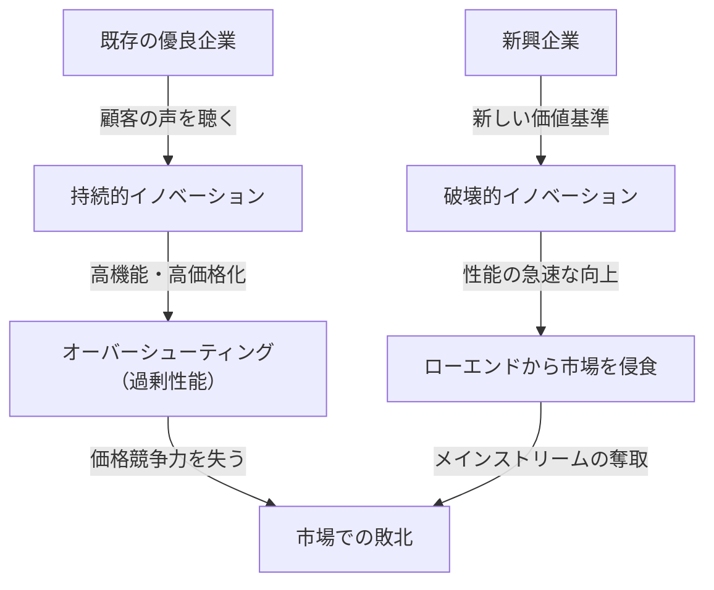
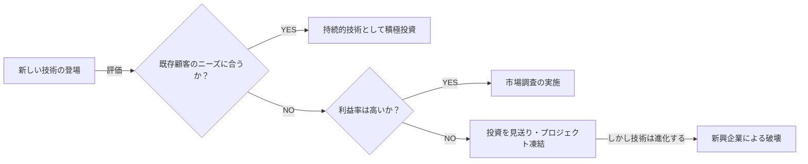

## はじめに：なぜ「完璧な経営」を行っている企業が失敗するのか？

ビジネスの世界において、「イノベーターのジレンマ（The Innovator's Dilemma）」ほど、経営者や起業家たちに深い洞察と衝撃を与えた概念は少ないでしょう。ハーバード・ビジネス・スクールの教授であった故クレイトン・クリステンセン氏が1997年に発表した同名の著書で提唱されたこの理論は、単なるビジネス書の一節を超え、現代の企業戦略における最も重要なパラダイムの一つとして定着しています。

私たちが通常考えるビジネスの成功法則は、「顧客の声に耳を傾け」「継続的に製品を改良し」「最も利益率の高い市場に投資する」というものです。これらは経営学の教科書に必ず書かれている「正しい経営」の基本です。しかし、クリステンセン氏の研究は、驚くべき事実を明らかにしました。それは、**「まさにその『正しい経営』を完璧に実行しているからこそ、偉大な企業は新興企業に敗れ去る」**というパラドックスです。

本記事では、この「イノベーターのジレンマ」の根底にあるメカニズム、持続的イノベーションと破壊的イノベーションの違い、具体的な歴史的事例、そして現代の企業がこの罠をいかにして回避し、自ら破壊者となるための戦略について、徹底的に深掘りして解説します。

---

## 1. イノベーションの2つの軌跡

イノベーターのジレンマを理解する上で、最も重要な前提となるのがイノベーションの分類です。クリステンセン氏は、テクノロジーの進化を「持続的イノベーション（Sustaining Innovation）」と「破壊的イノベーション（Disruptive Innovation）」の2つに大別しました。

### 持続的イノベーション（Sustaining Innovation）

持続的イノベーションとは、既存の主要顧客が重視する性能指標に沿って、製品やサービスの性能を向上させるイノベーションです。これは「漸進的（少しずつ良くなる）」なものもあれば、「画期的（一気に性能が跳ね上がる）」なものもありますが、ベクトルは常に「既存市場における既存の評価基準の向上」に向かっています。

優良企業は、この持続的イノベーションにおいて極めて優秀です。彼らは顧客調査を徹底的に行い、顧客が望む機能を追加し、より高品質な製品を、より高い価格（高い利益率）で提供するプロセスを組織のDNAとして組み込んでいます。

### 破壊的イノベーション（Disruptive Innovation）

一方で破壊的イノベーションとは、既存の主要顧客から見れば「性能が低く、おもちゃのように見える」ものの、全く新しい価値基準（安価、小型、シンプル、使いやすいなど）を提供するイノベーションです。

最初は既存の主流市場では見向きもされず、ニッチな新市場やローエンド（低価格帯）市場で細々と受け入れられます。しかし、テクノロジーの進化のスピードは、顧客のニーズが進化するスピードよりも速いため、やがて破壊的技術の性能は向上し、既存市場の顧客が求める最低限の性能水準（ハイエンドのニーズではなく、主流のニーズ）を満たすようになります。その瞬間、劇的な市場の入れ替わりが発生します。

---

## 2. なぜ優良企業は破壊的技術を見逃すのか？（ジレンマの構造）

ここで一つの疑問が生じます。なぜ、莫大な研究開発費と優秀な人材を抱える優良企業が、新興企業の「ちゃちな」技術に敗れてしまうのでしょうか？
彼らが技術的に無能だったわけではありません。むしろ、破壊的技術の初期プロトタイプを開発したのは既存の優良企業であるケースも多いのです。

優良企業が失敗する理由は、**「合理的な意思決定プロセスの結果」**なのです。これを説明する以下の要因が、強固なジレンマを形成しています。

### 1. リソース配分のメカニズム
企業のリソース（資金、人材、時間）は、最も利益率が高く、市場規模が大きいプロジェクトに優先的に配分されます。既存顧客からの強い要望がある「持続的イノベーション」のプロジェクトは、高い売上と利益が予測しやすいため、社内の稟議を簡単に通ります。一方、破壊的技術は初期段階では市場規模が小さく、利益率も低いため、投資対効果（ROI）の観点から「合理的」に却下されてしまいます。

### 2. 「顧客の声」という呪縛
優良企業は、優良顧客（最もお金を払ってくれる顧客）の声に耳を傾けます。しかし、破壊的技術の初期バージョンを既存の優良顧客に見せても、「こんな性能の低いものは要らない」「もっと今の製品のスペックを上げてくれ」と言われるだけです。企業は顧客に誠実であるがゆえに、破壊的技術から目を背けることになります。

### 3. バリュー・ネットワーク（価値基準の網）の束縛
企業は、自社だけでなく、サプライヤー、ディストリビューター、顧客などを含む「バリュー・ネットワーク」の中に存在しています。このネットワーク全体が「より高機能で高単価なもの」を良しとする文化と構造を持っているため、そこから外れた安価で低スペックな製品を流通させることは、ネットワーク全体の抵抗に遭います。

---

## 3. 破壊的イノベーションの2つのパターン

破壊的イノベーションには、市場の攻め方によって主に2つのパターンが存在します。

### ローエンド型破壊（Low-end Disruption）
既存市場において、「そこまでの高性能は求めていないが、安価であれば使いたい」と考えている「オーバーサーブ（過剰満足）された顧客」をターゲットにするアプローチです。
既存企業は、利益率の低いローエンド市場を喜んで新興企業に明け渡します。なぜなら、より利益率の高いハイエンド市場へのシフト（アップマーケット・マイグレーション）を進めているからです。しかし、新興企業はローエンドを足場にして徐々に技術力を高め、やがて中位層、上位層へと侵食していきます。
**（例：鉄鋼業界におけるミニミル（電炉）による高炉メーカーの破壊、トヨタ自動車によるアメリカ市場への初期参入）**

### 新市場型破壊（New-market Disruption）
これまでお金がない、スキルがない、時間がないなどの理由で製品を消費できなかった「非消費者」をターゲットに、全く新しい市場を創出するアプローチです。
既存製品よりも「シンプルで、便利で、手頃な価格」で提供することで、これまで存在しなかった需要を喚起します。既存企業から見れば、自分たちの市場のパイを奪われているようには見えないため、警戒が遅れます。
**（例：大型コンピュータに対するパーソナルコンピュータ、固定電話に対する初期の携帯電話、レコードに対するソニーのウォークマン）**

---

## 4. 歴史が証明する「破壊」の軌跡：ケーススタディ

### ケース1：ハードディスク・ドライブ（HDD）業界
クリステンセンが最も詳細に調査したのがHDD業界です。14インチから8インチ、5.25インチ、3.5インチへと小型化が進む過程で、既存のトップ企業はほぼ毎回、次世代サイズの覇権を新興企業に奪われました。
メインフレームの顧客は14インチの容量向上（持続的イノベーション）を求めており、初期の8インチHDD（容量が少なく、ミニコン向け）には見向きもしませんでした。既存企業は顧客の声を聴いて8インチへの投資を遅らせ、結果としてミニコン市場の成長とともに台頭した8インチの新興企業に、後の市場ごと飲み込まれました。

### ケース2：デジタルカメラによる銀塩フィルムの破壊
コダックは、世界で初めてデジタルカメラを開発した企業の一つでした。しかし、自社の莫大な利益を生み出していた「フィルムと現像」のビジネスモデル（バリュー・ネットワーク）を破壊することを恐れ、デジタル化への本格移行をためらいました。初期のデジカメは画質が悪く、既存のプロカメラマンは「おもちゃ」と評価しましたが、一般ユーザーにとって「現像代が不要ですぐ見られる」という新しい価値（破壊的イノベーション）は圧倒的でした。画質が一定の水準に達した時、市場は一瞬でひっくり返りました。

### ケース3：SaaSとクラウド・コンピューティング
エンタープライズ向けの巨大なオンプレミス（自社運用型）ソフトウェアを提供していたオラクルやSAPに対し、セールスフォースなどのSaaS企業は当初、「中小企業向けの簡易的なツール（ローエンド）」として登場しました。大企業は「セキュリティが不安」「機能が足りない」とSaaSを敬遠しましたが、SaaS側は急速に機能とセキュリティを向上させ、現在では大企業市場（ハイエンド）の中核を担うまでになっています。

---

## 5. イノベーターのジレンマを克服する「マネジメント戦略」

この強固な「合理性の罠」から逃れ、既存企業が破壊的イノベーションを自ら起こす（あるいは生き残る）ためには、これまでの常識を覆すマネジメントが必要です。

### 1. 独立した組織・スピンアウトの設立
破壊的プロジェクトを、既存の巨大な組織のプロセスや価値基準の中で育てようとしてはいけません。1000億円の売上がある部門にとって、1億円の新規事業は「誤差」に過ぎず、リソースを奪い合う会議で必ず敗北します。
破壊的技術には、**「小さな市場でも十分に興奮でき、独自の利益率の基準で動ける、完全に独立した別組織」**を与える必要があります。

### 2. 「失敗を前提」とした発見的アプローチ（Discovery-driven Planning）
持続的イノベーションでは、過去のデータに基づいた精緻な事業計画が可能です。しかし、破壊的イノベーションの市場は「まだ存在しない」ため、事前の予測は100%外れます。
最初から完璧な戦略を実行するのではなく、「仮説を立て、少額の資金でテストし、市場から学習して戦略を軌道修正する（ピボット）」というリーンスタートアップ的なアプローチが不可欠です。

### 3. 「ジョブ理論（Jobs to be Done）」による顧客理解
顧客の「属性（年齢、性別など）」や「製品の機能」ではなく、「顧客がどのような用事（ジョブ）を済ませるために、その製品を雇用（ハイア）しているのか？」という視点で市場を見直すことです。
これにより、既存製品の過剰な機能追加（オーバーシューティング）を防ぎ、全く異なるアプローチで顧客のジョブを安価に・シンプルに片付ける「破壊の機会」を発見することができます。

### 4. 資源・プロセス・価値基準（RPVフレームワーク）の評価
企業ができること・できないことは、「資源（Resource）」「プロセス（Process）」「価値基準（Values）」の3つで決まります。優良企業は豊富な「資源」を持っていますが、既存事業に最適化された「プロセス」と、高い利益率を求める「価値基準」が、破壊的イノベーションの妨げになります。リーダーは、新規事業に対して既存のプロセスと価値基準を適用しないよう、組織の仕組みそのものを再設計しなければなりません。

---

## 6. 現代（AI・Web3時代）におけるイノベーターのジレンマ

現在、生成AI（ChatGPTなど）の台頭により、GoogleやAppleなどの巨大テック企業がイノベーターのジレンマに直面していると言われています。
例えば、Googleは圧倒的な精度の検索エンジン（持続的イノベーションの極致）と広告モデルを持っています。そこに、時として事実誤認（ハルシネーション）を起こすものの、対話形式で直接答えを出す生成AIが登場しました。生成AIは既存の「検索してリンクをクリックし、広告を見る」という収益モデルを破壊する恐れがあるため、検索の巨人はAIへの全面移行にジレンマを抱えています。

このように、テクノロジーの進化が加速する現代において、「破壊」のサイクルはかつてないほど短くなっています。ソフトウェアやデジタル領域では、物理的な制約が少ないため、ローエンドからハイエンドへの侵食が数十年ではなく、数年、数ヶ月単位で起こり得ます。

---

## 結語：ジレンマを受け入れ、自らを破壊せよ

クレイトン・クリステンセンの「イノベーターのジレンマ」が教えてくれる最大の教訓は、**「現在の成功を支えている強みそのものが、未来の致命的な弱点になる」**ということです。

経営者やリーダーに求められるのは、既存事業の効率化と持続的成長を追求する「両利きの経営（Ambidextrous Organization）」を実践しつつ、時には自らの手で既存のキャッシュカウ（ドル箱事業）を破壊する勇気を持つことです。
「自社を破壊する技術が現れるのを待つのか、それとも自ら創り出すのか。」
この問いに向き合い続けることこそが、現代の激動のビジネス環境を生き抜く唯一の道と言えるでしょう。

（了）
