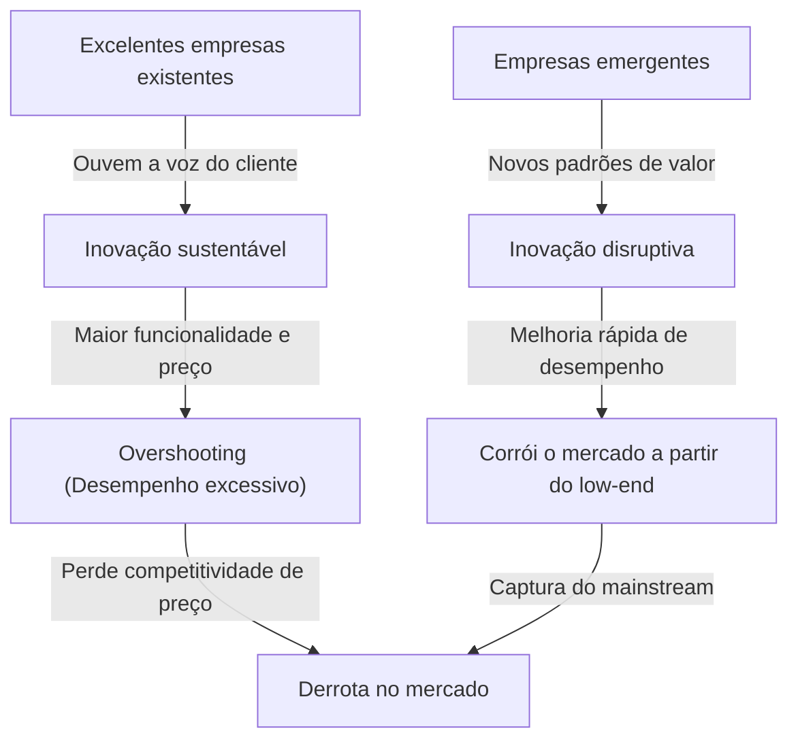
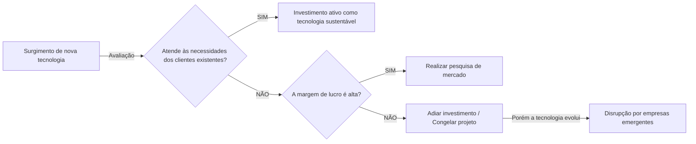

## Introdução: Por que empresas com "gestão perfeita" fracassam?

No mundo dos negócios, poucos conceitos forneceram reflexões e impactos tão profundos a gestores e empreendedores quanto "O Dilema do Inovador" (The Innovator's Dilemma). Esta teoria, proposta em 1997 pelo falecido professor da Harvard Business School, Clayton Christensen, no seu livro homônimo, transcendeu o status de apenas mais uma passagem em livros de negócios para se estabelecer como um dos paradigmas mais importantes na estratégia corporativa moderna.

A regra de sucesso nos negócios que normalmente pensamos é "ouvir a voz do cliente", "melhorar continuamente os produtos" e "investir nos mercados com as maiores margens de lucro". Estes são os fundamentos da "boa gestão" invariavelmente escritos nos manuais de administração. No entanto, a pesquisa de Christensen revelou um fato surpreendente. É o paradoxo de que **"exatamente por executarem perfeitamente essa 'boa gestão', grandes empresas acabam perdendo para empresas emergentes"**.

Neste artigo, aprofundaremos e explicaremos minuciosamente os mecanismos subjacentes a este "Dilema do Inovador", a diferença entre inovação sustentável e inovação disruptiva, exemplos históricos concretos, e as estratégias para as empresas modernas evitarem esta armadilha e se tornarem, elas próprias, as disruptoras.

---

## 1. As duas trajetórias da inovação

A premissa mais importante para entender o dilema do inovador é a classificação da inovação. Christensen dividiu a evolução tecnológica em duas grandes categorias: "Inovação Sustentável" (Sustaining Innovation) e "Inovação Disruptiva" (Disruptive Innovation).

### Inovação Sustentável (Sustaining Innovation)

A inovação sustentável é a inovação que melhora o desempenho de produtos ou serviços de acordo com as métricas de desempenho valorizadas pelos principais clientes existentes. Pode ser "incremental" (melhorando aos poucos) ou "radical" (com o desempenho saltando de uma vez), mas o vetor é sempre direcionado para a "melhoria dos critérios de avaliação existentes nos mercados atuais".

Empresas excelentes são extremamente boas nesta inovação sustentável. Elas conduzem pesquisas exaustivas com clientes, adicionam as funcionalidades que os clientes desejam e integram o processo de oferecer produtos de maior qualidade a preços mais altos (margens de lucro mais altas) no DNA da organização.

### Inovação Disruptiva (Disruptive Innovation)

Por outro lado, a inovação disruptiva é aquela que, embora possa parecer ter "baixo desempenho e parecer um brinquedo" do ponto de vista dos principais clientes existentes, oferece padrões de valor completamente novos (barato, pequeno, simples, fácil de usar, etc.).

No início, é ignorada pelos principais mercados existentes e é modestamente aceita em novos nichos de mercado ou no mercado low-end (de baixo custo). No entanto, como a velocidade da evolução tecnológica é mais rápida do que a velocidade com que as necessidades dos clientes evoluem, o desempenho da tecnologia disruptiva eventualmente melhora, atingindo o nível de desempenho mínimo exigido pelos clientes do mercado existente (não as necessidades de ponta, mas as necessidades convencionais). Nesse momento, ocorre uma substituição dramática no mercado.

---

## 2. Por que as empresas excelentes não percebem a tecnologia disruptiva? (A estrutura do dilema)

Aqui surge uma pergunta. Por que empresas excelentes, com enormes orçamentos de pesquisa e desenvolvimento e talentos brilhantes, perdem para a tecnologia "barata" das empresas emergentes?
Não é que elas fossem tecnologicamente incompetentes. Na verdade, em muitos casos, os primeiros protótipos de tecnologias disruptivas foram desenvolvidos por essas mesmas excelentes empresas existentes.

A razão pela qual as empresas excelentes falham é **"o resultado de um processo racional de tomada de decisão"**. Os seguintes fatores, que explicam isso, formam um dilema robusto.

### 1. O mecanismo de alocação de recursos
Os recursos da empresa (fundos, talentos, tempo) são alocados prioritariamente aos projetos com as maiores margens de lucro e o maior tamanho de mercado. Os projetos de "inovação sustentável", que têm forte demanda dos clientes existentes, passam facilmente pelos processos de aprovação interna porque altas vendas e lucros são fáceis de prever. Por outro lado, a tecnologia disruptiva é "racionalmente" rejeitada do ponto de vista do retorno sobre o investimento (ROI), porque o tamanho do mercado é pequeno e a margem de lucro é baixa nos estágios iniciais.

### 2. A maldição da "Voz do Cliente"
As empresas excelentes ouvem a voz de seus melhores clientes (os que pagam mais). No entanto, se mostrarem as primeiras versões da tecnologia disruptiva a esses clientes excelentes, ouvirão apenas: "Não precisamos de algo com desempenho tão baixo" e "Aumentem as especificações do produto atual". Por serem fiéis aos seus clientes, as empresas acabam desviando o olhar da tecnologia disruptiva.

### 3. As restrições da Rede de Valor (Value Network)
Uma empresa existe dentro de uma "rede de valor" que inclui não apenas ela mesma, mas também fornecedores, distribuidores, clientes, etc. Como toda essa rede tem a cultura e a estrutura de valorizar "coisas mais funcionais e mais caras", distribuir produtos baratos e com especificações inferiores, que desviam dessa norma, enfrentará a resistência de toda a rede.

---

## 3. Os 2 padrões de inovação disruptiva

A inovação disruptiva possui principalmente dois padrões de acordo com a forma como o mercado é atacado.

### Disrupção de Low-end (Low-end Disruption)
É a abordagem de visar, nos mercados existentes, os "clientes superatendidos (over-served)" que pensam: "Não exijo um desempenho tão alto, mas adoraria usá-lo se fosse barato".
As empresas existentes entregam com prazer o mercado low-end de baixa margem para as emergentes. Por quê? Porque elas estão progredindo em sua mudança para o mercado high-end (upmarket migration), que tem margens de lucro maiores. No entanto, as emergentes usam o low-end como um ponto de apoio para aumentar gradualmente suas capacidades tecnológicas, e logo corroem as camadas intermediárias e superiores.
**(Exemplo: A disrupção dos fabricantes de altos-fornos pelas minimills (fornos elétricos) na indústria do aço, a entrada inicial da Toyota no mercado dos EUA)**

### Disrupção de Novo Mercado (New-market Disruption)
É a abordagem de criar um mercado completamente novo, visando os "não consumidores" que até agora não podiam consumir o produto por falta de dinheiro, habilidades, tempo, etc.
Ao oferecê-lo de forma mais "simples, conveniente e acessível" do que os produtos existentes, elas despertam uma demanda que não existia antes. Do ponto de vista das empresas existentes, não parece que o bolo do seu mercado está sendo roubado, então a cautela é tardia.
**(Exemplo: Os computadores pessoais contra os computadores mainframe (grande porte), os primeiros telefones celulares contra telefones fixos, o Walkman da Sony contra os discos de vinil)**

---

## 4. A trajetória da "disrupção" provada pela história: Estudos de Caso

### Caso 1: A Indústria de Discos Rígidos (HDD)
Christensen investigou mais detalhadamente a indústria de HDD. Durante o processo de miniaturização de 14 polegadas para 8 polegadas, 5,25 polegadas e 3,5 polegadas, as principais empresas existentes perderam quase todas as vezes a hegemonia do tamanho da próxima geração para as emergentes.
Os clientes de mainframes exigiam maior capacidade das 14 polegadas (inovação sustentável) e ignoraram os primeiros HDDs de 8 polegadas (baixa capacidade, destinados a minicomputadores). As empresas existentes ouviram a voz de seus clientes, adiaram os investimentos em 8 polegadas e, como resultado, foram engolidas, junto com seus mercados, pelas empresas emergentes de 8 polegadas que surgiram com o crescimento do mercado de minicomputadores.

### Caso 2: A disrupção do filme fotográfico de prata pelas câmeras digitais
A Kodak foi uma das primeiras empresas no mundo a desenvolver uma câmera digital. No entanto, com medo de destruir seu modelo de negócios de "filme e revelação" (rede de valor), que gerava lucros maciços para a empresa, hesitou em migrar totalmente para o digital. As primeiras câmeras digitais tinham má qualidade de imagem, e os fotógrafos profissionais as avaliaram como um "brinquedo", mas para os usuários comuns o novo valor de "não precisar pagar revelação e poder ver imediatamente" (inovação disruptiva) era avassalador. Quando a qualidade da imagem atingiu um certo nível, o mercado virou de cabeça para baixo em um instante.

### Caso 3: SaaS e Cloud Computing
Contra a Oracle e a SAP, que forneciam softwares empresariais massivos on-premise (gerenciados localmente), empresas de SaaS como a Salesforce apareceram inicialmente como "ferramentas simples para pequenas e médias empresas (low-end)". As grandes empresas evitavam o SaaS dizendo: "Preocupações com segurança" e "Falta de funcionalidades", mas o lado do SaaS melhorou rapidamente suas funcionalidades e segurança, e hoje desempenha um papel central no mercado de grandes empresas (high-end).

---

## 5. "Estratégias de Gestão" para superar o Dilema do Inovador

Para escapar dessa forte "armadilha da racionalidade" e para que as empresas existentes provoquem (ou sobrevivam a) a inovação disruptiva elas próprias, é necessária uma gestão que contrarie o senso comum do passado.

### 1. Estabelecimento de organizações independentes / Spin-outs
Você não deve tentar cultivar projetos disruptivos dentro dos processos e padrões de valor de organizações enormes já existentes. Para um departamento com US$ 1 bilhão em vendas, um novo negócio de US$ 1 milhão é apenas uma "margem de erro" e certamente será derrotado em reuniões de disputa de recursos.
A tecnologia disruptiva requer **"uma organização separada, completamente independente, que possa se empolgar o suficiente mesmo em um mercado pequeno e possa agir com base em seus próprios padrões de margem de lucro"**.

### 2. Abordagem de descoberta assumindo o "fracasso" (Discovery-driven Planning)
Na inovação sustentável, planos de negócios precisos baseados em dados do passado são possíveis. No entanto, como o mercado de inovação disruptiva "ainda não existe", as previsões antecipadas estarão 100% erradas.
Em vez de executar uma estratégia perfeita desde o início, uma abordagem como a da Lean Startup é essencial: "levantar hipóteses, testar com uma pequena quantia de fundos, aprender com o mercado e corrigir a rota da estratégia (pivotar)".

### 3. Entendimento do cliente através da "Teoria dos Jobs (Jobs to be Done)"
Não se trata de olhar o mercado através dos "atributos" do cliente (idade, sexo, etc.) ou da "função do produto", mas sim através da perspectiva de: "Para que tipo de tarefa (job) o cliente está 'contratando' (hiring) aquele produto?".
Isso evita a adição excessiva de recursos aos produtos existentes (overshooting) e permite descobrir "oportunidades de disrupção" em que se pode resolver o trabalho do cliente de forma simples e barata, utilizando uma abordagem completamente diferente.

### 4. Avaliação de Recursos, Processos e Padrões de Valor (Framework RPV)
O que uma empresa pode ou não fazer é determinado por três coisas: "Recursos (Resource)", "Processos (Process)" e "Valores (Values)". As empresas excelentes têm muitos "recursos", mas seus "processos" otimizados para negócios existentes e seus "valores" em busca de altas margens de lucro prejudicam a inovação disruptiva. Os líderes devem reprojetar a própria estrutura organizacional para não aplicar os processos e valores existentes a novos negócios.

---

## 6. O Dilema do Inovador nos Tempos Modernos (Era da IA / Web3)

Atualmente, diz-se que gigantes da tecnologia como o Google e a Apple estão enfrentando o dilema do inovador devido à ascensão da IA generativa (como o ChatGPT).
Por exemplo, o Google tem um mecanismo de busca incrivelmente preciso (o auge da inovação sustentável) e um modelo de anúncios. Lá, surgiu a IA generativa, que dá respostas diretamente num formato interativo, embora por vezes sofra alucinações (fatos equivocados). Como a IA generativa ameaça perturbar o modelo de receita existente de "pesquisar, clicar num link e ver anúncios", o gigante das buscas enfrenta um dilema quanto à transição total para a IA.

Desta forma, nos tempos modernos onde a evolução da tecnologia acelera, o ciclo de "disrupção" é mais curto do que nunca. No domínio de software e no âmbito digital, devido à escassez de restrições físicas, a erosão do low-end ao high-end pode ocorrer em unidades de anos ou meses, e não de décadas.

---

## Conclusão: Aceite o dilema e desestabilize a si próprio

A maior lição que "O Dilema do Inovador" de Clayton Christensen nos ensina é que **"os próprios pontos fortes que apoiam o sucesso atual tornar-se-ão falhas fatais no futuro"**.

O que se exige de gestores e líderes é implementar a "Organização Ambidestra (Ambidextrous Organization)", que busca eficiência e crescimento sustentável nos negócios existentes, e, ao mesmo tempo, ter a coragem de destruir a sua própria vaca leiteira (cash cow) com as próprias mãos em certos momentos.
"Vamos esperar que a tecnologia que destruirá a nossa empresa apareça, ou vamos nós mesmos criá-la?"
Pode-se dizer que continuar a enfrentar essa questão é o único caminho para sobreviver no turbulento ambiente de negócios de hoje.

(Fim)
