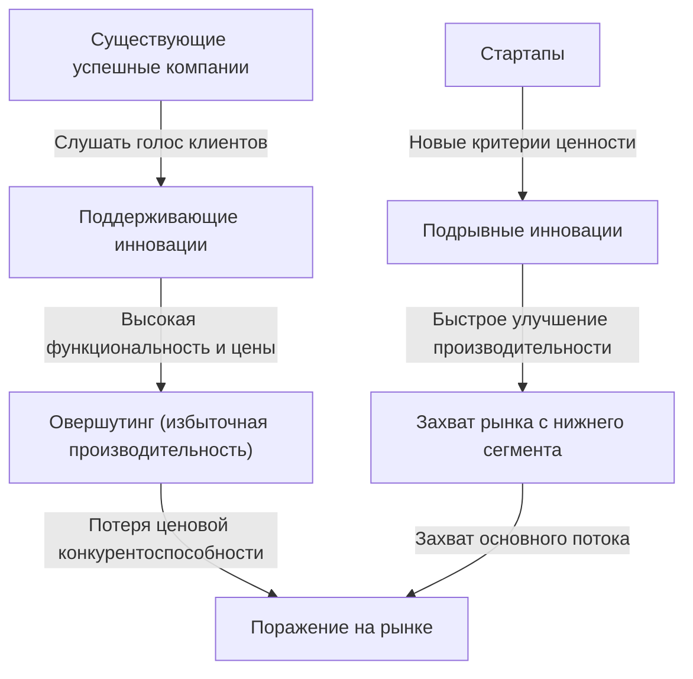
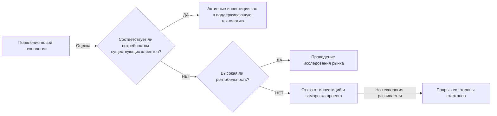

## Введение: Почему компании, практикующие "идеальный менеджмент", терпят неудачу?

В мире бизнеса мало какие концепции дали столь глубокое понимание и оказали такое шокирующее влияние на руководителей и предпринимателей, как "Дилемма инноватора" (The Innovator's Dilemma). Эта теория, предложенная покойным профессором Гарвардской школы бизнеса Клейтоном Кристенсеном в его одноименной книге 1997 года, вышла за рамки обычного отрывка из деловой литературы и утвердилась как одна из важнейших парадигм в современной корпоративной стратегии.

Правила успеха в бизнесе, о которых мы обычно думаем, заключаются в следующем: "прислушиваться к голосу клиентов", "постоянно улучшать продукты" и "инвестировать в рынки с самой высокой рентабельностью". Это основы "правильного менеджмента", которые обязательно описаны в учебниках по бизнесу. Однако исследования Кристенсена выявили удивительный факт. Это парадокс, который заключается в том, что **"именно потому, что великие компании безупречно реализуют этот 'правильный менеджмент', они терпят поражение от стартапов"**.

В этой статье мы подробно и глубоко рассмотрим механизмы, лежащие в основе "дилеммы инноватора", разницу между поддерживающими и подрывными инновациями, конкретные исторические примеры, а также стратегии того, как современные компании могут избежать этой ловушки и сами стать разрушителями (подрывателями).

---

## 1. Две траектории инноваций

Для понимания дилеммы инноватора важнейшей предпосылкой является классификация инноваций. Кристенсен разделил технологическую эволюцию на две основные категории: "Поддерживающие инновации" (Sustaining Innovation) и "Подрывные инновации" (Disruptive Innovation).

### Поддерживающие инновации (Sustaining Innovation)

Поддерживающие инновации — это инновации, которые улучшают производительность продуктов и услуг в соответствии с показателями эффективности, которые ценятся существующими основными клиентами. Они могут быть "постепенными" (понемногу улучшающимися) или "прорывными" (когда производительность резко возрастает), но их вектор всегда направлен на "улучшение существующих критериев оценки на существующих рынках".

Успешные компании чрезвычайно преуспевают в этих поддерживающих инновациях. Они тщательно исследуют клиентов, добавляют желаемые функции и внедряют процесс предоставления высококачественных продуктов по более высоким ценам (с высокой нормой прибыли) прямо в ДНК своей организации.

### Подрывные инновации (Disruptive Innovation)

С другой стороны, подрывные инновации предлагают совершенно новые критерии ценности (дешевизна, компактность, простота, удобство использования и т.д.), хотя с точки зрения существующих основных клиентов они "имеют низкую производительность и выглядят как игрушки".

Поначалу на них не обращают внимания на существующих основных рынках, и они скромно принимаются на новых нишевых рынках или рынках низкого уровня (low-end). Однако скорость эволюции технологий выше скорости эволюции потребностей клиентов, поэтому со временем производительность подрывной технологии улучшается и начинает соответствовать минимальному уровню производительности, требуемому клиентами существующего рынка (не потребности высшего сегмента, а потребности основного потока). В этот момент происходит резкая смена рынка.

---

## 2. Почему успешные компании упускают подрывные технологии? (Структура дилеммы)

Здесь возникает один вопрос. Почему успешные компании с огромными бюджетами на исследования и разработки и талантливыми кадрами проигрывают "дешевым" технологиям стартапов?
Они не были технически некомпетентными. Напротив, во многих случаях именно существующие успешные компании разрабатывали первоначальные прототипы подрывных технологий.

Причина неудач успешных компаний заключается в **"результатах процесса принятия рациональных решений"**. Следующие факторы, объясняющие это, формируют прочную дилемму.

### 1. Механизм распределения ресурсов
Ресурсы компании (капитал, кадры, время) в приоритетном порядке направляются на проекты с самой высокой рентабельностью и самым большим объемом рынка. Проекты "поддерживающих инноваций", на которые есть сильный запрос от существующих клиентов, легко получают одобрение руководства, так как прогнозируются высокие продажи и прибыль. С другой стороны, подрывные технологии на начальном этапе имеют небольшой объем рынка и низкую рентабельность, поэтому они "рационально" отвергаются с точки зрения рентабельности инвестиций (ROI).

### 2. Проклятие "Голоса клиента"
Успешные компании прислушиваются к своим лучшим клиентам (тем, кто платит больше всего). Однако, если показать начальную версию подрывной технологии существующему премиум-клиенту, он скажет лишь: "Мне не нужна такая низкая производительность", "Улучшите характеристики текущего продукта". Поскольку компании лояльны к своим клиентам, они отворачиваются от подрывных технологий.

### 3. Ограничения "Сети создания стоимости" (Value Network)
Компания существует не только сама по себе, но и внутри "сети создания стоимости", которая включает поставщиков, дистрибьюторов, клиентов и т.д. Вся эта сеть имеет культуру и структуру, одобряющую "более функциональные и дорогие продукты", поэтому распространение дешевых продуктов с низкими характеристиками, которые выпадают из этой сети, встретит сопротивление всей системы.

---

## 3. Два паттерна подрывных инноваций

Существует в основном два паттерна подрывных инноваций в зависимости от того, как они атакуют рынок.

### Подрыв нижнего сегмента (Low-end Disruption)
Это подход, нацеленный на "переобслуженных клиентов" (overserved customers) на существующем рынке, которые считают: "Мне не нужна такая высокая производительность, но я бы пользовался этим, если бы это было дешевле".
Существующие компании охотно уступают стартапам низкомаржинальный рынок нижнего уровня (low-end). Это происходит потому, что они переходят на более маржинальный рынок высшего уровня (upmarket migration). Однако стартапы, используя нижний сегмент в качестве плацдарма, постепенно наращивают свои технологические возможности и в конечном итоге захватывают средний и высший сегменты.
**(Пример: Подрыв производителей доменных печей мини-заводами (электродуговыми печами) в сталелитейной промышленности; начальное проникновение Toyota на рынок США)**

### Подрыв нового рынка (New-market Disruption)
Это подход, создающий совершенно новый рынок, нацеленный на "непотребителей" (non-consumers), которые ранее не могли потреблять продукт из-за отсутствия денег, навыков или времени.
Предлагая продукт, который "проще, удобнее и доступнее" по сравнению с существующими продуктами, они пробуждают ранее не существовавший спрос. С точки зрения существующих компаний это не выглядит так, будто у них отбирают долю рынка, поэтому они поздно начинают проявлять осторожность.
**(Пример: Персональные компьютеры против мейнфреймов; ранние мобильные телефоны против стационарных; Sony Walkman против виниловых пластинок)**

---

## 4. Исторические примеры "Подрыва": Тематические исследования

### Кейс 1: Индустрия жестких дисков (HDD)
Кристенсен наиболее подробно исследовал индустрию HDD. В процессе миниатюризации с 14 дюймов до 8, 5.25 и 3.5 дюймов существующие лидеры рынка почти каждый раз уступали стартапам господство в следующем размере.
Клиентам мейнфреймов требовалось увеличение емкости 14-дюймовых дисков (поддерживающая инновация), и они не обращали внимания на ранние 8-дюймовые HDD (с малой емкостью, предназначенные для мини-компьютеров). Существующие компании, прислушиваясь к клиентам, откладывали инвестиции в 8 дюймов и, как следствие, были поглощены стартапами, которые выросли вместе с рынком мини-компьютеров.

### Кейс 2: Подрыв фотопленки цифровыми камерами
Kodak была одной из первых компаний в мире, разработавших цифровую камеру. Однако, опасаясь разрушить свою бизнес-модель "пленка и проявка" (сеть создания стоимости), которая приносила огромные прибыли, она колебалась перед полномасштабным переходом на цифровые технологии. Ранние цифровые камеры имели плохое качество изображения, и профессиональные фотографы расценивали их как "игрушки", но для обычных пользователей новая ценность (подрывная инновация) — "не нужно платить за проявку и можно сразу посмотреть" — была подавляющей. Когда качество изображения достигло определенного уровня, рынок перевернулся в одно мгновение.

### Кейс 3: SaaS и облачные вычисления
Против Oracle и SAP, которые предоставляли гигантское локальное (on-premise) программное обеспечение для предприятий, SaaS-компании, такие как Salesforce, изначально появились как "простые инструменты для малого и среднего бизнеса (low-end)". Крупные предприятия избегали SaaS, говоря, что "безопасность вызывает опасения" и "не хватает функций", но SaaS быстро улучшили свои функции и безопасность, и сегодня они составляют ядро рынка крупных предприятий (high-end).

---

## 5. "Стратегии менеджмента" для преодоления дилеммы инноватора

Чтобы вырваться из этой прочной "ловушки рациональности" и чтобы существующая компания могла сама инициировать подрывные инновации (или хотя бы выжить), необходим менеджмент, ломающий прежние стереотипы.

### 1. Создание независимой организации / Spin-out
Не пытайтесь выращивать подрывные проекты в рамках процессов и критериев ценности существующей огромной организации. Для подразделения с доходом в 1 миллиард долларов новый бизнес на 1 миллион долларов — это всего лишь "погрешность", и он обязательно проиграет на совещаниях за распределение ресурсов.
Подрывным технологиям необходимо предоставить **"полностью независимую отдельную организацию, которая может быть достаточно воодушевлена даже небольшим рынком и действовать по собственным стандартам рентабельности"**.

### 2. Эвристический подход, предполагающий возможность неудачи (Discovery-driven Planning)
При поддерживающих инновациях возможно точное бизнес-планирование на основе прошлых данных. Однако рынков подрывных инноваций "еще не существует", поэтому предварительные прогнозы будут ошибочными на 100%.
Вместо того чтобы изначально реализовывать идеальную стратегию, необходим подход в стиле Lean Startup: "строить гипотезы, тестировать с небольшими инвестициями, учиться у рынка и корректировать стратегию (pivot)".

### 3. Понимание клиентов через "Теорию работ" (Jobs to be Done)
Смотреть на рынок нужно не с точки зрения "атрибутов" клиента (возраст, пол и т.д.) или "функций продукта", а с точки зрения того: "Какую работу (job) клиенту нужно сделать, для которой он нанимает (hire) этот продукт?".
Это позволяет предотвратить чрезмерное добавление функций к существующим продуктам (overshooting) и обнаружить "возможности для подрыва", решая задачи клиента дешево и просто, используя совершенно другой подход.

### 4. Оценка ресурсов, процессов и ценностей (Фреймворк RPV)
То, что компания может и не может делать, определяется тремя факторами: "Ресурсами" (Resource), "Процессами" (Process) и "Ценностями" (Values). Успешные компании обладают богатыми "ресурсами", но "процессы", оптимизированные под существующий бизнес, и "ценности", требующие высокой нормы прибыли, становятся препятствием для подрывных инноваций. Лидеры должны перепроектировать саму структуру организации так, чтобы существующие процессы и ценности не применялись к новому бизнесу.

---

## 6. Дилемма инноватора в современную эпоху (Эпоха ИИ и Web3)

В настоящее время говорят, что с появлением генеративного ИИ (например, ChatGPT) технологические гиганты, такие как Google и Apple, столкнулись с дилеммой инноватора.
Например, Google обладает поисковой системой с подавляющей точностью (вершина поддерживающих инноваций) и рекламной моделью. И тут появился генеративный ИИ, который, хотя иногда и допускает фактические ошибки (галлюцинации), выдает прямые ответы в диалоговом формате. Генеративный ИИ может разрушить существующую модель монетизации "поиск, клик по ссылке, просмотр рекламы", поэтому поисковый гигант испытывает дилемму перед полным переходом на ИИ.

Таким образом, в современную эпоху, когда развитие технологий ускоряется, циклы "подрыва" стали короче, чем когда-либо. В сфере программного обеспечения и цифровых технологий физических ограничений мало, поэтому переход от нижнего сегмента к высшему может произойти не за десятилетия, а за годы или месяцы.

---

## Заключение: Примите дилемму и разрушьте себя сами

Главный урок, которому нас учит "Дилемма инноватора" Клейтона Кристенсена, заключается в том, что **"сильные стороны, которые поддерживают ваш текущий успех, станут вашими фатальными слабостями в будущем"**.

От руководителей и лидеров требуется практика "Амбидекстричной организации" (Ambidextrous Organization) — стремление к повышению эффективности и устойчивому росту существующего бизнеса, и в то же время смелость иногда собственными руками разрушать свою "дойную корову" (высокоприбыльный бизнес).
"Ждать ли появления технологии, которая разрушит вашу компанию, или создать ее самим?"
Продолжение поиска ответа на этот вопрос — возможно, единственный способ выжить в бурной современной бизнес-среде.

(Конец)
