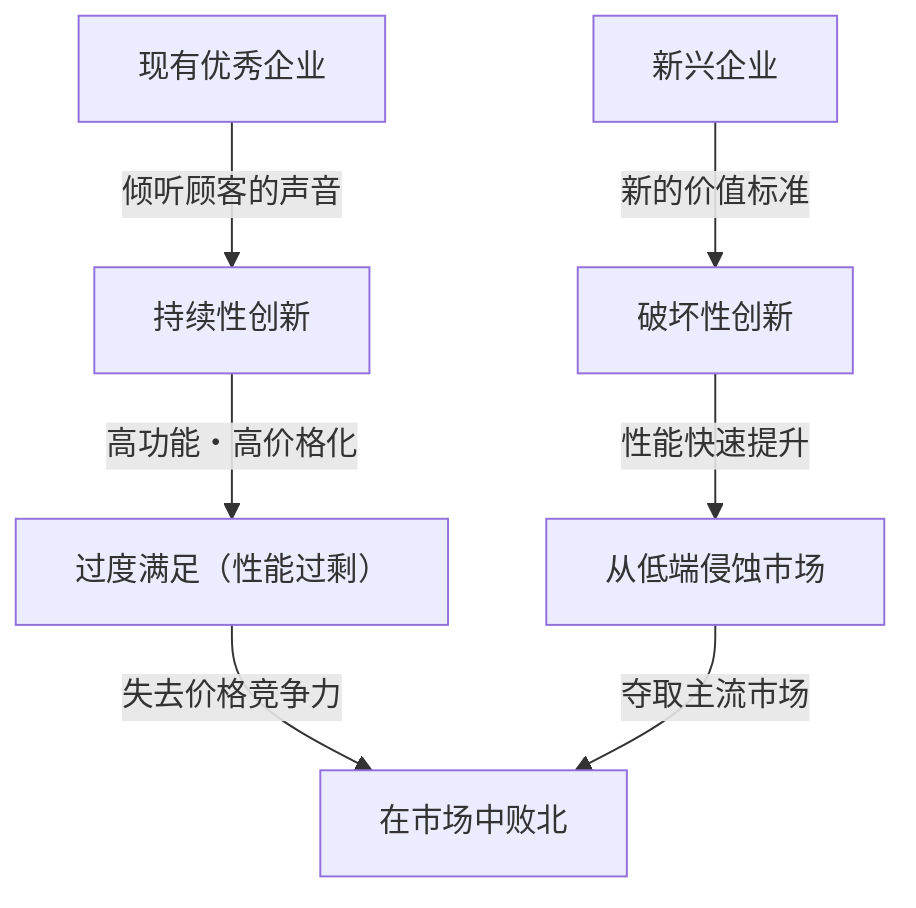
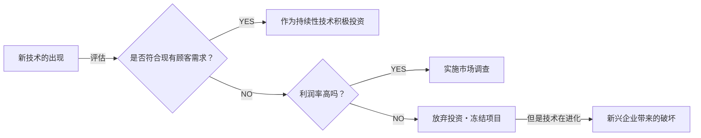

## 引言：为什么实施“完美经营”的企业会失败？

在商业世界中，很少有像“创新者的窘境（The Innovator's Dilemma）”这样给经营者和创业者带来如此深刻洞察和冲击的概念。哈佛商学院已故教授克莱顿·克里斯坦森（Clayton Christensen）于1997年在其同名著作中提出了这一理论，它不仅是商业书籍中的一个章节，更已成为现代企业战略中最重要的范式之一。

我们通常认为商业成功的法则就是：“倾听顾客的声音”、“持续改进产品”、“向利润率最高的市场投资”。这些都是经营学教科书上必定会写的“正确经营”的基本原则。然而，克里斯坦森的研究揭示了一个令人震惊的事实。那就是一个悖论：**“正因为完美地执行了所谓的‘正确经营’，伟大的企业才会败给新兴企业。”**

本文将深入探讨“创新者的窘境”背后的根本机制、持续性创新与破坏性创新的区别、具体的历史案例，以及现代企业如何避免这一陷阱、甚至自己成为破坏者的战略。

---

## 1. 创新的两条轨迹

在理解创新者的窘境时，最重要的前提就是对创新的分类。克里斯坦森将技术的进化大致分为“持续性创新（Sustaining Innovation）”和“破坏性创新（Disruptive Innovation）”两种。

### 持续性创新（Sustaining Innovation）

持续性创新是指沿着现有主要顾客重视的性能指标，不断提升产品或服务性能的创新。这既包括“渐进式（一点点变好）”的创新，也包括“突破式（性能一下子大幅飞跃）”的创新，但其方向始终是“提升现有市场中的现有评价标准”。

优秀企业在持续性创新方面极其出色。他们彻底进行顾客调查，增加顾客期望的功能，并将以更高价格（高利润率）提供更高质量产品的流程融入了组织的DNA中。

### 破坏性创新（Disruptive Innovation）

另一方面，破坏性创新则是指那些在现有主要顾客看来“性能低下、像玩具一样”，但却能提供全新价值标准（如廉价、小巧、简单、易用等）的创新。

一开始，它们在现有的主流市场无人问津，只能在利基新市场或低端（低价位）市场勉强被接受。但是，技术进化的速度往往快于顾客需求进化的速度，因此破坏性技术的性能不久后就会提升，并达到现有市场顾客所要求的最低性能水平（不是高端需求，而是主流需求）。就在那一瞬间，市场会发生戏剧性的交替。

---

## 2. 为什么优秀企业会错过破坏性技术？（窘境的结构）

这里产生了一个疑问。为什么拥有庞大研发经费和优秀人才的优秀企业，会败给新兴企业那些“简陋”的技术呢？
这并不是因为他们在技术上无能。相反，破坏性技术的早期原型往往正是由这些现有的优秀企业开发出来的。

优秀企业失败的原因，其实是**“合理决策过程的结果”**。以下因素解释了这一点，并形成了坚固的窘境。

### 1. 资源分配的机制
企业的资源（资金、人才、时间）会被优先分配给利润率最高、市场规模最大的项目。有现有顾客强烈要求的“持续性创新”项目，因为能容易地预测出高销售额和利润，所以可以轻松通过公司内部的审批。另一方面，破坏性技术在初期阶段市场规模小，利润率也低，从投资回报率（ROI）的角度来看，就会被“合理”地否决。

### 2. “顾客声音”的魔咒
优秀企业会倾听优质顾客（最愿意付钱的顾客）的声音。但是，即使把破坏性技术的早期版本展示给现有的优质顾客看，他们也只会说：“我们不需要这种性能低下的东西”、“请进一步提高现在产品的规格”。企业正是因为对顾客忠诚，才对破坏性技术视而不见。

### 3. 价值网络（价值标准的网络）的束缚
企业不仅仅是自身，还存在于一个包含供应商、分销商、顾客等在内的“价值网络”中。由于整个网络都拥有一种认为“功能更强、单价更高的东西更好”的文化和结构，因此如果要在其中流通那些偏离此标准的廉价、低规格产品，就会遭到整个网络的抵抗。

---

## 3. 破坏性创新的两种模式

破坏性创新根据进攻市场的方式，主要存在两种模式。

### 低端型破坏（Low-end Disruption）
在现有市场中，以那些“不追求那么高的性能，但如果便宜就想用”的“被过度服务（过度满足）的顾客”为目标的策略。
现有企业会很高兴地将利润率较低的低端市场让给新兴企业。因为他们正在向利润率更高的高端市场转移（向上游市场迁移）。然而，新兴企业以低端为立足点，逐步提高技术实力，最终会向上侵蚀到中端甚至高端市场。
**（例如：钢铁行业中迷你厂（电炉）对高炉制造商的破坏，丰田汽车初期进入美国市场）**

### 新市场型破坏（New-market Disruption）
以那些以前因为没钱、没技能、没时间等原因而无法消费产品的“非消费者”为目标，创造出全新市场的策略。
通过提供比现有产品“更简单、更方便、价格更实惠”的产品，唤起以前不存在的需求。从现有企业的角度来看，并不觉得自己市场的蛋糕被抢走，因此往往警惕较晚。
**（例如：个人电脑相对于大型计算机，早期移动电话相对于固定电话，索尼Walkman相对于唱片机）**

---

## 4. 历史证明的“破坏”轨迹：案例研究

### 案例1：硬盘驱动器（HDD）行业
克里斯坦森调查最详细的就是HDD行业。在硬盘尺寸从14英寸缩小到8英寸、5.25英寸、再到3.5英寸的过程中，现有的顶级企业几乎每一次都将下一代尺寸的霸权拱手让给了新兴企业。
大型机的顾客需要的是14英寸硬盘容量的提升（持续性创新），对初期的8英寸HDD（容量小、面向小型机）根本不屑一顾。现有企业听从了顾客的声音，推迟了对8英寸硬盘的投资，结果随着小型机市场的增长而崛起的8英寸新兴企业，最终将他们连同后来的市场一起吞噬了。

### 案例2：数码相机对银盐胶卷的破坏
柯达是世界上最早开发出数码相机的企业之一。但是，他们害怕破坏为公司带来巨大极润的“胶卷与冲洗”商业模式（价值网络），因此对全面向数字化转型犹豫不决。早期的数码相机画质很差，被现有的专业摄影师评价为“玩具”，但对于普通用户来说，“不需要冲洗费、可以马上看到”这种新价值（破坏性创新）是压倒性的。当画质达到一定水平时，市场在瞬间就被颠覆了。

### 案例3：SaaS与云计算
相对于提供面向企业级巨大本地化（企业内部部署型）软件的甲骨文和SAP，Salesforce等SaaS企业最初是作为“面向中小企业的简易工具（低端）”出现的。大企业以“担心安全问题”、“功能不足”为由敬而远之，但SaaS企业迅速提升了功能安全性，现在甚至已成为大企业市场（高端）的核心。

---

## 5. 克服创新者窘境的“管理战略”

为了逃脱这个坚固的“合理性陷阱”，并使现有企业能够自己发起破坏性创新（或者生存下来），需要实施颠覆以往常识的管理方式。

### 1. 设立独立组织・分拆上市
不要试图在现有庞大组织的流程或价值标准中培育破坏性项目。对于销售额达1000亿日元的部门来说，1亿日元的新业务只是“误差”，在争夺资源的会议上必定会失败。
对于破坏性技术，必须给予一个**“能够在小市场中感到足够兴奋，并能以独特的利润率标准运作的、完全独立的另外一个组织”**。

### 2. 以“失败为前提”的发现驱动法（Discovery-driven Planning）
在持续性创新中，可以基于过去的数据制定出精确的商业计划。但是，破坏性创新的市场“尚不存在”，因此事前的预测百分之百会落空。
不能从一开始就执行完美的战略，而是必须采取“建立假设，用少量资金进行测试，从市场中学习并修正战略（Pivot）”这种精益创业式的策略。

### 3. 基于“待办任务（Jobs to be Done）”理论理解顾客
与其关注顾客的“属性（年龄、性别等）”或“产品的功能”，不如从“顾客为了完成什么样的差事（任务），而雇用（购买）了那个产品？”的视角来重新审视市场。
这样可以防止现有产品过度增加功能（过度满足），并能发现以完全不同的方法，低价、简单地解决顾客任务的“破坏机会”。

### 4. 资源、流程、价值标准（RPV框架）的评估
企业能做什么、不能做什么，取决于“资源（Resource）”、“流程（Process）”和“价值标准（Values）”这三个要素。优秀企业拥有丰富的“资源”，但针对现有业务优化的“流程”以及追求高利润率的“价值标准”，却成为了破坏性创新的阻碍。领导者必须重新设计组织的机制本身，以确保不会将现有的流程和价值标准应用于新业务上。

---

## 6. 现代（AI・Web3时代）的创新者窘境

目前，随着生成式AI（如ChatGPT等）的崛起，据说谷歌和苹果等科技巨头正面临着创新者的窘境。
例如，谷歌拥有精度压倒性优势的搜索引擎（持续性创新的极致）和广告模式。而就在此时，虽然有时会产生事实性错误（幻觉），但能以对话形式直接给出答案的生成式AI出现了。由于生成式AI可能会破坏现有的“搜索后点击链接，然后看广告”的盈利模式，这位搜索巨头在全面向AI转型的过程中陷入了窘境。

像这样，在技术进化加速的现代社会中，“破坏”的周期变得前所未有的短暂。在软件和数字领域，由于物理限制很少，从低端向高端的侵蚀可能不再需要几十年，而是几年甚至几个月就能发生。

---

## 结语：接受窘境，破坏自我

克莱顿·克里斯坦森的“创新者的窘境”告诉我们的最大教训是：**“支撑当前成功的优势本身，将成为未来致命的弱点。”**

对经营者和领导者的要求是，在实践追求现有业务效率化和持续增长的“双元性经营（Ambidextrous Organization）”的同时，有时也必须拥有亲手破坏现有摇钱树（高盈利业务）的勇气。
“是等待破坏自家企业的技术出现，还是自己去创造？”
不断面对这个问题，可以说是在当今动荡的商业环境中生存下去的唯一出路。

（完）
