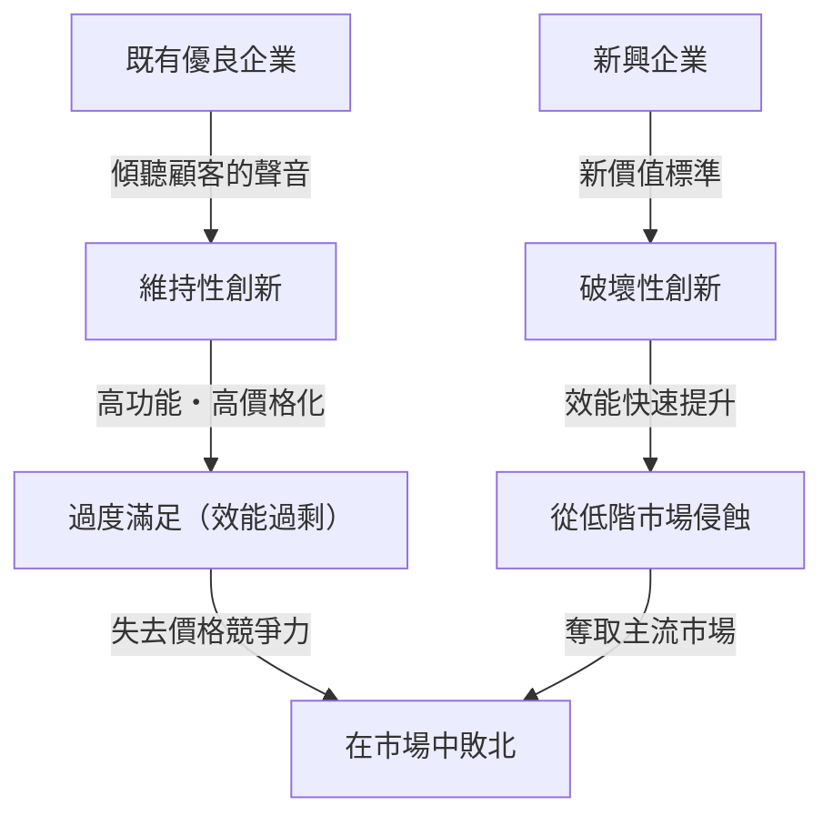
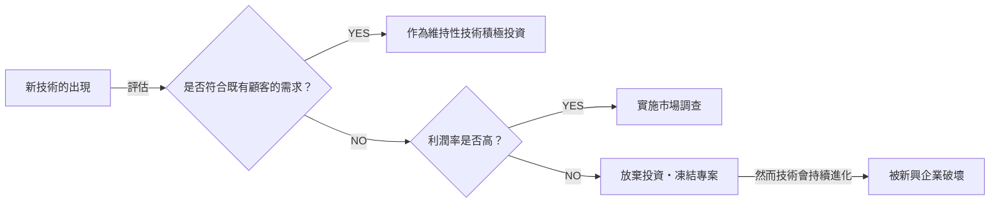

## 簡介：為何實行「完美經營」的企業會失敗？

在商業世界中，鮮少有概念能像「創新者的窘境（The Innovator's Dilemma）」一樣，帶給經營者與創業者如此深刻的洞察與震撼。這套理論由前哈佛商學院教授克雷頓·克里斯汀生（Clayton Christensen）於1997年出版的同名著作中提出，它不僅是商業書籍中的一段論述，更已成為現代企業策略中最重要的典範之一。

我們通常認為的商業成功法則包含「傾聽顧客的聲音」、「持續改善產品」，以及「投資於利潤率最高的市場」。這些都是經營學教科書上必然會寫的「正確經營」基本原則。然而，克里斯汀生教授的研究卻揭示了一個驚人的事實：**「正因為完美執行了這些『正確的經營』，偉大的企業才會敗給新興企業。」**這是一個極具悖論意味的現象。

本文將針對這套「創新者的窘境」底層機制、維持性創新與破壞性創新的差異、具體的歷史案例，以及現代企業該如何避開這個陷阱、轉而成為破壞者的策略，進行徹底的深度解析。

---

## 1. 創新的兩條軌跡

在理解創新者的窘境時，最重要的前提是創新的分類。克里斯汀生教授將科技的演進劃分為「維持性創新（Sustaining Innovation）」與「破壞性創新（Disruptive Innovation）」兩大類。

### 維持性創新（Sustaining Innovation）

維持性創新是指沿著既有主要顧客所重視的效能指標，去提升產品或服務效能的創新。這可能包含「漸進式（一點一滴地改善）」或「突破式（效能瞬間大幅躍升）」，但其發展方向始終朝向「在既有市場中提升既有的評估標準」。

優良企業在此類維持性創新方面表現得極為出色。他們將徹底進行顧客調查、追加顧客期望的功能，並以更高的價格（高利潤率）提供更高品質產品的流程，深植於組織的DNA之中。

### 破壞性創新（Disruptive Innovation）

另一方面，破壞性創新是指從既有主要顧客的眼光來看「效能低落、像個玩具」，卻能提供全新價值標準（如便宜、小型、簡單、易用等）的創新。

一開始，它們在既有的主流市場中無人問津，只能在利基的新市場或低階（低價位）市場中勉強生存。然而，科技演進的速度往往快於顧客需求進化的速度，因此破壞性技術的效能會逐漸提升，直到能滿足既有市場顧客所要求的最低效能水準（不是高階需求，而是主流需求）。就在那個瞬間，市場會發生戲劇性的交替。

---

## 2. 為何優良企業會錯過破壞性技術？（窘境的結構）

此時會產生一個疑問：為什麼擁有龐大研發經費與優秀人才的優良企業，會敗給新興企業那「簡陋」的技術呢？
並不是因為他們在技術上無能。相反地，許多破壞性技術的早期原型，其實正是由既有的優良企業所開發出來的。

優良企業失敗的原因，**「正是合理決策流程的結果」**。以下三個因素共同構成了這個堅不可摧的窘境：

### 1. 資源分配的機制
企業的資源（資金、人才、時間）會優先分配給利潤率最高、市場規模最大的專案。對於有著既有顧客強烈需求的「維持性創新」專案，由於容易預測高營收與高利潤，因此在公司內部的提案很容易通過。相對地，破壞性技術在初期階段市場規模小且利潤率低，從投資報酬率（ROI）的角度來看，被「合理地」否決是必然的。

### 2. 「顧客的聲音」這個魔咒
優良企業會傾聽優良顧客（願意付最多錢的顧客）的聲音。但是，如果將破壞性技術的早期版本展示給既有的優良顧客看，他們只會說：「我不需要效能這麼低的東西」、「請提升現有產品的規格」。正是因為企業對顧客忠誠，反而使他們對破壞性技術視而不見。

### 3. 價值網絡（Value Network）的束縛
企業不僅僅是自身，還存在於包含供應商、經銷商、顧客等在內的「價值網絡」之中。由於這個網絡整體具備一種傾向「功能更強、單價更高產品」的文化與結構，因此若要流通便宜且低規格的產品，便會遭遇整個網絡的阻力。

---

## 3. 破壞性創新的兩種模式

根據攻佔市場的方式，破壞性創新主要可分為兩種模式。

### 低階市場破壞（Low-end Disruption）
這是針對既有市場中「雖然不需要那麼高的效能，但只要便宜就願意使用」的「被過度滿足（Overserved）的顧客」為目標的作法。
既有企業會很樂意將利潤率較低的低階市場拱手讓給新興企業。為什麼呢？因為他們正致力於向利潤率更高的高階市場轉移（Upmarket Migration）。然而，新興企業會以低階市場為跳板，逐步提升技術能力，最終向上侵蝕中階與高階市場。
**（例如：鋼鐵業中以迷你廠（電爐）破壞高爐廠、豐田汽車早期進入美國市場）**

### 新市場破壞（New-market Disruption）
這是針對過去因為沒錢、沒技術、沒時間等原因而無法消費產品的「非消費者（Non-consumers）」為目標，創造出全新市場的作法。
藉由提供比既有產品「更簡單、更方便、價格更實惠」的選擇，喚起過去不存在的需求。在既有企業看來，這似乎並沒有奪走他們市場的大餅，因此往往會放鬆警戒。
**（例如：個人電腦對抗大型主機、早期行動電話對抗室內電話、Sony Walkman對抗黑膠唱片）**

---

## 4. 歷史證明的「破壞」軌跡：案例研究

### 案例1：硬碟機（HDD）產業
克里斯汀生調查得最詳細的就是HDD產業。在硬碟從14吋縮小至8吋、5.25吋，再到3.5吋的過程中，既有的頂尖企業幾乎每一次都被新興企業奪走了次世代尺寸的霸權。
大型主機的顧客要求的是提升14吋硬碟的容量（維持性創新），對於早期的8吋硬碟（容量小、專為迷你電腦設計）根本不屑一顧。既有企業聽從了顧客的聲音而延遲了對8吋硬碟的投資，結果隨著迷你電腦市場的成長，伴隨崛起的8吋硬碟新興企業最終吞噬了整個市場。

### 案例2：數位相機對傳統底片的破壞
柯達（Kodak）是世界上最早開發出數位相機的企業之一。然而，由於害怕破壞自家帶來龐大利潤的「底片與沖洗」商業模式（價值網絡），他們對於全面轉向數位化猶豫不決。早期的數位相機畫質很差，被專業攝影師視為「玩具」，但對一般大眾而言，「不需要沖洗費且能馬上看到照片」這項新價值（破壞性創新）具有壓倒性的吸引力。當畫質達到一定水準時，市場在一瞬間就被徹底翻轉。

### 案例3：SaaS與雲端運算
面對甲骨文（Oracle）和SAP等為企業提供大型地端（On-premises）軟體的巨頭，Salesforce等SaaS企業最初是作為「針對中小企業的簡易工具（低階）」登場的。大企業因為「安全疑慮」和「功能不足」而對SaaS敬而遠之，但SaaS陣營迅速提升了功能與安全性，如今已成為支撐大企業市場（高階）的核心。

---

## 5. 克服創新者窘境的「管理策略」

為了逃離這個堅固的「合理性陷阱」，既有企業若要自行引發破壞性創新（或至少存活下來），就必須採取顛覆過往常識的管理方式。

### 1. 設立獨立組織或拆分公司（Spin-out）
絕對不能試圖在既有龐大組織的流程與價值標準中孕育破壞性專案。對於一個營收達千億日圓的部門來說，一億日圓的新事業只不過是「誤差」，在爭奪資源的會議上注定會失敗。
破壞性技術必須擁有一個**「能在小市場中感到振奮，並以獨特的利潤率標準運作的完全獨立組織」**。

### 2. 「以失敗為前提」的發現驅動型規劃（Discovery-driven Planning）
在維持性創新中，基於過去的數據可以制定出精確的事業計畫。但是，破壞性創新的市場「還不存在」，因此事前的預測有100%的機率會失準。
我們不能從一開始就執行完美的策略，而是必須採取「建立假說、以少量資金進行測試、從市場中學習並調整策略（Pivot）」這種類似精實創業（Lean Startup）的方法。

### 3. 透過「焦糖布丁理論（Jobs to be Done，或譯需完成的工作）」理解顧客
不要從顧客的「屬性（年齡、性別等）」或「產品的功能」來看待市場，而是要問：「顧客為了完成什麼樣的任務（Job），而雇用了（Hire）這個產品？」
這樣就能防止對既有產品進行過度的功能追加（效能過剩），並發現能以完全不同的方式、更便宜且簡單地解決顧客任務的「破壞機會」。

### 4. 評估資源、流程、價值觀（RPV框架）
企業能做什麼、不能做什麼，取決於「資源（Resources）」、「流程（Processes）」與「價值觀（Values）」這三要素。優良企業擁有豐富的「資源」，但為了既有事業最佳化的「流程」以及追求高利潤率的「價值觀」，卻會成為破壞性創新的絆腳石。領導者必須重新設計組織架構，確保既有的流程與價值觀不會套用到新事業上。

---

## 6. 現代（AI・Web3時代）的創新者窘境

如今，隨著生成式AI（如ChatGPT等）的崛起，Google和Apple等科技巨頭被認為正處於創新者的窘境之中。
例如，Google擁有精準度極高的搜尋引擎（維持性創新的極致）與廣告模式。此時，雖然偶爾會產生幻覺（Hallucination），但能以對話形式直接給出答案的生成式AI出現了。由於生成式AI可能會破壞既有「搜尋、點擊連結、看廣告」的獲利模式，因此這位搜尋巨頭在全面轉向AI時陷入了窘境。

像這樣，在科技發展不斷加速的現代，「破壞」的週期已變得前所未有地短暫。在軟體與數位領域，由於物理限制較少，從低階向高階市場的侵蝕可能不需要幾十年，而是幾年甚至幾個月內就會發生。

---

## 結語：接受窘境，破壞自我

克雷頓·克里斯汀生的「創新者窘境」帶給我們最大的教訓是：**「支撐著現在成功的優勢，本身就會成為未來致命的弱點。」**

經營者與領導者所需具備的，是在實踐追求既有事業效率化與持續成長的「雙翼組織（Ambidextrous Organization）」的同時，偶爾也要有勇氣親手破壞既有的搖錢樹（Cash Cow）。
「是要等待破壞自家公司的技術出現，還是要自己創造出來？」
持續面對這個問題，或許正是企業在現代動盪的商業環境中生存的唯一途徑。

（完）
