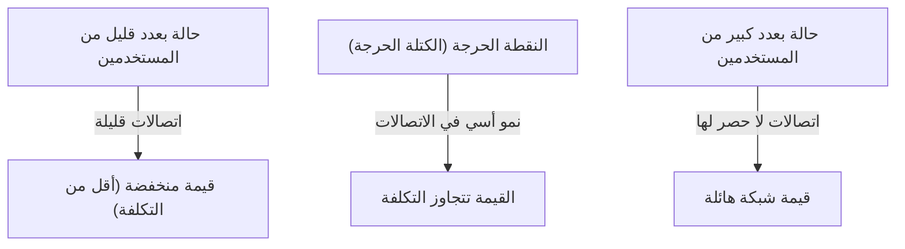
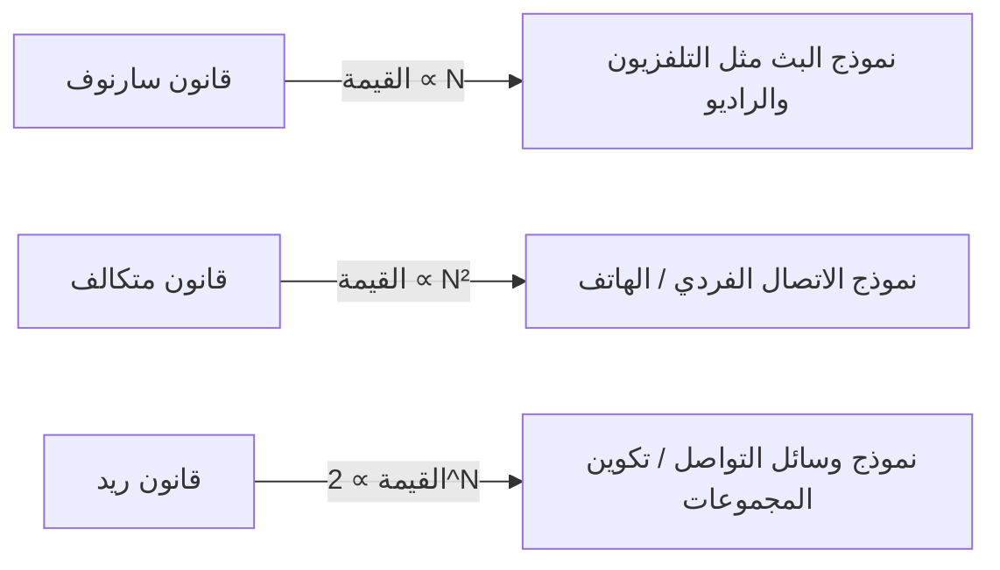

# ما هو "قانون متكالف" الذي يتحكم في قيمة الشبكة؟ دليل شامل لاستخدامه في استراتيجية الأعمال

في عالم الأعمال المعاصر، وخاصة في المنصات الرقمية ووسائل التواصل الاجتماعي وشركات البرمجيات كخدمة (SaaS)، لا يمر يوم دون سماع مصطلح "تأثير الشبكة" (أو العوامل الخارجية للشبكة). والقانون الأكثر شهرة الذي يفسر قوة تأثير الشبكة هذا رياضيًا ومفاهيميًا هو "قانون متكالف" (Metcalfe's Law).

"قيمة الشبكة تتناسب طرديًا مع مربع عدد المستخدمين (العقد) المتصلين بتلك الشبكة."

لماذا يفسر هذا القانون الذي يبدو بسيطًا صعود عمالقة التكنولوجيا ويشكل أساس استراتيجيات النمو للشركات الناشئة؟ في هذا المقال، سنتعمق في استكشاف قانون متكالف، بدءًا من المفاهيم الأساسية والخلفية التاريخية، مرورًا بأمثلة الأعمال الواقعية، وصولاً إلى حدود القانون ونظريات الجيل القادم.

## 1. المفهوم الأساسي لقانون متكالف

### روبرت متكالف وولادة الإيثرنت
سُمي قانون متكالف على اسم روبرت متكالف (Robert Metcalfe)، المخترع المشارك لتقنية شبكات الكمبيوتر "إيثرنت" (Ethernet) ومؤسس شركة 3Com. تم استخدام هذا المفهوم، الذي اقترحه في أوائل الثمانينيات، في البداية كنموذج توضيحي لترويج مبيعات أجهزة الفاكس والهواتف ومعدات الإيثرنت.

### الخلفية الرياضية للقانون
يعتمد قانون متكالف على عدد الاتصالات المحتملة داخل الشبكة. إذا كان عدد العقد (المستخدمين أو الأجهزة) المشاركة في الشبكة هو $n$، فإن كل عقدة يمكنها الاتصال بـ $n-1$ من العقد الأخرى. وبالتالي، يتم التعبير عن إجمالي عدد الاتصالات المحتملة $C$ بالمعادلة التالية:

$$ C = \frac{n(n - 1)}{2} $$

عندما يصبح $n$ كبيرًا بما يكفي، تقترب هذه القيمة بشكل مقارب من $n^2$. بعبارة أخرى، يجادل متكالف بأن قيمة الشبكة $V$ تتناسب طرديًا مع مربع عدد المستخدمين $n$ ($V \propto n^2$).

على سبيل المثال، إذا كان هناك هاتفان فقط في العالم، يمكنك التحدث إلى شخص واحد فقط، وقيمة تلك الشبكة محدودة. ومع ذلك، إذا أصبح عدد الهواتف 100، فإن تركيبات الاتصال تصبح 4950، ومع 10000 هاتف تقفز إلى حوالي 50 مليون مجموعة. مع إضافة كل مستخدم جديد، يتم إنشاء فرص اتصال جديدة لجميع المستخدمين الحاليين، مما يؤدي إلى تسريع القيمة الإجمالية بشكل كبير.

## 2. العلاقة مع تأثير الشبكة

يعد قانون متكالف ركيزة نظرية قوية لشرح "تأثير الشبكة" (Network Effect). يشير تأثير الشبكة إلى ظاهرة "تتغير فيها قيمة منتج أو خدمة بناءً على عدد المستخدمين الآخرين الذين يستخدمونها".

### تأثير الشبكة المباشر
تعتبر الهواتف ووسائل التواصل الاجتماعي (مثل فيسبوك وLINE وX وغيرها) أمثلة نموذجية. كلما زاد عدد المستخدمين على نفس المنصة، زاد عدد الأشخاص الذين يمكن التواصل معهم مباشرة، مما يزيد من قيمة الخدمة.

### تأثير الشبكة غير المباشر (تأثير الشبكة المتقاطع)
يُرى غالبًا في الأسواق ثنائية الجوانب (المنصات ثنائية الجانب). على سبيل المثال، في تطبيقات طلب سيارات الأجرة مثل أوبر (Uber)، إذا زاد عدد "الركاب"، تزداد القيمة بالنسبة "للسائقين"، وإذا زاد عدد "السائقين"، تزداد القيمة بالنسبة "للركاب" (مثل تقليل وقت الانتظار). بطاقات الائتمان وأنظمة التشغيل (مثل ويندوز أو iOS) تندرج أيضًا ضمن هذه الفئة.

## 3. المقارنة مع قوانين أخرى: سارنوف، متكالف، وريد

ليس قانون متكالف هو القانون الوحيد المتعلق بقيمة الشبكة. تم اقتراح قوانين مختلفة لتناسب ثلاثة نماذج: البث، والاتصالات، والمجتمع.

### قانون سارنوف (Sarnoff's Law)
قانون سمي على اسم ديفيد سارنوف، مؤسس RCA. "قيمة شبكة البث تتناسب طرديًا مع عدد المشاهدين/المستمعين ($V \propto n$)". ينطبق هذا على نماذج "واحد إلى متعدد" مثل التلفزيون والراديو.

### قانون ريد (Reed's Law)
اقترحه ديفيد ريد. "قيمة الشبكة التي تسمح بتكوين المجموعات تتناسب مع 2 أس عدد المشاركين ($V \propto 2^n$)". في الشبكات التي يمكن للمستخدمين فيها إنشاء مجموعات فرعية بحرية، مثل سلاك (Slack) أو ديسكورد (Discord) أو مجموعات فيسبوك، تزداد القيمة بشكل متفجر تفوق بكثير قانون متكالف.

## 4. أهمية "الكتلة الحرجة" في الأعمال

التأثير الأهم لقانون متكالف على استراتيجية الأعمال هو مفهوم "الكتلة الحرجة" (النقطة الحرجة).

في المراحل الأولى من بناء الشبكة، تتجاوز التكاليف الثابتة مثل تطوير النظام وصيانة الخوادم قيمة الشبكة. ومع ذلك، بينما ينمو عدد المستخدمين ($n$) خطيًا، تنمو القيمة ($n^2$) بشكل تربيعي، وفي مرحلة ما تتجاوز القيمة التكلفة. حجم المستخدمين عند نقطة التعادل هذه هو الكتلة الحرجة.

### مشكلة البداية الباردة
قبل الوصول إلى الكتلة الحرجة، تقع في معضلة: "لا توجد قيمة لأن عدد المستخدمين قليل، ولا يأتي المستخدمون لأنه لا توجد قيمة". يُعرف هذا باسم "مشكلة البداية الباردة".

للتغلب على هذا، تتخذ الشركات الاستراتيجيات التالية:
- **استثمارات أولية ضخمة / حملات ترويجية**: اكتساب المستخدمين حتى مع تكبد خسائر لتجاوز الكتلة الحرجة بسرعة.
- **توفير القيمة في وضع اللاعب الفردي**: تقديم أداة مفيدة حتى بدون وجود مستخدمين آخرين، ثم تحويلها إلى شبكة لاحقًا (على سبيل المثال، كان إنستغرام الأولي مجرد تطبيق لتحرير الصور عالي الأداء).
- **السيطرة من خلال سوق متخصص**: استراتيجية فيسبوك، حيث اقتصر في البداية على طلاب جامعة هارفارد لبناء شبكة قوية قبل التوسع إلى جامعات أخرى والجمهور العام.

## 5. انتقادات وحدود قانون متكالف

على الرغم من قوة قانون متكالف نظريًا، إلا أن هناك انتقادات تشير إلى أنه يبالغ في تقدير قيمة الشبكة في الأعمال الواقعية.

### قانون زيف وقانون أودليزكو
أشار علماء الرياضيات مثل أندرو أودليزكو إلى أن قانون متكالف يبالغ في تقدير قيمة الشبكة لأن "ليس كل الاتصالات لها نفس القيمة". يميل البشر إلى التواصل بشكل متكرر مع مجموعة محدودة من الأشخاص (قانون زيف)، ووفقًا لأودليزكو، فإن قيمة الشبكة تتناسب مع $n \log n$ بدلاً من $n^2$.

### رقم دنبار (Dunbar's Number)
بسبب محدودية القدرات المعرفية للدماغ البشري، هناك مفهوم يُعرف باسم "رقم دنبار"، والذي يشير إلى أن الحد الأقصى لعدد العلاقات الاجتماعية المستقرة التي يمكن للفرد الحفاظ عليها هو حوالي 150. حتى لو كان لدى شبكة اجتماعية مليار مستخدم، فإن عدد الأشخاص الذين يتصل بهم الفرد له حد أقصى، لذلك لا تزيد القيمة إلى ما لا نهاية مع مربع عدد المستخدمين.

### ازدحام الشبكة وتأثيرات الشبكة السلبية
إذا زاد عدد المستخدمين بشكل كبير جدًا، يمكن أن تحدث "تأثيرات شبكة سلبية" مثل زيادة الرسائل غير المرغوب فيها، وبطء الاتصال، وزيادة الضوضاء في المعلومات، مما قد يقلل من القيمة. بدون خوارزميات مطابقة عالية الجودة وإشراف قوي، ينهار قانون متكالف.

## 6. الخلاصة: التطبيق في الاستراتيجيات الحديثة

على الرغم من كونه نموذجًا مبسطًا، إلا أن قانون متكالف يصف بشكل مثالي ديناميكيات "الفائز يأخذ كل شيء" (Winner-takes-all) في أعمال المنصات.

يجب على قادة الأعمال ورواد الأعمال أن يضعوا دائمًا في قلب تصميمهم كيفية إنشاء منتجاتهم لتأثيرات الشبكة، ومدى سرعة تجاوزهم للكتلة الحرجة. حتى في عصر الذكاء الاصطناعي والبلوكتشين (Web3)، فإن الطريقة التي تتصل بها العقد وتتبادل القيمة لا تزال تخضع بصمت ولكن بقوة لقانون متكالف.
