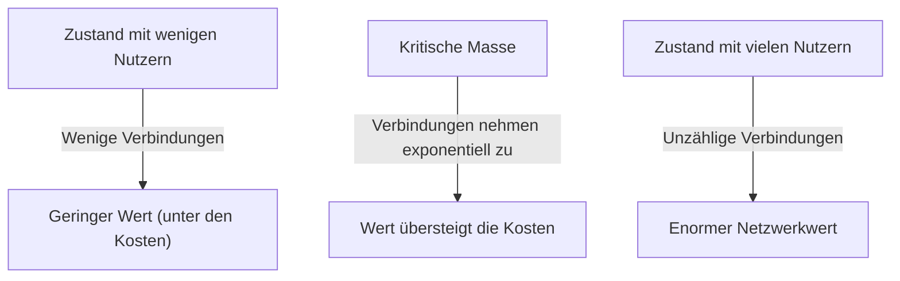
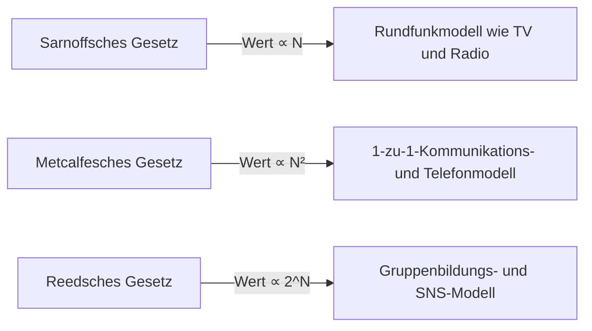

# Was ist das „Metcalfesche Gesetz“, das den Wert eines Netzwerks bestimmt? Eine ausführliche Erklärung zur Anwendung in der Geschäftsstrategie

In der heutigen Geschäftswelt, insbesondere bei digitalen Plattformen, sozialen Netzwerken (SNS) und SaaS-Unternehmen, vergeht kein Tag, an dem man nicht den Begriff „Netzwerkeffekt“ (oder Netzwerkexternalität) hört. Das berühmteste Gesetz, das die Macht dieses Netzwerkeffekts mathematisch und konzeptionell erklärt, ist das „Metcalfesche Gesetz“ (Metcalfe's Law).

„Der Wert eines Netzwerks ist proportional zum Quadrat der Anzahl der verbundenen Nutzer (Knoten).“

Warum erklärt dieses scheinbar einfache Gesetz den Aufstieg gigantischer Tech-Unternehmen und bildet den Kern der Wachstumsstrategie von Start-ups? In diesem Artikel werden wir tief in das Metcalfesche Gesetz eintauchen – von seinen Grundkonzepten über den historischen Hintergrund und konkrete Geschäftsbeispiele bis hin zu den Grenzen des Gesetzes und den Theorien der nächsten Generation.

## 1. Das Grundkonzept des Metcalfeschen Gesetzes

### Robert Metcalfe und die Geburt von Ethernet
Das Metcalfesche Gesetz ist nach Robert Metcalfe benannt, dem Miterfinder der Computernetzwerktechnologie „Ethernet“ und Gründer des Unternehmens 3Com. Dieses Konzept, das er in den frühen 1980er Jahren vorstellte, wurde ursprünglich als Erklärungsmodell zur Förderung des Verkaufs von Faxgeräten, Telefonen und Ethernet-Ausrüstung verwendet.

### Der mathematische Hintergrund des Gesetzes
Das Metcalfesche Gesetz basiert auf der Anzahl möglicher Verbindungspaare innerhalb eines Netzwerks. Wenn $n$ die Anzahl der Knoten (Nutzer oder Geräte) in einem Netzwerk ist, kann sich jeder Knoten mit $n-1$ anderen Knoten verbinden. Die gesamte Anzahl potenzieller Verbindungen $C$ wird daher durch folgende Formel ausgedrückt:

$$ C = \frac{n(n - 1)}{2} $$

Wenn $n$ groß genug wird, nähert sich dieser Wert $n^2$ an. Das bedeutet, dass laut Metcalfe der Wert des Netzwerks $V$ proportional zum Quadrat der Nutzerzahl $n$ ist ($V \propto n^2$).

Wenn es beispielsweise auf der Welt nur zwei Telefone gäbe, könnte man nur eine einzige Person anrufen, wodurch der Wert dieses Netzwerks sehr begrenzt wäre. Gäbe es jedoch 100 Telefone, so gäbe es 4.950 mögliche Verbindungen, und bei 10.000 Telefonen würde die Zahl auf etwa 50 Millionen springen. Mit jedem neu hinzukommenden Nutzer entsteht für alle bestehenden Nutzer ein weiteres potenzielles Verbindungsziel, wodurch der Gesamtwert beschleunigt steigt.

## 2. Die Beziehung zum Netzwerkeffekt

Das Metcalfesche Gesetz ist eine starke theoretische Stütze zur Erklärung des „Netzwerkeffekts“ (Network Effect). Der Netzwerkeffekt bezeichnet das „Phänomen, dass sich der Wert eines bestimmten Produkts oder einer Dienstleistung in Abhängigkeit von der Anzahl anderer Nutzer ändert“.

### Direkter Netzwerkeffekt
Telefone oder soziale Netzwerke (wie Facebook, LINE, X usw.) sind klassische Beispiele. Je mehr Nutzer dieselbe Plattform nutzen, desto mehr direkte Kommunikationspartner gibt es, und der Wert der Dienstleistung steigt.

### Indirekter Netzwerkeffekt (Kreuz-Netzwerkeffekt)
Wird oft in zweiseitigen Märkten (Two-Sided Platforms) beobachtet. Bei Fahrtenvermittlungs-Apps wie Uber steigt beispielsweise der Wert für die „Fahrer“, wenn es mehr „Fahrgäste“ gibt; umgekehrt steigt der Wert für die „Fahrgäste“ (z. B. durch kürzere Wartezeiten), wenn es mehr „Fahrer“ gibt. Auch Kreditkarten oder Betriebssysteme (wie Windows und iOS) fallen in diese Kategorie.

## 3. Vergleich mit anderen Gesetzen: Sarnoff, Metcalfe, Reed

Das Metcalfesche Gesetz ist nicht das einzige Gesetz bezüglich des Wertes von Netzwerken. Abhängig von den drei Paradigmen – Rundfunk, Kommunikation und Community – wurden verschiedene Gesetze formuliert.

### Sarnoffsches Gesetz (Sarnoff's Law)
Benannt nach dem Gründer von RCA, David Sarnoff. „Der Wert eines Rundfunknetzwerks ist proportional zur Anzahl der Zuschauer ($V \propto n$).“ Dies gilt für das Eins-zu-viele-Modell von Fernsehen und Radio.

### Reedsches Gesetz (Reed's Law)
Formuliert von David Reed. „Der Wert von Netzwerken, die Gruppenbildung ermöglichen, ist proportional zu 2 hoch der Anzahl der Teilnehmer ($V \propto 2^n$).“ In Netzwerken, in denen Nutzer frei Untergruppen erstellen können – wie bei Slack, Discord oder Facebook-Gruppen –, besagt diese Theorie, dass der Wert noch explosionsartiger steigt als beim Metcalfeschen Gesetz.

## 4. Die Bedeutung der „kritischen Masse“ im Geschäft

Die wichtigste geschäftliche Erkenntnis des Metcalfeschen Gesetzes ist das Konzept der „kritischen Masse“ (Critical Mass).

In der Anfangsphase des Aufbaus eines Netzwerks übersteigen die Fixkosten, wie Systementwicklung und Serverwartung, den Wert des Netzwerks. Da jedoch die Anzahl der Nutzer ($n$) linear wächst, während der Wert ($n^2$) quadratisch zunimmt, übersteigt der Wert ab einem bestimmten Punkt die Kosten. Diese Gewinnschwelle der Nutzerzahl ist die kritische Masse.

### Das Kaltstartproblem (Cold Start Problem)
Bis zum Erreichen der kritischen Masse gerät man in ein Dilemma: „Das Netzwerk hat keinen Wert, weil es wenige Nutzer hat, und Nutzer kommen nicht, weil es keinen Wert gibt.“ Dies wird als „Kaltstartproblem“ bezeichnet.

Unternehmen wenden folgende Strategien an, um dieses Problem zu überwinden:
- **Riesige Anfangsinvestitionen und Kampagnen**: Nutzergewinnung, selbst wenn dabei Gewinne ignoriert werden, um die kritische Masse so schnell wie möglich zu überschreiten.
- **Wertangebot im Einzelspielermodus (Single-Player)**: Die Dienstleistung zunächst als nützliches Tool bereitstellen, auch wenn es noch keine anderen Nutzer gibt, und das Netzwerk später aufbauen (z. B. war Instagram anfangs nur eine hochwertige App zur Fotobearbeitung).
- **Dominanz aus Nischenmärkten heraus**: Die Strategie von Facebook, das zunächst nur für Studenten der Harvard University verfügbar war. Erst nachdem ein starkes Netzwerk aufgebaut worden war, wurde es auf andere Universitäten und die breite Öffentlichkeit ausgeweitet.

## 5. Kritik und Grenzen des Metcalfeschen Gesetzes

Obwohl das Metcalfesche Gesetz theoretisch stark ist, gibt es in der realen Geschäftswelt auch einige Kritikpunkte, die auf Grenzen oder eine Überschätzung hinweisen.

### Zipfsches Gesetz und Odlyzkos Gesetz
Der Mathematiker Andrew Odlyzko und andere wiesen darauf hin, dass das Metcalfesche Gesetz den Wert eines Netzwerks überschätzt. Der Grund dafür ist, dass „nicht alle Verbindungen von gleichem Wert sind“. Menschen kommunizieren oft nur mit einer begrenzten Anzahl von Personen (Zipfsches Gesetz), weshalb Odlyzko argumentiert, dass der Wert eines Netzwerks nicht proportional zu $n^2$ wächst, sondern zu $n \log n$ (Odlyzkos Gesetz).

### Die Dunbar-Zahl
Es gibt das Konzept der „Dunbar-Zahl“, das besagt, dass aufgrund kognitiver Grenzen des menschlichen Gehirns die maximale Anzahl stabiler sozialer Beziehungen bei etwa 150 Personen liegt. Selbst wenn ein soziales Netzwerk eine Milliarde Nutzer erreicht, gibt es eine Obergrenze dafür, mit wie vielen Menschen ein einzelnes Individuum verbunden sein kann. Der Wert steigt also nicht unendlich im Quadrat an.

### Netzwerküberlastung und negative Netzwerkeffekte
Wenn es zu viele Nutzer gibt, können „negative Netzwerkeffekte“ auftreten – wie zunehmender Spam, Verzögerungen bei der Kommunikation und erhöhtes Informationsrauschen –, wodurch der Wert sogar sinken kann. Ohne hochwertige Matching-Algorithmen und Moderation kann das Metcalfesche Gesetz zusammenbrechen.

## 6. Fazit: Anwendung auf moderne Strategien

Obwohl das Metcalfesche Gesetz ein vereinfachtes Modell ist, stellt es die „Winner-takes-all“-Dynamik (Der Gewinner bekommt alles) von Plattformgeschäften brillant dar.

Führungskräfte und Unternehmer sollten immer die Frage in den Mittelpunkt ihres Designs stellen, wie ihr Produkt Netzwerkeffekte erzeugen wird und wie schnell es die kritische Masse durchbrechen kann. Selbst im Zeitalter von KI und Blockchain (Web3) wirkt das Metcalfesche Gesetz im Verborgenen – aber kraftvoll – als grundlegendes Prinzip dafür, wie Knoten miteinander in Verbindung treten und Werte austauschen.
