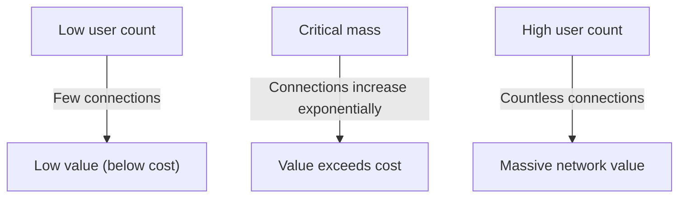
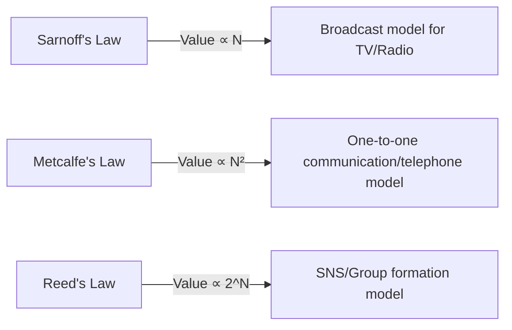

# What is 'Metcalfe's Law' Governing Network Value? A Comprehensive Guide to Using It in Business Strategy

In modern business, especially in digital platforms, SNS, and SaaS businesses, not a day goes by without hearing the term "Network Effect" (Network Externality). The most famous law that explains the power of this network effect mathematically and conceptually is "Metcalfe's Law".

"The value of a network is proportional to the square of the number of connected users (nodes) of the system."

Why does this seemingly simple law explain the rise of giant tech companies and form the core of startup growth strategies? In this article, we will thoroughly explain everything from the basic concepts of Metcalfe's Law to its historical background, specific business case studies, and even the limitations of the law and next-generation theories.

## 1. Basic Concept of Metcalfe's Law

### Robert Metcalfe and the Birth of Ethernet
Metcalfe's Law is named after Robert Metcalfe, co-inventor of the computer network technology "Ethernet" and founder of 3Com. The concept he proposed in the early 1980s was initially used as an explanatory model to promote the sales of facsimiles (FAX), telephones, and Ethernet equipment.

### Mathematical Background of the Law
Metcalfe's Law is based on the number of possible connections in a network. Let $n$ be the number of nodes (users or devices) participating in the network; since each node can connect with the $n-1$ other nodes, the total number of potential connections $C$ is expressed by the following formula:

$$ C = \frac{n(n - 1)}{2} $$

As $n$ becomes sufficiently large, this value is asymptotic to $n^2$. In other words, Metcalfe's claim is that the value of the network $V$ is proportional to the square of the number of users $n$ ($V \propto n^2$).

For example, if there were only two telephones in the world, you could only talk to one other person, and the value of that network is limited. However, if there are 100 telephones, the combination of connections becomes 4,950, and if there are 10,000, it jumps to about 50 million. Each additional user creates a new connection destination for all existing users, accelerating the overall value.

## 2. Relationship with Network Effects

Metcalfe's Law is a powerful theoretical pillar explaining the "Network Effect". A network effect refers to the phenomenon where "the value of a certain product or service changes depending on the number of other users who use it."

### Direct Network Effects
Telephones and SNS (Facebook, LINE, X, etc.) are typical examples. The more users who use the same platform, the more communication partners directly increase, enhancing the value of the service.

### Indirect Network Effects (Cross-Network Effects)
Often seen in two-sided platforms. For example, in a ride-hailing app like Uber, an increase in "passengers" increases the value for "drivers," and an increase in "drivers" increases the value for "passengers" (such as shorter waiting times). Credit cards and OS (Windows, iOS, etc.) also fall into this category.

## 3. Comparison with Other Laws: Sarnoff, Metcalfe, Reed

Metcalfe's Law is not the only law regarding network value. Different laws have been proposed tailored to the three paradigms of broadcasting, communication, and community.

### Sarnoff's Law
A law named after David Sarnoff, founder of RCA. "The value of a broadcast network is proportional to the number of viewers ($V \propto n$)." It applies to the one-to-many TV or radio model.

### Reed's Law
Proposed by David Reed. "The value of a network that allows for group formation is proportional to two to the power of the number of participants ($V \propto 2^n$)." The theory is that in networks where users can freely create subgroups, such as Slack, Discord, and Facebook groups, value grows explosively, even more so than under Metcalfe's Law.

## 4. The Importance of "Critical Mass" in Business

The most important implication Metcalfe's Law offers for business strategy is the concept of "Critical Mass" (the tipping point).

In the initial stages of building a network, fixed costs such as system development and server maintenance exceed the value of the network. However, while the number of users ($n$) increases linearly, the value ($n^2$) grows quadratically, meaning at a certain point the value overtakes the cost. The user scale at this break-even point is the critical mass.

### The Cold Start Problem
Until reaching the critical mass, companies fall into a dilemma: "There is no value because there are few users, and users do not gather because there is no value." This is called the "Cold Start Problem."

Companies take strategies like the following to break through this:
- **Massive initial investments/campaigns**: Acquire users even while ignoring profits to quickly exceed the critical mass (e.g., PayPay's 10 Billion Yen Giveaway Campaign).
- **Providing value in single-player mode**: Offer the product as a convenient tool even without other users, and add the network later (e.g., the early version of Instagram was just a high-performance photo editing app).
- **Dominating niche markets**: A strategy like Facebook, which initially limited its spread to Harvard students to create a strong network before expanding to other universities and the general public.

## 5. Criticisms and Limitations of Metcalfe's Law

While Metcalfe's Law is powerful in theory, there are several limitations and criticisms of overvaluation in actual business.

### Zipf's Law and Odlyzko's Law
Mathematician Andrew Odlyzko and others pointed out that Metcalfe's Law overestimates network value because "not all connections hold equal value." Humans communicate frequently only with a limited subset of people (Zipf's Law), so the network value is not proportional to $n^2$, but to $n \log n$, as Odlyzko and others argue (Odlyzko's Law).

### Dunbar's Number
Due to the limits of human cognitive ability, the concept of "Dunbar's Number" suggests that the maximum number of stable social relationships a person can maintain is about 150. Even if an SNS has 1 billion users, the number of connections for a single individual has an upper limit, so the value does not increase infinitely squared.

### Network Congestion and Negative Network Effects
If there are too many users, problems such as an increase in spam, communication delays, and increased information noise—"negative network effects"—can occur, paradoxically reducing the value. Without high-quality matching algorithms and moderation, Metcalfe's Law breaks down.

## 6. Conclusion: Application to Modern Strategy

Although a simplified model, Metcalfe's Law beautifully expresses the "Winner-takes-all" dynamics of platform businesses.

Business leaders and entrepreneurs should always center their design on how their product creates network effects and how quickly they can break through the critical mass. Even in the era of AI and Blockchain (Web3), Metcalfe's Law continues to quietly but powerfully act as the foundation for how nodes connect and exchange value.
