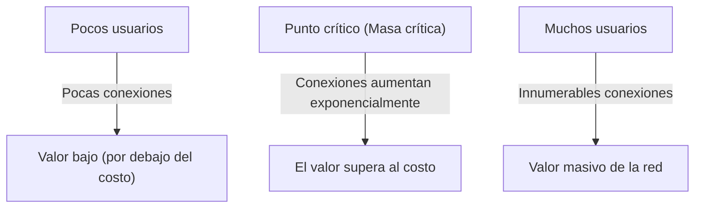
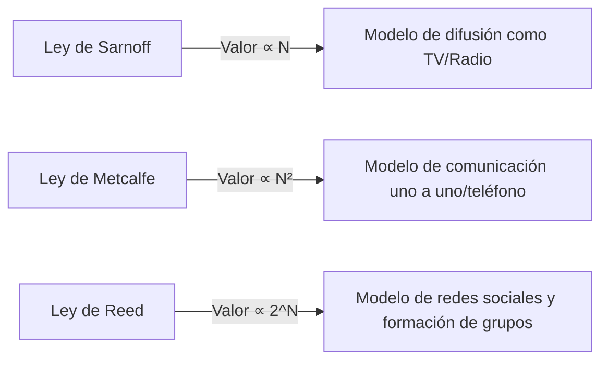

# ¿Qué es la 'Ley de Metcalfe' que domina el valor de la red? Guía completa para su uso en estrategias de negocio

En los negocios modernos, especialmente en plataformas digitales, redes sociales y SaaS, no pasa un día sin escuchar el término "Efecto de red" (Externalidad de red). La ley más famosa que explica el poder de este efecto de red matemática y conceptualmente es la "Ley de Metcalfe" (Metcalfe's Law).

"El valor de una red es proporcional al cuadrado del número de usuarios (nodos) conectados a ella."

¿Por qué esta ley aparentemente simple explica el surgimiento de las gigantes empresas tecnológicas y forma el núcleo de las estrategias de crecimiento de las startups? En este artículo, profundizaremos exhaustivamente desde los conceptos básicos de la Ley de Metcalfe hasta su trasfondo histórico, casos comerciales específicos e incluso las limitaciones de la ley y las teorías de la próxima generación.

## 1. Concepto básico de la Ley de Metcalfe

### Robert Metcalfe y el nacimiento de Ethernet
La Ley de Metcalfe lleva el nombre de Robert Metcalfe, co-inventor de la tecnología de red informática "Ethernet" y fundador de la empresa 3Com. El concepto que propuso a principios de la década de 1980 se utilizó inicialmente como modelo explicativo para promover las ventas de facsímiles (FAX), teléfonos y equipos Ethernet.

### Trasfondo matemático de la ley
La Ley de Metcalfe se basa en el número de pares de conexiones posibles en una red. Si el número de nodos (usuarios o dispositivos) que participan en la red es $n$, dado que cada nodo puede conectarse a $n-1$ nodos aparte de sí mismo, el número total de conexiones potenciales $C$ se expresa con la siguiente fórmula:

$$ C = \frac{n(n - 1)}{2} $$

A medida que $n$ se vuelve suficientemente grande, este valor se acerca asintóticamente a $n^2$. En otras palabras, la afirmación de Metcalfe es que el valor de la red $V$ es proporcional al cuadrado del número de usuarios $n$ ($V \propto n^2$).

Por ejemplo, si solo hubiera dos teléfonos en el mundo, solo podrías hablar con una persona y el valor de esa red estaría limitado. Sin embargo, si hay 100 teléfonos, las combinaciones de conexiones serían 4,950, y si hay 10,000, el número se dispara a unos 50 millones. Con cada usuario que se añade, se crea un nuevo destino de conexión para todos los usuarios existentes, por lo que el valor total se acelera.

## 2. Relación con el efecto de red

La Ley de Metcalfe es un pilar teórico poderoso que explica el "Efecto de Red" (Network Effect). El efecto de red se refiere al "fenómeno donde el valor de un cierto producto o servicio cambia dependiendo del número de otros usuarios que lo utilizan".

### Efectos de red directos
Los teléfonos y las redes sociales (Facebook, LINE, X, etc.) son ejemplos típicos. Cuantos más usuarios utilicen la misma plataforma, los interlocutores directos aumentan, mejorando el valor del servicio.

### Efectos de red indirectos (Efectos de red cruzados)
Se ven a menudo en plataformas de dos lados (mercados bilaterales). Por ejemplo, en una aplicación de transporte como Uber, el aumento de "pasajeros" eleva el valor para los "conductores", y el aumento de "conductores" eleva el valor para los "pasajeros" (como la reducción del tiempo de espera). Las tarjetas de crédito y los sistemas operativos (Windows, iOS, etc.) también entran en esta categoría.

## 3. Comparación con otras leyes: Sarnoff, Metcalfe, Reed

La Ley de Metcalfe no es la única ley relacionada con el valor de la red. Se han propuesto diferentes leyes adaptadas a los tres paradigmas de difusión, comunicación y comunidad.

### Ley de Sarnoff (Sarnoff's Law)
Una ley que lleva el nombre de David Sarnoff, fundador de RCA. "El valor de una red de difusión es proporcional al número de espectadores ($V \propto n$)". Se aplica al modelo de televisión o radio de uno a muchos.

### Ley de Reed (Reed's Law)
Propuesta por David Reed. "El valor de una red capaz de formar grupos es proporcional a dos elevado al número de participantes ($V \propto 2^n$)". Es la teoría de que en redes donde los usuarios pueden crear libremente subgrupos, como en Slack, Discord o grupos de Facebook, el valor crece explosivamente, incluso más que bajo la Ley de Metcalfe.

## 4. La importancia de la "Masa Crítica" en los negocios

La implicación más importante que ofrece la Ley de Metcalfe en la estrategia de negocios es el concepto de "Masa crítica" (punto de inflexión).

En las etapas iniciales de la construcción de una red, los costos fijos, como el desarrollo del sistema y el mantenimiento del servidor, superan el valor de la red. Sin embargo, mientras el número de usuarios ($n$) aumenta linealmente, el valor ($n^2$) crece de forma cuadrática, por lo que, en un momento determinado, el valor supera al costo. La escala de usuarios en este punto de equilibrio es la masa crítica.

### El problema del arranque en frío (Cold Start Problem)
Hasta que se alcanza la masa crítica, las empresas caen en el dilema: "No hay valor porque hay pocos usuarios, y los usuarios no se reúnen porque no hay valor". Esto se llama el "Problema del arranque en frío".

Para superar esto, las empresas adoptan estrategias como las siguientes:
- **Enormes inversiones iniciales/campañas**: Adquirir usuarios incluso a expensas de las ganancias para superar rápidamente la masa crítica (ej., campañas de regalos millonarios de PayPay).
- **Proporcionar valor en modo para un jugador**: Ofrecerlo como una herramienta conveniente incluso sin otros usuarios y añadir la red más tarde (ej., la versión inicial de Instagram era simplemente una aplicación de edición de fotos de alto rendimiento).
- **Dominar mercados nicho**: La estrategia de Facebook, que al principio limitó su difusión a los estudiantes de la Universidad de Harvard para crear una red sólida antes de expandirse a otras universidades y al público en general.

## 5. Críticas y limitaciones a la Ley de Metcalfe

Aunque la Ley de Metcalfe es poderosa en teoría, también existen algunas limitaciones y críticas de sobrevaloración en los negocios reales.

### Ley de Zipf y Ley de Odlyzko
El matemático Andrew Odlyzko y otros han señalado que la Ley de Metcalfe sobrestima el valor de la red porque "no todas las conexiones tienen el mismo valor". Dado que los seres humanos se comunican frecuentemente solo con un pequeño subconjunto de personas (Ley de Zipf), la afirmación de Odlyzko y otros es que el valor de la red no es proporcional a $n^2$, sino a $n \log n$ (Ley de Odlyzko).

### Número de Dunbar
Debido a los límites de la capacidad cognitiva del cerebro humano, el concepto del "Número de Dunbar" sugiere que el límite máximo de relaciones sociales estables que una persona puede mantener es de aproximadamente 150. Incluso si los usuarios de una red social llegan a los mil millones, el número de conexiones de un individuo tiene un límite, por lo que el valor no aumenta infinitamente al cuadrado.

### Congestión de red y efectos de red negativos
Si el número de usuarios aumenta demasiado, pueden producirse "efectos de red negativos", como un aumento del spam, retrasos en la comunicación y un aumento del ruido informativo, que en realidad reducen el valor. Sin algoritmos de emparejamiento y moderación de alta calidad, la Ley de Metcalfe fracasa.

## 6. Conclusión: Aplicación a la estrategia moderna

Aunque es un modelo simplificado, la Ley de Metcalfe expresa maravillosamente la dinámica de "El ganador se lo lleva todo" (Winner-takes-all) en los negocios de plataformas.

Los líderes empresariales y los emprendedores siempre deben centrar su diseño en cómo su producto crea un efecto de red y cuán rápido puede superar la masa crítica. Incluso en la era de la IA y el [Blockchain](/es/p/blockchain-technology-smart-contract-distributed-ledger/) (Web3), la Ley de Metcalfe sigue actuando silenciosa pero poderosamente como la base de cómo los nodos se conectan e intercambian valor.
