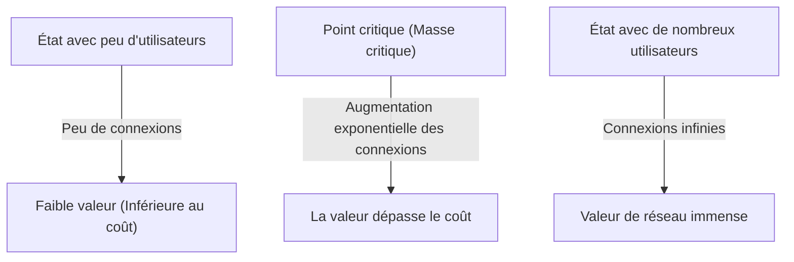
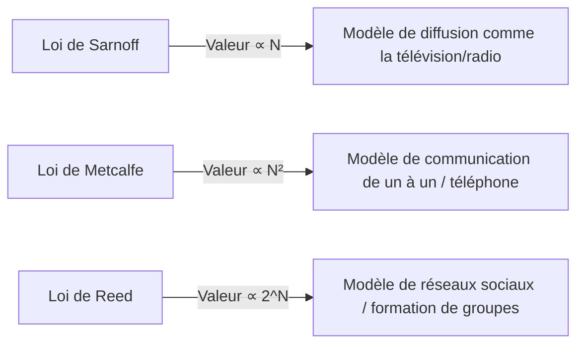

# Qu'est-ce que la « loi de Metcalfe » qui régit la valeur d'un réseau ? Guide complet de son utilisation dans la stratégie d'entreprise

Dans le monde des affaires d'aujourd'hui, notamment en ce qui concerne les plateformes numériques, les réseaux sociaux et les entreprises SaaS, il ne se passe pas un jour sans que l'on entende parler d'« effet de réseau » (ou externalité de réseau). Et la loi la plus célèbre qui explique la puissance de cet effet de réseau, d'un point de vue mathématique et conceptuel, est la « loi de Metcalfe ».

« La valeur d'un réseau est proportionnelle au carré du nombre d'utilisateurs (nœuds) connectés à ce réseau. »

Pourquoi cette loi apparemment simple explique-t-elle la montée en puissance des géants de la technologie et constitue-t-elle le fondement des stratégies de croissance des startups ? Dans cet article, nous explorerons en profondeur la loi de Metcalfe, de ses concepts de base à son contexte historique, en passant par des exemples commerciaux concrets, jusqu'aux limites de la loi et aux théories de la prochaine génération.

## 1. Concept de base de la loi de Metcalfe

### Robert Metcalfe et la naissance d'Ethernet
La loi de Metcalfe porte le nom de Robert Metcalfe, co-inventeur de la technologie de réseau informatique « Ethernet » et fondateur de 3Com. Ce concept, qu'il a proposé au début des années 1980, était initialement utilisé comme modèle explicatif pour promouvoir les ventes de télécopieurs (fax), de téléphones et d'équipements Ethernet.

### Contexte mathématique de la loi
La loi de Metcalfe repose sur le nombre de paires possibles de connexions au sein d'un réseau. Si le nombre de nœuds (utilisateurs ou appareils) participant au réseau est $n$, chaque nœud peut se connecter à $n-1$ autres nœuds. Ainsi, le nombre total de connexions potentielles $C$ est exprimé par la formule suivante :

$$ C = \frac{n(n - 1)}{2} $$

Lorsque $n$ devient suffisamment grand, cette valeur s'approche asymptotiquement de $n^2$. En d'autres termes, Metcalfe affirme que la valeur $V$ du réseau est proportionnelle au carré du nombre d'utilisateurs $n$ ($V \propto n^2$).

Par exemple, s'il n'y a que deux téléphones dans le monde, vous ne pouvez parler qu'à une seule personne, et la valeur de ce réseau est limitée. Cependant, avec 100 téléphones, il y a 4 950 combinaisons de connexions, et avec 10 000 téléphones, cela bondit à environ 50 millions de combinaisons. Chaque fois qu'un nouvel utilisateur s'ajoute, de nouvelles connexions potentielles sont créées pour tous les utilisateurs existants, ce qui accélère de manière exponentielle la valeur globale.

## 2. Relation avec l'effet de réseau

La loi de Metcalfe est un pilier théorique puissant pour expliquer l'« effet de réseau ». L'effet de réseau désigne le phénomène par lequel « la valeur d'un produit ou d'un service change en fonction du nombre d'autres utilisateurs qui l'utilisent ».

### Effet de réseau direct
Les téléphones et les réseaux sociaux (Facebook, LINE, X, etc.) en sont des exemples typiques. Plus le nombre d'utilisateurs sur la même plateforme augmente, plus le nombre d'interlocuteurs directs s'accroît, augmentant ainsi la valeur du service.

### Effet de réseau indirect (Effet de réseau croisé)
On le rencontre souvent sur les marchés bifaces (plateformes à deux versants). Par exemple, sur une application de covoiturage comme Uber, si le nombre de « passagers » augmente, la valeur pour les « chauffeurs » augmente, et si le nombre de « chauffeurs » augmente, la valeur pour les « passagers » (comme la réduction du temps d'attente) augmente également. Les cartes de crédit et les systèmes d'exploitation (comme Windows ou iOS) entrent également dans cette catégorie.

## 3. Comparaison avec d'autres lois : Sarnoff, Metcalfe, Reed

La loi de Metcalfe n'est pas la seule loi concernant la valeur d'un réseau. Différentes lois ont été proposées pour correspondre à trois paradigmes : la diffusion, la communication et la communauté.

### Loi de Sarnoff
Une loi nommée d'après David Sarnoff, fondateur de la RCA. « La valeur d'un réseau de diffusion est proportionnelle au nombre de téléspectateurs/auditeurs ($V \propto n$) ». Elle s'applique aux modèles de télévision et de radio (de un à plusieurs).

### Loi de Reed
Proposée par David Reed. « La valeur d'un réseau permettant la formation de groupes est proportionnelle à 2 à la puissance du nombre de participants ($V \propto 2^n$) ». Dans les réseaux où les utilisateurs peuvent librement créer des sous-groupes, comme Slack, Discord ou les groupes Facebook, la valeur augmente de manière explosive, bien plus que dans la loi de Metcalfe.

## 4. L'importance de la « masse critique » en affaires

L'implication stratégique la plus importante de la loi de Metcalfe pour les entreprises réside dans le concept de « masse critique » (point critique).

Dans les premières étapes de la construction d'un réseau, les coûts fixes tels que le développement du système et la maintenance des serveurs dépassent la valeur du réseau. Cependant, alors que le nombre d'utilisateurs ($n$) augmente de manière linéaire, la valeur ($n^2$) croît de manière quadratique, et à un moment donné, la valeur dépasse le coût. La taille de la base d'utilisateurs à ce seuil de rentabilité est la masse critique.

### Le problème du démarrage à froid
Avant d'atteindre la masse critique, on tombe dans un dilemme : « Le réseau n'a pas de valeur parce qu'il y a peu d'utilisateurs, et il n'attire pas d'utilisateurs parce qu'il n'a pas de valeur ». C'est ce qu'on appelle le « problème du démarrage à froid ».

Pour surmonter cela, les entreprises adoptent des stratégies telles que :
- **Investissements initiaux massifs / Campagnes** : Acquérir des utilisateurs même au détriment des profits pour dépasser rapidement la masse critique (ex : la campagne de 10 milliards de yens de PayPay au Japon).
- **Création de valeur en mode solo** : Offrir un outil utile même sans autres utilisateurs, et le transformer en réseau par la suite (ex : au début, Instagram n'était qu'une application de retouche photo performante).
- **Domination à partir d'un marché de niche** : Facebook s'est initialement limité aux étudiants de l'Université Harvard pour créer un réseau solide avant de s'étendre à d'autres universités et au grand public.

## 5. Critiques et limites de la loi de Metcalfe

Bien que théoriquement puissante, la loi de Metcalfe fait face à certaines limites et on lui reproche parfois de surestimer la valeur des réseaux dans la réalité des affaires.

### La loi de Zipf et la loi d'Odlyzko
Des mathématiciens comme Andrew Odlyzko ont souligné que la loi de Metcalfe surestimait la valeur d'un réseau car « toutes les connexions n'ont pas la même valeur ». Les personnes avec lesquelles un individu communique fréquemment sont limitées à un petit groupe (loi de Zipf), et selon Odlyzko, la valeur du réseau est proportionnelle à $n \log n$ plutôt qu'à $n^2$ (loi d'Odlyzko).

### Le nombre de Dunbar
En raison des limites cognitives du cerveau humain, il existe un concept appelé « nombre de Dunbar », selon lequel le nombre maximum de relations sociales stables qu'une personne peut maintenir est d'environ 150. Même si un réseau social compte 1 milliard d'utilisateurs, le nombre de personnes avec lesquelles un individu se connecte a une limite supérieure, donc la valeur n'augmente pas à l'infini avec le carré du nombre d'utilisateurs.

### Congestion du réseau et effets de réseau négatifs
Si le nombre d'utilisateurs devient trop important, des « effets de réseau négatifs » peuvent se produire, tels que l'augmentation du spam, la lenteur des communications et l'augmentation du bruit informationnel, ce qui peut paradoxalement réduire la valeur. Sans algorithmes de mise en relation de haute qualité et sans modération, la loi de Metcalfe s'effondre.

## 6. Conclusion : Application aux stratégies modernes

Bien qu'il s'agisse d'un modèle simplifié, la loi de Metcalfe décrit parfaitement la dynamique du « gagnant rafle tout » (Winner-takes-all) des plateformes.

Les dirigeants d'entreprises et les entrepreneurs doivent toujours placer la manière dont leurs produits créent des effets de réseau, et la rapidité avec laquelle ils peuvent franchir la masse critique, au cœur de leur conception. Même à l'ère de l'IA et de la [blockchain](/fr/p/blockchain-technology-smart-contract-distributed-ledger/) (Web3), la manière dont les nœuds se connectent et échangent de la valeur repose toujours, silencieusement mais puissamment, sur la loi de Metcalfe.
