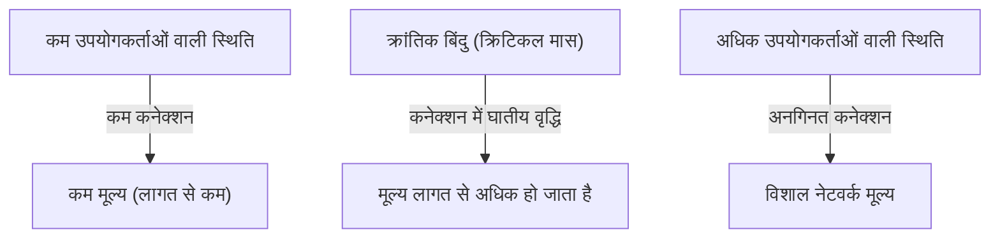
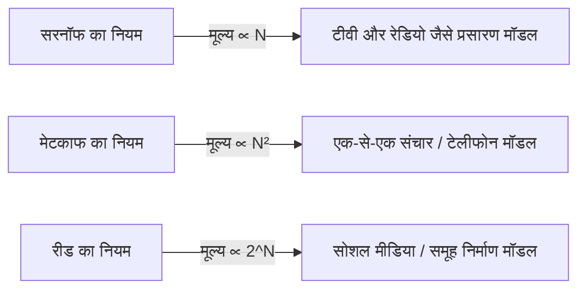

# नेटवर्क के मूल्य को नियंत्रित करने वाला 'मेटकाफ का नियम' क्या है? व्यापार रणनीति में इसके उपयोग पर विस्तृत मार्गदर्शिका

आधुनिक व्यापार में, विशेष रूप से डिजिटल प्लेटफॉर्म, सोशल नेटवर्क (SNS) और SaaS व्यवसायों में, शायद ही कोई दिन ऐसा जाता हो जब 'नेटवर्क प्रभाव' (या नेटवर्क बाह्यता) शब्द सुनने को न मिले। और इस नेटवर्क प्रभाव की शक्ति को गणितीय और वैचारिक रूप से समझाने वाला सबसे प्रसिद्ध नियम 'मेटकाफ का नियम' (Metcalfe's Law) है।

"नेटवर्क का मूल्य उस नेटवर्क से जुड़े उपयोगकर्ताओं (नोड्स) की संख्या के वर्ग (square) के समानुपाती होता है।"

यह दिखने में सरल नियम क्यों विशाल तकनीकी कंपनियों के उदय की व्याख्या करता है और स्टार्टअप्स की विकास रणनीति का आधार क्यों बनता है? इस लेख में, हम मेटकाफ के नियम की मूल बातें, इसके ऐतिहासिक पृष्ठभूमि, विशिष्ट व्यावसायिक उदाहरणों, और इस नियम की सीमाओं तथा अगली पीढ़ी के सिद्धांतों तक गहराई से चर्चा करेंगे।

## 1. मेटकाफ के नियम की मूल अवधारणा

### रॉबर्ट मेटकाफ और इथरनेट का जन्म
मेटकाफ के नियम का नाम रॉबर्ट मेटकाफ (Robert Metcalfe) के नाम पर रखा गया है, जो कंप्यूटर नेटवर्क तकनीक 'इथरनेट' (Ethernet) के सह-आविष्कारक और 3Com कंपनी के संस्थापक हैं। 1980 के दशक की शुरुआत में उनके द्वारा प्रस्तावित इस अवधारणा का उपयोग शुरुआत में फैक्स मशीन, टेलीफोन और इथरनेट उपकरणों की बिक्री को बढ़ावा देने के लिए एक व्याख्यात्मक मॉडल के रूप में किया गया था।

### नियम की गणितीय पृष्ठभूमि
मेटकाफ का नियम नेटवर्क के भीतर संभावित कनेक्शनों की संख्या पर आधारित है। यदि नेटवर्क में भाग लेने वाले नोड्स (उपयोगकर्ता या उपकरण) की संख्या $n$ है, तो प्रत्येक नोड अपने अलावा $n-1$ अन्य नोड्स से जुड़ सकता है। इस प्रकार, कुल संभावित कनेक्शन $C$ को निम्नलिखित सूत्र से दर्शाया जाता है:

$$ C = \frac{n(n - 1)}{2} $$

जब $n$ पर्याप्त रूप से बड़ा हो जाता है, तो यह मान $n^2$ के करीब पहुँच जाता है। दूसरे शब्दों में, मेटकाफ का दावा है कि नेटवर्क का मूल्य $V$ उपयोगकर्ताओं की संख्या $n$ के वर्ग के समानुपाती होता है ($V \propto n^2$)।

उदाहरण के लिए, यदि दुनिया में केवल दो टेलीफोन हों, तो आप केवल एक ही व्यक्ति से बात कर सकते हैं, और उस नेटवर्क का मूल्य सीमित है। हालाँकि, यदि टेलीफोन 100 हो जाते हैं, तो कनेक्शन के संयोजन 4,950 हो जाते हैं, और 10,000 टेलीफोन होने पर यह लगभग 5 करोड़ संयोजनों तक उछल जाता है। जैसे-जैसे प्रत्येक नया उपयोगकर्ता जुड़ता है, सभी मौजूदा उपयोगकर्ताओं के लिए भी नए कनेक्शन के अवसर पैदा होते हैं, जिससे समग्र मूल्य तेजी से बढ़ता है।

## 2. नेटवर्क प्रभाव के साथ संबंध

मेटकाफ का नियम 'नेटवर्क प्रभाव' (Network Effect) को समझाने के लिए एक शक्तिशाली सैद्धांतिक स्तंभ है। नेटवर्क प्रभाव का तात्पर्य उस घटना से है जिसमें "किसी उत्पाद या सेवा का मूल्य उसे उपयोग करने वाले अन्य उपयोगकर्ताओं की संख्या के आधार पर बदलता है।"

### प्रत्यक्ष नेटवर्क प्रभाव
टेलीफोन और सोशल मीडिया (Facebook, LINE, X आदि) इसके विशिष्ट उदाहरण हैं। एक ही प्लेटफॉर्म का उपयोग करने वाले उपयोगकर्ताओं की संख्या जितनी अधिक होती है, सीधे संवाद करने वाले लोगों की संख्या उतनी ही बढ़ती है, और सेवा का मूल्य बढ़ता है।

### अप्रत्यक्ष नेटवर्क प्रभाव (क्रॉस-नेटवर्क प्रभाव)
यह अक्सर दो-तरफा बाजारों (Two-sided platforms) में देखा जाता है। उदाहरण के लिए, Uber जैसे राइड-हेलिंग ऐप में, 'यात्रियों' के बढ़ने से 'ड्राइवरों' के लिए मूल्य बढ़ता है, और 'ड्राइवरों' के बढ़ने से 'यात्रियों' के लिए मूल्य (जैसे प्रतीक्षा समय कम होना) बढ़ता है। क्रेडिट कार्ड और ओएस (जैसे Windows या iOS) भी इस श्रेणी में आते हैं।

## 3. अन्य नियमों के साथ तुलना: Sarnoff, Metcalfe, Reed

नेटवर्क के मूल्य से संबंधित मेटकाफ का नियम एकमात्र नियम नहीं है। प्रसारण, संचार और समुदाय के तीन प्रतिमानों के अनुरूप विभिन्न नियम प्रस्तावित किए गए हैं।

### सरनॉफ का नियम (Sarnoff's Law)
आरसीए (RCA) के संस्थापक डेविड सरनॉफ के नाम पर यह नियम है। "एक प्रसारण नेटवर्क का मूल्य दर्शकों की संख्या के समानुपाती होता है ($V \propto n$)।" यह टीवी और रेडियो जैसे एक-से-अनेक (One-to-many) मॉडल पर लागू होता है।

### रीड का नियम (Reed's Law)
डेविड रीड द्वारा प्रस्तावित। "समूह निर्माण की अनुमति देने वाले नेटवर्क का मूल्य प्रतिभागियों की संख्या की 2 की घात के समानुपाती होता है ($V \propto 2^n$)।" जिन नेटवर्कों में उपयोगकर्ता स्वतंत्र रूप से उप-समूह (subgroups) बना सकते हैं, जैसे कि Slack, Discord या Facebook समूह, उनका मूल्य मेटकाफ के नियम से भी कहीं अधिक तेज़ी से बढ़ता है।

## 4. व्यापार में "क्रिटिकल मास" का महत्व

व्यापार रणनीति में मेटकाफ के नियम का सबसे महत्वपूर्ण निहितार्थ "क्रिटिकल मास" (क्रांतिक बिंदु) की अवधारणा है।

एक नेटवर्क बनाने के प्रारंभिक चरण में, सिस्टम विकास और सर्वर रखरखाव जैसी निश्चित लागत नेटवर्क के मूल्य से अधिक होती है। हालाँकि, जहाँ उपयोगकर्ताओं की संख्या ($n$) रैखिक (linearly) रूप से बढ़ती है, वहीं मूल्य ($n^2$) द्विघातीय (quadratically) रूप से बढ़ता है, और एक बिंदु पर मूल्य लागत को पार कर जाता है। यह ब्रेक-ईवन बिंदु ही क्रिटिकल मास है।

### कोल्ड स्टार्ट समस्या
क्रिटिकल मास तक पहुँचने से पहले, एक दुविधा होती है: "उपयोगकर्ता कम होने के कारण कोई मूल्य नहीं है, और कोई मूल्य न होने के कारण उपयोगकर्ता नहीं आते।" इसे 'कोल्ड स्टार्ट समस्या' कहा जाता है।

कंपनियां इससे पार पाने के लिए निम्नलिखित रणनीतियाँ अपनाती हैं:
- **भारी प्रारंभिक निवेश / अभियान**: लाभ की परवाह किए बिना उपयोगकर्ताओं को आकर्षित करना और जल्दी से क्रिटिकल मास को पार करना।
- **सिंगल-प्लेयर मोड में मूल्य प्रदान करना**: अन्य उपयोगकर्ताओं के बिना भी इसे एक उपयोगी टूल के रूप में पेश करना और बाद में इसे नेटवर्क बनाना (उदाहरण: शुरुआती Instagram केवल एक उच्च-प्रदर्शन वाला फोटो-एडिटिंग ऐप था)।
- **आला (Niche) बाजार से प्रभुत्व**: Facebook की रणनीति, जिसे शुरुआत में केवल हार्वर्ड विश्वविद्यालय के छात्रों तक सीमित रखा गया और एक मजबूत नेटवर्क बनाने के बाद अन्य विश्वविद्यालयों और आम जनता तक फैलाया गया।

## 5. मेटकाफ के नियम की आलोचना और सीमाएँ

हालांकि सिद्धांत रूप में मेटकाफ का नियम शक्तिशाली है, वास्तविक व्यापार में इसकी कुछ सीमाएँ और इसके अतिमूल्यांकन की ओर इशारा किया गया है।

### ज़िप का नियम और ओडलज़्को का नियम
गणितज्ञ एंड्रयू ओडलज़्को (Andrew Odlyzko) ने बताया कि मेटकाफ का नियम नेटवर्क के मूल्य को अधिक आंकता है क्योंकि "सभी कनेक्शनों का समान मूल्य नहीं होता है।" इंसान आमतौर पर सीमित लोगों के साथ ही बार-बार संवाद करते हैं (ज़िप का नियम), इसलिए ओडलज़्को के अनुसार, नेटवर्क का मूल्य $n^2$ के बजाय $n \log n$ के समानुपाती होता है।

### डनबार संख्या (Dunbar's Number)
मानव मस्तिष्क की संज्ञानात्मक क्षमताओं की सीमा के कारण, एक व्यक्ति द्वारा बनाए रखे जा सकने वाले स्थिर सामाजिक संबंधों की अधिकतम संख्या लगभग 150 मानी जाती है जिसे 'डनबार संख्या' कहा जाता है। भले ही किसी SNS के 1 बिलियन उपयोगकर्ता हों, एक व्यक्ति के कनेक्शन की एक ऊपरी सीमा होती है, इसलिए मूल्य उपयोगकर्ताओं की संख्या के वर्ग के साथ अनंत तक नहीं बढ़ता है।

### नेटवर्क की भीड़ और नकारात्मक नेटवर्क प्रभाव
यदि उपयोगकर्ता बहुत अधिक हो जाते हैं, तो स्पैम बढ़ना, संचार में देरी, और सूचना शोर में वृद्धि जैसी 'नकारात्मक नेटवर्क प्रभाव' उत्पन्न हो सकते हैं, जिससे मूल्य कम हो सकता है। उच्च गुणवत्ता वाले मिलान एल्गोरिदम और मॉडरेशन के बिना, मेटकाफ का नियम विफल हो जाता है।

## 6. निष्कर्ष: आधुनिक रणनीतियों में अनुप्रयोग

हालांकि यह एक सरलीकृत मॉडल है, लेकिन मेटकाफ का नियम प्लेटफॉर्म व्यवसायों में 'विजेता-सब-लेता-है' (Winner-takes-all) की गतिशीलता को बहुत अच्छी तरह से दर्शाता है।

बिजनेस लीडर्स और उद्यमियों को हमेशा इस बात को डिजाइन के केंद्र में रखना चाहिए कि उनके उत्पाद नेटवर्क प्रभाव कैसे पैदा करते हैं, और वे कितनी जल्दी क्रिटिकल मास को पार कर सकते हैं। AI और [ब्लॉकचेन](/hi/p/blockchain-technology-smart-contract-distributed-ledger/) (Web3) के युग में भी, नोड्स कैसे जुड़ते हैं और मूल्य का आदान-प्रदान कैसे करते हैं, इसकी नींव में मेटकाफ का नियम अभी भी चुपचाप लेकिन शक्तिशाली रूप से काम कर रहा है।
