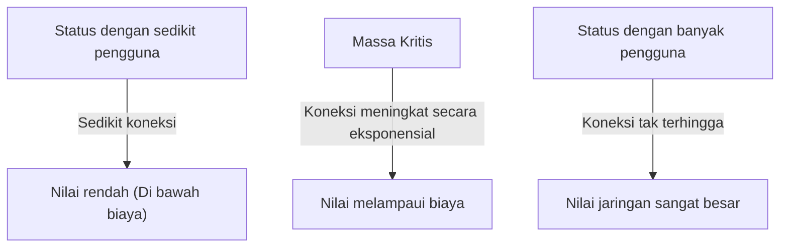
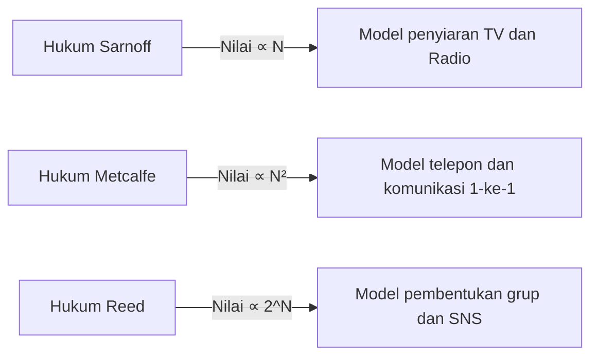

# Apa itu "Hukum Metcalfe" yang Menguasai Nilai Jaringan? Penjelasan Lengkap Cara Memanfaatkannya dalam Strategi Bisnis

Dalam bisnis modern, khususnya platform digital, SNS, dan bisnis SaaS, tidak ada hari tanpa mendengar istilah "efek jaringan" (network effect / network externality). Dan hukum yang paling terkenal untuk menjelaskan kekuatan efek jaringan ini secara matematis dan konseptual adalah "Hukum Metcalfe" (Metcalfe's Law).

"Nilai sebuah jaringan sebanding dengan kuadrat jumlah pengguna (node) yang terhubung ke jaringan tersebut"

Mengapa hukum yang tampak sederhana ini dapat menjelaskan kebangkitan perusahaan raksasa teknologi dan menjadi inti dari strategi pertumbuhan startup? Dalam artikel ini, kita akan menggali lebih dalam mulai dari konsep dasar Hukum Metcalfe, latar belakang sejarah, contoh nyata dalam bisnis, hingga batasan-batasan hukum dan teori generasi berikutnya.

## 1. Konsep Dasar Hukum Metcalfe

### Robert Metcalfe dan Lahirnya Ethernet
Hukum Metcalfe dinamai dari Robert Metcalfe, penemu bersama teknologi jaringan komputer "Ethernet" dan pendiri perusahaan 3Com. Konsep ini, yang diajukan pada awal tahun 1980-an, pada awalnya digunakan sebagai model penjelasan untuk mempromosikan penjualan faksimili (FAX), telepon, dan peralatan Ethernet.

### Latar Belakang Matematika Hukum
Hukum Metcalfe didasarkan pada jumlah pasangan yang dapat terhubung dalam suatu jaringan. Jika jumlah node (pengguna atau perangkat) yang berpartisipasi dalam jaringan adalah $n$, maka masing-masing node dapat terhubung dengan $n-1$ node lainnya selain dirinya sendiri. Oleh karena itu, jumlah keseluruhan potensi koneksi $C$ dapat dinyatakan dengan rumus berikut:

$$ C = \frac{n(n - 1)}{2} $$

Ketika $n$ menjadi cukup besar, nilai ini akan mendekati $n^2$. Dengan kata lain, klaim Metcalfe adalah bahwa nilai jaringan $V$ sebanding dengan kuadrat dari jumlah pengguna $n$ ($V \propto n^2$).

Sebagai contoh, jika hanya ada dua telepon di dunia, Anda hanya bisa menelepon satu orang, sehingga nilai jaringan tersebut sangat terbatas. Namun, jika jumlah telepon mencapai 100, kombinasi koneksi akan menjadi 4.950 kemungkinan, dan jika ada 10.000 telepon, akan melonjak menjadi sekitar 50 juta kemungkinan. Setiap kali jumlah pengguna bertambah 1 orang, maka akan tercipta tujuan koneksi baru bagi semua pengguna yang ada, sehingga nilai keseluruhan akan meningkat secara terakselerasi.

## 2. Hubungan dengan Efek Jaringan

Hukum Metcalfe adalah pilar teoretis yang kuat untuk menjelaskan "Efek Jaringan" (Network Effect). Efek jaringan adalah "fenomena di mana nilai suatu produk atau layanan berubah bergantung pada jumlah pengguna lain yang memanfaatkannya".

### Efek Jaringan Langsung
Telepon atau SNS (Facebook, LINE, X, dll) adalah contoh tipikal. Semakin banyak pengguna yang menggunakan platform yang sama, semakin banyak lawan komunikasi secara langsung, dan nilai layanannya pun semakin tinggi.

### Efek Jaringan Tidak Langsung (Efek Jaringan Lintas)
Sering terlihat di pasar dua sisi (two-sided platforms). Misalnya, pada aplikasi transportasi online seperti Uber, jika "penumpang" bertambah, nilai bagi "pengemudi" akan meningkat. Sebaliknya, jika "pengemudi" bertambah, nilai bagi "penumpang" akan meningkat (seperti waktu tunggu yang lebih singkat). Kartu kredit atau sistem operasi (Windows, iOS, dll) juga termasuk dalam kategori ini.

## 3. Perbandingan dengan Hukum Lainnya: Sarnoff, Metcalfe, Reed

Hukum tentang nilai jaringan bukan hanya Hukum Metcalfe. Ada hukum-hukum lain yang diajukan sesuai dengan tiga paradigma: penyiaran, komunikasi, dan komunitas.

### Hukum Sarnoff (Sarnoff's Law)
Hukum yang dinamai dari pendiri RCA, David Sarnoff. "Nilai dari jaringan penyiaran berbanding lurus dengan jumlah penonton ($V \propto n$)". Ini berlaku untuk model satu-ke-banyak seperti televisi dan radio.

### Hukum Reed (Reed's Law)
Diajukan oleh David Reed. "Nilai jaringan yang memungkinkan pembentukan grup berbanding lurus dengan pangkat dua dari jumlah peserta ($V \propto 2^n$)". Dalam jaringan di mana pengguna dapat secara bebas membuat subkelompok seperti Slack, Discord, atau Grup Facebook, teori ini menyatakan bahwa nilainya akan meledak melebihi Hukum Metcalfe.

## 4. Pentingnya "Massa Kritis" dalam Bisnis

Implikasi paling penting dari Hukum Metcalfe bagi strategi bisnis adalah konsep "Massa Kritis" (Critical Mass / titik kritis).

Pada tahap awal membangun jaringan, biaya tetap seperti pengembangan sistem dan biaya pemeliharaan server lebih besar daripada nilai jaringannya. Namun, sementara jumlah pengguna ($n$) tumbuh secara linear, nilainya ($n^2$) tumbuh secara eksponensial (fungsi kuadrat), sehingga pada titik tertentu nilai jaringan akan melampaui biayanya. Skala pengguna di titik impas ini disebut Massa Kritis.

### Masalah Awal yang Dingin (Cold Start Problem)
Sebelum mencapai Massa Kritis, layanan sering kali terjebak dalam dilema: "Karena tidak ada pengguna, layanan tidak bernilai, dan karena tidak bernilai, tidak ada pengguna yang berkumpul". Ini disebut "Masalah Awal yang Dingin" (Cold Start Problem).

Perusahaan-perusahaan menggunakan strategi berikut untuk mengatasi hal ini:
- **Investasi Awal Besar / Kampanye**: Memperoleh pengguna bahkan jika mengorbankan keuntungan di awal, untuk melampaui Massa Kritis secepat mungkin (contoh: kampanye bakar uang oleh layanan e-wallet/fintech).
- **Penyediaan Nilai dalam Mode Single-Player**: Menawarkannya sebagai alat yang berguna bahkan tanpa kehadiran pengguna lain, dan menghubungkannya dalam jaringan kemudian (contoh: Instagram versi awal yang hanya berupa aplikasi edit foto canggih).
- **Penguasaan dari Pasar Niche (Ceruk)**: Strategi Facebook, yang awalnya membatasi dan menyebarkan layanannya khusus kepada mahasiswa Universitas Harvard, membangun jaringan yang kuat sebelum menyebar ke universitas lain dan ke masyarakat umum.

## 5. Kritik dan Batasan Hukum Metcalfe

Meskipun kuat secara teoretis, dalam dunia bisnis nyata ada beberapa batasan dan kritik atas overestimasi (penilaian berlebihan) dari Hukum Metcalfe.

### Hukum Zipf dan Hukum Odlyzko
Matematikawan Andrew Odlyzko dan lainnya menunjukkan bahwa Hukum Metcalfe terlalu tinggi dalam menilai nilai jaringan. Alasannya adalah "tidak semua koneksi memiliki nilai yang setara". Manusia sering kali hanya berkomunikasi dengan sebagian pihak yang terbatas (Hukum Zipf), sehingga Odlyzko berpendapat bahwa nilai jaringan tidak sebanding dengan $n^2$, melainkan sebanding dengan $n \log n$ (Hukum Odlyzko).

### Angka Dunbar
Ada konsep "Angka Dunbar", yang menyatakan bahwa mengingat batas kemampuan kognitif otak manusia, ada batasan sekitar 150 orang untuk menjaga hubungan sosial yang stabil. Bahkan jika jumlah pengguna SNS mencapai 1 miliar, karena ada batas atas pada jumlah koneksi seseorang, nilainya tidak akan terus berlipat ganda secara tak terbatas.

### Kemacetan Jaringan dan Efek Jaringan Negatif
Jika pengguna terlalu banyak, fenomena "Efek Jaringan Negatif" dapat terjadi, seperti peningkatan spam, keterlambatan komunikasi, dan peningkatan kebisingan (noise) informasi, yang justru akan menurunkan nilai. Tanpa algoritma pencocokan yang berkualitas tinggi atau moderasi, Hukum Metcalfe bisa runtuh.

## 6. Kesimpulan: Penerapan dalam Strategi Modern

Meskipun merupakan model yang disederhanakan, Hukum Metcalfe dengan luar biasa merepresentasikan dinamika "Pemenang mengambil semua" (Winner-takes-all) dalam bisnis platform.

Para pemimpin bisnis dan wirausahawan harus selalu menempatkan pada pusat perancangan tentang bagaimana produk mereka akan menciptakan efek jaringan, dan bagaimana cara menembus Massa Kritis secepat mungkin. Bahkan di era AI dan blockchain (Web3), Hukum Metcalfe masih terus bekerja secara diam-diam namun kuat sebagai dasar bagaimana node-node terhubung dan bertukar nilai.
