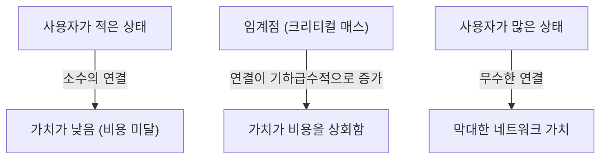
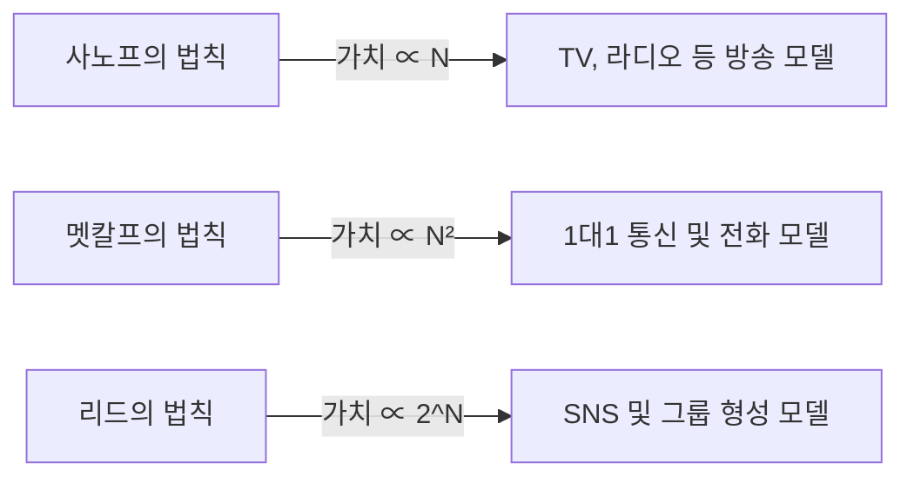

# 네트워크의 가치를 지배하는 "멧칼프의 법칙"이란? 비즈니스 전략에서의 활용법 철저 해설

현대의 비즈니스, 특히 디지털 플랫폼이나 SNS, SaaS 비즈니스에서 '네트워크 효과(네트워크 외부성)'라는 단어를 듣지 않는 날이 없습니다. 그리고 이 네트워크 효과의 위력을 수학적, 개념적으로 설명하는 가장 유명한 법칙이 바로 '멧칼프의 법칙(Metcalfe's Law)'입니다.

"네트워크의 가치는 그 네트워크에 연결된 사용자(노드) 수의 제곱에 비례한다"

이 언뜻 보기에 단순한 법칙이 왜 거대 테크 기업의 대두를 설명하고, 스타트업 성장 전략의 근간이 되는 것일까요? 본 기사에서는 멧칼프의 법칙의 기초부터 역사적 배경, 구체적인 비즈니스 사례, 그리고 법칙의 한계와 차세대 이론에 이르기까지 철저하게 심층적으로 해설합니다.

## 1. 멧칼프의 법칙의 기본 개념

### 로버트 멧칼프와 이더넷의 탄생
멧칼프의 법칙은 컴퓨터 네트워크 기술 '이더넷(Ethernet)'의 공동 발명자이자 3Com사의 창업자인 로버트 멧칼프(Robert Metcalfe)의 이름에서 유래했습니다. 그가 1980년대 초반에 제창한 이 개념은 당초 팩시밀리(FAX)나 전화, 그리고 이더넷 기기의 판매를 촉진하기 위한 설명 모델로 사용되었습니다.

### 법칙의 수학적 배경
멧칼프의 법칙은 네트워크 내 연결 가능한 쌍의 수에 기반하고 있습니다. 네트워크에 참여하고 있는 노드(사용자나 기기)의 수를 $n$이라고 하면, 각 노드는 자신 이외의 $n-1$개의 노드와 연결할 수 있기 때문에, 전체의 잠재적인 연결 수 $C$는 다음 공식으로 표현됩니다.

$$ C = \frac{n(n - 1)}{2} $$

$n$이 충분히 커지면, 이 값은 $n^2$에 점근합니다. 즉, 네트워크의 가치 $V$는 사용자 수 $n$의 제곱에 비례한다는 것이 멧칼프의 주장입니다($V \propto n^2$).

예를 들어 세계에 전화기가 2대밖에 없다면 통화할 수 있는 상대는 1명뿐이며, 그 네트워크의 가치는 제한적입니다. 하지만 전화기가 100대가 되면 연결 조합은 4,950가지가 되고, 1만 대가 되면 약 5,000만 가지로 뛰어오릅니다. 사용자가 1명 늘어날 때마다 기존의 모든 사용자에게도 새로운 연결처가 생겨나므로 전체의 가치가 가속도적으로 상승하는 것입니다.

## 2. 네트워크 효과와의 관계

멧칼프의 법칙은 '네트워크 효과(Network Effect)'를 설명하는 강력한 이론적 지주입니다. 네트워크 효과란 '어떤 제품이나 서비스의 가치가 그것을 이용하는 다른 사용자 수에 의존하여 변화하는 현상'을 말합니다.

### 직접적 네트워크 효과
전화나 SNS(Facebook, LINE, X 등)가 대표적인 예입니다. 같은 플랫폼을 이용하는 사용자가 늘어날수록 직접적으로 소통할 상대가 늘어나 서비스의 가치가 높아집니다.

### 간접적 네트워크 효과(교차 네트워크 효과)
양면 시장(투 사이드 플랫폼)에서 자주 보입니다. 예를 들어, Uber와 같은 배차 앱에서는 '승객'이 늘어나면 '운전자'에게 가치가 올라가고, '운전자'가 늘어나면 '승객'에게 가치(대기 시간 단축 등)가 올라갑니다. 신용카드나 OS(Windows, iOS 등)도 이에 해당합니다.

## 3. 다른 법칙들과의 비교: Sarnoff, Metcalfe, Reed

네트워크의 가치에 관한 법칙은 멧칼프의 법칙만이 아닙니다. 방송, 통신, 커뮤니티의 3가지 패러다임에 맞추어 서로 다른 법칙들이 제창되어 있습니다.

### 사노프의 법칙(Sarnoff's Law)
RCA의 창업자 데이비드 사노프의 이름을 딴 법칙. "방송 네트워크의 가치는 시청자 수에 비례한다($V \propto n$)". 1대다의 TV나 라디오 모델에 해당합니다.

### 리드의 법칙(Reed's Law)
데이비드 리드가 제창. "그룹 형성이 가능한 네트워크의 가치는 참여자 수의 2의 거듭제곱에 비례한다($V \propto 2^n$)". Slack이나 Discord, Facebook 그룹처럼 사용자끼리 자유롭게 소그룹을 만들 수 있는 네트워크에서는 멧칼프의 법칙 이상으로 가치가 폭발적으로 증대한다는 이론입니다.

## 4. 비즈니스에서 '크리티컬 매스(임계점)'의 중요성

멧칼프의 법칙이 비즈니스 전략에 있어서 가장 중요한 시사점을 주는 것은 '크리티컬 매스(임계점, Critical Mass)'라는 개념입니다.

네트워크를 구축하는 초기 단계에서는 시스템 개발이나 서버 유지비 등의 고정 비용이 네트워크의 가치를 상회합니다. 그러나 사용자 수($n$)가 선형적으로 증가하는 데 반해, 가치($n^2$)는 2차 함수적으로 성장하기 때문에 어느 시점에서 가치가 비용을 추월하게 됩니다. 이 손익분기점이 되는 사용자 규모가 바로 크리티컬 매스입니다.

### 콜드 스타트 문제
크리티컬 매스에 도달하기 전까지는 "사용자가 적기 때문에 가치가 없고, 가치가 없기 때문에 사용자가 모이지 않는다"는 딜레마에 빠집니다. 이를 '콜드 스타트 문제(Cold Start Problem)'라고 부릅니다.

기업은 이를 돌파하기 위해 다음과 같은 전략을 취합니다.
- **거액의 초기 투자 및 캠 캠페인**: 이익을 도외시하더라도 사용자를 확보하여 빠르게 크리티컬 매스를 넘는다 (예: 페이페이의 100억엔 환원 캠페인).
- **싱글 플레이어 모드에서의 가치 제공**: 다른 사용자가 없어도 유용한 도구로서 제공하고, 나중에 네트워크화한다 (예: 초기의 Instagram은 단순한 고성능 사진 보정 앱이었다).
- **니치 시장부터의 장악**: Facebook이 처음에는 하버드 대학교 학생들로만 제한하여 보급시켰고, 견고한 네트워크를 만든 후에 타 대학이나 일반 대중에게 넓힌 전략.

## 5. 멧칼프의 법칙에 대한 비판과 한계

이론상으로는 강력한 멧칼프의 법칙이지만, 실제 비즈니스에서는 몇 가지 한계나 과대평가에 대한 지적도 존재합니다.

### 지프의 법칙과 오들리츠코의 법칙
수학자 앤드류 오들리츠코 등은 멧칼프의 법칙이 네트워크의 가치를 과대평가하고 있다고 지적했습니다. "모든 연결이 동등한 가치를 가지는 것은 아니기" 때문입니다. 인간이 자주 소통하는 상대는 일부에 한정되어 있으며(지프의 법칙), 네트워크의 가치는 $n^2$이 아니라 $n \log n$에 비례한다는 것이 오들리츠코 등의 주장입니다(오들리츠코의 법칙).

### 던바의 수
인간 뇌의 인지 능력의 한계로 인해 안정적인 사회적 관계를 유지할 수 있는 인원은 약 150명이 한계라는 '던바의 수(Dunbar's number)'라는 개념이 있습니다. SNS의 사용자 수가 10억 명이 되어도, 한 개인이 연결되는 인원에는 상한이 있기 때문에 가치가 2제곱으로 무한히 계속 늘어나는 것은 아닙니다.

### 네트워크 혼잡과 부정적 네트워크 효과
사용자가 너무 많아지면 스팸의 증가, 통신 지연, 정보의 노이즈 증대 등 '부정적인 네트워크 효과'가 발생하여 오히려 가치가 떨어질 수 있습니다. 질 높은 매칭 알고리즘이나 모더레이션이 없다면 멧칼프의 법칙은 파탄납니다.

## 6. 요약: 현대 전략으로의 응용

멧칼프의 법칙은 단순화된 모델이긴 하지만, 플랫폼 비즈니스의 '승자 독식(Winner-takes-all)' 다이내믹스를 훌륭하게 표현하고 있습니다.

비즈니스 리더나 창업가는 자사의 프로덕트가 어떻게 네트워크 효과를 만들어 낼 것인지, 그리고 얼마나 빨리 크리티컬 매스를 돌파할 것인지를 항상 설계의 중심에 두어야 합니다. AI나 [블록체인](/ko/p/blockchain-technology-smart-contract-distributed-ledger/)(Web3)의 시대에 있어서도, 노드끼리 어떻게 연결되고 가치를 교환할 세인지의 기반에는 여전히 멧칼프의 법칙이 조용하지만 강력하게 작용하고 있는 것입니다.
