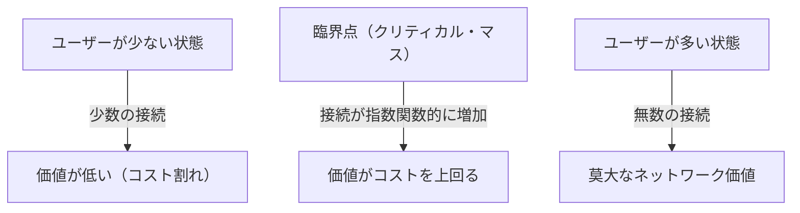
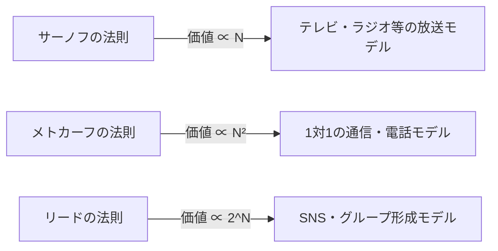

# ネットワークの価値を支配する「メトカーフの法則」とは？ビジネス戦略での活用法を徹底解説

現代のビジネス、特にデジタルプラットフォームやSNS、SaaSビジネスにおいて、「ネットワーク効果（ネットワーク外部性）」という言葉を耳にしない日はありません。そして、このネットワーク効果の威力を数学的・概念的に説明する最も有名な法則が「メトカーフの法則（Metcalfe's Law）」です。

「ネットワークの価値は、そのネットワークに接続されているユーザー（ノード）の数の2乗に比例する」

この一見シンプルな法則が、なぜ巨大テック企業の台頭を説明し、スタートアップの成長戦略の根幹となるのでしょうか。本記事では、メトカーフの法則の基礎から、歴史的背景、具体的なビジネス事例、そして法則の限界と次世代の理論に至るまで、徹底的に深掘りして解説します。

## 1. メトカーフの法則の基本概念

### ロバート・メトカーフとイーサネットの誕生
メトカーフの法則は、コンピュータネットワーク技術「イーサネット（Ethernet）」の共同発明者であり、3Com社の創業者でもあるロバート・メトカーフ（Robert Metcalfe）にちなんで名付けられました。彼が1980年代初頭に提唱したこの概念は、当初はファクシミリ（FAX）や電話、そしてイーサネット機器の販売を促進するための説明モデルとして使われていました。

### 法則の数学的背景
メトカーフの法則は、ネットワーク内の接続可能なペアの数に基づいています。ネットワークに参加しているノード（ユーザーやデバイス）の数を $n$ とすると、各ノードは自分以外の $n-1$ 個のノードと接続できるため、全体の潜在的な接続数 $C$ は以下の式で表されます。

$$ C = \frac{n(n - 1)}{2} $$

$n$ が十分に大きくなると、この値は $n^2$ に漸近します。つまり、ネットワークの価値 $V$ はユーザー数 $n$ の2乗に比例するというのが、メトカーフの主張です（$V \propto n^2$）。

例えば、世界に電話が2台しかなければ、通話できる相手は1人だけであり、そのネットワークの価値は限られています。しかし、電話が100台になれば接続の組み合わせは4,950通りになり、1万台になれば約5,000万通りに跳ね上がります。ユーザーが1人増えるごとに、既存のすべてのユーザーにとっても新たな接続先が生まれるため、全体の価値が加速度的に上昇するのです。

## 2. ネットワーク効果との関係

メトカーフの法則は「ネットワーク効果（Network Effect）」を説明する強力な理論的支柱です。ネットワーク効果とは、「ある製品やサービスの価値が、それを利用する他のユーザーの数に依存して変化する現象」を指します。

### 直接的ネットワーク効果
電話やSNS（Facebook、LINE、Xなど）が典型例です。同じプラットフォームを利用するユーザーが増えるほど、直接的にコミュニケーションの相手が増え、サービスの価値が高まります。

### 間接的ネットワーク効果（交差ネットワーク効果）
2面市場（ツーサイド・プラットフォーム）でよく見られます。例えば、Uberのような配車アプリでは、「乗客」が増えれば「ドライバー」にとっての価値が上がり、「ドライバー」が増えれば「乗客」にとっての価値（待ち時間の短縮など）が上がります。クレジットカードやOS（WindowsやiOSなど）もこれに該当します。

## 3. その他の法則との比較：Sarnoff, Metcalfe, Reed

ネットワークの価値に関する法則はメトカーフの法則だけではありません。放送、通信、コミュニティの3つのパラダイムに合わせて、異なる法則が提唱されています。

### サーノフの法則（Sarnoff's Law）
RCAの創業者デビッド・サーノフにちなむ法則。「放送ネットワークの価値は視聴者の数に比例する（$V \propto n$）」。1対多のテレビやラジオのモデルに当てはまります。

### リードの法則（Reed's Law）
デビッド・リードが提唱。「グループ形成が可能なネットワークの価値は、参加者数の2のべき乗に比例する（$V \propto 2^n$）」。SlackやDiscord、Facebookグループのように、ユーザー同士がサブグループを自由に作れるネットワークでは、メトカーフの法則以上に価値が爆発的に増大するという理論です。

## 4. ビジネスにおける「クリティカル・マス」の重要性

メトカーフの法則がビジネス戦略において最も重要な示唆を与えるのは、「クリティカル・マス（臨界点）」という概念です。

ネットワークを構築する初期段階では、システム開発やサーバー維持費などの固定コストがネットワークの価値を上回っています。しかし、ユーザー数（$n$）が直線的に増加するのに対し、価値（$n^2$）は二次関数的に成長するため、ある時点で価値がコストを追い抜きます。この損益分岐点となるユーザー規模がクリティカル・マスです。

### コールドスタート問題
クリティカル・マスに達するまでの間は、「ユーザーが少ないから価値がない、価値がないからユーザーが集まらない」というジレンマに陥ります。これを「コールドスタート問題」と呼びます。

企業はこれを突破するために、以下のような戦略をとります。
- **巨額の初期投資・キャンペーン**: 利益を度外視してでもユーザーを獲得し、いち早くクリティカル・マスを超える（例：PayPayの100億円あげちゃうキャンペーン）。
- **シングルプレイヤーモードでの価値提供**: 他のユーザーがいなくても便利なツールとして提供し、後からネットワーク化する（例：初期のInstagramは単なる高性能な写真加工アプリだった）。
- **ニッチ市場からの制圧**: Facebookが最初はハーバード大学の学生に限定して普及させ、強固なネットワークを作ってから他大学、一般へと広げた戦略。

## 5. メトカーフの法則に対する批判と限界

理論上は強力なメトカーフの法則ですが、現実のビジネスにおいてはいくつかの限界や過大評価の指摘も存在します。

### ジップの法則とオドリツコの法則
数学者アンドリュー・オドリツコらは、メトカーフの法則がネットワークの価値を過大評価していると指摘しました。「すべての接続が等価な価値を持つわけではない」からです。人間が頻繁にコミュニケーションをとる相手は一部に限られており（ジップの法則）、ネットワークの価値は $n^2$ ではなく、$n \log n$ に比例するというのがオドリツコらの主張です（オドリツコの法則）。

### ダンバー数
人間の脳の認知能力の限界から、安定した社会関係を維持できる人数は約150人が限界であるという「ダンバー数」の概念があります。SNSのユーザー数が10億人になっても、一個人がつながる人数には上限があるため、価値が無限に2乗で増え続けるわけではありません。

### ネットワークの混雑と負のネットワーク効果
ユーザーが増えすぎると、スパムの増加、通信の遅延、情報のノイズ増大など「負のネットワーク効果」が発生し、かえって価値が下がることがあります。質の高いマッチングアルゴリズムやモデレーションがなければ、メトカーフの法則は破綻します。

## 6. まとめ：現代の戦略への応用

メトカーフの法則は、単純化されたモデルではあるものの、プラットフォームビジネスの「勝者総取り（Winner-takes-all）」のダイナミクスを見事に表現しています。

ビジネスリーダーや起業家は、自社のプロダクトがどのようにネットワーク効果を生み出すか、そしていかに早くクリティカル・マスを突破するかを常に設計の中心に据えるべきです。AIや[ブロックチェーン](/p/blockchain-technology-smart-contract-distributed-ledger/)（Web3）の時代においても、ノード同士がどのようにつながり、価値を交換するかの基盤には、依然としてメトカーフの法則が静かに、しかし強力に作用し続けているのです。
