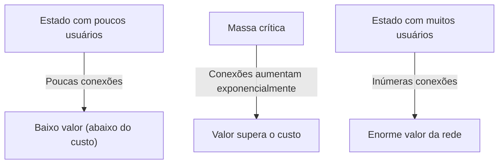
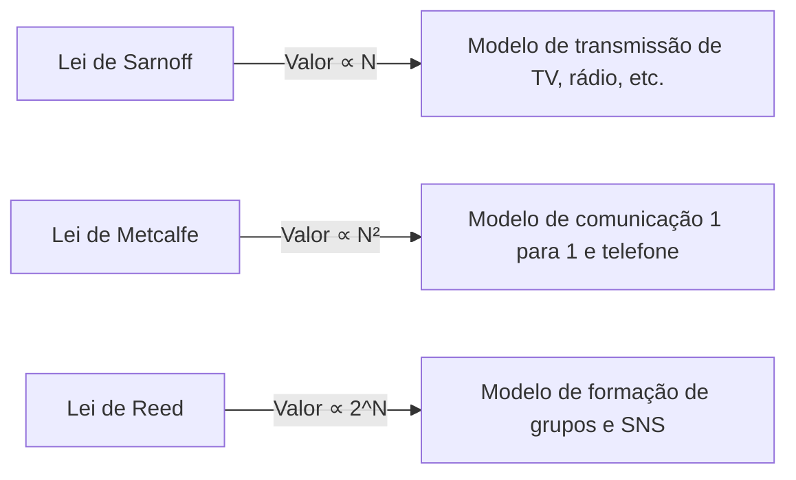

# O que é a "Lei de Metcalfe" que domina o valor da rede? Explicação detalhada da sua aplicação na estratégia de negócios

Nos negócios modernos, especialmente em plataformas digitais, SNS e negócios SaaS, não há um dia em que não se ouça o termo "efeito de rede" (externalidade de rede). E a lei mais famosa que explica matemática e conceitualmente o poder desse efeito de rede é a "Lei de Metcalfe" (Metcalfe's Law).

"O valor de uma rede é proporcional ao quadrado do número de usuários (nós) conectados a essa rede"

Por que essa lei aparentemente simples explica a ascensão das gigantes empresas de tecnologia e se torna a base das estratégias de crescimento das startups? Neste artigo, explicaremos a fundo desde os conceitos básicos da Lei de Metcalfe, o contexto histórico, os exemplos concretos de negócios e até os limites da lei e as teorias da próxima geração.

## 1. Conceito Básico da Lei de Metcalfe

### Robert Metcalfe e o Nascimento da Ethernet
A Lei de Metcalfe recebeu o nome de Robert Metcalfe, co-inventor da tecnologia de rede de computadores "Ethernet" e fundador da empresa 3Com. Esse conceito, proposto por ele no início dos anos 1980, foi inicialmente usado como um modelo explicativo para promover as vendas de aparelhos de fax, telefones e equipamentos Ethernet.

### Contexto Matemático da Lei
A Lei de Metcalfe é baseada no número de pares conectáveis dentro de uma rede. Se o número de nós (usuários ou dispositivos) participando da rede for $n$, como cada nó pode se conectar a $n-1$ outros nós (exceto a si mesmo), o número total de potenciais conexões $C$ é expresso pela seguinte fórmula:

$$ C = \frac{n(n - 1)}{2} $$

Quando $n$ se torna suficientemente grande, este valor se aproxima de $n^2$. Em outras palavras, a afirmação de Metcalfe é que o valor da rede $V$ é proporcional ao quadrado do número de usuários $n$ ($V \propto n^2$).

Por exemplo, se houver apenas dois telefones no mundo, só haverá uma pessoa para quem se pode ligar, e o valor dessa rede é limitado. No entanto, se houver 100 telefones, haverá 4.950 combinações de conexão, e se houver 10.000 telefones, saltará para cerca de 50 milhões. Cada vez que o número de usuários aumenta em 1, novos destinos de conexão são criados para todos os usuários existentes, o que faz com que o valor geral suba de forma acelerada.

## 2. A Relação com os Efeitos de Rede

A Lei de Metcalfe é um poderoso pilar teórico que explica o "Efeito de Rede" (Network Effect). O efeito de rede refere-se ao "fenômeno em que o valor de um determinado produto ou serviço muda de acordo com o número de outros usuários que o utilizam".

### Efeito de Rede Direto
Telefones e SNS (Facebook, LINE, X, etc.) são exemplos típicos. Quanto mais usuários utilizam a mesma plataforma, mais parceiros de comunicação diretos existem e maior se torna o valor do serviço.

### Efeito de Rede Indireto (Efeito de Rede Cruzado)
Muitas vezes visto em mercados de dois lados (two-sided platforms). Por exemplo, em aplicativos de carona como a Uber, se o número de "passageiros" aumentar, o valor para os "motoristas" aumenta; se o número de "motoristas" aumentar, o valor para os "passageiros" aumenta (como tempos de espera mais curtos). Cartões de crédito e sistemas operacionais (como Windows e iOS) também se enquadram nesta categoria.

## 3. Comparação com Outras Leis: Sarnoff, Metcalfe, Reed

A Lei de Metcalfe não é a única lei em relação ao valor das redes. Leis diferentes foram propostas para se adaptarem a três paradigmas: transmissão, comunicação e comunidade.

### Lei de Sarnoff (Sarnoff's Law)
Uma lei nomeada em homenagem ao fundador da RCA, David Sarnoff. "O valor das redes de transmissão é proporcional ao número de telespectadores ($V \propto n$)". Isso se aplica ao modelo um-para-muitos da televisão e da rádio.

### Lei de Reed (Reed's Law)
Proposta por David Reed. "O valor das redes que permitem a formação de grupos é proporcional a duas potências do número de participantes ($V \propto 2^n$)". Essa é a teoria de que, em redes onde os usuários podem criar subgrupos livremente, como o Slack, Discord e grupos do Facebook, o valor explode ainda mais do que a Lei de Metcalfe.

## 4. A Importância da "Massa Crítica" nos Negócios

A sugestão mais importante que a Lei de Metcalfe fornece para a estratégia de negócios é o conceito de "massa crítica" (ponto crítico).

Nos estágios iniciais da construção de uma rede, os custos fixos, como os custos de desenvolvimento de sistemas e manutenção de servidores, excedem o valor da rede. Contudo, enquanto o número de usuários ($n$) aumenta de forma linear, o valor ($n^2$) cresce numa função quadrática, de modo que em algum momento o valor ultrapassa o custo. O tamanho de usuários que se torna este ponto de equilíbrio é a massa crítica.

### O Problema do Início a Frio (Cold Start Problem)
Até que a massa crítica seja alcançada, entra-se num dilema em que "o serviço não tem valor porque há poucos usuários, e os usuários não se reúnem porque o serviço não tem valor". Isto é chamado de "Problema do Início a Frio".

As empresas adotam as seguintes estratégias para superar isso:
- **Enormes investimentos e campanhas iniciais**: Adquirir usuários ignorando os lucros para ultrapassar a massa crítica o mais rapidamente possível (ex: campanha "PayPay dá 10 bilhões de ienes").
- **Provisão de valor no modo de um único jogador**: Oferecer como uma ferramenta útil, mesmo sem outros usuários, e depois transformá-la em rede (ex: o Instagram no início era apenas um aplicativo de edição de fotos de alto desempenho).
- **Domínio a partir de mercados de nicho**: A estratégia do Facebook, que inicialmente se limitou aos estudantes da Universidade de Harvard para popularizá-lo e criou uma rede forte antes de se espalhar para outras universidades e para o público em geral.

## 5. Críticas e Limites da Lei de Metcalfe

Embora a Lei de Metcalfe seja teoricamente poderosa, também há várias críticas quanto aos seus limites e sobreavaliação no mundo real dos negócios.

### A Lei de Zipf e a Lei de Odlyzko
O matemático Andrew Odlyzko e outros salientaram que a Lei de Metcalfe sobreavalia o valor de uma rede. Isso porque "nem todas as conexões têm o mesmo valor". Os seres humanos comunicam frequentemente apenas com um número limitado de pessoas (Lei de Zipf), e a afirmação de Odlyzko e outros é que o valor de uma rede não é proporcional a $n^2$, mas a $n \log n$ (Lei de Odlyzko).

### O Número de Dunbar
Existe o conceito do "número de Dunbar", que afirma que o limite da cognição do cérebro humano restringe a cerca de 150 o número de pessoas com as quais podemos manter relações sociais estáveis. Mesmo que o número de usuários de um SNS atinja um bilhão, há um limite para o número de pessoas com as quais um indivíduo pode se conectar, por isso o valor não continuará a aumentar infinitamente pelo quadrado.

### Congestionamento de Rede e Efeitos de Rede Negativos
Se houver muitos usuários, podem ocorrer "efeitos de rede negativos", como aumento de spam, atrasos de comunicação e aumento de ruído de informações, que podem, em vez disso, reduzir o valor. Sem algoritmos de correspondência de alta qualidade e moderação, a Lei de Metcalfe entrará em colapso.

## 6. Conclusão: Aplicação à Estratégia Moderna

Embora a Lei de Metcalfe seja um modelo simplificado, capta de forma brilhante a dinâmica "O Vencedor Leva Tudo" (Winner-takes-all) dos negócios de plataforma.

Líderes de negócios e empreendedores devem manter sempre no centro da concepção como os seus próprios produtos irão criar efeitos de rede e com que rapidez irão ultrapassar a massa crítica. Mesmo na era da IA e das blockchains (Web3), a Lei de Metcalfe continua a atuar de forma silenciosa, mas poderosa, como a base de como os nós se conectam e trocam valor.
