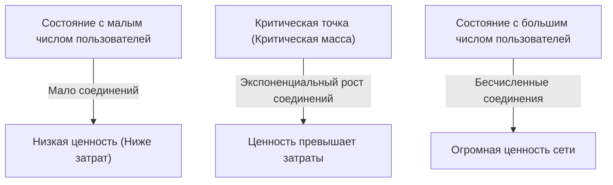
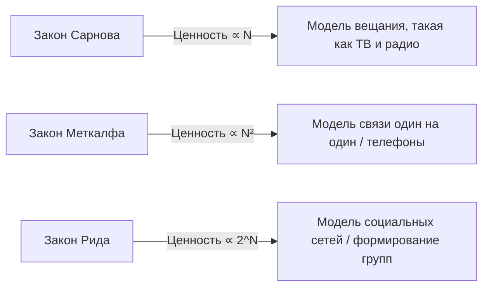

# Что такое «Закон Меткалфа», определяющий ценность сети? Полное руководство по его использованию в бизнес-стратегии

В современном бизнесе, особенно в сфере цифровых платформ, социальных сетей (SNS) и SaaS-бизнеса, ни дня не проходит без упоминания термина «сетевой эффект» (или сетевой экстерналии). И самым известным законом, который математически и концептуально объясняет силу этого сетевого эффекта, является «Закон Меткалфа».

«Ценность сети пропорциональна квадрату количества пользователей (узлов), подключенных к ней.»

Почему этот, на первый взгляд, простой закон объясняет взлет технологических гигантов и является основой стратегий роста стартапов? В этой статье мы подробно рассмотрим закон Меткалфа — от его базовых концепций до исторического контекста, конкретных бизнес-примеров, а также ограничений этого закона и теорий следующего поколения.

## 1. Базовая концепция закона Меткалфа

### Роберт Меткалф и рождение Ethernet
Закон Меткалфа назван в честь Роберта Меткалфа, соизобретателя технологии компьютерных сетей «Ethernet» и основателя компании 3Com. Эта концепция, предложенная им в начале 1980-х годов, изначально использовалась как объяснительная модель для стимулирования продаж факсимильных аппаратов, телефонов и оборудования Ethernet.

### Математическое обоснование закона
Закон Меткалфа основан на количестве возможных соединений внутри сети. Если количество узлов (пользователей или устройств), участвующих в сети, равно $n$, каждый узел может соединяться с $n-1$ другими узлами. Таким образом, общее количество потенциальных соединений $C$ выражается следующей формулой:

$$ C = \frac{n(n - 1)}{2} $$

Когда $n$ становится достаточно большим, это значение асимптотически приближается к $n^2$. Иными словами, Меткалф утверждает, что ценность сети $V$ пропорциональна квадрату количества пользователей $n$ ($V \propto n^2$).

Например, если в мире есть только два телефона, вы можете позвонить только одному человеку, и ценность такой сети ограничена. Однако если телефонов становится 100, количество комбинаций соединений достигает 4950, а при 10 000 телефонов — подпрыгивает примерно до 50 миллионов. С каждым новым пользователем создаются новые потенциальные связи для всех существующих пользователей, поэтому общая ценность сети возрастает с ускорением.

## 2. Связь с сетевым эффектом

Закон Меткалфа является мощной теоретической основой для объяснения «сетевого эффекта». Сетевой эффект — это феномен, при котором «ценность продукта или услуги изменяется в зависимости от количества других пользователей, использующих этот продукт».

### Прямой сетевой эффект
Телефоны и социальных сетей (Facebook, LINE, X и т.д.) являются типичными примерами. Чем больше пользователей на одной платформе, тем больше людей для прямого общения, что напрямую повышает ценность сервиса.

### Косвенный сетевой эффект (Перекрестный сетевой эффект)
Часто встречается на двусторонних рынках (двусторонних платформах). Например, в приложениях для вызова такси, таких как Uber, если увеличивается число «пассажиров», возрастает ценность для «водителей», а если увеличивается число «водителей», возрастает ценность для «пассажиров» (например, сокращается время ожидания). Кредитные карты и операционные системы (Windows, iOS и др.) также относятся к этой категории.

## 3. Сравнение с другими законами: Сарнов, Меткалф, Рид

Закон Меткалфа — не единственный закон, касающийся ценности сети. Для трех парадигм — вещания, связи и сообщества — были предложены разные законы.

### Закон Сарнова
Закон, названный в честь Дэвида Сарнова, основателя RCA. «Ценность широковещательной сети пропорциональна количеству зрителей ($V \propto n$)». Он применим к моделям «один ко многим», таким как телевидение и радио.

### Закон Рида
Предложен Дэвидом Ридом. «Ценность сети, позволяющей формировать группы, пропорциональна двум в степени количества участников ($V \propto 2^n$)». В сетях, где пользователи могут свободно создавать подгруппы, таких как Slack, Discord или группы Facebook, ценность возрастает взрывными темпами, даже быстрее, чем по закону Меткалфа.

## 4. Важность «Критической массы» в бизнесе

Наиболее важное значение закона Меткалфа для бизнес-стратегии заключается в понятии «критической массы».

На начальном этапе создания сети постоянные издержки, такие как разработка системы и обслуживание серверов, превышают ценность сети. Однако, в то время как количество пользователей ($n$) растет линейно, ценность ($n^2$) растет квадратично, и в определенный момент ценность превышает затраты. Объем пользователей на этой точке безубыточности и есть критическая масса.

### Проблема холодного старта
До достижения критической массы возникает дилемма: «Сеть не имеет ценности из-за малого числа пользователей, а пользователи не приходят, потому что нет ценности». Это называется «проблемой холодного старта».

Для ее преодоления компании используют следующие стратегии:
- **Огромные первоначальные инвестиции и кампании**: Привлечение пользователей даже ценой убытков для быстрого преодоления критической массы.
- **Предоставление ценности в однопользовательском режиме**: Предложение полезного инструмента без наличия других пользователей, а затем его сетевизация (например, ранний Instagram был просто хорошим фоторедактором).
- **Доминирование через нишевый рынок**: Стратегия Facebook, который изначально ограничивался студентами Гарварда для создания сильной сети, а затем расширился на другие университеты и широкую публику.

## 5. Критика и ограничения закона Меткалфа

Несмотря на теоретическую силу, у закона Меткалфа есть критики, указывающие на переоценку ценности сети в реальном бизнесе.

### Закон Ципфа и закон Одлызко
Математики, такие как Эндрю Одлызко, указывали на то, что закон Меткалфа переоценивает ценность сети, так как «не все соединения имеют равную ценность». Люди часто общаются с ограниченным кругом лиц (закон Ципфа), и по мнению Одлызко, ценность сети пропорциональна $n \log n$, а не $n^2$.

### Число Данбара
Из-за ограниченности когнитивных способностей человеческого мозга существует понятие «число Данбара» — около 150 стабильных социальных связей. Даже если у соцсети 1 миллиард пользователей, у отдельного человека есть предел числа связей, поэтому ценность не растет до бесконечности в квадрате.

### Перегрузка сети и отрицательный сетевой эффект
Если пользователей становится слишком много, может возникнуть «отрицательный сетевой эффект»: рост спама, задержки связи, увеличение информационного шума, что снижает ценность. Без качественных алгоритмов подбора и модерации закон Меткалфа перестает работать.

## 6. Заключение: Применение в современных стратегиях

Хотя закон Меткалфа и является упрощенной моделью, он отлично описывает динамику «победитель получает всё» (Winner-takes-all) в платформенном бизнесе.

Бизнес-лидеры и предприниматели всегда должны ставить во главу угла понимание того, как их продукт создает сетевой эффект и как быстро можно достичь критической массы. Даже в эпоху ИИ и блокчейна (Web3) то, как узлы связываются и обмениваются ценностью, по-прежнему тихо, но мощно подчиняется закону Меткалфа.
