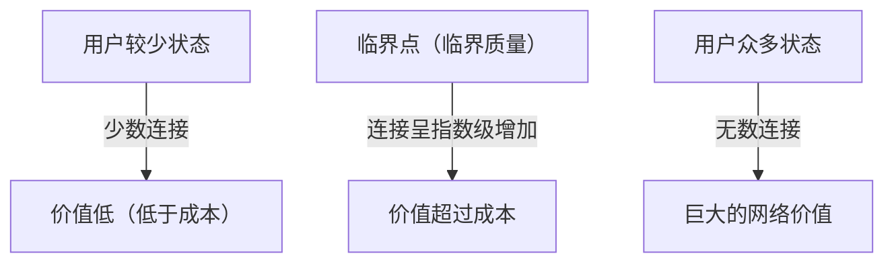
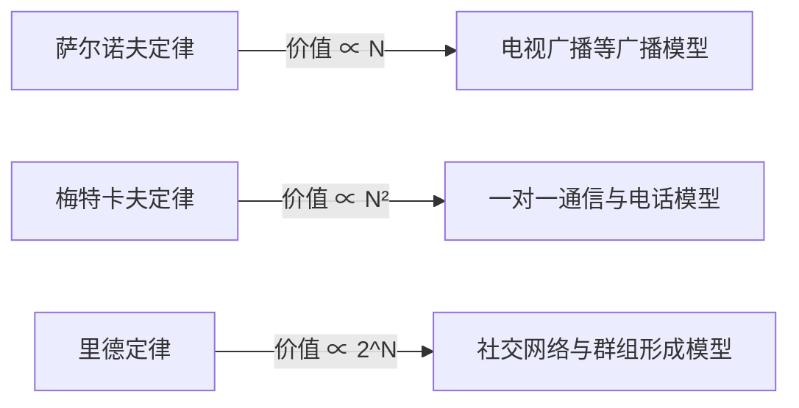

# 什么是主导网络价值的“梅特卡夫定律”？全面解析其在商业战略中的应用

在现代商业，尤其是数字平台、社交媒体和SaaS业务中，几乎每天都能听到“网络效应”（网络外部性）这个词。而在数学和概念层面上解释这种网络效应威力的最著名定律，就是“梅特卡夫定律”（Metcalfe's Law）。

“网络的价值与连接到该网络的系统用户（节点）数量的平方成正比。”

为什么这个看似简单的定律能够解释科技巨头的崛起，并成为初创企业增长战略的核心？本文将从梅特卡夫定律的基本概念、历史背景、具体商业案例，直至定律的局限性和下一代相关理论，为您提供详尽深度的解析。

## 1. 梅特卡夫定律的基本概念

### 罗伯特·梅特卡夫与以太网的诞生
梅特卡夫定律以计算机网络技术“以太网（Ethernet）”的共同发明人、3Com公司创始人罗伯特·梅特卡夫（Robert Metcalfe）的名字命名。他在1980年代初提出这个概念，最初是作为一种解释模型来促进传真机（FAX）、电话和以太网设备的销售。

### 定律的数学背景
梅特卡夫定律基于网络中可能的连接对数。假设参与网络中的节点（用户或设备）数量为 $n$，由于每个节点可以与自己之外的 $n-1$ 个节点连接，整体的潜在连接总数 $C$ 可用以下公式表示：

$$ C = \frac{n(n - 1)}{2} $$

当 $n$ 足够大时，这个值趋近于 $n^2$。也就是说，梅特卡夫的主张是，网络价值 $V$ 与用户数量 $n$ 的平方成正比（$V \propto n^2$）。

例如，如果世界上只有两部电话，只能与另一个人通话，那么该网络的价值是有限的。然而，如果有100部电话，连接的组合将达到4,950种；如果是1万部电话，组合数将激增至约5,000万种。每增加一个用户，现有的所有用户都会产生一个新的连接对象，整个网络的价值就会加速上升。

## 2. 与网络效应的关系

梅特卡夫定律是解释“网络效应”（Network Effect）的强大理论支柱。网络效应指的是“某项产品或服务的价值随着使用该服务的其他用户数量的增减而变化的现象”。

### 直接网络效应
电话和社交网络（如Facebook、LINE、X等）是典型例子。使用相同平台的用户越多，沟通的对象就直接增加，从而提高了服务的价值。

### 间接网络效应（跨边网络效应）
在双边市场（Two-sided Platform）中常见。例如，在Uber这样的打车应用中，“乘客”的增加提高了对“司机”的价值，而“司机”的增加也提高了对“乘客”的价值（例如缩短等待时间）。信用卡和操作系统（如Windows、iOS等）也属于此类。

## 3. 与其他定律的比较：Sarnoff, Metcalfe, Reed

关于网络价值的定律并不只有梅特卡夫定律。针对广播、通信和社区三种不同范式，学界提出了不同的定律。

### 萨尔诺夫定律（Sarnoff's Law）
以RCA创始人戴维·萨尔诺夫的名字命名的定律。“广播网络的价值与观众人数成正比（$V \propto n$）”。适用于一对多的电视或广播模型。

### 里德定律（Reed's Law）
由戴维·里德提出。“能够形成群组的网络的价值，与参与者人数的2的幂次方成正比（$V \propto 2^n$）”。在Slack、Discord或Facebook群组等用户可以自由创建子群组的网络中，这套理论指出其价值甚至会以超越梅特卡夫定律的爆炸性速度增长。

## 4. “临界质量”在商业中的重要性

梅特卡夫定律在商业战略中给予的最重要启示，就是“临界质量”（Critical Mass，即临界点）的概念。

在构建网络的初期阶段，系统开发、服务器维护费用等固定成本高于网络价值。然而，与用户数（$n$）的线性增长不同，价值（$n^2$）是呈二次函数增长的，因此在某个节点，价值将超过成本。这个作为盈亏平衡点的用户规模，就是临界质量。

### 冷启动问题
在达到临界质量之前，企业会陷入“因为用户少所以没有价值，因为没有价值所以无法吸引用户”的困境。这被称为“冷启动问题”（Cold Start Problem）。

为了打破这种困境，企业通常采取以下策略：
- **巨额初期投资与活动**：哪怕不顾利润也要获取用户，尽快突破临界质量（例：PayPay的百亿日元派送活动）。
- **通过单机模式提供价值**：在没有其他用户的情况下，将其作为便利工具提供，之后再实现网络化（例：早期的Instagram只是一款高性能的照片编辑应用）。
- **从利基市场进行突围**：比如Facebook起初仅在哈佛大学学生中普及，在建立起强大的网络之后，再扩展到其他大学和普通大众。

## 5. 对梅特卡夫定律的批评与局限性

尽管梅特卡夫定律在理论上非常强大，但在现实商业环境中也面临着一些局限性和对其价值高估的批评。

### 齐普夫定律与奥德利兹科定律
数学家安德鲁·奥德利兹科等人指出，梅特卡夫定律高估了网络价值，因为“并非所有的连接都具有同等价值”。由于人类频繁沟通的对象仅限于少部分人（齐普夫定律），奥德利兹科等人主张，网络的价值并不与 $n^2$ 成正比，而是与 $n \log n$ 成正比（奥德利兹科定律）。

### 邓巴数
受到人类大脑认知能力的限制，“邓巴数”概念提出，人类能够维持稳定社交关系的人数上限大约为150人。即使社交媒体用户数达到10亿人，单个个体的联系人数依然有上限，因此价值不会无限地按平方增加。

### 网络拥堵与负网络效应
如果用户数量过多，可能会导致垃圾信息增加、通信延迟、信息噪音增大等“负网络效应”，反而会降低网络价值。如果没有高质量的匹配算法或内容审核，梅特卡夫定律便会失效。

## 6. 总结：在现代战略中的应用

尽管梅特卡夫定律是一个简化的模型，但它完美地描绘了平台型企业“赢者通吃”（Winner-takes-all）的动态机制。

商业领袖和企业家应该始终将自己的产品如何产生网络效应、以及如何尽快突破临界质量作为设计的核心。即使在人工智能（AI）和[区块链](/zh-cn/p/blockchain-technology-smart-contract-distributed-ledger/)（Web3）时代，关于节点之间如何连接和交换价值的底层逻辑中，梅特卡夫定律依然在悄无声息却又极其强大地发挥着作用。
