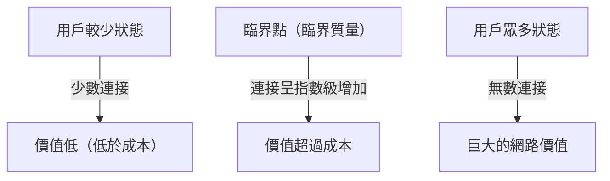
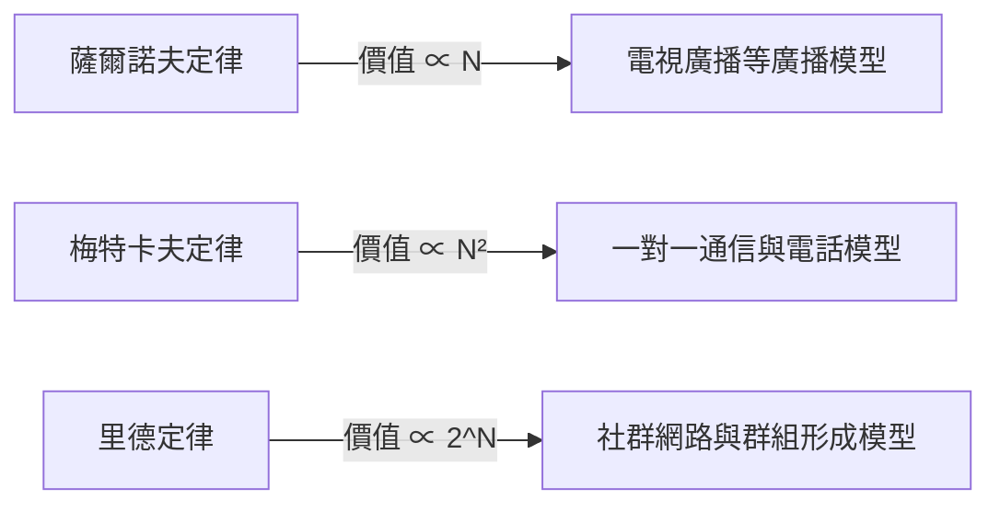

# 什麼是主導網路價值的「梅特卡夫定律」？全面解析其在商業策略中的應用

在現代商業，尤其是數位平台、社群媒體和SaaS業務中，幾乎每天都能聽到「網路效應」（網路外部性）這個詞。而在數學和概念層面上解釋這種網路效應威力的最著名定律，就是「梅特卡夫定律」（Metcalfe's Law）。

「網路的價值與連接到該網路的系統用戶（節點）數量的平方成正比。」

為什麼這個看似簡單的定律能夠解釋科技巨頭的崛起，並成為新創企業成長策略的核心？本文將從梅特卡夫定律的基本概念、歷史背景、具體商業案例，直至定律的局限性和下一代相關理論，為您提供詳盡深度的解析。

## 1. 梅特卡夫定律的基本概念

### 羅伯特·梅特卡夫與乙太網的誕生
梅特卡夫定律以電腦網路技術「乙太網（Ethernet）」的共同發明人、3Com公司創辦人羅伯特·梅特卡夫（Robert Metcalfe）的名字命名。他在1980年代初提出這個概念，最初是作為一種解釋模型來促進傳真機（FAX）、電話和乙太網設備的銷售。

### 定律的數學背景
梅特卡夫定律基於網路中可能的連接對數。假設參與網路中的節點（用戶或設備）數量為 $n$，由於每個節點可以與自己之外的 $n-1$ 個節點連接，整體的潛在連接總數 $C$ 可用以下公式表示：

$$ C = \frac{n(n - 1)}{2} $$

當 $n$ 足夠大時，這個值趨近於 $n^2$。也就是說，梅特卡夫的主張是，網路價值 $V$ 與用戶數量 $n$ 的平方成正比（$V \propto n^2$）。

例如，如果世界上只有兩部電話，只能與另一個人通話，那麼該網路的價值是有限的。然而，如果有100部電話，連接的組合將達到4,950種；如果是1萬部電話，組合數將激增至約5,000萬種。每增加一個用戶，現有的所有用戶都會產生一個新的連接對象，整個網路的價值就會加速上升。

## 2. 與網路效應的關係

梅特卡夫定律是解釋「網路效應」（Network Effect）的強大理論支柱。網路效應指的是「某項產品或服務的價值隨著使用該服務的其他用戶數量的增減而變化的現象」。

### 直接網路效應
電話和社群網路（如Facebook、LINE、X等）是典型例子。使用相同平台的用戶越多，溝通的對象就直接增加，從而提高了服務的價值。

### 間接網路效應（跨邊網路效應）
在雙邊市場（Two-sided Platform）中常見。例如，在Uber這樣的叫車應用中，「乘客」的增加提高了對「司機」的價值，而「司機」的增加也提高了對「乘客」的價值（例如縮短等待時間）。信用卡和作業系統（如Windows、iOS等）也屬於此類。

## 3. 與其他定律的比較：Sarnoff, Metcalfe, Reed

關於網路價值的定律並不只有梅特卡夫定律。針對廣播、通信和社群三種不同範式，學界提出了不同的定律。

### 薩爾諾夫定律（Sarnoff's Law）
以RCA創辦人戴維·薩爾諾夫的名字命名的定律。「廣播網路的價值與觀眾人數成正比（$V \propto n$）」。適用於一對多的電視或廣播模型。

### 里德定律（Reed's Law）
由戴維·里德提出。「能夠形成群組的網路的價值，與參與者人數的2的冪次方成正比（$V \propto 2^n$）」。在Slack、Discord或Facebook群組等用戶可以自由創建子群組的網路中，這套理論指出其價值甚至會以超越梅特卡夫定律的爆炸性速度增長。

## 4. 「臨界質量」在商業中的重要性

梅特卡夫定律在商業策略中給予的最重要啟示，就是「臨界質量」（Critical Mass，即臨界點）的概念。

在建構網路的初期階段，系統開發、伺服器維護費用等固定成本高於網路價值。然而，與用戶數（$n$）的線性成長不同，價值（$n^2$）是呈二次函數成長的，因此在某個節點，價值將超過成本。這個作為盈虧平衡點的用戶規模，就是臨界質量。

### 冷啟動問題
在達到臨界質量之前，企業會陷入「因為用戶少所以沒有價值，因為沒有價值所以無法吸引用戶」的困境。這被稱為「冷啟動問題」（Cold Start Problem）。

為了打破這種困境，企業通常採取以下策略：
- **巨額初期投資與活動**：哪怕不顧利潤也要獲取用戶，盡快突破臨界質量（例：PayPay的百億日圓派送活動）。
- **透過單機模式提供價值**：在沒有其他用戶的情況下，將其作為便利工具提供，之後再實現網路化（例：早期的Instagram只是一款高性能的照片編輯應用）。
- **從利基市場進行突圍**：比如Facebook起初僅在哈佛大學學生中普及，在建立起強大的網路之後，再擴展到其他大學和普通大眾。

## 5. 對梅特卡夫定律的批評與局限性

儘管梅特卡夫定律在理論上非常強大，但在現實商業環境中也面臨著一些局限性和對其價值高估的批評。

### 齊普夫定律與奧德利茲科定律
數學家安德魯·奧德利茲科等人指出，梅特卡夫定律高估了網路價值，因為「並非所有的連接都具有同等價值」。由於人類頻繁溝通的對象僅限於少部分人（齊普夫定律），奧德利茲科等人主張，網路的價值並不與 $n^2$ 成正比，而是與 $n \log n$ 成正比（奧德利茲科定律）。

### 鄧巴數
受到人類大腦認知能力的限制，「鄧巴數」概念提出，人類能夠維持穩定社交關係的人數上限大約為150人。即使社群媒體用戶數達到10億人，單個個體的聯繫人數依然有上限，因此價值不會無限地按平方增加。

### 網路擁堵與負網路效應
如果用戶數量過多，可能會導致垃圾訊息增加、通信延遲、資訊噪音增大等「負網路效應」，反而會降低網路價值。如果沒有高品質的配對演算法或內容審核，梅特卡夫定律便會失效。

## 6. 總結：在現代策略中的應用

儘管梅特卡夫定律是一個簡化的模型，但它完美地描繪了平台型企業「贏者全拿」（Winner-takes-all）的動態機制。

商業領袖和企業家應該始終將自己的產品如何產生網路效應、以及如何盡快突破臨界質量作為設計的核心。即使在人工智慧（AI）和區塊鏈（Web3）時代，關於節點之間如何連接和交換價值的底層邏輯中，梅特卡夫定律依然在悄無聲息卻又極其強大地發揮著作用。
