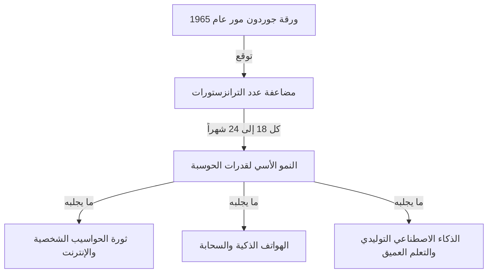
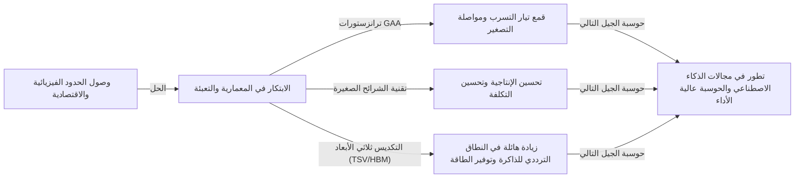

# ما هو قانون مور؟ مسار أشباه الموصلات والتطور المتسارع

يتغير مجتمعنا بسرعة بفضل التقنيات مثل الهواتف الذكية، الحوسبة السحابية، والذكاء الاصطناعي (AI). الأساس التقني الذي يدعم هذه التقنيات هو "أشباه الموصلات (الرقائق الدقيقة)"، وما حدد تاريخ تطورها هو **"قانون مور (Moore's Law)"** الشهير.

في هذا المقال، ومن منظور كاتب تقني محترف، سنقوم بالتعمق في الخلفية التاريخية لقانون مور، الآليات التقنية، تأثيره على الأعمال والاقتصاد، الحدود الفيزيائية التي يواجهها حالياً، وصولاً إلى تقنيات الحوسبة من الجيل التالي التي تقع ما بعد "نهاية قانون مور".

---

## 1. ولادة قانون مور والخلفية التاريخية

### رؤية جوردون مور في عام 1965
ينبع قانون مور من ورقة بحثية قصيرة ساهم بها جوردون مور، أحد المؤسسين المشاركين لشركة إنتل (Intel)، في مجلة "الإلكترونيات (Electronics)" عام 1965. في ذلك الوقت، كان يعمل في شركة فيرتشايلد لأشباه الموصلات. لقد نشر ملاحظة تفيد بأن عدد الترانزستورات الموجودة على دائرة متكاملة (IC) "يتضاعف كل عام" تقريبًا.

بعد ذلك، في عام 1975، قام مور نفسه بتعديل توقعه وإعادة تعريفه ليصبح "يتضاعف تقريبًا كل 18 إلى 24 شهرًا (عامين)". أصبح هذا هو التفسير الشائع لـ "قانون مور" كما نعرفه اليوم.

### لماذا سمي بـ "القانون"؟
بالمعنى الدقيق للكلمة، قانون مور ليس "قانوناً (Law)" مطلقاً في الفيزياء أو الرياضيات. بل كان بمنزلة "قاعدة عامة (Rule of thumb)" ولعب دور "خارطة طريق" للصناعة.
شاركت شركات تصنيع أشباه الموصلات، بما في ذلك إنتل، شعوراً بالأزمة يتمثل في "إذا لم نضاعف الأداء كل عامين، فسنُهزم أمام المنافسين"، واستثمرت مبالغ ضخمة في البحث والتطوير (R&D) والنفقات الرأسمالية لتحقيق ذلك كهدف. بمعنى آخر، فإن قانون مور هو "منظم ضربات القلب للاقتصاد والابتكار" الذي حققته صناعة أشباه الموصلات بأكملها كنبوءة ذاتية التحقق.

---

## 2. رعب التطور المتسارع (النمو الأسي)

المفهوم الأكثر أهمية لفهم قانون مور هو **"التطور المتسارع (النمو الأسي: Exponential Growth)"**.
يميل العقل البشري عادة إلى توقع التغييرات "الخطية (Linear)". على سبيل المثال، فكرة أنه "إذا تقدمت خطوة واحدة كل يوم، فسوف تتقدم 30 خطوة في 30 يومًا". ومع ذلك، في النمو الأسي، يزداد العدد بلعبة المضاعفة مثل "1، 2، 4، 8، 16، 32...".

إذا كررت المضاعفة 30 مرة، فإن الرقم النهائي سيتجاوز مليار (2 أُس 30). في عالم أشباه الموصلات، استمرت هذه المضاعفة لأكثر من 50 عامًا، لذلك أصبحت أجهزة الكمبيوتر التي كانت تشغل مساحة بحجم الغرفة في البداية قادرة الآن على وضعها في جيوبنا وحتى في ساعات اليد (الساعات الذكية).

---

## 3. آلية تصغير أشباه الموصلات: كيف نزيد من كثافة التكامل؟

النهج الأساسي لزيادة عدد الترانزستورات (زيادة كثافة التكامل) هو "التصغير (Scaling)". إذا تمكنا من جعل الترانزستورات أصغر حجمًا، فيمكننا وضع المزيد منها على رقاقة سيليكون بنفس المساحة.

### تحدي حدود الطباعة الحجرية الضوئية
يتم تصنيع أشباه الموصلات باستخدام طريقة تسمى "الطباعة الحجرية الضوئية (Photolithography)". يتم تطبيق مادة حساسة للضوء (مقاوم ضوئي) على رقاقة سيليكون، ويتم تسليط الضوء من خلال قناع مرسوم عليه نمط الدائرة لنقل الدائرة.
من أجل رسم دوائر أدق، هناك حاجة إلى ضوء ذي طول موجي أقصر.
كافحت الصناعة لسنوات عديدة لتقصير الطول الموجي للضوء.
- **من الضوء المرئي إلى الأشعة فوق البنفسجية**
- **ليزر الإكسيمر (KrF, ArF)**
- **تقنية الطباعة الحجرية بالغمر**
- والتكنولوجيا الرائدة حالياً، **الطباعة الحجرية بالأشعة فوق البنفسجية القصوى (EUV)**

تستخدم معدات الطباعة الحجرية EUV، التي تصنعها شركة ASML الهولندية حصريًا، ضوءًا بطول موجي يبلغ 13.5 نانومتر فقط لرسم دوائر دقيقة للغاية. تطلب تطوير هذه المعدات عقودًا من الزمن واستثمارات بمليارات الدولارات، ولكنها تتيح تصنيع أحدث أشباه الموصلات المتقدمة اليوم، مثل عمليات الـ 5 نانومتر والـ 3 نانومتر.

---

## 4. تأثير قانون مور على الأعمال والاقتصاد

لم يكن قانون مور مجرد مؤشر تقني، بل لقد غير جذريًا هيكل الاقتصاد العالمي.

### ضغوط الانكماش وانخفاض التكاليف بشكل كبير
مضاعفة كثافة دمج الترانزستور تعني "الحصول على ضعف القدرة الحسابية بنفس التكلفة"، أو "الحصول على نفس القدرة الحسابية بنصف التكلفة". وقد أدى هذا الانخفاض الهائل في التكلفة إلى دفع الرقمنة (التحول الرقمي: DX) في كل صناعة.
مع تحول موارد الحوسبة من شيء "نادر ومكلف" إلى شيء "وفير ورخيص"، ظهرت نماذج أعمال جديدة واحدة تلو الأخرى.

### خلق صناعات جديدة
1. **انتشار أجهزة الكمبيوتر الشخصية (PC):** منذ الثمانينيات والتسعينيات، أصبح بإمكان الأفراد امتلاك أجهزة كمبيوتر.
2. **الإنترنت وأعمال الويب:** في العقد الأول من القرن الحادي والعشرين، ربطت الخوادم ومعدات الاتصالات الرخيصة العالم عبر شبكة.
3. **الهواتف الذكية واقتصاد الهاتف المحمول:** في العقد الأول من القرن الحادي والعشرين (2010)، امتلكت الأجهزة التي بحجم كف اليد أداءً يعادل أجهزة الكمبيوتر العملاقة، وشهد اقتصاد التطبيقات نمواً هائلاً.
4. **السحابة والذكاء الاصطناعي:** منذ عام 2020 فصاعدًا، ظهر التعلم العميق والذكاء الاصطناعي التوليدي، اللذان يتطلبان موارد حسابية هائلة. تعتمد هذه التقنيات كليًا على تطور قدرات المعالجة المتوازية الفائقة لوحدات معالجة الرسومات (GPU).

---

## 5. حدود قانون مور والعوائق الفيزيائية التي يواجهها

على الرغم من إطالة أمد قانون مور مع تكرار مقولة "لقد مات القانون" لسنوات عديدة، إلا أنه يواجه الآن حدودًا فيزيائية حقيقية. العوائق الرئيسية الثلاثة هي:

### 1. تأثير النفق الكمي وتيار التسرب
عندما يتقلص حجم الترانزستور (وخاصة طول البوابة) إلى مستوى بضعة نانومترات (بحجم ذرات قليلة إلى العشرات من الذرات)، تتوقف القوانين الكلاسيكية للفيزياء عن العمل، وتصبح الظواهر الميكانيكية الكمية بارزة. والمثال النموذجي لذلك هو "تأثير النفق الكمي".
حتى إذا حاولت إيقاف التيار عن طريق "إيقاف" المفتاح، فإن الإلكترونات تتسرب عبر الحاجز (تيار التسرب: Leakage Current)، مما يتسبب في زيادة استهلاك الطاقة وحدوث أعطال.

### 2. حاجز الحرارة (مشكلة السيليكون المظلم)
مع زيادة كثافة الترانزستورات على الرقاقة، ترتفع أيضًا كثافة الحرارة المتولدة بسرعة. ولا تستطيع تقنيات التبريد مواكبة ذلك، وتسمى الظاهرة التي يصبح فيها من المستحيل تشغيل الرقاقة بأكملها بكامل طاقتها في نفس الوقت بـ "السيليكون المظلم (Dark Silicon)". وعلى الرغم من زيادة القدرة الحسابية، إلا أنهم يقعون في معضلة عدم القدرة على استخراج الأداء الأصلي بسبب القيود الحرارية.

### 3. الحدود الاقتصادية (قانون روك)
توجد قاعدة عامة تسمى "القانون الثاني لمور" أو "قانون روك (Rock's Law)". وهي تنص على أن "تكلفة بناء مصنع لتصنيع أشباه الموصلات تتضاعف مع كل جيل". يتطلب بناء مصنع تصنيع على أحدث طراز (فاب) حاليًا استثمارات تتراوح ما بين 2 إلى 3 تريليون ين (نحو 15 إلى 20 مليار دولار)، وقد انخفض عدد الشركات القادرة على تحمل هذه التكلفة الهائلة إلى ثلاث شركات فقط في العالم: TSMC وسامسونج للإلكترونيات وإنتل.

---

## 6. More than Moore (أكثر من مجرد مور)

مع اقتراب التحسن في كثافة التكامل من خلال التصغير البسيط (More Moore) من نهايته، تتحول صناعة أشباه الموصلات نحو نهج جديد لتحسين الأداء، وهو "More than Moore" (أكثر من مجرد مور).

### تطور المعمارية (من FinFET إلى GAA)
تم قمع تيار التسرب من خلال الانتقال من هيكل الترانزستور المستوي (النوع المستوي) إلى **FinFET (ترانزستور تأثير المجال الزعنفي)** الذي يتمتع بهيكل ثلاثي الأبعاد، ولكن الآن يتم الانتقال إلى هيكل **GAA (بوابة محيطة بالكامل)** حيث تحيط البوابة بالكامل. هذا يزيد من قابلية التحكم في الإلكترونات إلى أقصى حد.

### تقنية الشرائح الصغيرة (Chiplet)
بدلاً من حشر جميع الوظائف في شريحة سيليكون عملاقة واحدة (قطعة متجانسة) كما كان يحدث سابقاً، تقسم هذه التقنية الوظائف إلى شرائح صغيرة (شرائح صغيرة - Chiplets) لتصنيعها، وتربطها داخل حزمة واحدة باستخدام تقنية تعبئة متقدمة. هذا جعل من الممكن تحسين الإنتاجية (معدل المنتجات الجيدة) بشكل كبير وزيادة الأداء العام مع الحفاظ على انخفاض التكاليف. وقد حقق هذا نجاحًا كبيرًا في معالجات Ryzen من AMD، وسيصبح الاتجاه السائد في المستقبل.

### التعبئة والتغليف 2.5D / 3D وتقنية التكديس
بدلاً من مجرد ترتيب الشرائح على مستوى مسطح (2D)، فإن تكديسها رأسيًا (3D) باستخدام تقنيات مثل الأقطاب الكهربائية عبر السيليكون (TSV) يحسن بشكل كبير سرعة الاتصال (عرض النطاق الترددي) بين الشرائح ويقلل من استهلاك الطاقة. تقنية التعبئة المتقدمة هذه لا غنى عنها لربط أحدث وحدات معالجة الرسومات المخصصة للذكاء الاصطناعي (مثل H100 من NVIDIA) بذاكرة النطاق الترددي العالي (HBM).

---

## 7. حوسبة الجيل التالي في عصر ما بعد مور

تحسباً للحدود التي يمكن أن تصل إليها أشباه الموصلات القائمة على السيليكون، تتقدم الأبحاث بسرعة بشأن تقنيات الحوسبة القائمة على مبادئ جديدة تماماً. هذه التقنيات لديها القدرة على أن تصبح اللاعب الرئيسي في "عصر ما بعد مور".

### الحوسبة الكمية (Quantum Computing)
باستخدام خصائص ميكانيكا الكم مثل "التراكب" و"التشابك الكمي"، من المتوقع أن تحل مشكلات معينة (مثل فك التشفير، ومحاكاة الجزيئات للأدوية الجديدة، ومشاكل التحسين) في لحظة، والتي قد تستغرق أجهزة الكمبيوتر التقليدية (أجهزة الكمبيوتر الكلاسيكية) مئات الملايين من السنين لحلها. وتتنافس الأبحاث في أساليب مختلفة، مثل الموصلية الفائقة، والمصائد الأيونية، والكميات الضوئية.

### الحوسبة العصبية (أجهزة الكمبيوتر المستوحاة من الدماغ)
هذه تقنية تحاكي آلية الشبكة العصبية للدماغ البشري (الخلايا العصبية والمشابك العصبية) على مستوى الأجهزة المادية. وعلى عكس معمارية فون نيومان الحالية (حيث يتم فصل وحدة المعالجة المركزية والذاكرة، مما يخلق عنق زجاجة في نقل البيانات)، يمكنها إجراء التعرف على الأنماط والتعلم باستهلاك منخفض جدًا للطاقة من خلال معالجة المعلومات وحفظها في نفس الوقت.

### الحوسبة الضوئية (Optical Computing)
هذه تقنية تستخدم الفوتونات بدلاً من الإلكترونات لمعالجة المعلومات ونقل البيانات. ونظرًا لأن الضوء أسرع من الإشارات الكهربائية ولا يعاني إلا من القليل من فقدان الطاقة وتوليد الحرارة، فمن المتوقع أن يكون بمثابة بنية تحتية للحوسبة فائقة السرعة ومنخفضة استهلاك الطاقة للجيل التالي. وعلى وجه الخصوص، دخلت تقنية "الضوئيات السيليكونية" لنقل البيانات بين الرقائق باستخدام الضوء بالفعل مرحلة التطبيق العملي.

---

## 8. الخاتمة: إرث قانون مور ومستقبلنا

لم يكن "قانون مور" الذي قدمه جوردون مور في عام 1965 مجرد تنبؤ تقني لأشباه الموصلات. يمكن القول إنه أعطى البشرية رؤية ثابتة مفادها أن "التكنولوجيا قادرة على الاستمرار في التطور بمعدل أسي"، وكان بمثابة "عقد اجتماعي ملحمي" دفع ملايين المهندسين والباحثين نحو نفس الهدف.

وحتى إذا وصل تصغير الترانزستورات على السيليكون إلى حدوده الفيزيائية، فإن ابتكار البشرية لزيادة القدرة الحسابية لن يتوقف أبدًا. ستستمر النماذج الجديدة مثل الشرائح الصغيرة، والتكديس ثلاثي الأبعاد، والمعماريات المتخصصة في الذكاء الاصطناعي، وأجهزة الكمبيوتر الكمية في المضي قدمًا بروح قانون مور وقيادة مجتمعنا إلى منطقة مجهولة.

ما هو مطلوب من قادة الأعمال والمهندسين في المستقبل هو فهم وتيرة هذا "التطور التكنولوجي المتسارع"، وتوقع الاختراقات التالية، ومواصلة التكيف حتى لا يتخلفوا عن موجة التغيير. فتاريخ تطور أشباه الموصلات ليس سوى مرآة تعكس مستقبل البشرية.
